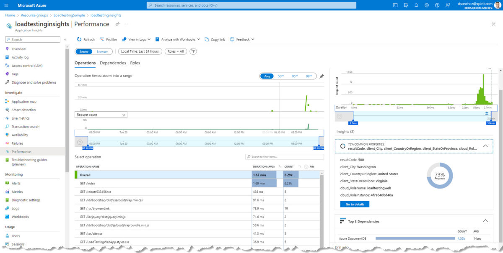

# Adding Load Testing to your CI/CD workflows

## Introduction
Load testing is a technique that focuses on evaluating the performance of an application under normal or expected load conditions. The goal is to determine how the application behaves when it is subjected to the expected levels of usage and traffic. Load testing is often used to verify that a system can handle the expected number of users and transactions, and to identify any performance bottlenecks or issues that may impact the user experience.
<!--truncate-->
Microsoft Azure offers a new service (on preview), called [Azure Load Testing](https://azure.microsoft.com/products/load-testing). One of the key benefits of using this service is that it allows you to test your application's performance at a scale without having to invest in expensive hardware and infrastructure. Additionally, it is highly configurable and can be used to test applications hosted on a variety of platforms, including Azure, on-premises servers, and third-party cloud providers.

## What do we need?
In addition to an Azure Subscription, and a GitHub account, we will need an [Apache JMeter](https://jmeter.apache.org) script, which typically consists of a series of test elements, including thread groups, samplers, listeners, and assertions. The thread groups define the number and type of virtual users that will be simulated, while the samplers define the specific actions or requests that will be performed by the virtual users. The listeners capture the performance data generated by the test, and the assertions define the expected results of the test and verify that the actual results match the expectations.

[Here you can find the script I created as part of this demo](https://raw.githubusercontent.com/dsanchezcr/LoadTestingDemo/main/LoadTestingScript.jmx)

## Getting Started
In the following example, we are going to use Azure Load Testing in our workflow from GitHub Actions to detect when our web app has reached a performance issue. We are going to define a load test scenario with a specific number and type of virtual users that will be simulated, as well as the test duration and the type of workload to be simulated, which in this case is just an HTTP Request. In addition, you can also use either Visual Studio or the Azure Portal to create and configure your load test scenario.

Once the load test scenario is defined, we can review the results and monitoring data, which includes metrics such as response time, CPU usage, and network traffic, as well as custom performance counters that we can define. With this data we identify bottlenecks and optimize the application's performance.

### The scenario
I developed a simple [Web App](https://loadtestingweb.azurewebsites.net) built with ASP.NET Core using .NET 7 that connects to an Azure Cosmos DB and adds a record of each visit to the page and retrieves the data from all the visits.

### The environment
This web app is running on an App Service <strong>Basic</strong> plan, and it has Applications Insights to monitor the performance of the application. The Cosmos DB is set with the <strong>free tier </strong>(1000 RU/s and 25 GB). I want to find out if the application running on this environment can support up to 100 concurrent users.

### The repository
You can check out the **GitHub repository** [here](https://github.com/dsanchezcr/LoadTestingDemo). There you can fork the repository, use the [ARM template](https://portal.azure.com/#create/Microsoft.Template/uri/https%3A%2F%2Fraw.githubusercontent.com%2Fdsanchezcr%2FLoadTestingDemo%2Fmain%2FARM%2Ftemplate.json).

> Note: Microsoft Azure only allows you to create one Cosmos DB Free Tier resource per subscription, you might get an error if you already have one Cosmos DB Free Tier in your subscription.

This repository has a [GitHub Action](https://github.com/dsanchezcr/LoadTestingDemo/actions/runs/3745714572) that Build & Deploy the application and run the Load Test in Azure Load Testing.

### The GitHub Action
The [workflow](https://raw.githubusercontent.com/dsanchezcr/LoadTestingDemo/main/.github/workflows/workflow.yml) consists of three steps (Build, Deploy and Load Testing) and runs on every push. The Load Testing job uses the following files in the root folder:

 	- [LoadTestingScript.jmx](https://github.com/dsanchezcr/LoadTestingDemo/blob/main/LoadTestingScript.jmx)
 	- [LoadTestingConfig.yaml](https://github.com/dsanchezcr/LoadTestingDemo/blob/main/LoadTestingConfig.yaml)

The Azure login is required to communicate with the Azure Load Testing service to send the JMeter script and the configuration for the test. In this configuration we can define the number of [engines](https://learn.microsoft.com/azure/load-testing/concept-load-testing-concepts#test-engine) we want to run the test and the failure criteria, in this case we have an average response time lower than 5 seconds and error percentage lower than 20%.

### The Results
As you can see in the image above, the Load Test <strong>failed</strong> because the average response time was higher than the threshold (5 seconds), we can get more details about the test run in the Azure Portal. [You can download the results here](https://raw.githubusercontent.com/dsanchezcr/LoadTestingDemo/main/engine1_results.csv).

In the Azure App Service, we can see the metrics with the response times (higher than 5 seconds) and the number of requests with the Data in and Data out. 

In addition, I added Application Insights to monitor the web app, in the Azure Portal we can see the performance issues and failures.

From the image above you can see where the requests came from, in this case I am running Azure Load Testing in the East US region (Virginia).

## Conclusions
The Load Testing <strong>should not be</strong> running on a production environment, try it on a QA or Pre-Production. Even if you are running on deployments slots, remember that the app will still run on the same App Service Plan, and this could affect your production environment or cause a [Denial-of-Service Attack](https://en.wikipedia.org/wiki/Denial-of-service_attack).

If you would like to learn more about Azure Load Testing, I recommend you review the [service documentation](https://learn.microsoft.com/azure/load-testing).