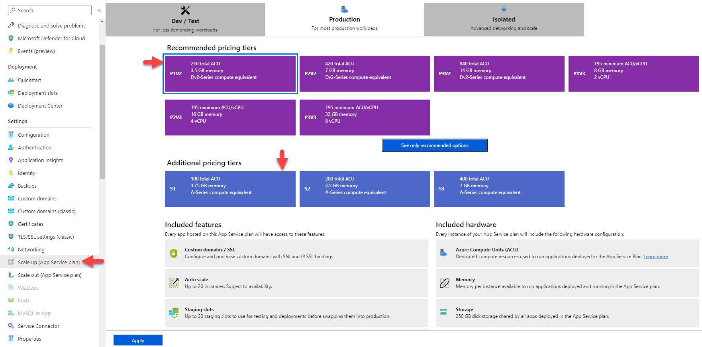
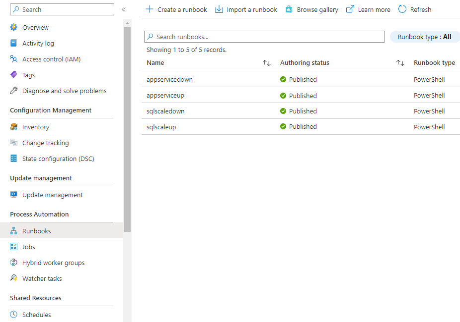

# Cost Savings with Azure for your Web Apps

## Introduction

Many of our web app hosted on Azure are built on top of a PaaS service, such as Azure App Service and SQL Azure. These services are usually billed based on the amount of resources they consume. The more resources they consume, the more we pay. However, there are some best practices that we can follow to reduce the amount of resources consumed and, therefore, reduce the amount of money we pay. Specially if we are running a web app that is not used 24/7 or just used during business hours in the same time zone.
<!--truncate-->
One of the cloud computing principles is the **elasticity**, meaning that we can scale up or down the resources that our app consumes based on the demand or schedule. This is a great feature of the cloud, but we should be aware of the cost implications of this feature. If we scale up our app to handle a peak of traffic, we should also scale down the resources when the traffic is back to normal.

In Azure App Service we have two ways to scale, scale up or down and scale out or in. Scale up or down means that we can change the size of the VM that our app is running on. Scale out or in means that we can add or remove VMs from our app. We can scale up or down and scale out or in at the same time. For example, we can scale up the size of the VMs and add more VMs to our app. 

So if we have a production Web App that is not used 24/7, we should consider the following:

- Scale down the app and database to the minimum resources needed during off-peak hours.
- Scale up the app and database to the maximum resources needed during peak hours. (in addition, we should enable auto-scaling to scale out the app and add more instances when needed, [through the rules that you define to scale out or in](https://learn.microsoft.com/azure/azure-monitor/autoscale/autoscale-get-started?toc=%2Fazure%2Fapp-service%2Ftoc.json#create-your-first-autoscale-setting)).

The process to scale up and down can be down manually from the portal as shown in the image.



However, this process can be tedious and error-prone. We can automate the process to scale up and down the Web App and the database during the night and weekends. This will reduce the amount of resources consumed and, therefore, reduce the amount of money we pay.

## Solution

We can use [Azure Automation](https://learn.microsoft.com/azure/automation/overview) service to schedule a PowerShell script to scale down the Web App and the DB during the night and weekends. We can also schedule another PowerShell script to scale up the Web App and the DB during before the business hours.

> You will need to setup an System Assigned Identity to the Azure Automation account to connect with the Azure Resources. You can follow the steps in this [article](https://learn.microsoft.com/azure/automation/learn/powershell-runbook-managed-identity#assign-permissions-to-managed-identities).

Let's explore the PowerShell scripts that we can use:

### Scale Up or Down the Web App

```powershell
$resourceGroupName = '<Your Resource Group>'
$appServicePlanName = '<Your App Service>'
$tier = '<Tier you would like to scale down - For example: Basic>'
try
{
    filter timestamp {"[$(Get-Date -Format G)]: $_"}
    Write-Output "Script started." | timestamp
    Write-Verbose "Logging in to Azure..." -Verbose
    Connect-AzAccount -Identity
    Write-Verbose "Login sucessful. Proceding to update service plan..." -Verbose
    Set-AzAppServicePlan -ResourceGroupName $resourceGroupName -Name $appServicePlanName -tier $tier
    Write-Verbose "Service plan updated. Getting information about the update..." -Verbose
    $appPlanService = Get-AzAppServicePlan -ResourceGroupName $resourceGroupName -Name $appServicePlanName
    Write-Output "App Service Plan name: $($appPlanService.Name)" | timestamp
    Write-Output "Current App Service Plan status: $($appPlanService.Status), tier: $($appPlanService.Sku.Name)" | timestamp
    Write-Output "Script finished."
}
catch {
    Write-Verbose "Error... '$_.Exception'" -Verbose
    Write-Error -Message $_.Exception
    throw $_.Exception
}
```

### Scale Up or Down the SQL Azure

```powershell
$resourceGroupName = '<Your Resource Group>'
$SqlServerName = '<Your SQL Azure Server Name>'
$DatabaseName = '<Your SQL Azure DB Name>'
$Edition = '<Tier you would like to scale down - For example: Basic>'
$PerfLevel = '<Tier you would like to scale down - For example: Basic>'
try{
    filter timestamp {"[$(Get-Date -Format G)]: $_"}
    Write-Output "Script started." | timestamp
    Write-Verbose "Logging in to Azure..." -Verbose
    Connect-AzAccount -Identity  
    Write-Verbose "Login sucessful. Proceding to update SQL Server plan..." -Verbose
    Set-AzSqlDatabase -ResourceGroupName $resourceGroupName -DatabaseName $DatabaseName -ServerName $SqlServerName -Edition $Edition -RequestedServiceObjectiveName $PerfLevel 
    Write-Verbose "SQL Server plan updated. Getting information about the update..." -Verbose
    $sqlServerPlan = Get-AzSqlDatabase -ResourceGroupName $resourceGroupName -DatabaseName $DatabaseName -ServerName $SqlServerName
    Write-Output "SQL Server Edition: $($sqlServerPlan.Edition)" | timestamp
    Write-Output "Current SQL Server Plan status: $($sqlServerPlan.Status)" | timestamp
    Write-Output "Script finished."
}
catch{
    Write-Verbose "Error... '$_.Exception'" -Verbose
    Write-Error -Message $_.Exception
    throw $_.Exception
}
```

Once you create the Runbooks in Azure Automation you can create the schedules and linke the Runbooks to the schedules.



## Conclusion

We have seen how we can use Azure Automation and PowerShell to schedule the scaling up or down of the Web App and the SQL Azure. This will help us to save money and also to avoid the downtime during the business hours by adding the resources we do not use at night.