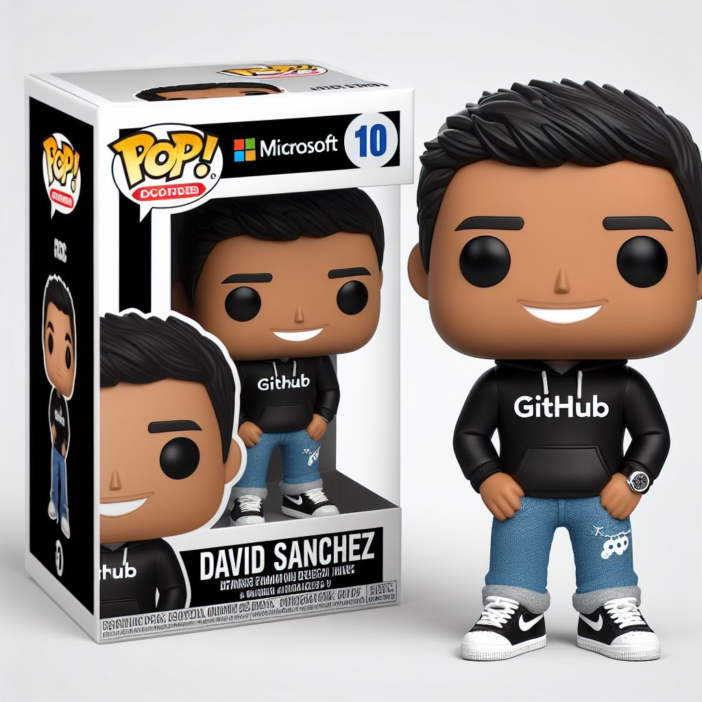
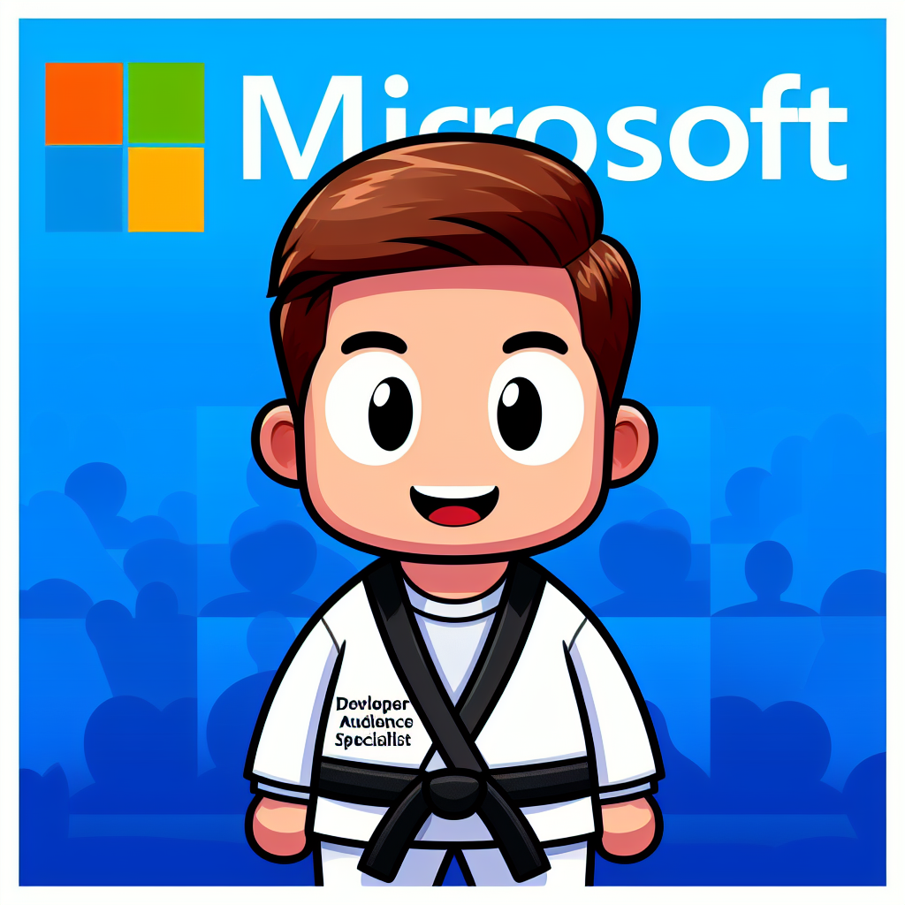

# I'm returning to Microsoft as Global Black Belt Specialist - Azure Developer Audience

I'm very excited to be back at Microsoft and to be part of the Global Black Belt team. I will be helping developers to build amazing solutions with GitHub & Azure.

<!--truncate-->

I'm looking forward to collaborating with exceptional minds, embracing new challenges, and continuing to make a meaningful impact in Software Engineering.

	

In this new role, I will be responsible for the following:

- Technical sales leader and influencer in shaping customer decisions to build and transform with clear strategic vision of Modern Engineering practices using the Azure and GitHub Platforms. 
- Develop, communicate, and provide high business impact solutions that enable digital transformation.
- Influence the Microsoft and GitHub go-to-market and product strategies by providing feedback to sales, marketing, and engineering on current and future product requirements.

I'm immensely grateful for this opportunity and the continuous support from family, friends, colleagues, and the Microsoft community.

Although I will not going to continue in the Microsoft MVP program, I will continue to contribute to the Microsoft technical community with content, writing blog posts, recording videos, speaking at conferences, and sharing knowledge.

PD: I did have a lot of fun playing with [Microsoft Designer](https://designer.microsoft.com) to create the Funko Pop image for this post. 😁

You can try creating yours using this [prompt](https://designer.microsoft.com/image-creator?p=Funko+figure+of+%5Ban+activity+or+role%5D%2C+%5Bfemale+or+male%5D%2C+called+%5BName%5D%2C+wearing+a+%5Bspecific+clothes+and+glasses%5D%2C+%5Bspecific+hair%5D+and+has+%5Baccessories%5D.+Holding+a+%5Bsomething%5D.+The+Funko+is+displayed+inside+a+Funko+box+with+%5Btext%5D+text+and+%5Blogo%5D+logo+for+the+box%2C+allowing+visibility+of+the+figure%2C+typography%2C+3D+render).

You can also try other designs like this one:

	

Thank you to everyone who has been a part of my journey. Let's connect and explore how we can drive innovation together in this new AI era! Feel free to reach out. I'm here to collaborate, learn, and grow with you all.