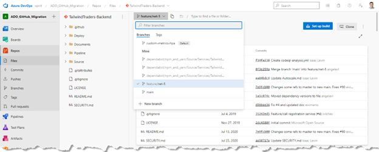
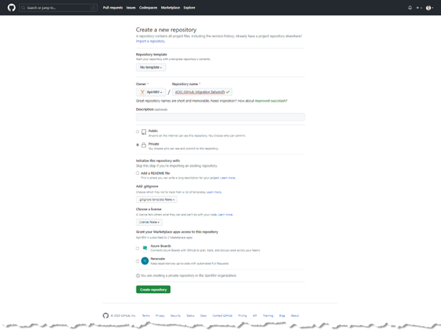
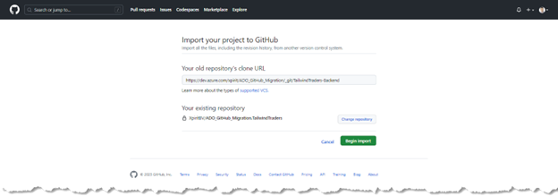
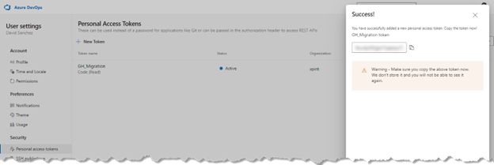
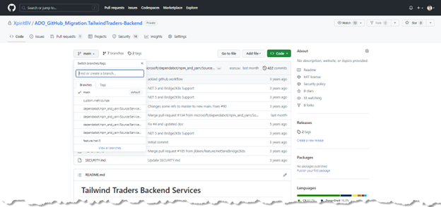

# Azure DevOps to GitHub – Repo Migration
Migrating a repository from one platform to another can be a challenging task, but with the right tools and guidance, it can be a straightforward process. We'll guide you through the steps to migrate a repository from Azure DevOps to GitHub using the import code option.

## 1. Locate the repository in Azure DevOps.

We used the [Azure DevOps Demo Generator](https://azuredevopsdemogenerator.azurewebsites.net) to create a sample project with multiple repositories that contain multiple branches. We will start the migration with the [TailwindTraders-Backend](https://github.com/microsoft/tailwindTraders-backend) repository.



## 2. Create a new repository in GitHub.

Go to your GitHub account or organization and click on the "New repository" button. Give your repository a name and description and choose the appropriate visibility settings. 
In this case we are using the following naming structure: ```<ADOProjectName>.<ADORepoName>```.



## 3. Import the repository to GitHub.

Now that you have your new GitHub repository, it's time to import your repository to GitHub. To do this, go to your new GitHub repository and click on the "Import code" button. 

In the "Your old repository's clone URL" field, enter the URL you found in your Azure DevOps repository in Step 1. Click “Begin Import”




## 4. Authenticate to your Azure DevOps project.

To authenticate to Azure DevOps, you can use a personal access token with read access to code. And enter your username and PAT in GitHub, then click “Submit”.




Depending on the size of your repository, the import process can take some time. You'll receive an email notification once the import process is complete. 


## 5. Verify your repository in GitHub.

Once the import process is complete, go to your new GitHub repository and verify that all your branches, tags, and commits have been imported correctly. You can also check that your repository's history has been preserved by looking at the commit history.



Congratulations! You've successfully migrated your repository from Azure DevOps to GitHub using the import code option.