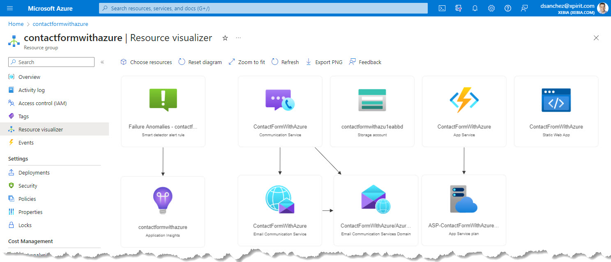
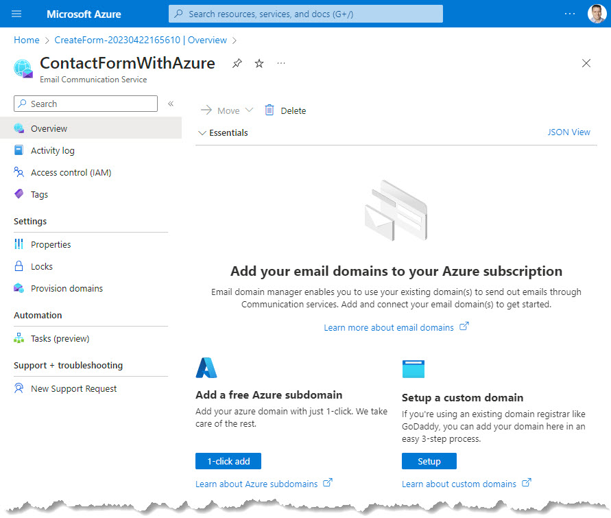
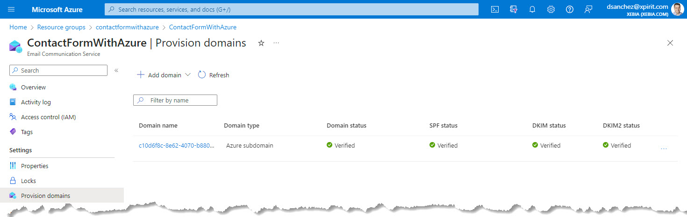
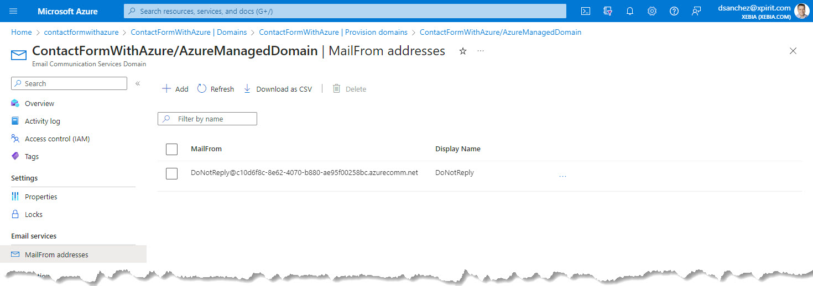
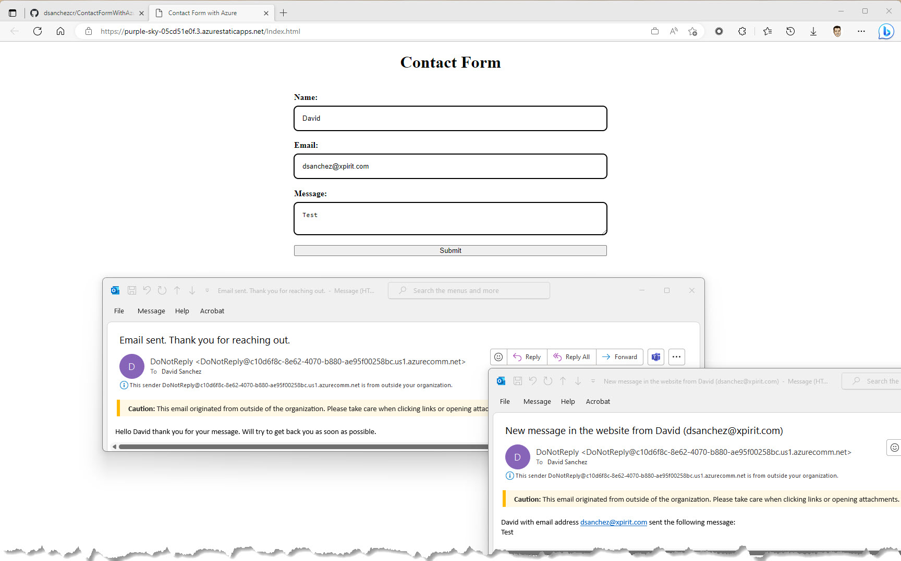

# Building a simple contact form with Azure

In this post, we will build a contact form with Azure Functions and Azure Communication Services.
<!--truncate-->
## Introduction

Having a functional contact form on your website is essential. A contact form is a simple yet effective way to receive inquiries and feedback from your visitors, customers, or clients. In this blog post, I will share my experience in building a contact form using Azure Functions and Azure Communication Service's Email Service.

## Why Azure Functions?

[Azure Functions](https://learn.microsoft.com/azure/azure-functions/functions-overview) is a serverless computing service offered by Microsoft Azure. It allows developers to build, run, and scale applications without having to manage infrastructure. Azure Functions support multiple programming languages, including C#, Java, JavaScript, Python, and PowerShell.

In this case my website is running on a static web app, so I need to use a serverless solution to build the contact form. Azure Functions is a great option because it allows me to build a contact form without having to manage infrastructure or worry about the complexities of communication protocols.

## What is Azure Communication Service?

[Azure Communication Service](https://learn.microsoft.com/azure/communication-services/overview) is a communication platform offered by Microsoft Azure. It provides developers with the tools and services to integrate real-time communication features such as voice, video, chat, and SMS messaging into their applications. Azure Communication Service also offers an [Email Service](https://learn.microsoft.com/azure/communication-services/concepts/email/email-overview) that allows developers to send and receive emails programmatically.

## Building the Contact Form using Azure Functions and Azure Communication Service

To build a contact form using Azure Functions and Azure Communication Service's Email Service, I followed these steps:

#### 1. Create the Azure resources

The first step was to create the Azure resources. These are the resouces that I used in this sample application:

- [Azure Communication Service](https://learn.microsoft.com/azure/communication-services/quickstarts/create-communication-resource) - to manage the Email service.
- [Azure Email Service (Part of Azure Communication Service)](https://learn.microsoft.com/azure/communication-services/quickstarts/email/create-email-communication-resource) - to send emails.
- [Azure Function](https://learn.microsoft.com/azure/azure-functions/functions-create-first-function-vs-code?pivots=programming-language-csharp) - to process the HTTP trigger sent by the HTML and send the emails using Azure Communication Service.
- [Azure Static Web App](https://learn.microsoft.com/azure/static-web-apps/getting-started) - to host the website (Index.html in this case).



#### 2. Configure the Azure Communication Services - Email Service

The next step was to configure the Azure Communication Services - Email Service. This includes setting up an email address to send emails. When you create this service you can choose if you want to use an Azure subdomain or if you want to setup your own domain.



In this case, I used the email address provisioned by an Azure subdomain. 



The email address was created and configured automatically:




#### 3. Develop the Azure Function

The first step was to create an Azure Function. You can choose from various templates based on the programming language of your choice. In this case, I used the VS Code to create the C# Azure Function with a HTTP trigger. The Function sends two emails, one to notify the website owner and another one to notify the user who sends the message through the website to let me know that their message was sent. 

> To call the Azure Function, it is required to send three parameters: `name`, `email`, and `message`. 
Also, the Function is using three environment variables that you need to create in the Azure Function configuration: 
- `myEmailAddress`: to notify the website owner that a new message has been received.
- `senderEmailAddress`: the email address that was provisioned in the Azure Communication Service configuration.
- `AzureCommunicationServicesConnectionString`: the connection string that was provisioned in the Azure Communication Service configuration.

The [EmailClient](https://learn.microsoft.com/dotnet/api/azure.communication.email.emailclient?view=azure-dotnet) class is used to send emails using the Azure Communication Service Email Service and it is initialized with the connection string.

The following code snippet shows the HTTP trigger function:

```c reference title="Azure Function HTTP Trigger - SendEmails.cs"
https://github.com/dsanchezcr/ContactFormWithAzure/blob/9f619eb2c8d41e45574557dbf3c2f95486391d30/api/SendEmails.cs#L17-L57
```

#### 4. Develop the front end

In my case I created a simple HTML file and added the necessary form fields for the contact form, name, email, and message.

```html reference title="Form to send the email"
https://github.com/dsanchezcr/ContactFormWithAzure/blob/9f619eb2c8d41e45574557dbf3c2f95486391d30/Index.html#L123-L137
```

Here is the JavaScript code that I used to process the call to Azure Function:

```javascript reference title="JavaScript code to call the Azure Function"
https://github.com/dsanchezcr/ContactFormWithAzure/blob/9f619eb2c8d41e45574557dbf3c2f95486391d30/Index.html#L8-L32
```

#### 5. GitHub Actions to build and deploy the solution

I created a GitHub Action to build and deploy the Azure Function and the website. The following code snippet shows the GitHub Action:

```yaml reference title="GitHub Action to build and deploy the solution"
https://github.com/dsanchezcr/ContactFormWithAzure/blob/9f619eb2c8d41e45574557dbf3c2f95486391d30/.github/workflows/main_contactformwithazure.yml#L1-L45
```

> The GitHub Action is using two secrets that you need to configure:
- `AZUREAPPSERVICE_PUBLISHPROFILE`: the publish profile of the Azure Function.
- `AZURE_STATIC_WEB_APPS_API_TOKEN`: the API token of the Azure Static Web App.

## Testing the solution

I tested the solution by sending a message from the contact form. The following image shows the email that was sent to the website owner and the email that was sent to the user who posted the message.



You can try the solution [here](https://purple-sky-05cd51e0f.3.azurestaticapps.net/Index.html).

And check out my production contact form [here](https://dsanchezcr.com/contact).