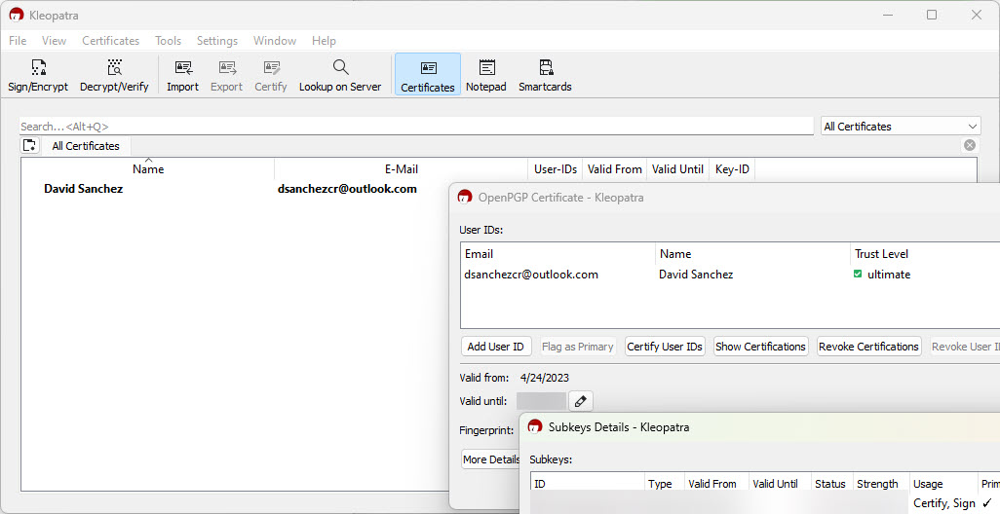
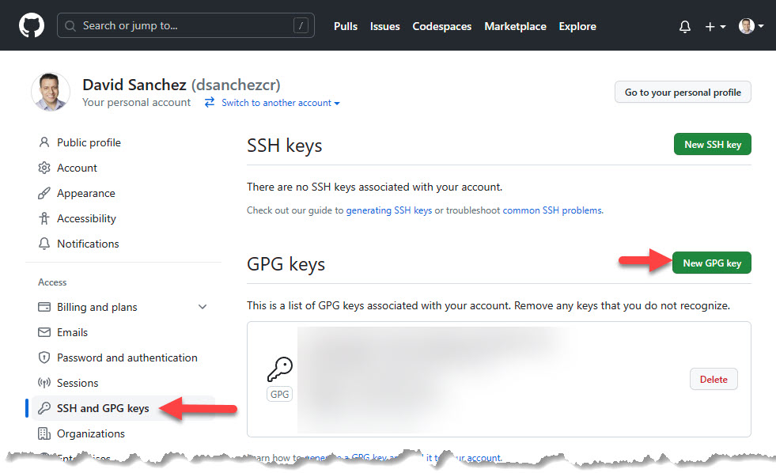
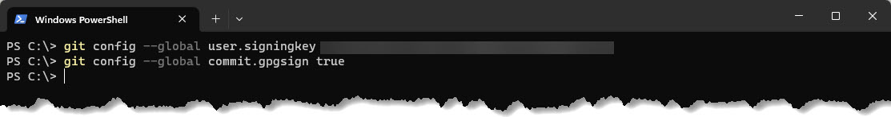

# Verified Commits in GitHub

A commit is a code change that is made to a repository. When a developer makes a commit, it is important to ensure that the code changes are made by an authorized person and that the changes have not been tampered with. This is where GitHub verified commits come in. This is useful to prevent impersonation and to ensure that the code you are downloading is the code that was uploaded by the developer.
<!--truncate-->
GitHub verified commits use digital signatures to ensure the authenticity of code changes. When a developer makes a commit, they can sign the commit using their GPG (GNU Privacy Guard) key. This key is a unique identifier that is used to verify the authenticity of the code changes. Once the commit is signed, GitHub will display a green "verified" badge next to the commit. Like this:


To use GitHub verified commits, developers must first generate a GPG key. This key is a type of encryption key that is used to sign and verify digital signatures. 

Once the key is generated, it can be uploaded to GitHub and used to sign commits.

To generate a GPG key, you will need to install GPG on your computer. There are different ways to generate the key, in my case I did using [Gpg4win](https://www.gpg4win.org) but you can also do it using the command line with the following command:

```bash
gpg --full-generate-key
```

In my case I did it using Kleopatra, which is a certificate manager and GUI for GnuPG:



Once you have the key, you can export it and upload it to GitHub. In settings, go to SSH and GPG keys and click on New GPG key:



Then you need to configure your git client to use the key. In my case, this is how I did it:

```bash
git config --global user.signingkey <your key id>
git config --global commit.gpgsign true
```



Now you can make a commit and sign it using the following command or the [GitHub Desktop](https://desktop.github.com) client.

```bash
git commit -S -m "Your commit message"
```

And that's it, now GitHub will show the verified badge next to your commit.