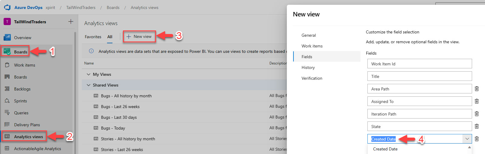
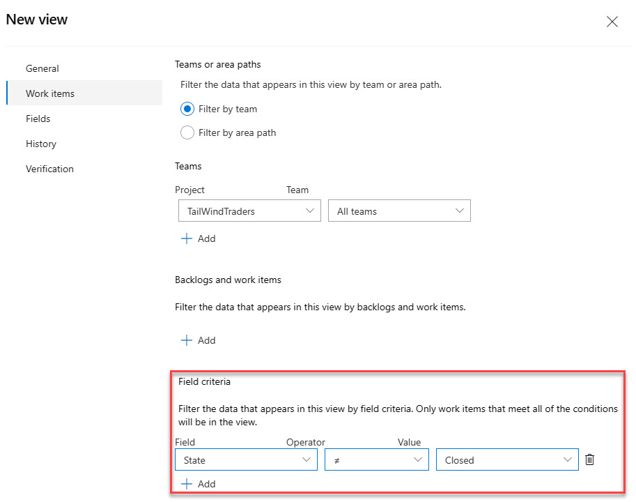
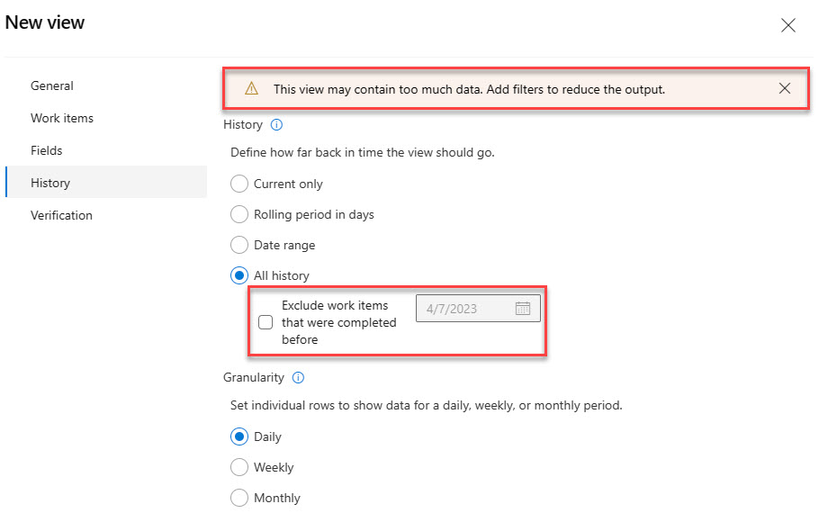
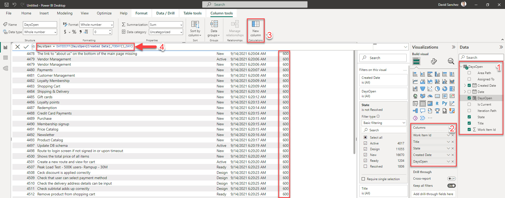
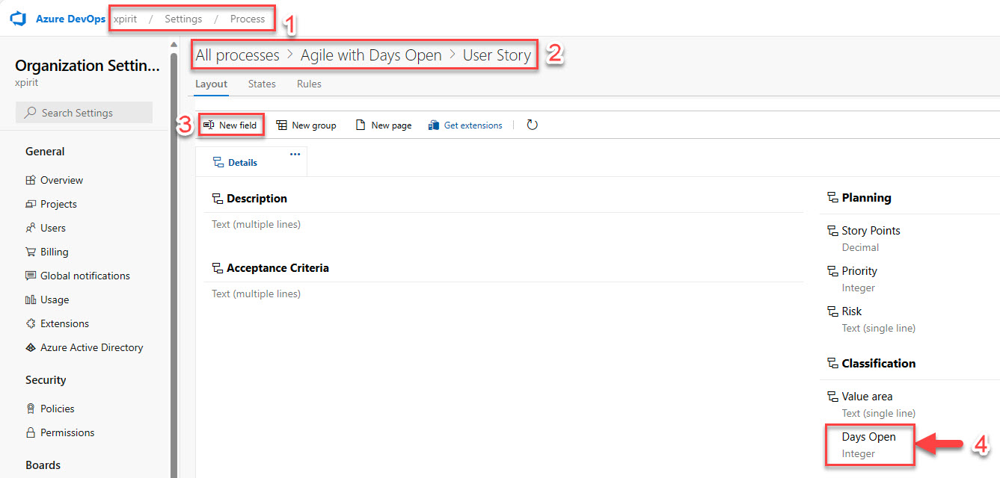
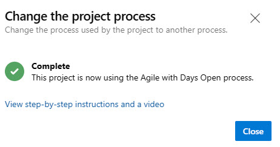
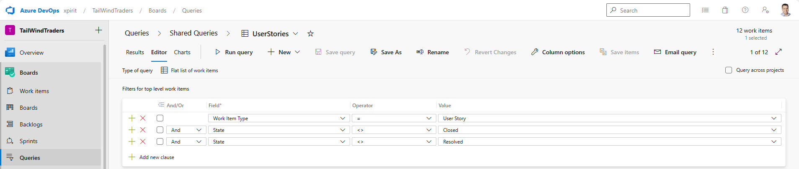
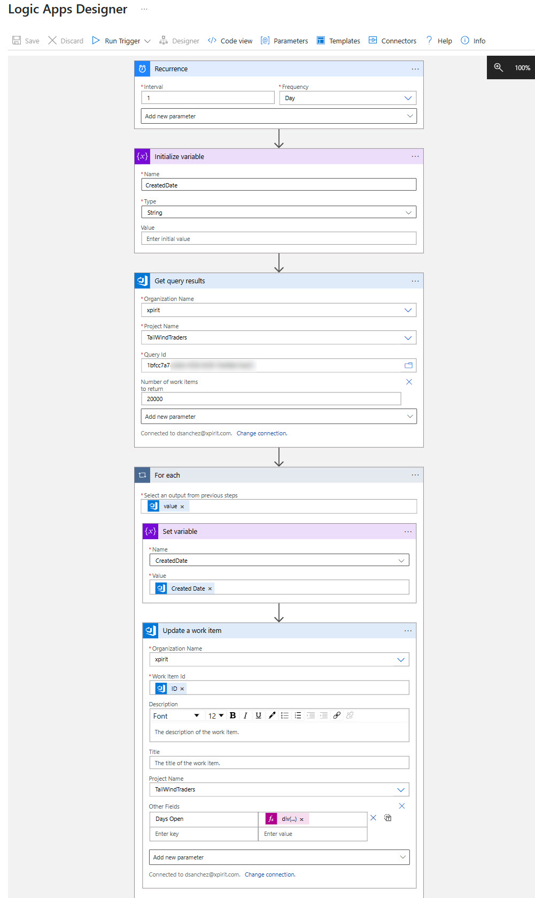
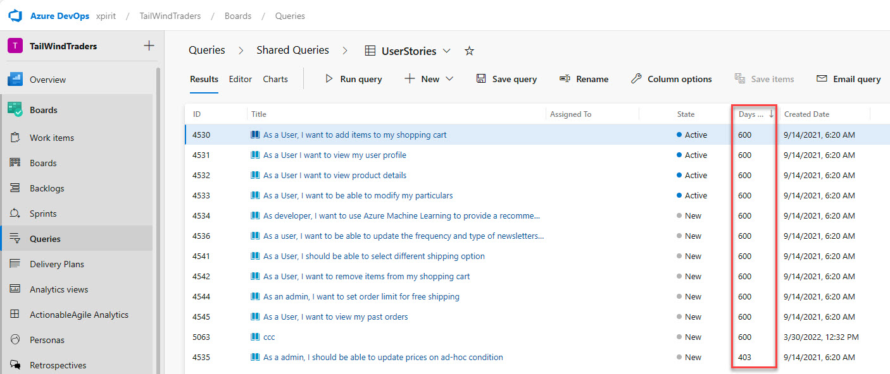

# How many days work items have been open in Azure Boards

Depending on how your team tracks the work, they may want to know how many days a work item has been open. For example, if you have a work item that has been open for a long time, you may want to close it or prioritize it.

In this post, I will show you how to get how many days work items have been open in Azure Boards.

<!--truncate-->

There are different ways to accomplish this, in this post, I will cover two ways of how to do it, the first one is using the Azure Boards analytics views to get a report in Power BI and the second one is by adding a custom field in your current process that will be updated daily automatically with an Azure Logic App or Power Automate workflow.

## Using Azure Boards Analytics

The first option is to use the Azure Boards Analytics views to get the information and then create a report in Power BI.

### Create the Analytics view

To create the Analytics view, go to the Analytics views in the Azure DevOps portal and click on the new view button. Then, select the Work Items option, add, or remove the fields that you need and make sure to add the Created Date. Click on the Continue button.



In the previous screen you can also filter the work items that you do not need, for example where the state is Closed.  



In the next screen, select the History that you need to get, you can also exclude the work items that were completed before a given date.



Then you can select the filters that you want to apply to the view, in this case, since this is a test project, I selected all history, and you can see the warning message on top about the amount of data. In this section you can also exclude the work items that were completed before the date that you choose.

Once the view is verified and created, we are ready to open Power BI, in my case I used the Power BI Desktop application.

### Create the Power BI report

In Power BI, click on the Get Data button and select the Azure DevOps option. 

Then, enter the URL of your Azure DevOps organization, team project and select the Analytics view that you created in the previous step then click on Load the data.

Next, you need to select the columns that you would like to see in your report, in my case I selected the Work Item Id, Title, State and Created Date.

As a filter you can select the status that you only want, in my case I removed the Resolved work items. Then create a new column to calculate the days open, in my case I used the following formula:

```
DaysOpen = DATEDIFF(DaysOpen[Created Date],TODAY(),DAY)
```

Once the new column is created, you just need to add it to the report, and you will see the days open for each work item.



## Using a custom field

The second option is to add a custom field in your current process that will be updated daily automatically with an Azure Logic App or Power Automate workflow.

### Create the custom field

To create the custom field, go to the Process section in the Azure DevOps portal and select the process that you want to update. Then, click on the Work item types option and select the work item type that you want to update, in this case, I selected the User Story work item type.

>    - If your current process is a default process, you will need to create a new inherited process and then update the work item types.
>    - You will need to do this with all the work item types that you want to update.

Add the new field to the work item type, in this case, I added the Days Open field as Integer to the Classification section.



> Remember to update the process if you created an inherited process.

> 

Once the process is updated with the custom field, I created a new query to get the work items (user stories in this case) that are not closed or resolved.



### Create the Logic App

In the Azure Portal, create the Azure Logic App and add a Recurrence trigger to run the workflow daily.

I created a variable to store the Created Date for each Work Item. Since I created a query in Azure Boards, I used the 'Get Query Results' action to get the work items that are not closed or resolved. (You can get up to 20,000 work items)

Then, in a for each loop, I used the 'Update Work Item' action to set the custom field 'Days Open' with the following formula:

```
div(sub(ticks(utcNow()), ticks(variables('CreatedDate'))), 864000000000)
```



Once the Logic App ran, you can see the Days Open field updated in the work items.



## Conclusion

In this post, I showed you how to get how many days work items have been open in Azure Boards. I hope you find this post useful!