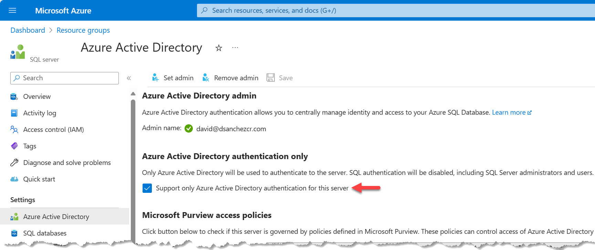
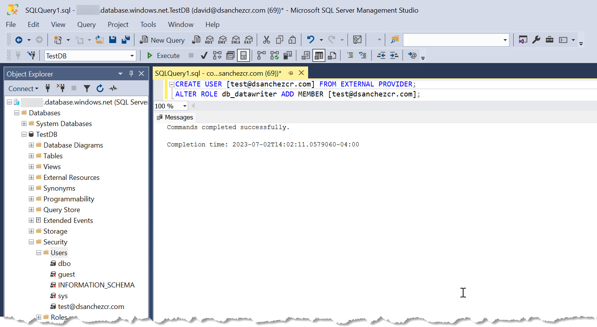
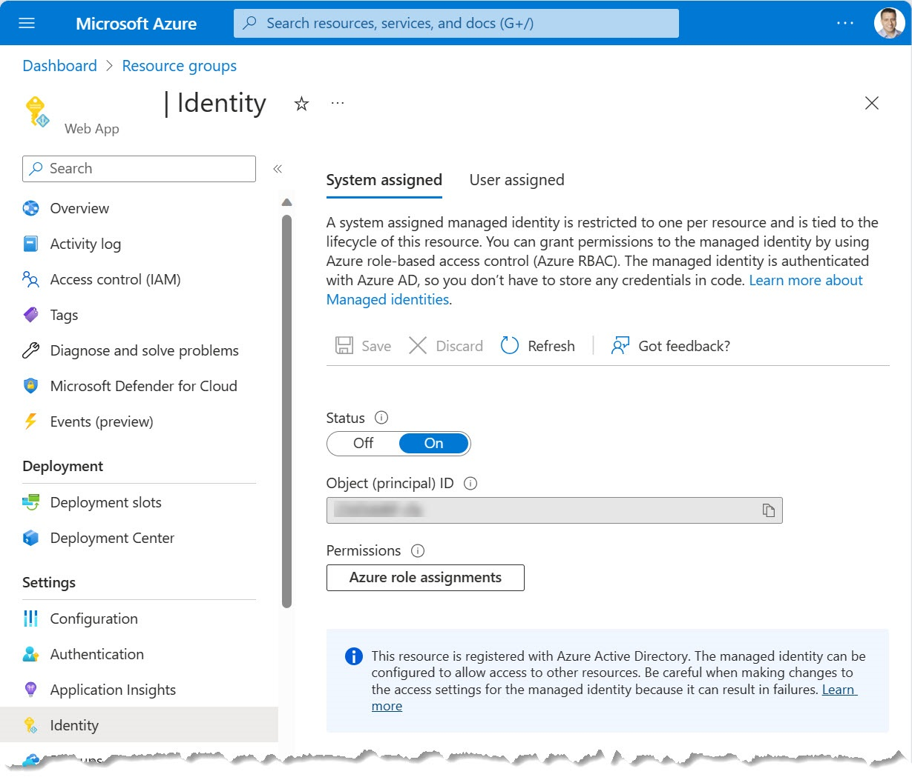
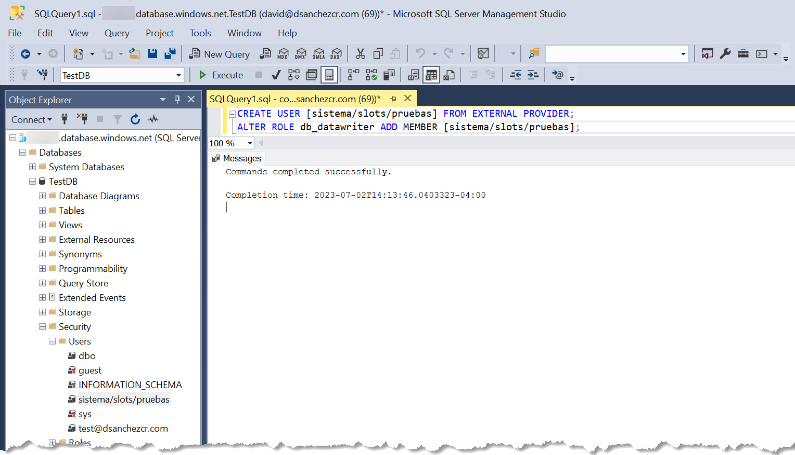

# Connecting to SQL Azure without secrets using Azure Active Directory

In this post I will show you how to connect to SQL Azure without using secrets, using Azure Active Directory.

<!--truncate-->

## Introduction

With GitHub Advanced Security, you can scan your code for secrets and vulnerabilities in your codebase and git history by using [Secret Scanning](https://docs.github.com/code-security/secret-scanning/about-secret-scanning) or even go one step further and use [push protection](https://docs.github.com/enterprise-cloud@latest/code-security/secret-scanning/protecting-pushes-with-secret-scanning) to avoid secrets being pushed in your repository. This is an excellent feature when we have secrets in our applications, but it is not enough when we talk about passwords in connections strings, you also need to rotate those passwords, protect them, make sure you are using the correct one for each different stage (Dev, QA, Prod, etc.). A solution to this problem is to use Managed Service Identity (MSI) instead of usernames and passwords to connect to different Azure services, including SQL Azure.

## Enabling Azure Active Directory authentication on SQL Azure

First, we need to make sure Azure Active Directory authentication is enabled on SQL Azure. 



## Adding users to SQL Azure and assigning permissions

To do this, we need to connect to the SQL Azure server using SSMS, and run the following query that creates a user from an Azure Active Directory account, and assigns the db_datareader role to it. You can learn more about the [SQL roles here](https://learn.microsoft.com/sql/relational-databases/security/authentication-access/database-level-roles?https://learn.microsoft.com/sql/relational-databases/security/authentication-access/database-level-roles?view=sql-server-ver16#fixed-database-roles).

```sql
CREATE USER [<user@AAD-tenant-domain>] FROM EXTERNAL PROVIDER;
ALTER ROLE db_datareader ADD MEMBER [<user@AAD-tenant-domain>];
```

Example:


> Note: You can do this at the server level, or at the database level. If you do it at the server level, the user will have access to all the databases in the server. If you do it at the database level, the user will only have access to that database.

As mentioned you can also use managed identities and service principals. Here is an example of how it looks like when using a managed identity:



Here is an example of the query you need to run to create the user from a managed identity and assign it a role, in this case db_datareader:

```sql
CREATE USER [name-of-the-object] FROM EXTERNAL PROVIDER;
ALTER ROLE db_datareader ADD MEMBER [name-of-the-object];
```

Example:


## Connecting to SQL Azure using Azure Active Directory

Now that we have Azure Active Directory authentication enabled on SQL Azure, and we have added users and assigned permissions, we can connect to SQL Azure using Azure Active Directory.

The connectiong string looks like this:

```csharp
Server=tcp;<your-server>.database.windows.net,1433;Initial Catalog=<your-database>;Authentication=Active Directory Managed Identity;
```

## Conclusion

Your connections to SQL Azure are now more secure and without using secrets by using Azure Active Directory.

## References

- [SQL Azure - Using Azure Active Directory Authentication](https://docs.microsoft.com/azure/azure-sql/database/authentication-aad-overview)