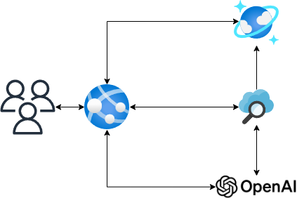

# Extending CosmicWorks with Azure Cognitive Search and Azure OpenAI

In this post I show how to add Azure Cognitive Search to CosmicWorks to enable full text search and how to add Azure OpenAI to CosmicWorks to enable chat experience with GPT from Azure OpenAI.

<!--truncate-->

## Introduction

CosmicWorks is a sample application with demo data that shows how to use Azure Cosmos DB with the .NET SDK. It is a simple application that allows you to manage sample product data.

You can check out the original repository here: [GitHub](https://github.com/AzureCosmosDB/CosmicWorks).

### Azure OpenAI

Azure OpenAI is a service that provides an API for accessing new AI models developed by OpenAI. The API is currently in preview and you can learn more about it in this link: [Microsoft Learn](https://learn.microsoft.com/en-us/azure/ai-services/openai/concepts/overview).

### Azure Cognitive Search

Azure Cognitive Search is a search-as-a-service cloud solution that gives developers APIs and tools for adding a rich search experience over your data in web, mobile, and enterprise applications. It is a fully managed service that removes the need to manage and scale your own search infrastructure.

To use Azure OpenAI with your data, you can consume data from Azure Cognitive Search to provide the chat experience. You can learn more about it in this link: [Microsoft Learn](https://learn.microsoft.com/en-us/azure/ai-services/openai/concepts/use-your-data#data-source-options).

## Open Source Repository

You can find the repository with the changes here: [GitHub](https://github.com/dsanchezcr/CosmicWorksSampleApp)

## Prerequisites

To run this application you will need to have access to the Azure OpenAI Service, you can apply [here](https://aka.ms/oai/access).

You will also need an Azure Cognitive Search instance, you can create one following this [guide](https://docs.microsoft.com/en-us/azure/search/search-create-service-portal).