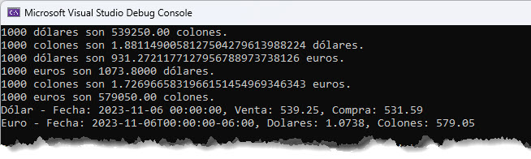

# Colones Exchange Rate - NuGet Package

In this post I am introducing [a new NuGet package](https://nuget.org/packages/ColonesExchangeRate) that I created to get the exchange rate of the Costa Rican Colón currency conversion to US Dollars and Euros.

<!--truncate-->

## Key Features

- Get the exchange rate of the Costa Rican Colón currency conversion to US Dollars and Euros.
- Get today's exchange rate of the Costa Rican Colón currency information for US Dollars and Euros.
- Consumes the API from the Ministerio de Hacienda de Costa Rica.

## How to use it

### Install the NuGet package

```powershell
Install-Package ColonesExchangeRate
```

### Get the exchange rate

```csharp
var _converter = new CurrencyConverter();
decimal amount = 1000;

var dolaresAColones = await _converter.DollarsToColones(amount);
Console.WriteLine($"{amount} dólares son {dolaresAColones} colones.");

var colonesADolares = await _converter.ColonesToDollars(amount);
Console.WriteLine($"{amount} colones son {colonesADolares} dólares.");

var dolaresAEuros = await _converter.DollarsToEuros(amount);
Console.WriteLine($"{amount} dólares son {dolaresAEuros} euros.");

var eurosADolares = await _converter.EurosToDollars(amount);
Console.WriteLine($"{amount} euros son {eurosADolares} dólares.");

var colonesAEuros = await _converter.ColonesToEuros(amount);
Console.WriteLine($"{amount} colones son {colonesAEuros} euros.");

var eurosAColones = await _converter.EurosToColones(amount);
Console.WriteLine($"{amount} euros son {eurosAColones} colones.");

var (date, sale, purchase) = await _converter.GetDollarExchangeRate(true);
Console.WriteLine($"Dólar - Fecha: {date}, Venta: {sale}, Compra: {purchase}");

var (_date, dollars, colones) = await _converter.GetEuroExchangeRate(true);
Console.WriteLine($"Euro - Fecha: {_date}, Dolares: {dollars}, Colones: {colones}");
```

The output will be:



## Source Code

The source code is available on [GitHub](https://github.com/dsanchezcr/ColonesExchangeRate). Feel free to contribute to the project.

> Note: This repository also deploys the NuGet package to GitHub Packages.

## NuGet Package

The NuGet package is available on [nuget.org](https://nuget.org/packages/ColonesExchangeRate).

## References

- [Ministerio de Hacienda de Costa Rica](https://api.hacienda.go.cr/indicadores/tc)

## Conclusion

I hope you find this NuGet package useful. If you have any questions or comments, please leave them below.

Thanks for reading and happy coding!