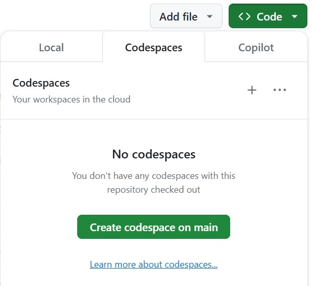
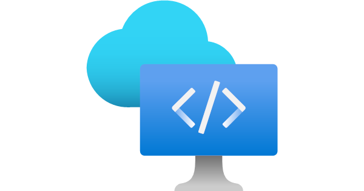
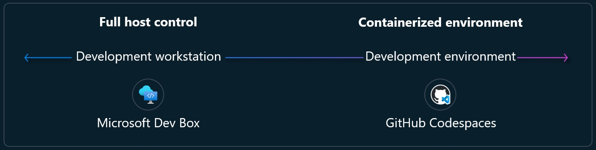

# Cloud Development Environments

In this post I am going to talk about the different options that we have to create a cloud development environment offered by Microsoft & GitHub.

<!--truncate-->

Let's start with the definition of it:

## What is a cloud development environment?

It is a complete development environment that is hosted in the cloud, includes everything you need to write, run, and debug your code. It is accessible from anywhere and from any device.

## Why use a cloud development environment?

There are many reasons to use a cloud development environment. Some of the main benefits include:

- **Convenience**: accessible from anywhere and from any device. This means you can work on your code from anywhere, whether you are at home, in the office, or on the go.
- **Scalability**: add or remove resources as needed. This means you can quickly scale up to meet increased demand, or scale down to save costs when demand is low.
- **Flexibility**: customize it to meet your specific needs. This means you can choose the tools and resources that work best for you, and you can easily change them as needed.
- **Collaboration**: share your definitions with others, and work together on the same codebase. This means you can easily collaborate with team members, partners, or customers, regardless of their location.
- **Security**: keep your code and data safe. This means you can rely on the cloud provider to maintain the security of your development environment, and you can focus on writing code without worrying about security.
- **Cost-effectiveness**: pay only for what you use. This means you can avoid the upfront costs of purchasing hardware and software, and you can save money by only paying for the resources you need.
- **Productivity**: focus on writing code, not managing infrastructure. This means you can spend more time writing code and less time setting up and maintaining your development environment.
- **Performance**: run your code on powerful servers. This means you can take advantage of the cloud provider's high-performance servers to run your code faster and more efficiently.
- **Sustainability**: reduce your carbon footprint. This means you can help protect the environment by using cloud resources more efficiently, and you can contribute to a more sustainable future for everyone.

## Different options for cloud development environments

There are many different options for creating a cloud development environment. Some of the most popular options include:

### 1. GitHub Codespaces

Available in your GitHub repositories. You can use it to write, run, and debug your code with a complete development environment in your browser or open it in Visual Studio Code. One of the biggest advantages of GitHub Codespaces is that you can customize the environment and configuration to meet your specific needs, and you can easily share it with others. For example, by [adding a `devcontainer.json` file to your repository](https://docs.github.com/codespaces/setting-up-your-project-for-codespaces/adding-a-dev-container-configuration/introduction-to-dev-containers#using-the-default-dev-container-configuration), you can define the development environment that you want to use, including the tools, extensions, and settings that you need. 

#### How to create a GitHub Codespace?

1. Go to your GitHub repository.
2. Click on the "Code" button.
3. Click on the "Open with Codespaces" button.
4. Wait for the Codespace to be created.
5. Start writing, running, and debugging your code.

### 2. Microsoft DevBox

Available through Microsoft Azure, it is a workstation in the cloud that includes everything you need to write, run, and debug your code. You can use it to develop, test, and deploy your applications with a complete development environment in the cloud.

## When to use Microsoft DevBox or GitHub Codespaces?

Whenever you need a Development Workstation, you can use Microsoft DevBox. It is a complete development environment that includes everything you need to write, run, and debug your code. You can use it to develop, test, and deploy your applications with a complete development environment in the cloud.

## Conclusion

In this post, I talked about the different options that we have to create a cloud development environment. I hope you found it useful. If you have any questions, feel free to ask in the comments section below. 