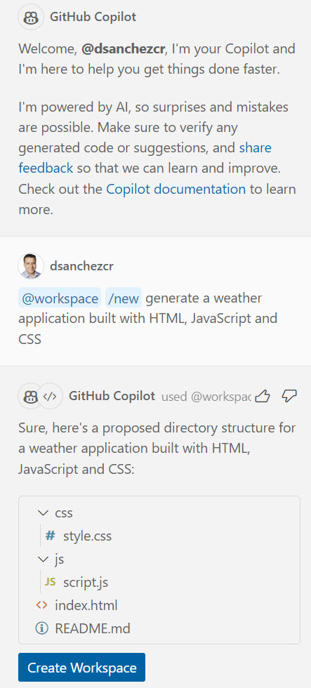
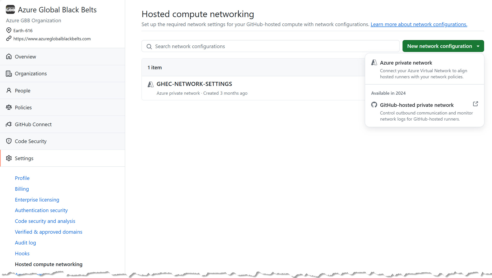
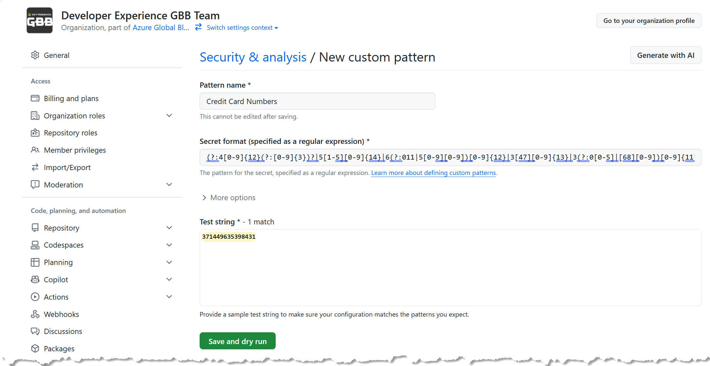

# GitHub de Mayo - Tips about GitHub

In this post I am sharing some tips about GitHub to celebrate "GitHub de Mayo". I hope you find these tips useful:

<!--truncate-->

## 1. GitHub Copilot

GitHub Copilot is an AI pair programmer that helps you write code faster. It is powered by OpenAI Codex. GitHub Copilot suggests whole lines or entire functions right inside your IDE.

Here is a cool tip that can help you get the most out of GitHub Copilot:

> [!TIP]
> In the chat use the slash commands `/` to get suggestions for code completions and snippets. For example, `/explain` will provide an explanation of the code, `/fix` will suggest a fix for the code, and `/test` will generate a test for the code, `/tests` will generate a test for the code. 
> Also you can combine it with references like `@workspace` to get suggestions for your workspace.

Here are some resources to learn more about GitHub Copilot:

- [GitHub Copilot Fundamentals MS Learn Path](https://learn.microsoft.com/training/paths/copilot)
- [Essentials of GitHub Copilot](https://resources.github.com/learn/pathways/copilot/essentials/essentials-of-github-copilot)
- [Introduction to GitHub Copilot](https://www.youtube.com/playlist?list=PLlrxD0HtieHgr23PS05FIncnih4dH9Na5)
- [Mastering GitHub Copilot for AI Paired Programming](https://github.com/microsoft/Mastering-GitHub-Copilot-for-Paired-Programming)

## 2. GitHub Actions - Hosted compute networking

GitHub Actions makes it easy to automate all your software workflows, now with world-class CI/CD. Build, test, and deploy your code right from GitHub.

However sometimes these deployments required to be in an isolated environment not from public internet because you don't want to expose your app to the public internet.

One solution is to use the [GitHub Actions self-hosted runners](https://docs.github.com/en/actions/hosting-your-own-runners/managing-self-hosted-runners/about-self-hosted-runners) but if you don't want to manage the infrastructure you can use the following tip:

> [!TIP]
> You can use **[Hosted compute networking](https://docs.github.com/en/actions/using-github-hosted-runners/connecting-to-a-private-network/about-private-networking-with-github-hosted-runners)** to connect the GitHub-hosted runners to resources on a private network, including package/container registries, secret managers, and other services even on-premises.

## 3. GitHub Advanced Security - Custom Patterns

GitHub Advanced Security features help you secure your code and your software supply chain. It includes Secret Scanning, in this service you can use your own secrets patters and GitHub Copilot can help you generate the RegEx from your secrets.

> [!TIP]
> Let's suppose you want to avoid credit card numbers in any part of your source code (including documentation or comments), you can ask GitHub Copilot to generate a regular expression or use the `Generate with AI` feature and then register it as a secret pattern in your repository or in a GitHub organization. 

Learn more about [Secret Scanning here](https://docs.github.com/en/code-security/secret-security/about-secret-scanning).

## Conclusion

I hope you find these tips useful. If you have any questions or comments, please leave them below.