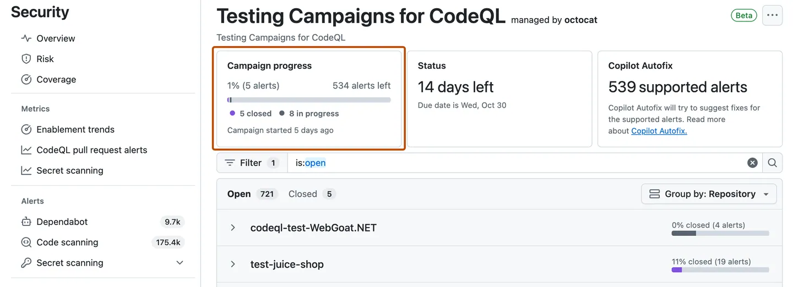
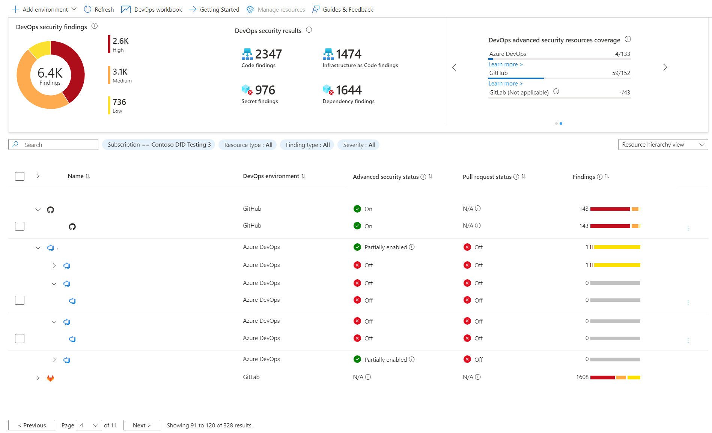

# Leveraging GitHub Advanced Security and Microsoft Defender for Cloud

## Introduction

Rolling out [GitHub Advanced Security (GHAS)](https://github.com/enterprise/advanced-security) across development teams can be a complex task. This blog post provides tips and tricks to help you successfully implement GHAS and integrate it with [Microsoft Defender for Cloud](https://azure.microsoft.com/products/defender-for-cloud), ensuring that your teams are not overwhelmed and can maximize the capabilities of Code Scanning, Secret Scanning, Supply Chain Scanning and Infrastructure as a Code Scanning.

<!--truncate-->

## Best Practices for Rolling Out GHAS

### 1. Start with a Pilot Project

Begin by rolling out GHAS to a small, manageable pilot project. This allows you to identify any potential issues and gather feedback from the team before scaling up to larger projects. Ensure that the pilot project includes a representative sample of your codebase and development practices.

### 2. Communicate the Benefits

Clearly communicate the benefits of GHAS to your development teams. Emphasize how it can help them not only identify but fix security vulnerabilities, reduce the risk of data breaches, and improve the overall security and quality of their code. Provide examples of [how GHAS has helped other teams within your organization or industry](https://github.com/customer-stories/all).

### 3. Provide Training and Support

Offer training sessions and resources to help your teams get up to speed with GHAS. This can include workshops, webinars, documentation, and one-on-one support. Ensure that your teams know how to use the various features of GHAS, such as Code Scanning, Secret Scanning, and Dependabot. Make sure to provide guidance to the different roles involved in the security process, such as developers, security teams, and operations teams.

### 4. Integrate with Existing Workflows

Integrate GHAS into your existing development workflows and tools. This can help minimize disruption and ensure that your teams can continue to work efficiently. For example, you can configure GHAS to run Code Scanning as part of your CI/CD pipeline, and use Dependabot to automatically update dependencies.

### 5. Monitor and Measure Success

Track the adoption and effectiveness of GHAS across your organization. When rolling out GHAS to multiple repositories, use [the organization security dashboard](https://docs.github.com/enterprise-cloud@latest/code-security/security-overview/viewing-security-insights#viewing-the-security-overview-dashboard-for-your-organization) to monitor the overall security posture of your repositories. Use the insights as the number of vulnerabilities identified and fixed, the time taken to resolve issues, secrets blocked or bypassed, etc.
Share these metrics with your teams to demonstrate the value of GHAS and encourage continued adoption. Increasing coverage and minizing the risk in your codebase.

### 6. Fixing Security Alerts at Scale

When you have a large number of repositories, it can be challenging to keep track of all the security alerts that are generated and it can also be a overwhelm process for the development teams, especially if they work on multiple repositories with that have the same alerts. To help you manage this, you can use the [security campaigns](https://docs.github.com/enterprise-cloud@latest/code-security/securing-your-organization/fixing-security-alerts-at-scale/best-practice-fix-alerts-at-scale#selecting-security-alerts-for-remediation) to automate the process of triaging and fixing security alerts.

## Extending GHAS with Microsoft Defender for Cloud DevOps Security

### 1. Enable Defender for Cloud

Enable Microsoft Defender for Cloud in your Azure Subscription to extend the DevOps Security capabilities of GHAS or GHAzDO (GitHub Advanced Security for Azure DevOps). Defender for Cloud provides advanced threat protection for your cloud resources (not only for Azure but also for AWS or GCP in case you have multi-cloud environment), helping you identify and mitigate more potential security risks.

### 2. Integrate GHAS with Defender for Cloud DevOps Security

The DevOps Security component of Defender for Cloud allows you to create connections with GitHub, Azure DevOps or GitLab to automatically import your security alerts. This integration can help you gain a comprehensive view of your security posture and streamline your security operations across multiple platforms. This can help you to gain a centralized dashboard of your security alerts and manage them more effectively. This dashboard also include Infrastructure as a Code alerts to protect your cloud resources.

### 3. Automate Security Remediation Processes

With Defender for Cloud you can create automation workflows to help you remediate security alerts faster. You can use the built-in playbooks or create your own using Azure Logic Apps or Azure Functions. By automating security remediation processes, you can reduce the burden on your development teams and ensure that security issues are addressed in a timely manner.

## Conclusion

Rolling out GitHub Advanced Security and integrating it with Microsoft Defender for Cloud can help you create a robust security solution for your development teams. By following these tips and best practices, you can ensure a smooth rollout and maximize the benefits of GHAS and Defender for Cloud.