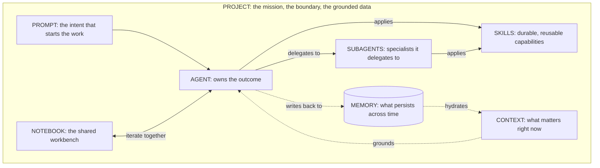

# Mastering Generative AI: The Architecture of a System of Intelligence

_Eight building blocks that turn a capable model into a system that ships real work: agents, subagents, skills, context, memory, prompts, notebooks, and projects._

Most people believe they are using Generative AI when they open a chat window and type a question. They are using the least interesting part of it. The chat box is the front door, not the house.

{/* truncate */}

The reframing that matters is this: a model that answers questions is a feature. A system that pursues outcomes is a different category of thing. The first is a chatbot. The second is a **system of intelligence**, and the gap between them is not bigger models. It is architecture.

Raw capability is commoditizing fast. Every serious model can now write code, summarize a document, and draft a plan. That is no longer where advantage lives. Advantage lives in how you assemble capability into something that remembers, specializes, grounds itself in your data, and coordinates its own work. That assembly has parts, and the parts have names. This post is the mental model that connects them.

---

## The Unifying Framework: Intelligence as an Operating System

Stop picturing a genius in a box. Picture a high functioning team working inside a well defined workspace.

A team has people who own outcomes, specialists they pull in when needed, shared playbooks everyone follows, awareness of the situation in front of them, institutional knowledge that survives turnover, clear assignments, a workbench where ideas get tested, and a mission with boundaries. A system of intelligence has exactly the same parts. We just give them different names.

Here is the full map:

| Building block | What it is | Its job in the system |
|---|---|---|
| **Prompt** | A structured statement of intent | Sets the work in motion |
| **Agent** | An autonomous unit that owns an outcome | Decides, acts, and verifies |
| **Subagent** | A scoped specialist an agent delegates to | Handles depth without polluting the main flow |
| **Skill** | A packaged, reusable capability | Encodes expertise so it is applied consistently |
| **Context** | The information relevant right now | Grounds the work in the current situation |
| **Memory** | Information that persists across time | Lets the system learn instead of restarting |
| **Notebook** | A shared, iterative workspace | Where humans and agents think together |
| **Project** | The mission, the boundary, the grounded data | Holds everything and defines what is in scope |

The diagram below is the model to keep in your head. Read it as a single workspace (the Project) inside which intent flows into an agent, the agent delegates and applies skills, while context and memory continuously feed and record the work.

Now let us walk through each block: what it is, the role it plays, and how it interacts with the others. The order is a narrative, from the spark of intent to the boundary that contains the whole system.

---

## Prompts: Intent, Not Incantation

A prompt is a statement of intent. That is the entire definition, and most of the confusion in this field comes from forgetting it.

The popular misconception is that prompting is a bag of tricks: magic phrases, role play openers, and threats that supposedly coax better answers out of a model. That is folklore. The prompts that hold up are the ones that communicate intent with precision: the goal, the constraints, the inputs, the definition of done. A strong prompt reads less like a spell and more like a small specification. I made this argument in depth in [From Prompts to Specifications](/blog/from-prompts-to-specifications), and it is the foundation everything else rests on.

Here is the role a prompt actually plays: it is the interface between human intent and machine action. In a system of intelligence, a prompt rarely travels alone. It arrives carrying context, it is interpreted by an agent, and it is shaped by the memory and skills available in the project. The same words produce wildly different results depending on what surrounds them.

The mistake to avoid is treating the prompt as the whole system. Teams pour weeks into prompt tuning while ignoring the context the prompt runs in and the memory it could draw on. That is optimizing the question while starving the answer. A precise prompt with no context is a precise question shouted into an empty room.

---

## Agents: The Unit That Owns an Outcome

An agent is an autonomous unit that owns an outcome. The keyword is *owns*. A chatbot responds to a turn. An agent pursues a goal: it plans, takes actions, observes results, corrects course, and decides when the work is actually done.

This is the leap from answering to achieving. Ask a model to "summarize this report" and you get text. Give an agent the goal "produce the weekly risk briefing and flag anything that needs an executive decision" and it has to retrieve the right documents, apply judgment, use tools, and assemble a result that meets a standard. The agent is the actor in the system, the thing that turns intent into completed work.

An agent interacts with everything else: it reads **context** to understand the situation, draws on **memory** to avoid relearning what it already knows, applies **skills** to perform specialized steps reliably, and delegates to **subagents** when a task needs depth it should not handle inline. The prompt sets its direction. The project draws its boundary.

The common failure here is the monolith: one giant agent with a sprawling instruction set asked to do everything. It works in demos and collapses in production, because a single context window cannot hold a whole business process without losing the thread. Real systems decompose. Which is exactly why subagents exist.

---

## Subagents: Delegation as a Design Principle

A subagent is a scoped specialist that an agent calls to handle one well defined job. If the agent is the lead, subagents are the experts it brings in for a specific question and then releases.

The reason subagents matter is not organizational tidiness. It is a hard constraint of how these systems work: attention and context are finite. When a lead agent tries to research, write, test, and review inside a single conversation, every one of those concerns competes for the same limited working space, and quality degrades. Delegating a self contained task to a subagent gives that task its own fresh space to work in. The subagent goes deep, returns a clean result, and the lead agent stays focused on the outcome it owns. I explored how to compose teams of these agents in [Building Your AI Agent Team](/blog/building-your-ai-agent-team).

Consider a developer workflow. The lead agent is implementing a feature. It dispatches an exploration subagent to map how an unfamiliar module works, and a testing subagent to write and run the verification suite. Each subagent burns through a large amount of intermediate reasoning that the lead never has to see. What returns is a summary: "here is how the module works" and "here are the results." The lead stays clean, oriented, and effective.

Subagents interact with skills (they often exist to apply one deeply), with context (they receive a focused slice, not the whole world), and with the lead agent through a narrow, well defined handoff. Used well, they are how a system scales beyond what any single agent could hold in its head.

---

## Skills: Capability You Can Reuse

A skill is a packaged, reusable capability: a defined procedure, with the knowledge and steps to perform it, that any agent can apply. If a prompt is a one time request, a skill is a competency the system keeps.

This is the difference between explaining how to do something every single time and teaching it once. Without skills, expertise lives in whoever happened to write the best prompt, and it evaporates when the conversation closes. With skills, that expertise becomes a durable, versioned asset. "How we triage a support ticket," "how we format a compliance report," "how we run our deployment checklist": each becomes a skill an agent invokes rather than a process it improvises.

The power of skills is composition. The same skill can be applied by many agents and by many subagents. A single skill can be improved once and instantly raise the quality of every workflow that uses it. Skills interact with agents (which decide when to apply them), with context (which supplies the specifics the skill operates on), and with memory (which can refine how a skill is used over time).

The mistake is treating skills as throwaway scripts instead of governed, shared assets. When skills are scattered and personal, you get the same fragmentation that package managers once solved for code dependencies: everyone reinvents the same capability slightly differently, and quality is a lottery.

---

## Context: Situational Awareness in the Moment

Context is the information that is relevant right now. Not everything the system knows, just what matters for the task in front of it: the current document, the relevant records, the state of the conversation, the data retrieved for this specific decision.

Context is the most underestimated block in the entire model, and the source of most disappointing results. A model with no context is brilliant and blind. It reasons beautifully about nothing in particular. The leap in quality almost never comes from a better prompt. It comes from putting the right information in front of the model at the right moment. In the enterprise this has a name: grounding. You connect the system to your data, retrieve the passages that matter, and let the model reason over reality instead of its generic training.

But context has a sharp edge, and it cuts the opposite way from what people assume. The instinct is to dump everything in, on the theory that more information is safer. It is not. An overstuffed context buries the signal that matters under noise, and quality falls. The discipline of context is curation: retrieving precisely what is relevant and nothing more. Context interacts with memory (which decides what is worth recalling into the moment), with prompts (which it grounds), and with agents (which act on it).

Here is the rule worth memorizing: most "the AI gave a bad answer" problems are not reasoning failures. They are context failures.

---

## Memory: Learning Across Time

Memory is information that persists across time, beyond a single task or conversation. If context is what is on the desk right now, memory is the filing cabinet, the institutional knowledge, the relationship that deepens with every interaction.

Without memory, every session starts from zero. The system is permanently meeting you for the first time, relearning your conventions, repeating questions you already answered, forgetting the decision it helped you make yesterday. It is intelligence with amnesia, and it caps the value of everything else. With memory, the system compounds. It remembers your preferences, your past decisions and the reasons behind them, the corrections you made, the way your domain actually works.

Memory and context are partners, not synonyms, and conflating them is a common and costly error. Memory is the durable store. Context is the working set pulled from it for the current task. Memory hydrates context: it decides what from the long term record is worth surfacing into the present moment. Agents write back to memory as they work, so the system that handles a task next week is smarter than the one that handled it today. That feedback loop, write and recall, is what separates a tool you operate from a system that learns.

The mistake is skipping memory entirely because it is harder to build than a prompt. Teams ship stateless systems, then wonder why the experience feels shallow and why users never develop trust. Trust is built on being remembered.

---

## Notebooks: The Shared Workbench

A notebook is a shared, iterative workspace where humans and agents think together. It is not a chat log that scrolls away and it is not finished software. It is the bench where work is composed, executed, inspected, and refined, with the reasoning left visible.

The role of the notebook is to make the process legible. In a chat, the conversation vanishes upward and the steps blur together. In a notebook, intent, code, results, and commentary live side by side as durable artifacts you can rerun, adjust, and build on. This is where a human stays in the loop, not as a bystander watching an agent work, but as a collaborator who can inspect a step, change an assumption, and run it again. It is the natural habitat of the collaboration patterns I described in [Humans and Agents](/blog/humans-and-agents-collaboration-patterns).

Notebooks interact with nearly everything: agents do work inside them, skills are applied and tested in them, context is loaded and examined in them, and the results that prove out can be promoted into durable skills or production workflows. The notebook is where experimentation becomes understanding.

The mistake is letting valuable work die in the notebook. A notebook is for iteration, not for permanence. When something you discovered there proves useful, it should graduate: into a skill, into an agent's instructions, into the project itself. A notebook full of insight that never gets promoted is a workbench full of finished parts no one ever installs.

---

## Projects: The Boundary That Makes It a System

A project is the mission, the boundary, and the grounded data that hold everything else together. It is the container. Every other block, the prompts, the agents, the subagents, the skills, the context, the memory, the notebooks, lives inside a project and is given meaning by it.

The project is what makes the difference between a clever assistant and a system that can be trusted with real work. It defines scope: what is in bounds and what is not. It defines grounding: which data the system is connected to and allowed to reason over. It defines the shared assets: the agents and skills available, the memory that accumulates, the conventions everyone follows. A project turns a pile of capable parts into a coherent whole with a purpose. This is the spirit of building software for systems, not sessions, which I unpacked in [Designing Software for an Agent First World](/blog/designing-software-agent-first-world).

In practice the project is where governance lives, and governance is what makes enterprise adoption possible at all. Boundaries are not bureaucracy. They are what let you give a system access to real data and real actions without losing control of either. The project is where you decide what the system is allowed to know, allowed to do, and accountable for.

The mistake is running without one: agents with no boundary, pulling from everything, grounded in nothing in particular, accountable to no defined scope. That is not a system. It is a liability with good grammar.

---

## Orchestration Is the Whole Point

Here is the thesis the entire model is built to deliver: the value is not in the blocks. It is in how they are coordinated. A system of intelligence is not eight features bolted together. It is one orchestrated flow.

Watch the parts move together in a single enterprise scenario. A team needs to prepare an account renewal briefing.

1. The **project** sets the stage. It is the account workspace, grounded in the customer's usage data, support history, and the team's playbooks. It defines what is in scope and what the system may touch.
2. A **prompt** states the intent: produce a renewal briefing and flag any risk that needs a leader's decision.
3. An **agent** takes ownership of that outcome. It does not just answer. It plans the work.
4. It delegates to **subagents**: one pulls and analyzes usage trends, another scans the support history for unresolved friction. Each works in its own focused space and returns a clean result.
5. Throughout, the agents apply **skills**: the standard way the organization assesses account health and drafts an executive brief, applied consistently rather than improvised.
6. Everything is grounded in **context**: this specific account's real data, retrieved precisely, not a generic template.
7. The work draws on **memory**: what the team learned about this account last quarter, the concerns raised before, the commitments made. And it writes back, so next quarter starts ahead.
8. A human reviews and refines in a **notebook**, adjusting emphasis, correcting a nuance, approving the result.

No single block did anything miraculous. The outcome (a grounded, trustworthy briefing produced in a fraction of the usual time) came from the coordination. Remove any one block and it degrades: no memory and it forgets the relationship, no context and it hallucinates the details, no subagents and the lead drowns in depth, no project and it has no right to the data in the first place.

This is the shift in thinking that mastery requires. Stop asking "what can the model do?" Start asking "how do I orchestrate these blocks into a flow that produces the outcome?" The first question has roughly the same answer for everyone. The second is where real systems, and real advantage, are built.

---

## The Mistakes That Keep Systems Shallow

The failures in this field are remarkably consistent. Almost all of them come from over investing in one block while neglecting the system.

- **Worshipping the prompt.** Treating prompt wording as the master skill while ignoring the context it runs in and the memory it could use. A perfect prompt over an empty context is still an empty answer.
- **Confusing the model for the system.** Believing a more capable model removes the need for architecture. It does the opposite. A stronger engine makes good orchestration more valuable, not less.
- **Building the monolith.** One sprawling agent asked to do everything, instead of a lead that delegates to focused subagents. It demos well and fails under real load.
- **Skipping memory.** Shipping stateless systems that meet the user for the first time every session, then wondering why trust never forms.
- **Starving or flooding context.** Giving the model nothing to ground on, or burying the signal under everything you could find. Both produce bad answers for opposite reasons.
- **Treating skills as scratch work.** Letting capability live in personal prompts instead of shared, versioned assets, so quality becomes a lottery and nothing compounds.
- **Running without a project.** No boundary, no grounding, no accountability. Capable, connected, and ungoverned is not a feature. It is exposure.

Notice the pattern. Every one of these is a coordination failure dressed up as a capability problem. The model is rarely the bottleneck. The architecture around it almost always is.

---

## What Mastery Looks Like Next

The first era of Generative AI rewarded the clever prompt. That era is ending. The phrasing that felt like a competitive edge is becoming table stakes, because the models are absorbing that cleverness into their defaults.

The next era rewards a different skill: the ability to compose. The people and organizations who pull ahead will be the ones who think like architects of intelligence, who design how agents, subagents, skills, context, memory, prompts, notebooks, and projects fit together into systems that learn, specialize, and stay grounded in reality. The applications that define the next decade will not be prompted into existence. They will be assembled, with the same rigor we bring to any serious software system.

So here is the takeaway worth keeping. Generative AI is not a chatbot you query. It is a system you architect. Mastery is not knowing the magic words. It is knowing the building blocks, and knowing how to make them work as one. The model is the easy part. The system is the whole game.
