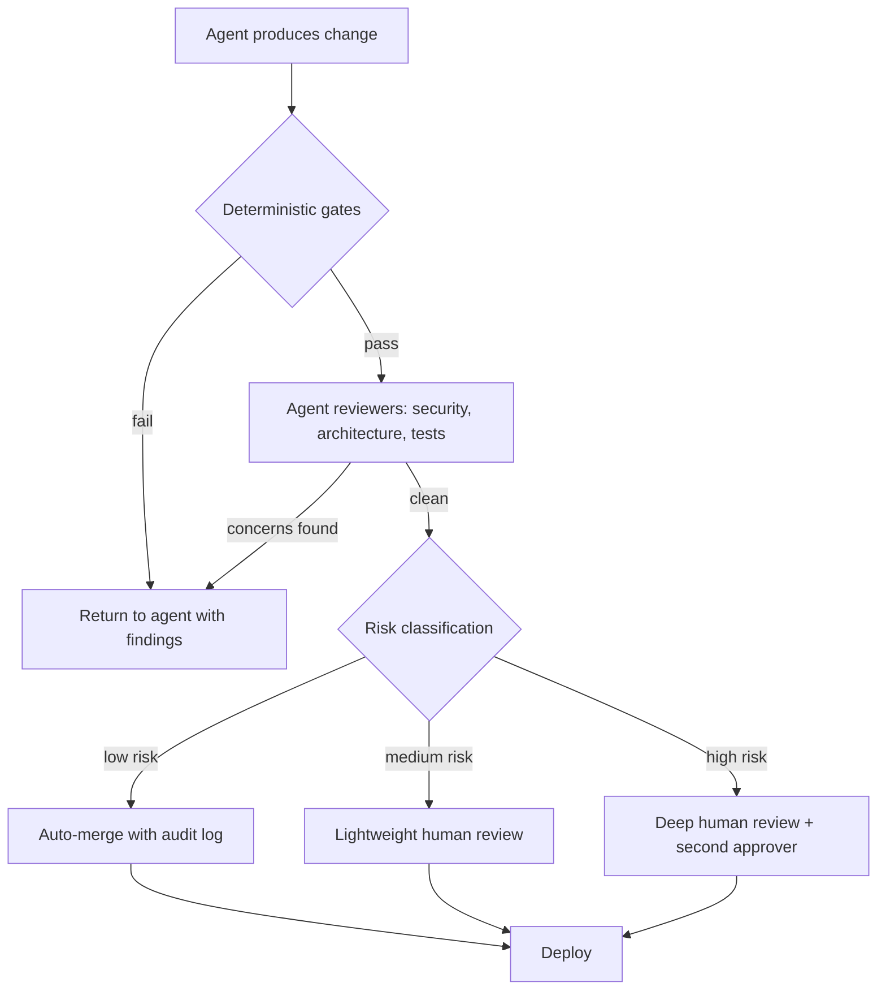

# Reviewer Fatigue: When Agents Write More Code Than Humans Can Read

## The Bottleneck Moved, and Most Teams Have Not Noticed

For decades, writing code was the expensive part. Reading it was almost free by comparison. A developer spent hours producing a change, and a reviewer spent minutes confirming it. That ratio shaped everything: our tools, our processes, our sense of who was busy and who was waiting.

Agents inverted that ratio. A capable agent now produces a complete branch with code, tests, and documentation in the time it takes to write a thoughtful task description. Authoring became cheap. Reading did not.

{/* truncate */}

The result is a quiet pileup. Pull requests arrive faster than any human can absorb them. The queue grows. The reviewer, who used to be the fast part of the loop, is now the slow part. The constraint did not disappear when writing got faster. It simply moved to the one place that did not speed up: the person who has to understand, verify, and take responsibility for the change.

This is reviewer fatigue, and it is the defining bottleneck of agentic software engineering. This post focuses on the human at the end of all those pipelines, and how to keep that person effective when the volume of work coming at them keeps climbing.

---

## The Asymmetry Nobody Budgeted For

Writing and reviewing are not mirror images of the same task. They place very different demands on the brain, and that difference is the root of the problem.

When you write code, you build a mental model as you go. Every decision is yours. You know why a variable exists, why a branch was added, why a dependency was chosen. The context lives in your head because you put it there.

When you review code, you have to reconstruct that mental model from the outside, with none of the original context. You are reverse-engineering intent from artifacts. You have to ask: what was this trying to do, does it actually do that, and what could go wrong that the author did not consider.

Reviewing agent-authored code is harder still, for three reasons:

1. **There is no shared context.** A human author can answer "why did you do this?" in a comment thread. An agent's reasoning, if it exists at all, is often discarded after generation. The reviewer is left with the output and no author to interrogate.
2. **The code looks confident.** Agent output is fluent, well-formatted, and plausible. It rarely looks wrong. Fluency is not correctness, but it reads like it, and that lowers the reviewer's guard.
3. **The volume is relentless.** A human author produces a few pull requests a day. A team of agents can produce dozens. The reviewer faces not one demanding task but a continuous stream of them.

The uncomfortable truth: the speed gain from agents is partly an illusion if it just relocates the work from a tired author to a tired reviewer. As I noted when [measuring developer productivity](/blog/measuring-developer-productivity-ai-era), a tool that generates code faster but forces engineers to spend more time reviewing it is not a net win.

---

## The Cognitive Science of Reviewer Fatigue

To design good solutions, it helps to understand exactly what is wearing reviewers down. Four well-documented cognitive effects compound under high-volume agent review.

### Cognitive Load

Working memory is small. Reviewing a change means holding the affected code, the surrounding system, the requirements, and the possible failure modes in your head at once. Each pull request resets that load. A reviewer who processes ten agent pull requests in a row is not doing one hard task ten times. They are repeatedly loading and unloading entire mental models, which is far more taxing than the line count suggests.

### Attention Residue

When you switch from one task to another, part of your attention stays behind on the previous task. Reviewers who context-switch between many small pull requests carry residue from each one into the next. The fifth review of the day is conducted with a fraction of the focus available for the first. The work looks the same on paper; the quality of attention is not.

### Automation Bias

Humans tend to trust automated output more than they should, especially when it is fluent and usually correct. After approving twenty agent pull requests that were fine, the reviewer's prior shifts toward "this is probably fine too." The twenty-first, the one with the subtle authorization flaw, sails through. This is the same dynamic I discussed in [security and compliance for agentic workflows](/blog/security-compliance-agentic-workflows): the dangerous defect is the one that arrives wrapped in the same confident packaging as everything that came before it.

### Vigilance Decrement

Sustained attention degrades over time. This is a measured effect in any task that requires watching for rare problems. Code review is exactly such a task: most lines are fine, and the reviewer is hunting for the few that are not. The longer the session, the more the detection rate falls. High agent volume turns review into a long vigilance task, which is precisely the condition under which human attention is least reliable.

Put these four together and you get a clear conclusion: **telling reviewers to "just review more carefully" is not a strategy.** It asks tired people to fight their own neurology at scale. The fix is not more human willpower. It is a system that reduces what reaches the human, pre-qualifies what does, and protects the attention of the reviewer for the decisions that genuinely need a person.

---

## Principle: Make the Human the Last Line, Not the Only Line

In a healthy agentic workflow, a human reviewer should be the final checkpoint, not the first filter. Everything that can be checked mechanically or by another agent should be checked before a person ever looks at the change. By the time a pull request reaches a human, three things should already be true:

1. It has passed every deterministic check (build, tests, lint, security scan, policy).
2. It has been reviewed by at least one agent reviewer that did not write it.
3. It has been routed by risk, so the human's effort matches the stakes.

The rest of this post covers how to build that system: delegation patterns that shape the input, agents that review other agents, and gating architectures that route work by risk.

---

## Patterns for Delegation

Delegation is not just "give the agent a task." Done well, it shapes the work so that what comes back is review-ready. The goal is fewer, larger-context, better-explained changes rather than a flood of opaque ones.

| Pattern | What It Does | Why It Reduces Fatigue |
|---|---|---|
| **Spec-first delegation** | Give the agent a written specification with acceptance criteria before it writes code | The reviewer checks output against a known intent instead of guessing what the change was for |
| **Bounded scope** | Constrain each task to a single concern or module | Smaller mental model per review; less context to reconstruct |
| **Self-documenting output** | Require the agent to produce a change summary, rationale, and a list of risks it considered | The reviewer starts with the author's reasoning instead of an empty context |
| **Batch by theme, not by time** | Group related changes into one coherent pull request rather than many trickling in | Fewer context switches; less attention residue |
| **Test-evidence required** | Require the agent to attach test results and explain what each test verifies | The reviewer evaluates evidence, not just claims of coverage |
| **Reversibility by default** | Prefer changes behind flags or in isolated modules | Lower stakes per review means the human can move faster with confidence |

The spec-first pattern is the highest-leverage of these. As I argued in [from prompts to specifications](/blog/from-prompts-to-specifications), a durable, versioned specification gives the reviewer a fixed reference point. Review then becomes a comparison ("does this match the spec?") rather than an open-ended investigation ("what is this and is it correct?"). That single change transforms the cognitive nature of the task from reconstruction to verification, which is far less draining.

A practical rule: **if a change cannot be explained in a short summary, it is too large to review well.** Use that as a delegation constraint, not just a review complaint.

---

## Agents Evaluating Other Agents

If the volume problem comes from agents, part of the solution comes from agents too. An agent that did not write the code can serve as the first reviewer, catching a large share of issues before a human spends any attention at all.

This is not about replacing human judgment. It is about filtering, so that human judgment is spent where it matters. A few patterns work well in practice.

### The Reviewer Agent

A dedicated reviewer agent reads the change with a different objective than the author. Where the author optimized for "make it work," the reviewer optimizes for "find what is wrong." Custom agents make this concrete: as I described in [building your AI agent team](/blog/building-your-ai-agent-team), you can define a `Security Reviewer` agent that enforces your policies, checks for common vulnerability classes, and validates input handling before any code reaches a person.

### Adversarial Review

Author and reviewer should not be the same agent, and ideally not the same model configuration. An agent reviewing its own output inherits its own blind spots. A separate reviewer agent, given the specification and the diff but not the author's reasoning, approaches the change cold and is more likely to notice gaps. This separation of author and critic is the agentic version of "do not review your own pull request."

### Specialized Review Agents

Different concerns benefit from different reviewers. Rather than one agent that checks everything shallowly, a set of focused agents each check one dimension deeply.

| Review Agent | Focus | Example Checks |
|---|---|---|
| **Security reviewer** | Vulnerability classes and trust boundaries | Input validation, authn/authz gaps, secret handling, injection risks |
| **Architecture reviewer** | Fit with existing patterns | Layering, dependency direction, naming and structure conventions |
| **Test reviewer** | Quality of verification, not just coverage | Meaningful assertions, edge cases, tests that actually exercise the change |
| **Dependency reviewer** | Supply chain integrity | New packages, version pins, packages that do not exist in any registry |
| **Performance reviewer** | Cost and latency implications | N+1 queries, unbounded loops, allocations in hot paths |

### The Trap to Avoid

Agent reviewers can produce automation bias of their own. If a reviewer agent approves a change, a human may rubber-stamp it precisely because an agent already looked. Guard against this by treating agent review as a filter that removes obvious problems, not as an endorsement that ends scrutiny. The agent reviewer reduces volume and surfaces concerns; the human still owns the decision on anything the system flags as high risk.

A useful framing: agent reviewers handle breadth (check everything, every time, without fatigue), and humans handle depth (judgment, context, and accountability on the changes that matter).

---

## Architectures for Security and Quality: Gating by Risk

The final piece is structural. Not every change deserves the same scrutiny, and treating them all equally is how reviewers drown. A risk-based gating architecture routes each change down a path proportional to its potential blast radius.

The principle echoes the shift I described in [CI/CD for the agentic era](/blog/cicd-pipelines-agentic-era): the pipeline stops being a uniform gate and becomes an active, risk-aware router.

### Layer 1: Deterministic Gates

These run first and require no human or agent judgment. Build, unit and integration tests, linting, static analysis, secret scanning, dependency vulnerability checks, and policy-as-code. Anything that fails here is returned to the authoring agent automatically, with the findings, so it can fix and resubmit. No human attention is spent on mechanically detectable problems.

### Layer 2: Agent Review

Changes that pass the deterministic gates go to the specialized reviewer agents described above. Their job is to remove the next tier of problems: the ones that need understanding but not necessarily human judgment. Their output is not just pass or fail; it is a structured set of findings and a risk signal that feeds the next layer.

### Layer 3: Risk Classification and Routing

This is the layer most teams are missing. Before a human is involved, classify the change by risk and route accordingly. Useful inputs to the classification:

| Signal | Pushes Risk Up |
|---|---|
| **Blast radius** | Touches authentication, payments, data deletion, infrastructure, or public APIs |
| **Surface** | Changes security boundaries, permissions, or external-facing contracts |
| **Reversibility** | Hard to roll back, or runs an irreversible migration |
| **Novelty** | Introduces a new dependency, pattern, or service rather than following an existing one |
| **Agent confidence** | The authoring or reviewing agent flagged uncertainty or unresolved tradeoffs |

A low-risk change (a copy fix, a well-tested change behind a flag in an isolated module) can be auto-merged with a full audit trail. A medium-risk change gets a lightweight human review. A high-risk change gets deep human review and a second approver. The human's scarce attention is now spent in proportion to the stakes, not spread evenly across a flood.

### Layer 4: The Human Decision

By the time a change reaches a person, the obvious problems are gone, the change is explained, and the risk is labeled. The human is no longer a volume processor. They are a judge, applying context and accountability to the small set of decisions that actually require it. That is the role humans are good at, and the role they should be protected for.

---

## Practical Tips to Overcome Reviewer Fatigue

Beyond the architecture, a set of concrete practices keeps reviewers effective day to day.

- **Cap review session length.** Vigilance degrades over time. Shorter, focused review sessions with breaks detect more problems than marathon queues. Treat review time as a finite, high-value resource, not a background activity squeezed between meetings.
- **Set a per-reviewer daily limit.** If the queue exceeds what a human can review well, the answer is not a heroic reviewer. It is more agent filtering, better batching, or more auto-merge for low-risk changes. A growing queue is a signal to fix the system, not to push the person harder.
- **Make agents explain themselves.** Require every agent change to include what it did, why, and what it was unsure about. A reviewer who starts with the author's reasoning spends their energy verifying, not reconstructing.
- **Separate author and reviewer agents.** Never let the agent that wrote the code be the only one that reviews it. Cold review by a different agent catches what self-review misses.
- **Rotate reviewers on sensitive areas.** Familiarity breeds automation bias. Fresh eyes on security-critical paths restore vigilance that routine erodes.
- **Track what slips through.** When a defect escapes review, do a blameless analysis: which gate should have caught it, and why did it not? Feed that back into the deterministic checks and the agent reviewers so the same class of problem is caught automatically next time.
- **Default to small and reversible.** The easiest review is the one with low stakes. Flags, isolated modules, and incremental changes let reviewers move quickly without carrying risk.
- **Give reviewers the spec.** A reviewer comparing a change against a clear specification works far faster, and far more reliably, than one inferring intent from the diff alone.

---

## Measuring Whether It Is Working

You cannot manage reviewer fatigue if you cannot see it. A few signals tell you whether the system is healthy or whether the human is silently becoming the bottleneck.

| Signal | What It Tells You | Warning Sign |
|---|---|---|
| **Review queue depth and age** | Whether reviewers are keeping up | A growing, aging queue means the system is overloading humans |
| **Time-in-review per change** | Whether changes are review-ready | Rising review time suggests poor delegation or oversized changes |
| **Approval-to-incident correlation** | Whether speed is costing quality | Fast approvals followed by incidents signal rubber-stamping |
| **Defect escape rate** | Whether review is actually catching problems | A rising escape rate means gates or attention are failing |
| **Reviewer load distribution** | Whether fatigue is concentrated | One or two people carrying the queue is a burnout risk |
| **Auto-merge rate for low-risk changes** | Whether the system protects human attention | A near-zero rate means humans are reviewing things that do not need them |

The healthiest pattern: most low-risk changes auto-merge safely, agent reviewers absorb the breadth, and human reviewers spend their time on a small number of genuinely consequential decisions with their attention intact. As I noted when [measuring developer productivity](/blog/measuring-developer-productivity-ai-era), the real question is not whether you ship faster, but whether you deliver better outcomes, more safely and sustainably.

---

## Closing Thoughts

Agents made writing code cheap, and in doing so they moved the constraint to the human who has to read it. Reviewer fatigue is the predictable consequence, and it is not solved by asking people to try harder. It is solved by designing a system that respects the limits of human attention.

The shape of that system is consistent: delegate so the input is review-ready, let agents handle the breadth of review, gate by risk so human effort matches the stakes, and protect the reviewer's attention as the scarce resource it is. Keep the human firmly in the loop, but put them at the end of the loop, as the final judgment rather than the first filter.

The teams that thrive in the agentic era will not be the ones that generate the most code. They will be the ones that can review it well, sustainably, without burning out the people whose judgment still matters most.
