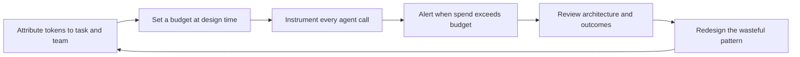

# Token Debt: Why FinOps for Agentic AI Is an Engineering Problem, Not a Model Choice

_Why the next chapter of FinOps is not about finding a cheaper model. It is about engineering systems that do not waste the tokens they already have._

A finance leader opens the monthly invoice for the company's AI platform and finds a number that does not match any story anyone can tell. Usage grew modestly. The bill grew sharply. Nobody switched to a pricier model. Nobody approved a new integration that anyone remembers. The line item simply grew on its own, the way cloud bills used to grow before anyone built a discipline around watching them.

Ask the engineering team what happened and the answer is rarely a single cause. It is a hundred small decisions: a system prompt that grew every time someone patched in a new rule, a retrieval step that fetches ten documents when two would do, an agent that retries a failing tool call five times before giving up, a workflow that hands a conversation between three specialized agents and resends the full history at every handoff. None of these decisions looked expensive in isolation. Together, they are the bill.

{/* truncate */}

This is not a story about a bad model choice. It is a story about architecture, and it is becoming the defining cost problem of the agentic era. **AI cost optimization is no longer primarily a model selection problem.** As organizations move from single prompt chat interfaces to agents that plan, call tools, retrieve data, and coordinate with other agents, the largest and most persistent savings opportunities move with them, out of the model catalog and into the engineering decisions that shape how agents actually consume tokens: agent design, context management, orchestration, memory, retrieval, and tool usage. Poor agent design creates token waste in exactly the way poor cloud architecture created infrastructure waste for the last decade: quietly, structurally, and at a scale that a cheaper unit price alone cannot fix.

---

## FinOps Already Solved This Once

[FinOps](https://www.finops.org) exists because cloud computing changed the shape of technology spend. A data center purchase was a large, infrequent, centrally controlled decision. Cloud spend is the opposite: small, continuous, and decided by thousands of individual engineering choices made far from any finance department. FinOps became a discipline because someone had to connect those two worlds, giving engineers visibility into cost and giving finance a way to understand spend that changes every hour based on what engineers build.

The practice worked because it got three things right. It made cost visible at the level of the team and workload that created it, through tagging, showback, and chargeback, rather than leaving it as a single number on an invoice. It made cost a shared concern between finance and engineering rather than a report finance produced after the fact. And it focused on unit economics, cost per transaction or per customer, rather than aggregate spend, because aggregate spend tells you almost nothing about whether the money is being spent well.

The industry that built this discipline is already telling you where it is headed next. The FinOps Foundation now runs entire tracks under names like AI for FinOps and Token Economics, and its own recent conference carried the theme AI Value: The Era of FinOps for AI, Token Economics, and Agentic FinOps, with a keynote titled simply From Alerts to Agents. That is not a marketing pivot. It is the same discipline recognizing that a new, harder to manage unit of spend has arrived, and that unit is the token.

Tokens break some of the assumptions FinOps built its practice around for cloud infrastructure. A virtual machine's cost is a function of size and duration, and both are set by a person who provisioned it. A token bill is a function of what an autonomous system decides to do at runtime: how much context it assembles, how many tools it calls, how many times it retries, how many other agents it consults before it produces an answer. The unit of spend is now downstream of a decision made by software rather than by a person, which means the discipline has to move upstream, into the design of that software, to have any real effect.

---

## The Model Selection Trap

Model choice is a legitimate lever, and dismissing it would be a mistake. Routing simple classification or extraction steps to a smaller model while reserving a larger one for the steps that genuinely need it is sound engineering. But it is a bounded, largely one time lever. You choose a model, you receive a fixed multiplier on cost, and the story mostly ends until the next model generation arrives with a better price for the same quality.

Meanwhile, the shape of the workload, how many tokens a task consumes to reach a correct outcome, is set entirely by engineering decisions, and it keeps compounding with every additional agent, tool, and retry a team adds. Treating model selection as the primary cost lever is a lot like obsessing over which region has the cheapest hourly rate for a virtual machine while ignoring that the workload is provisioned five times larger than it needs, never scales down, and retries failed jobs without a limit. The unit price was never the biggest number in that equation.

The parallels between cloud waste and token waste are close enough to use as a working map:

| Cloud Waste Pattern | Token Waste Pattern | Underlying Cause |
|---|---|---|
| Oversized virtual machines running at low utilization | Oversized context windows carrying irrelevant history | Provisioning or assembling for the worst case instead of the actual need |
| Idle resources left running after a project ends | Idle conversation state kept alive and resent every turn | No lifecycle management for state that has stopped being useful |
| Chatty microservices making redundant calls to each other | Chatty agent handoffs resending full context at every hop | Each component reasoning locally instead of the system reasoning as a whole |
| Missing autoscaling, so capacity is fixed to the peak | Missing context pruning, so every call pays for the peak history | No mechanism to shrink resource use as the actual need shrinks |
| Retrying failed jobs without backoff, multiplying compute | Retrying failed tool calls or agent steps without backoff, multiplying tokens | Failure handling treated as an afterthought instead of a designed path |

Every row on the right side of that table is an engineering decision. None of them are fixed by switching models.

---

## Token Debt: A Framework for Waste You Cannot See on a Dashboard

I use the term **token debt** for the same reason engineers use technical debt: to describe a cost that is invisible at the moment a shortcut is taken, and that compounds quietly until it is impossible to ignore. A system prompt that gains one more paragraph every sprint does not look expensive today. A retrieval step that pulls in a slightly oversized chunk does not look expensive today. An agent that retries three times instead of failing fast does not look expensive today. Multiply any of these by a few hundred thousand calls a month, and today's rounding error becomes next quarter's line item.

Token debt has the same defining trait as technical debt: it is cheap to create and expensive to repay. It is cheap because tokens are priced so low per unit that no single wasteful call ever triggers a review. It is expensive to repay because by the time the waste is visible in the aggregate bill, it is already baked into the architecture, spread across every workflow that copied the same pattern, and tangled up with behavior that people are now depending on.

Seven engineering areas account for most of the token debt that shows up in agentic systems, and they map directly onto the decisions teams make when they design an agent, not onto which model sits behind it.

| Engineering Area | How Token Debt Accumulates | A Better Pattern |
|---|---|---|
| Agent design | One broad agent handles every request, loading a full instruction set and every tool definition on every call, even for simple tasks | Scope agents narrowly, and load specialized instructions only when the task actually requires them |
| Context management | Full conversation history is resent on every turn, so cost grows much faster than the conversation itself | Summarize or window history, keeping only what materially affects the next decision |
| Orchestration patterns | Multiple agents pass a task between each other, and each one resends the complete context it received | Design handoffs as small, structured messages, not full context transfers |
| Memory strategies | Long term memory stores raw transcripts and replays them wholesale whenever they are recalled | Store distilled facts and decisions, and retrieve only what is relevant to the current task |
| Retrieval approaches | Oversized chunks, no caching, and no relevance filtering mean every query pulls in far more than the model needs | Right size chunks, cache repeat lookups, and rerank results before sending anything to the model |
| Tool usage | Tools return entire payloads regardless of what the task actually needs | Constrain tool responses to the fields the task requires, filtered at the source |
| Workflow architecture | Retry loops run without limits or backoff, so one failure can multiply into dozens of expensive attempts | Bound retries, add backoff, and design an explicit fallback or escalation path |

Some of these patterns are easier to recognize once you look at how mature agent platforms already handle them. [GitHub Copilot](https://github.com/features/copilot)'s custom agents and skills, for example, are only loaded into context when the relevant agent or skill is actually invoked, rather than concatenating every possible instruction into one prompt sent with every request. The specific mechanism will differ across platforms, but the underlying principle generalizes to any agentic system: relevance should determine what enters the context window, not convenience.

Tool usage deserves a specific caution, because it is easy to confuse standardization with efficiency. Protocols such as the [Model Context Protocol](https://modelcontextprotocol.io) make it far easier to connect an agent to many tools without writing custom integration code for each one, and that is a genuine engineering improvement. It does not automatically make tool usage cheap. A tool schema sent with every call and a verbose response returned on every invocation still cost tokens whether the protocol behind them is open and standardized or proprietary. Standardization solves integration friction. It does not solve token efficiency, and treating the two as the same problem is itself a source of token debt.

### Where a Single Turn Spends Its Tokens

It helps to make the abstraction concrete. A single agent turn, one request and one response, typically carries several components, and each one is a place where debt can accumulate quietly.

| Component of the Call | What It Carries | Common Waste Risk |
|---|---|---|
| System instructions | Standing rules and persona sent with every call | Grows every time someone patches in a new rule, and is rarely pruned back |
| Tool definitions | Schemas for every tool the agent could possibly call | Every tool loaded regardless of whether the current task needs it |
| Retrieved context | Documents or records pulled in for grounding | Chunks too large, duplicate passages, no relevance filter |
| Conversation history | Prior turns carried forward for continuity | Full transcript resent instead of a summary |
| Tool responses | Data returned from a completed tool call | Entire payload returned instead of the fields the task actually needs |
| Agent handoffs | Context passed to a cooperating agent or subagent | Full state resent at every hop instead of a minimal, structured handoff |
| Memory writes | What gets committed to long term storage | Raw transcripts stored instead of distilled summaries |

None of these components are inherently wasteful. Each one becomes token debt only when it is assembled by default instead of by design.

---

## Metrics That Make Token Efficiency Visible

You cannot manage what you cannot see, and most organizations can currently see exactly one token metric: the total bill. That number is nearly useless for engineering decisions, because it does not say whether spend is proportional to the value delivered. A small set of metrics, tracked at the workflow level rather than the company level, turns token spend from an accounting entry into an engineering signal.

| Metric | Definition | What It Reveals | Watch Out For |
|---|---|---|---|
| Tokens per Outcome | Total tokens consumed divided by tasks completed to a defined quality bar | The real unit cost of a workflow, comparable across teams and over time | A vague definition of completed hides quality problems behind a good looking number |
| Context Utilization | The share of tokens sent in a request that materially influenced the response | Whether context assembly is precise or bloated | Hard to measure directly, so approximate it with ablation tests that remove context and check whether output quality holds |
| Retry Token Ratio | Tokens spent on retries and self correction divided by tokens spent on the first successful pass | Whether failure handling is cheap or expensive | A ratio near zero can mean the agent gives up too early rather than retrying efficiently |
| Token Amplification Factor | Tokens consumed by an orchestrated, multiple step workflow divided by the tokens a single well scoped call would need for the same outcome | Whether orchestration is adding value or only overhead | Some amplification buys real reliability or safety, so a higher number is not automatically a problem |
| Cost per Successful Task | Dollar cost divided by tasks completed to the same quality bar used above | Ties token efficiency directly to a number finance already understands | Must be paired with the quality bar, or teams will learn to optimize for cheap, wrong answers |

Every one of these metrics is dangerous in isolation. A team measured only on tokens per outcome will learn to produce shorter, cheaper, worse answers. A team measured only on quality will never notice waste. The two have to be reported together, on the same dashboard, reviewed by the same people, or the metric will optimize exactly the wrong behavior.

---

## Governance and Accountability: Who Owns the Token Bill

Cloud FinOps works because of shared ownership among finance, engineering, and platform teams, and because spend is attributed clearly enough that showback or chargeback means something to the person looking at it. Agentic systems need the same structure, adapted to a unit of spend that is set by agent behavior rather than by a person choosing a virtual machine size.

A handful of practices carry most of the weight:

* **Attribute every token to a task, a workflow, and a team**, the same way cloud spend gets tagged to a resource group and an owner. Without attribution, a rising bill has no name attached to it, and nobody feels responsible for reducing it.
* **Set a token budget for each task type before building the agent**, not after the first invoice arrives. A budget defined at design time turns cost into a constraint the team designs against, the same way a latency budget or an availability target already does.
* **Require a documented cost profile before an agentic workflow reaches production.** What is the expected tokens per outcome. What is the maximum context size per turn. How many tool calls or subagent hops can a single task trigger before it counts as a runaway execution.
* **Alert on token consumption the way you already alert on error rates or latency**, and route the alert to the team that owns the workflow, not only to finance.
* **Review token efficiency on the same cadence as architecture review**, and make it a real gate rather than a suggestion. A workflow that cannot explain its own token profile is not ready for production traffic.
* **Escalate deliberately.** When a workflow exceeds its budget, the response should be a defined path, such as throttling, falling back to a cheaper approach, or pausing for a human decision, not a silent overage that only surfaces thirty days later on an invoice.

The loop these practices form is a direct descendant of the classic FinOps cycle, adapted for a unit of spend that is shaped by software behavior rather than provisioning choices.

---

## A Maturity Model for Agentic FinOps

Organizations tend to move through recognizable stages as they build this discipline. Naming the stages makes it easier to see where a team actually sits, rather than where it assumes it sits.

| Stage | What Is True | Signature Behavior |
|---|---|---|
| Unmanaged | Token spend is visible only as a single number on a vendor invoice | Nobody can say which team, agent, or workflow is responsible for the spend |
| Observed | Token consumption is measured and attributed to teams and workflows | Dashboards exist, but nobody is accountable for acting on what they show |
| Managed | Budgets, alerts, and design time cost profiles exist for agentic workflows | Engineering teams treat token efficiency as a real design constraint |
| Governed | Token efficiency is part of architecture review and a condition of shipping | An agent cannot reach production without a documented cost profile and an owner |
| Systemic | Efficient context, retrieval, and orchestration patterns become shared platform capabilities | Teams reuse solved efficiency problems instead of each rediscovering them independently |

Most organizations adopting agents today sit at unmanaged or observed. Few have reached managed. Almost none have reached systemic, and that is exactly where the durable advantage accumulates, because a solved pattern reused by every team compounds savings the same way an unsolved waste pattern compounds cost.

---

## Systems Thinking Beats Model Thinking

A cheaper model is a discount applied once to every token you were always going to spend. A better architecture changes how many tokens you spend in the first place, and that saving compounds every time the workflow runs, every time it scales, and every time another team adopts the same pattern.

Cloud computing taught this exact lesson a decade earlier. Choosing a slightly cheaper virtual machine size helped once. Designing for elasticity, so the system used only the capacity the workload actually needed at any given moment, kept paying dividends indefinitely. Token efficiency is following the same arc. The organizations that treat it as an architecture discipline rather than a procurement decision will end up with a structural cost advantage that a competitor cannot erase simply by switching to a cheaper model next quarter.

---

## Practical Guidance for Engineering and Platform Teams

* **Instrument first.** Attach token counts to every agent call, tagged by task, workflow, and team, before attempting to optimize anything. You cannot fix what you cannot attribute.
* **Set the budget before you build.** Decide what a task type should cost in tokens at design time, not after the first invoice surprises someone.
* **Treat context assembly as a designed artifact, not an accumulation.** Decide deliberately what belongs in a call rather than defaulting to including everything that might possibly be relevant.
* **Separate memory into tiers.** Keep working memory small and precise for the current task. Keep long term memory distilled into facts and decisions, never a verbatim replay of everything that has happened.
* **Bound every retry and every loop.** Define a maximum number of attempts, add backoff, and design an explicit fallback path for when an agent cannot complete a step.
* **Audit orchestration for redundant hops.** Every additional agent or subagent in a workflow should earn its share of the token cost through a clear improvement in outcome or reliability, not simply exist because it seemed useful during a prototype.
* **Make token efficiency part of the definition of done** for agentic features, reviewed alongside correctness and security, rather than discovered later in a monthly invoice.
* **Report token metrics next to reliability and quality metrics**, to the same audience, on the same cadence. A metric that finance sees and engineering never does will not change engineering behavior.

---

## Closing: Optimize the System, Not the Model

Model selection will keep mattering. New models will keep arriving, some of them meaningfully cheaper or faster at the same quality, and it will keep making sense to take advantage of that when it happens. But that lever has always had a ceiling, and organizations that treat it as their primary cost strategy are optimizing the smallest part of the problem.

The larger, more durable opportunity sits in the engineering decisions that determine how many tokens a system needs to reach a correct outcome in the first place: how an agent is scoped, how context is assembled, how memory is stored and recalled, how retrieval is filtered, how tools respond, how failures are bounded, and how work is orchestrated across agents. Every one of these is a design decision, made by an engineer, and reviewable like any other piece of architecture. None of them require choosing a cheaper model. All of them require treating token efficiency as seriously as latency, correctness, and security have always been treated.

Token debt accumulates quietly, the same way technical debt and cloud waste always have: one convenient shortcut at a time, until an invoice forces a conversation that could have started months earlier as a design review. The organizations that win economically in the agentic era will not be the ones that found the cheapest model. They will be the ones that built systems disciplined enough not to waste the tokens they were already paying for.
