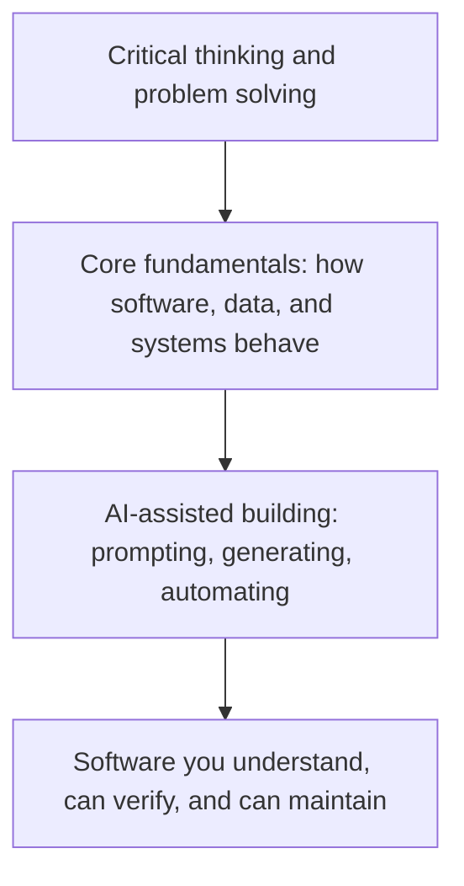

# Before You Prompt: The Fundamentals Every Beginner Needs in the AI Era

## Why Understanding Still Matters When AI Can Write the Code

It has never been easier to turn an idea into working software. Describe what you want in plain language, and an AI tool can generate a web page, a script, an API integration, or even a multi-step agent that takes actions on your behalf. For anyone who felt shut out of software because they did not know how to code, that shift is real and welcome.

But there is a difference between software that runs and software you understand. AI can produce the first one in seconds. Only you can produce the second, and only if you know enough about how software actually works to read what the AI gave you, question it, and fix it when it is wrong.

{/* truncate */}

This post is for students, career changers, and anyone starting out who wants to build real solutions with the help of AI. It is not an argument for spending years studying before you touch a keyboard. It is a practical map of the fundamentals that make you a better builder, reviewer, and decision maker, regardless of your job title or background.

---

## AI Changed What You Produce, Not What You Are Responsible For

AI tools are exceptionally good at producing plausible answers quickly. They are not good at knowing exactly what you need, catching every mistake, or understanding the consequences of a decision inside your specific situation. That judgment still belongs to the person asking the question.

Think of AI as a capable collaborator who has read almost everything but has never used your product, met the people who depend on it, or dealt with the aftermath when something breaks. It can draft, suggest, and accelerate. It cannot decide what "correct" means for your context, and it cannot take responsibility for what happens after you ship.

That is the gap fundamentals fill. Not because you need to memorize syntax or spend years on theory, but because:

- You need to **recognize** when an output looks right but is not.
- You need to **ask** better questions, since a vague request produces a vague or wrong result.
- You need to **judge risk**, since some mistakes are cosmetic and others are dangerous.
- You need to **maintain** what gets built after the first version works, which is most of the real effort in software.

None of this requires a computer science degree. It requires a working mental model of a small number of ideas, most of which take a few hours to learn and a long time to deepen, exactly like any other practical skill.

Skip the base of that stack and the top becomes fragile. You can still produce something that runs. You will struggle to know whether it is safe, correct, or worth trusting.

---

## The Building Blocks: A Practical Tour

The concepts below show up in almost every software solution, whether it is a personal project, a class assignment, or a live product. You do not need to master all of them before you start building. You need to know they exist, what problem each one solves, and enough to notice when something is off.

| Foundation | What It Really Means | Why It Matters When AI Writes the Code |
|---|---|---|
| How software works | Programs are precise, literal instructions a computer executes step by step | AI-generated code is also just instructions. If you cannot read them, you cannot confirm they do what you asked |
| Client, server, and localhost | One program requests something, another responds, and you can run both privately on your own machine first | Most bugs and security gaps live in that handoff, and localhost is where you catch them before anyone else can |
| APIs | Agreed-upon ways for programs to exchange data | AI tools connect to APIs constantly; a misunderstood call fails quietly or expensively |
| Data structures | How information is organized so it can be stored, found, and changed | The difference between software that scales and software that falls over under real use |
| Debugging | Reading errors and evidence to find the actual cause | The most transferable fundamental, and one AI cannot fully do for you |
| Version control | A recorded, reversible history of every change | Your safety net when an AI-suggested change turns out to be wrong |
| Testing | Proof that something works, not just a hope that it does | The fastest way to catch an AI mistake before a person does |
| Security fundamentals | Understanding trust boundaries and what could go wrong | AI will generate insecure code if you do not ask it not to, or do not notice |
| Systems thinking | Seeing how pieces affect each other, not just one piece in isolation | AI reasons about the code in front of it, not your whole system and its history |

### How Software Works

A computer only ever does one thing: it follows instructions, exactly as written, at extraordinary speed. Programming languages let people write those instructions in a form that is readable by humans and translatable into something a machine can run.

This matters because AI-generated code is not magic. It is instructions like any other, written by a model instead of a person. If you can trace through what a piece of code does, step by step, in plain language, you can tell whether it matches what you actually asked for. If you cannot, you are trusting the output on faith, and faith is not a verification strategy.

You do not need to learn every language. You need to be comfortable with the basic building blocks that almost every language shares: variables that hold values, conditionals that make decisions, loops that repeat actions, and functions that group steps into a reusable unit.

### Client, Server, and Localhost

Most software you use daily involves two separate programs talking to each other. The **client** is the program you interact with directly: a browser, a mobile app, or a command line tool. The **server** is a separate program, often running somewhere else entirely, that receives requests, does the work, and sends a response back.

Every time a page loads, a form submits, or an app fetches new data, a client is asking a server for something and the server is answering. Understanding that back-and-forth is what turns "why is this slow" or "why did my request fail" from unexplainable magic into something you can actually investigate.

**Localhost** is your own computer acting as both the client and the server, so you can build and test software before anyone else can reach it. When a tutorial tells you to open `http://localhost:3000`, it means a server is running on your machine and your browser is talking to it privately. Localhost is where you should test anything AI generates for you before it goes near real users or real data. [MDN Web Docs](https://developer.mozilla.org/) is a solid, free reference for the underlying concepts once you want more depth.

### APIs: The Contracts Between Systems

An **API** (Application Programming Interface) is an agreed-upon way for one piece of software to ask another for something, without needing to know how the other one works internally. You send a request in a specific format and get a response in a specific format back.

APIs are everywhere in AI-assisted development. The AI model itself is usually reached through an API. Code an AI generates for you will frequently call other APIs, for weather data, payments, authentication, or a database. If you do not understand the basic shape of a request and a response, including status codes and error handling, you cannot tell whether an AI-generated integration is solid or just optimistic.

A simple habit builds this fast: take any public API with free access, make a request to it using nothing but your browser or a short script, and look closely at what comes back, including what happens when something goes wrong on purpose.

### Data Structures: How Information Is Organized

A data structure is a way of organizing information so it can be stored, found, and changed efficiently. A list, a table, a key-value pair, and a tree are all data structures. The specific names matter less than the question they force you to ask: **what is the right way to organize this information for how it will actually be used?**

AI will confidently generate code using whatever structure fits the prompt, not necessarily the one that fits your actual data or scale. Storing a million records in a structure meant for a dozen works fine in a demo and fails in production. You do not need to memorize every data structure that exists. You need to be able to ask what happens to an approach as the data grows, and have enough grounding to judge the answer. [roadmap.sh's data structures guide](https://roadmap.sh/datastructures-and-algorithms) is a good free reference when you are ready to go deeper.

### Debugging: The Skill AI Cannot Fully Automate

Debugging is figuring out why something is not behaving as expected, using evidence such as error messages, logs, and actual system behavior, instead of guesses.

This may be the most transferable fundamental of all, because it is really applied critical thinking. You observe a symptom, form a hypothesis about the cause, test that hypothesis, and narrow things down until you find the real source. AI can help enormously here, suggesting causes and fixes, but it often lacks access to your specific runtime, your data, and the full history of how the system got into its current state. When an AI-suggested fix does not work, the ability to keep investigating methodically, instead of trying random changes, is what separates someone who builds reliable software from someone who is guessing.

### Version Control: Your Safety Net for Experimentation

Version control, most commonly through a tool called Git, keeps a complete, reversible history of every change made to a project. Every change is recorded, labeled, and can be undone.

This becomes essential once AI enters the picture, because AI-suggested changes will sometimes be wrong, and some of those mistakes will not be obvious right away. Version control means you can always return to a known-good state, compare what changed, and see exactly what an AI edit touched versus what it left alone. Treat committing your work early and often as a basic habit, not an advanced technique reserved for professionals. [roadmap.sh's Git and GitHub guide](https://roadmap.sh/git-github) is a solid, free starting point.

### Testing: Proof, Not Hope

A test is a small, automated check that confirms a piece of software behaves the way it is supposed to. Instead of running an application by hand and hoping it works, you write a check that runs the same verification every time, instantly, for as long as the project exists.

Tests matter more, not less, in an AI-assisted workflow. When an AI regenerates or refactors a piece of code, a good test suite tells you immediately whether the behavior you depend on still holds. Without tests, you are relying on manual spot-checking, which gets weaker every time the project grows. Start small: one test that checks one important behavior is more valuable than zero tests protecting an entire project.

### Security Fundamentals: Trust Boundaries and Blast Radius

Security starts with a simple question: **what happens if this input, this user, or this system cannot be trusted?** A trust boundary is any point where information crosses from something you do not control into something you do, a form submission, an uploaded file, a request from the public internet.

AI-generated code will often skip validation, expose more information than necessary, or handle secrets carelessly, not out of malice, but because it optimizes for making the immediate request work. You do not need to become a security engineer to build responsibly. You need enough grounding to ask basic questions before shipping anything: is this input validated, is this secret stored safely, and what is the worst case if this goes wrong, meaning how far the damage could spread, its **blast radius**. The [OWASP Top 10](https://owasp.org/Top10/2025/) is the standard, free starting point for the most common risks.

### Systems Thinking: Seeing the Whole Picture

Systems thinking is the habit of considering how a change in one part of a solution affects everything connected to it, instead of evaluating that change in isolation. Software is rarely one piece. It is a set of interacting parts: code, data, infrastructure, other systems, and real users with real behavior.

AI tools reason well about the piece of code directly in front of them. They are far weaker at reasoning about your entire system, its history, its constraints, and the tradeoffs behind its current shape. That broader view is your job. A change that looks correct in isolation can still break something two steps away, and only someone thinking about the whole system catches that before it ships.

---

## Critical Thinking: The Skill AI Cannot Do for You

Every fundamental above builds toward one outcome: the ability to look at something AI produced and judge it honestly, instead of accepting it because it sounds confident.

AI-generated answers share a trait that makes them risky for beginners: they are almost always fluent, well-formatted, and plausible, whether or not they are correct. Fluency is not accuracy, and it is easy to confuse the two when you do not yet have the fundamentals to tell them apart.

A short set of questions turns blind trust into real evaluation:

- **Does this actually answer what I asked, or something adjacent to it?** AI can confidently solve a slightly different problem than the one you have.
- **Can I explain, in my own words, what this does?** If you cannot restate it simply, you do not understand it yet, regardless of whether it runs.
- **What would prove this wrong?** Look for the edge case or the input that would break the claim or the code, and try it.
- **What is this based on?** AI can present outdated information or a real-looking reference that does not exist, confidently and without any signal that it is unsure.
- **What happens if this is wrong in production, not in a demo?** Some mistakes cost you a redo. Others cost data, money, or someone else's trust.

None of these questions require advanced expertise. They require the habit of pausing before accepting an answer, and enough foundational knowledge to actually test it instead of just re-reading it.

---

## Using AI Responsibly

Building well with AI is not only a technical question. It is also a question of judgment about what you share, what you automate, and what you are willing to be accountable for.

A few practical habits go a long way:

- **Never paste secrets, credentials, or private data into a prompt.** Treat anything you type into an AI tool as information that could leave your control. Use placeholders instead of real keys, tokens, or personal details.
- **Match an AI tool's permissions to the task.** An agent asked to fix a typo does not need the ability to delete data or deploy to production. Give AI tools and agents the narrowest access that lets them do the job.
- **Verify before you trust, especially for anything irreversible.** Review generated code before running it, especially commands that delete, overwrite, or publish something. Reversible mistakes are learning experiences. Irreversible ones are not.
- **Check licensing and originality on anything you plan to reuse or publish.** AI-generated content can resemble existing material closely enough to raise real questions about attribution and rights. When in doubt, verify before you ship.
- **Own the outcome.** If you asked an AI to produce something and you used it, you are accountable for what it does, the same way you would be if you had written it yourself.

Responsible use is not about fear of AI. It is about treating a powerful tool with the same care you would want from anyone else who had access to your systems and your data.

---

## Fundamentals Are Not Gatekeeping

None of this is an argument that you need a computer science degree, a certificate, or years of prior experience before you are allowed to build something. Plenty of people build useful, real solutions without a formal credential, and that becomes more true, not less, as AI lowers the cost of getting started.

The actual argument is narrower and more useful: the fewer fundamentals you have, the harder it is to tell good AI output from bad, and the more exposed you are to mistakes you cannot see coming. That is not a wall meant to keep people out. It is a set of skills that make you dramatically more effective once you decide to walk through the door, and every one of them is learnable, in small pieces, by anyone willing to practice.

Where you come from, your job title, and how you learned do not determine whether you can build good software. Whether you understand what you built well enough to trust it, explain it, and fix it does.

---

## Getting Started: A Simple Learning Roadmap

You do not need to learn everything in this post before you start building with AI. You need a sequence. Here is a practical starting order:

1. **Learn how a request becomes a response.** Build the simplest possible web page, open it locally, and watch your browser's developer tools show the request and response happen in real time.
2. **Learn one language well enough to read its errors without panic.** Focus on variables, conditionals, loops, and functions. You are not aiming for mastery yet, just enough fluency to follow what AI-generated code is doing.
3. **Install Git and commit something today.** Make committing a habit from your very first project, not a skill you add later.
4. **Call a real, public API and handle both a success and a failure on purpose.** Seeing an error response deliberately teaches you more than only seeing the happy path.
5. **Write one automated test for something you built.** It does not need to be sophisticated. It needs to prove that one thing works, every time.
6. **Read a short, beginner-friendly overview of common security risks**, such as unvalidated input and exposed secrets, so you recognize them on sight.
7. **Use AI to build something, then explain every part of it out loud or in writing**, as if you had to teach it to someone else. Wherever you get stuck explaining, that is exactly where to study next.

Free, structured starting points like [roadmap.sh](https://roadmap.sh/) and [freeCodeCamp](https://www.freecodecamp.org/) can support this sequence without requiring a formal program or a large budget.

Each step is small on its own. Together, they build the judgment that turns "AI generated this for me" into "I built this, and I know it works." That judgment, more than any single tool or model, is the real skill worth developing right now, and it is available to anyone willing to start.
