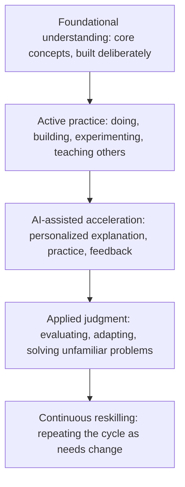

# Learning Differently: How Teaching and Learning Must Evolve in the AI and Agentic Era

## The Real Shift Is Not Less Learning, It Is Different Learning

Every time a new technology makes information easier to reach, the same worry resurfaces: will people stop learning altogether? Calculators supposedly meant nobody needed arithmetic. Search engines supposedly meant nobody needed to remember facts. AI now raises the same question, at a much larger scale, because it can explain a concept, draft an essay, and carry out multi-step tasks on its own.

The worry misreads what is actually changing. AI is transforming how quickly people can access information and produce a first draft of an answer. It is not transforming the underlying process by which a human being builds real understanding, develops judgment, or becomes capable of solving problems they have never seen before. That process is still slow, effortful, and deeply human.

{/* truncate */}

This matters for students, self-learners, teachers, school and university leaders, workforce development organizations, and professionals who now need to reskill more often than any generation before them. The argument here is simple: the future of learning is not about learning less because AI can answer instantly. It is about learning differently, more continuously, and more intentionally. AI can be one of the most powerful learning amplifiers ever built, but only if learners, teachers, and institutions choose to use it that way.

---

## From Memorization to Judgment

Traditional education grew up in a world where information was scarce and slow to reach people. In that world, memorizing facts and procedures was genuinely valuable, because recalling information quickly was often the bottleneck to using it.

That bottleneck has mostly disappeared. AI now retrieves, synthesizes, and explains information at whatever depth a learner needs. This does not make foundational knowledge useless, but it makes pure recall a much weaker measure of real learning. The more useful questions have shifted: Can this person recognize when information applies to a new situation? Can they judge whether an answer, including one from AI, is correct or dangerous? Can they combine knowledge across domains to solve a problem nobody handed them a template for?

None of those abilities come from memorizing more content. They come from **judgment**: the capacity to evaluate, apply, and adapt knowledge under real, messy conditions. Judgment is built through practice, feedback, and reflection, not repetition of facts. That shift was overdue even before AI arrived. AI has simply raised the cost of ignoring it.

Foundational knowledge still matters for a direct reason: it is what allows a person to evaluate an AI-generated answer instead of just accepting it. AI can be fluent and confident while being wrong or outdated. Someone with strong fundamentals can catch that; someone without them has no independent basis for comparison. Foundations are also the raw material for creativity, since genuinely new ideas usually come from recombining existing knowledge, and they are a form of resilience when a tool is unavailable or wrong.

---

## How People Learn, and Why Doing Beats Consuming

Learning is not one-size-fits-all. People absorb information through reading, watching, listening, discussing, practicing, experimenting, building projects, and teaching others, often in combination. Reading builds depth and precision. Discussion tests understanding against other perspectives. Building a project integrates multiple skills into real-world judgment. Teaching a concept to someone else exposes gaps no amount of passive review would reveal.

Decades of research point to the same conclusion from different angles: people learn far more from doing something than from watching or reading about it. Retrieval practice, where a learner tries to recall or apply something instead of re-reading it, produces stronger, longer-lasting understanding than passive review.

AI introduces a real risk here. When an answer or a working piece of code can be generated instantly, it is tempting to treat that output as the finish line rather than a starting point. A student who copies an AI-generated explanation without working through it has consumed information, not necessarily learned anything durable. The healthier pattern flips the sequence: attempt the problem first, even imperfectly, then use AI to check reasoning, fill gaps, or offer a second approach. The comparison between your own attempt and the AI's response, not the response itself, is where the learning happens.

---

## Where AI Actually Helps: Personalization, Tutors, and Agents

Good teachers have always adjusted pace and difficulty to the person in front of them. What has been missing at scale is doing this for every learner, in every subject, at every moment. This is where AI offers something genuinely new: adaptive systems can pinpoint exactly where understanding breaks down, adjust difficulty in real time, and track progress in ways that would take a human instructor far longer to assemble.

Personalization has limits worth naming. A system that simply serves easier content whenever a learner struggles can quietly lower expectations instead of building capability. Good personalization adjusts *how* a concept is taught, not *whether* the learner is eventually expected to reach real mastery.

Beyond personalization, a few AI roles are emerging clearly in education:

- **On-demand explainer:** available at any hour, willing to repeat an explanation differently as many times as needed.
- **Socratic partner:** asks guiding questions and points out gaps in reasoning instead of just handing over an answer.
- **Practice generator:** creates unlimited variations of problems tailored to what a specific learner needs to repeat.
- **Agentic learning orchestrator:** manages a multi-step learning plan on its own, sequencing topics, generating practice, and adjusting based on results, whether preparing differentiated material for a class or building a personalized reskilling path for a professional.

None of these roles substitute for a teacher or mentor. They substitute for the repetitive, time-consuming parts of teaching that are hard to scale. That distinction, AI as amplifier rather than replacement, should guide every adoption decision.

---

## Modernizing Schools, Colleges, and Universities

Institutions face a real design challenge: keep what works, update what was built for a world where information access was the bottleneck.

- **Rethink assessment.** Shift weight toward project-based work, oral defenses, and applied portfolios, which measure judgment rather than the ability to produce a fluent answer.
- **Teach AI literacy explicitly.** Students need to evaluate AI output critically, not just operate the tools competently.
- **Redefine academic integrity.** Replace blanket "no AI" rules with clear distinctions between using AI to understand, to check work, and to bypass learning entirely.
- **Invest in educators, not just tools.** Give teachers real time and training to redesign courses, not just new software layered on an unchanged curriculum.
- **Protect human interaction.** Reinvest time saved by AI-assisted grading and practice generation into more mentorship and discussion, not less.

---

## Continuous Reskilling and Human Mentorship

Outside formal education, the pace at which specific skills become outdated keeps increasing, and AI is accelerating that trend across nearly every field. This makes reskilling a career-long practice: shorter, focused learning cycles built around a current need fit this pace better than long, front-loaded programs. Professionals who thrive treat AI as a personal learning partner, using it to explain unfamiliar concepts or generate relevant practice, while building a repeatable habit of identifying gaps and validating their own understanding. Workforce development organizations succeed here by building modular, updatable learning paths rather than static curricula, and by explicitly teaching the meta-skill of learning how to learn.

None of this reduces the value of human relationships. A mentor offers context and honest feedback an AI system cannot; a peer group offers motivation and debate that sharpens thinking. AI works best when it takes on the repetitive parts of learning, freeing human time for what depends on relationship and lived experience. A useful test for any learning tool: does it create more space for human interaction, or does it try to eliminate the need for it? The first is amplification. The second is usually a mistake.

---

## A Practical Framework for the Future of Learning

Each layer depends on the one below it. Skipping foundations to jump straight into AI-assisted acceleration produces fluent-sounding output without real judgment behind it. Skipping active practice for passive AI consumption produces recognition without the ability to apply. The cycle compounds in value only when all five layers repeat over time, not when treated as a one-time sequence.

---

## Recommendations

**For learners and self-learners:**
- Attempt a problem yourself before asking AI; the comparison is where learning happens.
- Mix modes: read, practice, build, and explain concepts to someone else.
- Build something real regularly, and teach what you learn to expose gaps.
- Treat AI as a tutor that explains reasoning, not an oracle that hands you answers.

**For schools, colleges, universities, and workforce programs:**
- Redesign assessment around applied judgment, not recall.
- Teach AI literacy as a core skill, not an afterthought.
- Set clear, realistic academic integrity policies instead of blanket bans.
- Invest in educators' time and training as much as in new tools.
- Reinvest time saved through AI into more mentorship and human interaction.

---

## Learning Differently, Not Less

AI has permanently changed how quickly people can reach information and how much support is available while learning something new. It has not changed the underlying nature of learning itself: a slow, effortful, deeply human process of building understanding, testing it against reality, and adjusting based on what happens.

The institutions and individuals who benefit most from this moment will not be the ones who learn less because AI answers faster. They will be the ones who use that speed to spend more time on what actually builds judgment: practicing, building, discussing, teaching, and applying knowledge to problems nobody has handed them a template for. The future of learning is not smaller. It is different, more continuous, and, done well, considerably more intentional than what came before it.
