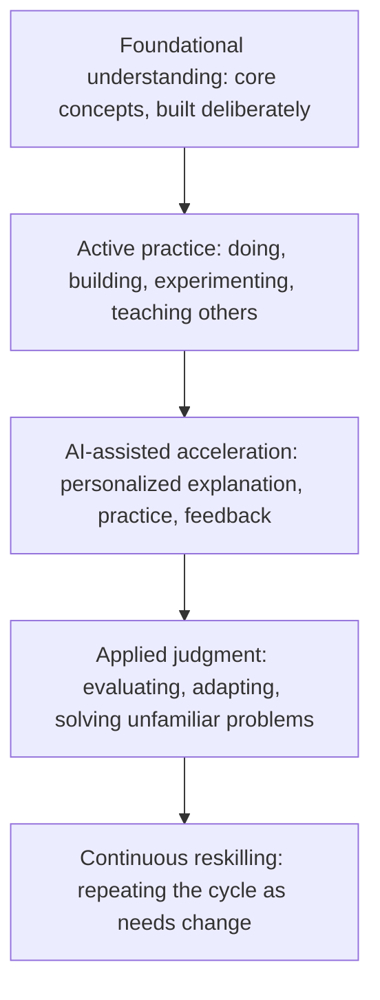

# Learning Differently: How Teaching and Learning Must Evolve in the AI and Agentic Era

## The Real Shift Is Not Less Learning, It Is Different Learning

Every time a new technology makes information easier to reach, the same worry resurfaces: will people stop learning altogether? Calculators supposedly meant nobody needed arithmetic. Search engines supposedly meant nobody needed to remember facts. AI now raises the same question, at a much larger scale, because it can explain a concept, draft an essay, solve a problem, and even carry out multi-step tasks on its own.

The worry is understandable, but it misreads what is actually changing. AI is transforming how quickly people can access information and produce a first draft of an answer. It is not transforming the underlying process by which a human being builds real understanding, develops judgment, or becomes capable of solving problems they have never seen before. That process is still slow, still effortful, and still deeply human.

{/* truncate */}

This matters for a wide range of people: students deciding how to study, self-learners building new skills outside a classroom, teachers and professors redesigning courses, school and university leaders setting policy, workforce development organizations preparing people for changing jobs, and professionals who now need to reskill more often than any generation before them.

The argument in this post is simple and, hopefully, reassuring: the future of learning is not about learning less because AI can answer questions instantly. It is about learning differently, more continuously, and more intentionally. AI can be one of the most powerful learning amplifiers ever built, but only if the humans around it, learners, teachers, and institutions, choose to use it that way.

---

## Memorization Was Never the Real Goal

Traditional education systems grew up in a world where information was scarce and slow to reach people. Books were expensive, libraries were limited, and experts were hard to access. In that world, memorizing facts, formulas, and procedures was genuinely valuable, because recalling information quickly was often the bottleneck to using it.

That bottleneck has mostly disappeared. Anyone with a phone can retrieve a fact, a formula, or a step-by-step explanation in seconds. AI accelerates this further by not just retrieving information, but synthesizing it, explaining it at whatever depth is needed, and adapting the explanation to the learner's current level of understanding.

This does not make foundational knowledge useless. It makes pure recall a much weaker measure of whether someone has actually learned something. The more useful questions have shifted:

- Can this person recognize when a piece of information applies to a new situation?
- Can they judge whether an answer, including one generated by AI, is correct, reasonable, or dangerous?
- Can they combine knowledge from different domains to solve a problem nobody has handed them a template for?
- Can they explain their reasoning clearly enough that another person, or an AI system, can build on it?

None of those abilities come from memorizing more content. They come from **judgment**: the capacity to evaluate, apply, and adapt knowledge under real, messy conditions. Judgment is built through practice, feedback, and reflection, not through repetition of facts. That is the real shift education needs to make, and it was overdue even before AI arrived. AI has simply made the cost of ignoring it much higher.

---

## How People Actually Learn: There Is No Single Right Method

One of the most persistent mistakes in both classrooms and self-directed learning is treating learning as if it happens the same way for everyone. It does not. People absorb, process, and retain information through very different channels, often in combination.

| Mode of learning | What it looks like | What it builds well |
|---|---|---|
| **Reading** | Books, articles, documentation, written explanations | Depth, precision, ability to revisit and reference |
| **Watching** | Video lectures, demonstrations, recorded talks | Visual and sequential understanding, pacing control |
| **Listening** | Podcasts, discussions, audio explanations | Learning while doing other tasks, narrative retention |
| **Discussing** | Study groups, seminars, structured debate | Testing understanding against other perspectives |
| **Practicing** | Exercises, drills, repeated application | Fluency, muscle memory, speed |
| **Experimenting** | Trying variations, testing hypotheses, tinkering | Intuition for cause and effect, comfort with failure |
| **Building projects** | Applying knowledge to a real, end-to-end outcome | Integration of multiple skills, real-world judgment |
| **Teaching others** | Explaining a concept so someone else understands it | Deepest form of mastery, exposes gaps in understanding |

No single row in that table is the "correct" way to learn. Most durable learning comes from combining several of them: reading to build a mental model, practicing to build fluency, building a project to integrate the pieces, and teaching someone else to expose what is still shaky.

This is precisely where AI can help without flattening learning into one method. A well-designed AI tutor can offer an explanation as text, as a worked example, as a series of practice questions, or as a conversation, depending on what the learner responds to best. The danger is not that AI replaces this variety. The danger is designing AI-assisted learning around a single mode, usually reading a generated answer, because it is the easiest thing to build.

---

## Learning by Doing: Why Practice Still Beats Passive Consumption

Decades of research on learning point to the same conclusion from different directions: people learn far more from doing something than from watching or reading about it. Retrieval practice, where a learner tries to recall or apply something rather than simply re-reading it, consistently produces stronger, longer-lasting understanding than passive review. Project-based learning, where a concept is applied to build something real, tends to produce deeper transfer of knowledge to new situations than isolated exercises.

AI introduces a real risk here, and it is worth naming directly. When an answer, an essay outline, or a working piece of code can be generated instantly, it becomes tempting to treat that output as the finish line rather than a starting point. A student who copies an AI-generated explanation without working through it has consumed information. They have not necessarily learned anything durable.

The healthier pattern flips the sequence: attempt the problem first, even imperfectly, then use AI to check reasoning, fill gaps, or offer a second approach. This preserves the productive struggle that drives real learning, while still giving learners fast, high-quality feedback that used to require a tutor, a mentor, or a lot of trial and error to obtain on their own.

For self-learners in particular, a simple habit protects against passive consumption: **do not ask AI for the answer before you have written down your own attempt, even a rough one.** The comparison between your attempt and the AI's response is where the actual learning happens, not the response itself.

---

## Personalized and Adaptive Learning: What AI Actually Changes

Personalized learning is not a new idea. Good teachers and tutors have always adjusted pace, examples, and difficulty to the person in front of them. What has been missing at scale is the ability to do this for every learner, in every subject, at every moment, without an enormous number of human tutors.

This is where AI offers a genuinely new capability. Adaptive systems can identify exactly where a learner's understanding breaks down, adjust the difficulty of practice problems in real time, offer explanations in a different style when the first one does not land, and track progress across weeks or months in a way that would take a human instructor far longer to assemble.

Used well, this can close gaps that have persisted for a long time: a student who needs more repetition before moving on, a learner who understands a concept visually but not verbally, or a professional who needs a refresher on a foundational topic before tackling something advanced.

Personalization has limits worth being explicit about. Adaptive systems are only as good as the model of learning behind them, and a system that simply serves easier content whenever a learner struggles can quietly lower expectations instead of building capability. Effective personalization should adjust *how* a concept is taught and *how much support* is given, not *whether* the learner is eventually expected to reach real mastery. Institutions adopting adaptive tools should ask vendors directly how the system defines progress, and whether it is designed to build toward independence or simply to keep learners engaged.

---

## AI Tutors, Copilots, and Agentic Systems in Education

The most interesting recent shift is not just AI that answers questions, but AI that can act as an ongoing collaborator throughout a learning journey. A few roles are already emerging clearly:

**AI as an on-demand explainer.** Available at any hour, willing to repeat an explanation in a different way as many times as needed, without judgment or impatience. This alone removes a significant barrier for learners who previously had to wait for the next class or office hour to get unstuck.

**AI as a Socratic partner.** Rather than simply providing an answer, a well-designed AI tutor can ask guiding questions, point out gaps in reasoning, and prompt a learner to reach a conclusion themselves. This mirrors one of the most effective forms of human tutoring and can be built deliberately into how AI learning tools are configured.

**AI as a practice generator.** Creating unlimited variations of problems, quizzes, and scenarios tailored to what a specific learner needs more repetition on, something that would be extremely time-consuming for a human instructor to produce individually for every student.

**Agentic systems as learning orchestrators.** This is the newer and less understood layer. An agentic system can go beyond answering a single question and manage a multi-step learning plan: assessing current knowledge, sequencing topics, generating practice, checking work, and adjusting the plan based on results, largely on its own. In a classroom, this could look like an agent that prepares differentiated practice sets for an entire class overnight. In workforce training, it could look like an agent that builds a personalized reskilling path based on a person's current role and a target role, then tracks progress against it.

None of these roles are a substitute for a teacher, mentor, or subject matter expert. They are a substitute for the parts of teaching that are repetitive, time-consuming, or difficult to scale: generating practice material, offering a first explanation, tracking progress across many learners at once. That distinction is the difference between AI as an amplifier and AI as a replacement, and it should guide every decision about how these tools get adopted.

---

## Why Foundational Knowledge Still Matters When Answers Are Instant

It might seem, at first glance, that instant access to explanations reduces the need for foundational knowledge. The opposite is true, and the reasoning matters.

Foundational knowledge is what allows a person to evaluate an AI-generated answer instead of simply accepting it. AI systems can be fluent and confident while being wrong, outdated, or subtly mismatched to the actual situation. A learner or professional with strong fundamentals can catch that. One without them cannot, because they have no independent basis for comparison.

Foundational knowledge is also what makes creativity and cross-domain thinking possible. Genuinely novel ideas usually come from recombining existing knowledge in a new way, not from generating something with no reference point at all. The more solid a person's grounding in core concepts, the more raw material they have available to recombine when facing an unfamiliar problem.

Finally, foundational knowledge is a form of resilience. Systems fail, connectivity drops, tools change, and access is not always guaranteed. A person who understands the underlying concepts can reason without a tool in front of them. A person who has only ever consumed AI-generated answers, without building the underlying model themselves, has no fallback when the tool is unavailable or wrong.

None of this argues for going back to memorization for its own sake. It argues for being deliberate about which foundations are worth building deeply, and treating AI as a way to reach and reinforce those foundations faster, not as a replacement for building them at all.

---

## Modernizing Schools, Colleges, and Universities

Educational institutions face a genuine design challenge: how to keep the parts of teaching that work, while updating the parts that were built for a world where information access was the bottleneck.

**Rethink assessment.** Assessments built primarily around recall, closed-book tests, short answers to factual questions, are the most exposed to AI in ways that undermine their value. Institutions that shift more weight toward project-based work, oral defenses, in-class problem solving, and portfolios of applied work create assessments that measure judgment and understanding rather than the ability to produce a fluent answer, whether that fluency came from the student or from a tool.

**Teach AI literacy explicitly, not just AI usage.** Students need to learn not only how to use AI tools, but how to evaluate their output critically: recognizing confident but incorrect answers, understanding where a model's training data might be outdated or biased, and knowing when a task genuinely requires human judgment. This belongs in the curriculum itself, not left to informal, inconsistent exposure.

**Redefine academic integrity for an AI-enabled world.** Rules built entirely around "did not use AI at all" are becoming impractical and, in many contexts, counterproductive. Clearer, more useful policies distinguish between using AI to understand a concept, using it to check work, and using it to bypass learning entirely, with expectations that are explicit rather than assumed.

**Invest in educators, not just technology.** Every one of these changes depends on teachers and professors who have the time, training, and support to redesign courses, not just a new tool added on top of an unchanged curriculum. Professional development focused on AI-aware pedagogy deserves the same institutional priority as the technology purchase itself.

**Preserve and strengthen human interaction.** Discussion sections, office hours, mentorship, and collaborative projects remain some of the highest-value parts of formal education precisely because they cannot be replicated by a tool. As routine explanation and practice generation shift to AI, institutions have an opportunity to reinvest the time saved into more of this human contact, not less.

---

## Continuous Reskilling: Learning as a Career-Long Practice

Outside formal education, the argument for learning differently is just as strong, and arguably more urgent. The pace at which specific skills become outdated has been increasing for years, and AI is accelerating that trend across many fields at once, not only technical ones.

This makes continuous reskilling a career-long practice rather than something that happens between jobs. A few shifts follow directly from that reality:

**Learning in smaller, more frequent cycles.** Waiting for a formal course, a degree program, or a company training initiative is too slow when the underlying skill landscape can shift within a year or two. Shorter, focused learning cycles, built around a specific, current need, fit this pace far better than long, front-loaded programs.

**Building a personal learning system, not just consuming courses.** Professionals who thrive during periods of rapid change tend to have a repeatable way of identifying what they need to learn, finding good sources, practicing deliberately, and validating their own understanding, rather than relying entirely on whatever training happens to be offered to them.

**Treating AI as a personal learning partner.** The same AI tools reshaping industries can help a professional learn the very skills those industries now demand: explaining an unfamiliar concept quickly, generating practice scenarios relevant to a specific job, or summarizing a dense technical topic before a deeper study session. Used this way, AI does not just change what skills are needed. It becomes part of how those skills get built.

**Workforce development organizations have a distinct role here.** Programs designed around static curricula, updated every few years, are poorly matched to this pace of change. Organizations that succeed in this environment build modular, stackable learning paths that can be updated quickly, and that explicitly teach the meta-skill of learning how to learn, since the specific technical content will keep shifting under any curriculum.

---

## Balancing Human Mentorship, Collaboration, and AI-Powered Tools

None of the capabilities described above remove the value of human relationships in learning. If anything, they clarify what those relationships are for.

A mentor provides context an AI system does not have: knowledge of a specific organization's culture, honest feedback grounded in a real relationship, and the kind of encouragement that comes from someone who has a genuine stake in a learner's growth. A peer group provides motivation, accountability, and the kind of debate that sharpens thinking in ways a solitary interaction with a tool rarely does. A teacher or instructor provides judgment about what a specific group of learners needs next, informed by experience that no model has access to.

AI tools work best when they take on the parts of learning that are repetitive, time-consuming, or hard to scale, freeing up human time and attention for the parts that depend on relationship, context, and lived experience. A useful test for any AI-powered learning tool is whether it is designed to create more time and space for human interaction, or whether it is designed to eliminate the need for it. The first is amplification. The second, in most learning contexts, is a mistake.

---

## A Practical Framework for the Future of Learning

Pulling the ideas above together, a simple framework can guide decisions for learners, educators, and institutions alike.

Each layer depends on the one below it. Skipping foundational understanding to jump straight into AI-assisted acceleration produces fluent-sounding output without real judgment behind it. Skipping active practice in favor of only consuming AI explanations produces recognition without the ability to apply. The cycle only compounds in value when all five layers are present and repeated over time, not treated as a one-time sequence.

| Layer | Role of the learner | Role of AI | Role of the educator or mentor |
|---|---|---|---|
| Foundational understanding | Build a working mental model of core concepts | Explain concepts multiple ways, at the right depth | Define what is genuinely foundational for a given field |
| Active practice | Attempt problems, build projects, teach concepts back | Generate varied practice and instant feedback | Design tasks that require real application, not recall |
| AI-assisted acceleration | Use AI to check, extend, and fill gaps after a genuine attempt | Personalize pace, difficulty, and explanation style | Model responsible, judgment-preserving use of AI tools |
| Applied judgment | Evaluate AI output critically before trusting it | Surface uncertainty and alternative approaches | Assess understanding through applied, open-ended work |
| Continuous reskilling | Treat learning as an ongoing habit, not a finished project | Identify emerging skill gaps and suggest next steps | Support learners returning to build new foundations |

---

## Recommendations for Learners and Self-Learners

- **Attempt before you ask.** Write your own answer or approach first, then use AI to check, extend, or challenge it. The comparison is where learning happens.
- **Mix your learning modes.** Combine reading, practicing, building, and explaining concepts to someone else instead of relying on a single format.
- **Build something real, regularly.** A finished project, however small, integrates knowledge in a way that isolated exercises rarely do.
- **Teach what you learn.** Explaining a concept, even to yourself in writing, exposes gaps that passive review hides.
- **Treat AI as a tutor, not an oracle.** Ask it to explain reasoning, offer alternative approaches, and question your assumptions, rather than only asking for final answers.
- **Make learning a habit, not an event.** Short, frequent sessions focused on current needs tend to outlast long, infrequent ones, especially as skills continue to shift.

## Recommendations for Schools, Colleges, Universities, and Workforce Programs

- **Redesign assessment around applied judgment.** Favor projects, oral defenses, and open-ended problems over assessments that primarily measure recall.
- **Teach AI literacy as a core skill.** Help learners evaluate AI output critically, not just operate AI tools competently.
- **Update academic integrity policies with clear, realistic distinctions.** Define what responsible AI use looks like for each type of assignment, instead of relying on blanket prohibitions that are hard to enforce and easy to misunderstand.
- **Invest in educators as much as in tools.** Give teachers and professors real time and support to redesign courses around these changes, not just access to new software.
- **Protect and expand human interaction.** Use time saved through AI-assisted grading, explanation, and practice generation to invest in mentorship, discussion, and collaborative work.
- **Build modular, updatable curricula.** Especially in workforce development, design learning paths that can be refreshed quickly as skill needs change, rather than rebuilt from scratch every few years.

---

## Learning Differently, Not Less

AI has permanently changed how quickly people can reach information and how much support is available while learning something new. It has not changed the underlying nature of learning itself: a slow, effortful, deeply human process of building understanding, testing it against reality, and adjusting based on what happens.

The institutions, programs, and individuals who benefit most from this moment will not be the ones who learn less because AI can answer faster. They will be the ones who use that speed to spend more time on the parts of learning that actually build judgment: practicing, building, discussing, teaching, and applying knowledge to problems nobody has handed them a template for.

The future of learning is not smaller. It is different, more continuous, and, done well, considerably more intentional than what came before it.
