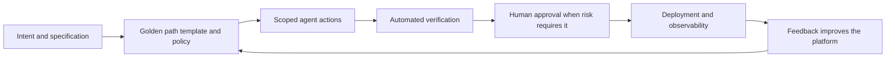

# Golden Paths for Agents: Why Platform Engineering is the Missing Layer

## Agents Do Not Remove Delivery Friction

AI agents can read a repository, write code, run tests, and open a pull request. That is an impressive capability, but it does not make the surrounding engineering system easier to navigate. It makes every inconsistency in that system easier to reproduce at speed.

An agent given access to a large, undocumented environment faces the same questions a new engineer does: Which template is approved? How is a service deployed? Where do secrets come from? Which checks are mandatory? Who owns this dependency? What is safe to change? A capable model can infer some answers, but inference is not a reliable operating model for production software.

{/* truncate */}

This is why the conversation about agents cannot stop at prompts, models, or repository instructions. The missing layer is **platform engineering**: the discipline of building internal products that make the safe, supported way of delivering software the easiest way.

For human developers, that layer reduces cognitive load. For agents, it turns vague context into an executable path. The result is not an agent with unrestricted access to everything. It is an agent that can make useful progress through well-understood, observable, and governed workflows.

---

## What a Golden Path Actually Is

A golden path is not a slide deck that tells teams which tools they should use. It is a paved route through a common engineering task, with the preferred choices already connected.

For example, a golden path for a new API might provide:

- A maintained service template with logging, health checks, and secure defaults.
- A standard way to request and inject configuration without exposing secrets.
- A CI workflow that runs the required tests, security checks, and policy validation.
- A deployment path with ownership, rollback, and observability built in.
- Documentation that explains the boundaries and the supported escape hatches.

The word *golden* does not mean mandatory or universal. Teams will have legitimate reasons to leave the path. It means the path is intentionally maintained, tested, and easier than rebuilding the same decisions from scratch.

That distinction matters even more for agents. An agent cannot benefit from an organizational preference that exists only in hallway conversations, tribal knowledge, or a wiki page last updated two years ago. It needs interfaces, templates, policies, and feedback that are available where it works.

---

## Why Agents Need Paved Roads, Not More Permissions

The first instinct when an agent struggles is often to grant another permission, add another tool, or expand its context window. Sometimes that is necessary. More often, it is a signal that the workflow itself is unclear.

Unbounded access creates several problems:

| Problem | What the agent sees | What the platform should provide |
|---|---|---|
| Too many valid patterns | Several ways to create, test, or deploy a service | A supported template and a default workflow |
| Hidden dependencies | Credentials, approvals, and ownership outside the repository | Self-service interfaces with explicit policy |
| Ambiguous quality | Checks vary by team or are performed manually | Reusable verification gates |
| Weak feedback | Failures appear late and without useful context | Fast, actionable signals at every stage |
| Broad blast radius | A local task can accidentally affect unrelated systems | Scoped credentials and protected boundaries |

Giving an agent more permissions may let it get past a blocked step, but it does not make the step safer, repeatable, or understandable. A golden path addresses the underlying problem. It constrains the choices that should be constrained and exposes the choices that actually require human judgment.

This is the same principle that made continuous integration and infrastructure as code valuable. Standardization is not bureaucracy when it removes repetitive decisions and makes the important decisions visible.

---

## The Agent-Ready Platform

An internal developer platform becomes agent-ready when its capabilities are usable by both people and software. A polished portal helps humans, but a portal alone is not enough. Agents also need machine-readable contracts and dependable interfaces.

Five elements matter most:

### 1. Opinionated starting points

Templates, reference implementations, and scaffolding encode the organization's preferred architecture. They should include the non-negotiables: identity, telemetry, dependency management, tests, deployment metadata, and ownership. An agent starting from a trusted template has fewer opportunities to invent a nearly-correct version of established practice.

### 2. Machine-readable context

Instructions, specifications, API contracts, service catalogs, and policy definitions need to live with the work or be available through stable interfaces. This is not documentation for its own sake. It is the context an agent uses to choose the right repository, understand boundaries, and know when to stop.

### 3. Scoped self-service

Agents should be able to request the capabilities their task requires without receiving standing access to unrelated systems. A platform can broker temporary credentials, approved environments, and controlled actions. The goal is to make safe actions easy while keeping high-impact actions deliberately gated.

### 4. Verification as a product capability

Builds, tests, security checks, accessibility checks, policy controls, and deployment previews are not just pipeline steps. They are the evidence that agent output is safe to advance. The faster and clearer those signals are, the more effective both agents and reviewers become.

### 5. Observable feedback loops

Every golden path should produce useful telemetry: adoption, lead time, failure reasons, rollback rate, and the points where people or agents leave the path. Without this feedback, a platform team cannot tell whether it has reduced friction or simply moved it somewhere less visible.

---

## A Golden Path Is a Delegation Contract

When a human delegates work to an agent, the platform should make the contract explicit. What is the desired outcome? Which resources can the agent use? Which checks must pass? What needs approval? How will the result be observed after deployment?

This is more than workflow automation. It creates a shared operating model for human contributors, agents, and the systems they both use. The platform handles the repeatable mechanics. People retain ownership of intent, risk decisions, and outcomes.

The model also improves accountability. When an agent creates a change through a golden path, the organization can answer useful questions: which template did it use, which policies applied, which identity authorized it, what evidence passed, and who approved the release? Those answers are difficult to reconstruct when every agent follows an improvised route.

---

## Start With One Repeated Pain

Platform engineering does not require a multi-year program or a complete internal portal before it creates value. Start where delivery is frequent, costly, and inconsistent.

Good candidates include:

- Creating a new service with production-ready defaults.
- Adding a dependency that requires security and license review.
- Provisioning a preview environment for a pull request.
- Deploying a scheduled job with monitoring and a clear owner.
- Rotating a secret without copying credentials into local configuration.

Choose one workflow, identify the decisions that should be standardized, and build a path that works for a developer first. Then make that path callable and understandable for an agent. Measure whether users reach a safe outcome faster, whether failures are easier to diagnose, and whether reviewers spend less time rediscovering the same requirements.

Avoid treating the platform as a tool catalog. A list of available services does not solve a delivery problem. The valuable unit of platform work is a complete journey from intent to a verified outcome.

---

## The Goal Is Better Autonomy

The promise of agents is not that they can operate without constraints. It is that they can take on more execution work while people focus on intent, design, review, and accountability. That promise only holds when the environment gives them a reliable way to act.

Golden paths are how organizations turn their hard-won engineering knowledge into a product. They package secure defaults, delivery standards, and operational lessons into routes that developers want to use because they save time. They give agents the same advantage, with clearer boundaries and stronger evidence.

Platform engineering is therefore not a supporting concern for the agentic era. It is the layer that makes safe agent autonomy practical. Build the paved roads first, and both humans and agents can move faster without losing control.
