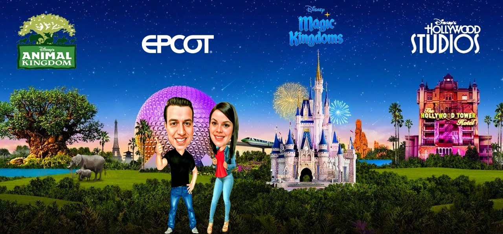

# Epcot

Epcot is a unique theme park that celebrates human achievement, technological innovation, and diverse cultures from around the world.

> Note: I am not affiliated with Disney in any way. These are just my personal tips. Neither I am a travel agent. I am just a Disney fan who wants to share my experiences with you.

## Park Overview

Epcot is divided into two main areas:
- Future World (featuring technology and innovation)
- World Showcase (featuring 11 country pavilions)

## Must-Do Attractions

### Future World
- Spaceship Earth
- Test Track
- Frozen Ever After
- The Seas with Nemo & Friends
- Soarin' Around the World

### World Showcase
- Remy's Ratatouille Adventure (France)
- Gran Fiesta Tour (Mexico)
- Impressions de France

## Dining

Epcot offers some of the best dining experiences at Walt Disney World:
- Le Cellier Steakhouse (Canada)
- Monsieur Paul (France)
- Akershus Royal Banquet Hall (Norway)
- Food & Wine Festival (seasonal)

## Tips

- Start with Future World in the morning
- Take your time exploring World Showcase
- Try different cuisines from around the world
- Don't miss the nighttime spectacular