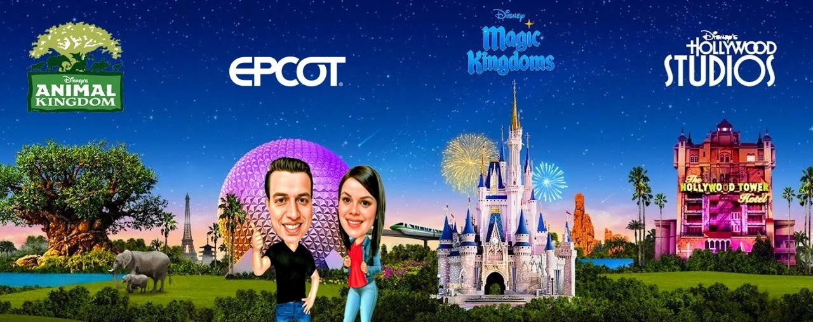

# Disney's Hollywood Studios

Disney's Hollywood Studios celebrates the magic of movies, television, music, and theater with thrilling attractions and immersive experiences.

> Note: I am not affiliated with Disney in any way. These are just my personal tips. Neither I am a travel agent. I am just a Disney fan who wants to share my experiences with you.

## Park Overview

Hollywood Studios features several themed areas:
- Hollywood Boulevard
- Echo Lake
- Star Wars: Galaxy's Edge
- Toy Story Land
- Sunset Boulevard
- Animation Courtyard

## Must-Do Attractions

### Star Wars: Galaxy's Edge
- Star Wars: Rise of the Resistance
- Millennium Falcon: Smugglers Run

### Thrill Rides
- The Twilight Zone Tower of Terror
- Rock 'n' Roller Coaster
- Slinky Dog Dash

### Family Attractions
- Mickey & Minnie's Runaway Railway
- Toy Story Midway Mania!
- The Great Movie Ride (closed)

## Shows
- Fantasmic! (nighttime spectacular)
- Indiana Jones Epic Stunt Spectacular!
- Frozen Sing-Along Celebration

## Tips

- Arrive early for Star Wars attractions
- Use Genie+ strategically
- Make dining reservations early
- Stay for Fantasmic! if available
- Check show schedules upon arrival