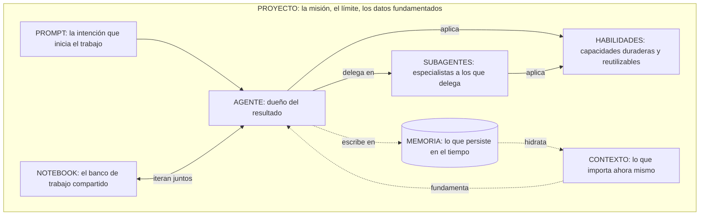

# Dominar la IA generativa: la arquitectura de un sistema de inteligencia

_Ocho bloques de construcción que convierten un modelo capaz en un sistema que entrega trabajo real: agentes, subagentes, habilidades, contexto, memoria, prompts, notebooks y proyectos._

La mayoría cree que está usando IA generativa cuando abre una ventana de chat y escribe una pregunta. Está usando la parte menos interesante de todo esto. El chat es la puerta de entrada, no la casa.

{/* truncate */}

El replanteamiento que importa es este: un modelo que responde preguntas es una funcionalidad. Un sistema que persigue resultados es una categoría distinta. Lo primero es un chatbot. Lo segundo es un **sistema de inteligencia**, y la diferencia entre ambos no son modelos más grandes. Es arquitectura.

La capacidad bruta se está volviendo un commodity a gran velocidad. Cualquier modelo serio ya escribe código, resume un documento y redacta un plan. Ahí ya no vive la ventaja. La ventaja vive en cómo ensamblas esa capacidad en algo que recuerda, se especializa, se fundamenta en tus datos y coordina su propio trabajo. Ese ensamblaje tiene partes, y las partes tienen nombre. Este artículo es el modelo mental que las conecta.

---

## El marco unificador: la inteligencia como sistema operativo

Deja de imaginar a un genio dentro de una caja. Imagina un equipo de alto rendimiento trabajando dentro de un espacio de trabajo bien definido.

Un equipo tiene personas que son dueñas de los resultados, especialistas a los que recurre cuando hace falta, manuales compartidos que todos siguen, conciencia de la situación que tiene enfrente, conocimiento institucional que sobrevive a la rotación, asignaciones claras, un banco de trabajo donde se prueban las ideas y una misión con límites. Un sistema de inteligencia tiene exactamente las mismas partes. Solo les damos nombres distintos.

Este es el mapa completo:

| Bloque de construcción | Qué es | Su función en el sistema |
|---|---|---|
| **Prompt** | Una declaración estructurada de intención | Pone el trabajo en marcha |
| **Agente** | Una unidad autónoma dueña de un resultado | Decide, actúa y verifica |
| **Subagente** | Un especialista acotado al que un agente delega | Aporta profundidad sin contaminar el flujo principal |
| **Habilidad** | Una capacidad empaquetada y reutilizable | Codifica la experiencia para aplicarla de forma consistente |
| **Contexto** | La información relevante en este momento | Fundamenta el trabajo en la situación actual |
| **Memoria** | Información que persiste a lo largo del tiempo | Permite que el sistema aprenda en vez de empezar de cero |
| **Notebook** | Un espacio de trabajo compartido e iterativo | Donde humanos y agentes piensan juntos |
| **Proyecto** | La misión, el límite y los datos fundamentados | Contiene todo y define qué está dentro del alcance |

El diagrama de abajo es el modelo que conviene tener en la cabeza. Léelo como un único espacio de trabajo (el proyecto) dentro del cual la intención fluye hacia un agente, el agente delega y aplica habilidades, mientras el contexto y la memoria alimentan y registran el trabajo de forma continua.

Ahora recorramos cada bloque: qué es, el papel que cumple y cómo interactúa con los demás. El orden es una narrativa, desde la chispa de la intención hasta el límite que contiene todo el sistema.

---

## Prompts: intención, no conjuro

Un prompt es una declaración de intención. Esa es toda la definición, y buena parte de la confusión en este campo viene de olvidarla.

El malentendido popular es que escribir prompts es una bolsa de trucos: frases mágicas, aperturas de juego de roles y amenazas que supuestamente le sacan mejores respuestas al modelo. Eso es folclore. Los prompts que aguantan son los que comunican la intención con precisión: el objetivo, las restricciones, las entradas, la definición de terminado. Un buen prompt se parece menos a un hechizo y más a una pequeña especificación. Desarrollé este argumento a fondo en [De prompts a especificaciones](/blog/from-prompts-to-specifications), y es la base sobre la que se apoya todo lo demás.

Este es el papel que realmente cumple un prompt: es la interfaz entre la intención humana y la acción de la máquina. En un sistema de inteligencia, un prompt rara vez viaja solo. Llega cargando contexto, lo interpreta un agente y lo moldean la memoria y las habilidades disponibles en el proyecto. Las mismas palabras producen resultados radicalmente distintos según lo que las rodea.

El error a evitar es tratar el prompt como si fuera el sistema entero. Hay equipos que invierten semanas en ajustar prompts mientras ignoran el contexto en el que ese prompt se ejecuta y la memoria de la que podría tomar. Eso es optimizar la pregunta mientras se mata de hambre a la respuesta. Un prompt preciso sin contexto es una pregunta precisa gritada en una habitación vacía.

---

## Agentes: la unidad dueña de un resultado

Un agente es una unidad autónoma dueña de un resultado. La palabra clave es *dueña*. Un chatbot responde a un turno. Un agente persigue un objetivo: planifica, actúa, observa los resultados, corrige el rumbo y decide cuándo el trabajo está realmente terminado.

Este es el salto de responder a lograr. Pídele a un modelo que "resuma este informe" y obtienes texto. Dale a un agente el objetivo "produce el informe semanal de riesgos y marca cualquier cosa que requiera una decisión ejecutiva" y tiene que recuperar los documentos correctos, aplicar criterio, usar herramientas y armar un resultado que cumpla un estándar. El agente es el actor del sistema, lo que convierte la intención en trabajo terminado.

Un agente interactúa con todo lo demás: lee el **contexto** para entender la situación, recurre a la **memoria** para no reaprender lo que ya sabe, aplica **habilidades** para ejecutar pasos especializados de forma confiable y delega en **subagentes** cuando una tarea requiere una profundidad que no debería manejar en línea. El prompt fija su dirección. El proyecto traza su límite.

El fallo típico aquí es el monolito: un agente gigante con un conjunto de instrucciones desbordado al que se le pide hacer todo. Funciona en demos y colapsa en producción, porque una sola ventana de contexto no puede sostener un proceso de negocio completo sin perder el hilo. Los sistemas reales se descomponen. Y por eso existen los subagentes.

---

## Subagentes: la delegación como principio de diseño

Un subagente es un especialista acotado al que un agente llama para resolver una tarea bien definida. Si el agente es el líder, los subagentes son los expertos que convoca para una pregunta específica y luego libera.

La razón por la que los subagentes importan no es prolijidad organizativa. Es una restricción dura del funcionamiento de estos sistemas: la atención y el contexto son finitos. Cuando un agente líder intenta investigar, escribir, probar y revisar dentro de una sola conversación, cada una de esas preocupaciones compite por el mismo espacio de trabajo limitado, y la calidad se degrada. Delegar una tarea autocontenida a un subagente le da a esa tarea su propio espacio fresco para trabajar. El subagente profundiza, devuelve un resultado limpio y el agente líder se mantiene enfocado en el resultado del que es dueño. Exploré cómo componer equipos de estos agentes en [Construye tu equipo de agentes de IA](/blog/building-your-ai-agent-team).

Piensa en un flujo de desarrollo. El agente líder está implementando una funcionalidad. Despacha un subagente de exploración para mapear cómo funciona un módulo desconocido, y un subagente de pruebas para escribir y ejecutar la suite de verificación. Cada subagente consume una gran cantidad de razonamiento intermedio que el líder nunca tiene que ver. Lo que vuelve es un resumen: "así funciona el módulo" y "estos son los resultados". El líder se mantiene limpio, orientado y eficaz.

Los subagentes interactúan con las habilidades (a menudo existen para aplicar una en profundidad), con el contexto (reciben una porción enfocada, no el mundo entero) y con el agente líder a través de una entrega estrecha y bien definida. Bien usados, son la forma en que un sistema escala más allá de lo que cualquier agente individual podría sostener en su cabeza.

---

## Habilidades: capacidad que puedes reutilizar

Una habilidad es una capacidad empaquetada y reutilizable: un procedimiento definido, con el conocimiento y los pasos para ejecutarlo, que cualquier agente puede aplicar. Si un prompt es una solicitud puntual, una habilidad es una competencia que el sistema conserva.

Esta es la diferencia entre explicar cómo hacer algo cada vez y enseñarlo una sola vez. Sin habilidades, la experiencia vive en quien escribió el mejor prompt, y se evapora cuando la conversación se cierra. Con habilidades, esa experiencia se convierte en un activo duradero y versionado. "Cómo clasificamos un ticket de soporte", "cómo damos formato a un informe de cumplimiento", "cómo ejecutamos nuestra lista de despliegue": cada una se convierte en una habilidad que un agente invoca en vez de un proceso que improvisa.

El poder de las habilidades es la composición. La misma habilidad puede ser aplicada por muchos agentes y muchos subagentes. Una sola habilidad puede mejorarse una vez y elevar de inmediato la calidad de todos los flujos que la usan. Las habilidades interactúan con los agentes (que deciden cuándo aplicarlas), con el contexto (que aporta los detalles sobre los que opera la habilidad) y con la memoria (que puede refinar con el tiempo cómo se usa una habilidad).

El error es tratar las habilidades como scripts desechables en vez de activos gobernados y compartidos. Cuando las habilidades están dispersas y son personales, obtienes la misma fragmentación que los gestores de paquetes resolvieron en su día para las dependencias de código: todos reinventan la misma capacidad de forma ligeramente distinta, y la calidad es una lotería.

---

## Contexto: conciencia situacional en el momento

El contexto es la información relevante en este momento. No todo lo que el sistema sabe, solo lo que importa para la tarea que tiene enfrente: el documento actual, los registros relevantes, el estado de la conversación, los datos recuperados para esta decisión específica.

El contexto es el bloque más subestimado de todo el modelo, y la causa de la mayoría de los resultados decepcionantes. Un modelo sin contexto es brillante y ciego. Razona maravillosamente sobre nada en particular. El salto de calidad casi nunca viene de un mejor prompt. Viene de poner la información correcta frente al modelo en el momento correcto. En la empresa esto tiene un nombre: fundamentación (grounding). Conectas el sistema a tus datos, recuperas los pasajes que importan y dejas que el modelo razone sobre la realidad en vez de sobre su entrenamiento genérico.

Pero el contexto tiene un filo, y corta en sentido contrario al que la gente supone. El instinto es meterlo todo, bajo la teoría de que más información es más seguro. No lo es. Un contexto sobrecargado entierra la señal que importa bajo el ruido, y la calidad cae. La disciplina del contexto es la curaduría: recuperar exactamente lo relevante y nada más. El contexto interactúa con la memoria (que decide qué vale la pena traer al momento), con los prompts (a los que fundamenta) y con los agentes (que actúan sobre él).

Esta es la regla que vale la pena memorizar: la mayoría de los problemas de "la IA dio una mala respuesta" no son fallos de razonamiento. Son fallos de contexto.

---

## Memoria: aprender a lo largo del tiempo

La memoria es información que persiste a lo largo del tiempo, más allá de una sola tarea o conversación. Si el contexto es lo que está sobre el escritorio ahora mismo, la memoria es el archivero, el conocimiento institucional, la relación que se profundiza con cada interacción.

Sin memoria, cada sesión empieza desde cero. El sistema te conoce permanentemente por primera vez, reaprende tus convenciones, repite preguntas que ya respondiste, olvida la decisión que te ayudó a tomar ayer. Es inteligencia con amnesia, y pone un techo al valor de todo lo demás. Con memoria, el sistema se acumula. Recuerda tus preferencias, tus decisiones pasadas y las razones detrás de ellas, las correcciones que hiciste, la forma en que tu dominio realmente funciona.

La memoria y el contexto son socios, no sinónimos, y confundirlos es un error común y costoso. La memoria es el almacén duradero. El contexto es el conjunto de trabajo que se extrae de ella para la tarea actual. La memoria hidrata el contexto: decide qué del registro de largo plazo vale la pena traer al momento presente. Los agentes escriben en la memoria a medida que trabajan, de modo que el sistema que atienda una tarea la próxima semana sea más inteligente que el que la atendió hoy. Ese ciclo de retroalimentación, escribir y recordar, es lo que separa una herramienta que operas de un sistema que aprende.

El error es saltarse la memoria por completo porque es más difícil de construir que un prompt. Hay equipos que lanzan sistemas sin estado y luego se preguntan por qué la experiencia se siente superficial y por qué los usuarios nunca desarrollan confianza. La confianza se construye sobre ser recordado.

---

## Notebooks: el banco de trabajo compartido

Un notebook es un espacio de trabajo compartido e iterativo donde humanos y agentes piensan juntos. No es un registro de chat que se va hacia arriba y no es software terminado. Es el banco donde el trabajo se compone, se ejecuta, se inspecciona y se refina, con el razonamiento a la vista.

El papel del notebook es hacer el proceso legible. En un chat, la conversación se desvanece hacia arriba y los pasos se difuminan. En un notebook, la intención, el código, los resultados y los comentarios conviven lado a lado como artefactos duraderos que puedes volver a ejecutar, ajustar y construir encima. Aquí es donde el humano permanece en el ciclo, no como espectador que mira a un agente trabajar, sino como colaborador que puede inspeccionar un paso, cambiar una suposición y ejecutarlo de nuevo. Es el hábitat natural de los patrones de colaboración que describí en [Humanos y agentes](/blog/humans-and-agents-collaboration-patterns).

Los notebooks interactúan con casi todo: los agentes trabajan dentro de ellos, las habilidades se aplican y se prueban en ellos, el contexto se carga y se examina en ellos, y los resultados que se validan pueden promoverse a habilidades duraderas o flujos de producción. El notebook es donde la experimentación se convierte en entendimiento.

El error es dejar morir el trabajo valioso en el notebook. Un notebook es para iterar, no para la permanencia. Cuando algo que descubriste ahí resulta útil, debería graduarse: a una habilidad, a las instrucciones de un agente, al proyecto mismo. Un notebook lleno de ideas que nunca se promueven es un banco de trabajo lleno de piezas terminadas que nadie instala.

---

## Proyectos: el límite que lo convierte en un sistema

Un proyecto es la misión, el límite y los datos fundamentados que mantienen unido todo lo demás. Es el contenedor. Cada uno de los otros bloques, los prompts, los agentes, los subagentes, las habilidades, el contexto, la memoria, los notebooks, vive dentro de un proyecto y recibe su sentido de él.

El proyecto es lo que marca la diferencia entre un asistente ingenioso y un sistema en el que se puede confiar para trabajo real. Define el alcance: qué está dentro de los límites y qué no. Define la fundamentación: a qué datos está conectado el sistema y sobre cuáles tiene permiso para razonar. Define los activos compartidos: los agentes y las habilidades disponibles, la memoria que se acumula, las convenciones que todos siguen. Un proyecto convierte un montón de partes capaces en un todo coherente con un propósito. Este es el espíritu de construir software para sistemas, no para sesiones, que desgrané en [Diseñar software para un mundo agéntico](/blog/designing-software-agent-first-world).

En la práctica, el proyecto es donde vive la gobernanza, y la gobernanza es lo que hace posible la adopción empresarial. Los límites no son burocracia. Son lo que te permite darle a un sistema acceso a datos reales y acciones reales sin perder el control de ninguno de los dos. El proyecto es donde decides qué tiene permitido saber el sistema, qué tiene permitido hacer y de qué es responsable.

El error es operar sin uno: agentes sin límite, tomando de todo, fundamentados en nada en particular, responsables ante ningún alcance definido. Eso no es un sistema. Es una vulnerabilidad con buena gramática.

---

## La orquestación es el punto central

Esta es la tesis que todo el modelo busca entregar: el valor no está en los bloques. Está en cómo se coordinan. Un sistema de inteligencia no son ocho funcionalidades atornilladas juntas. Es un único flujo orquestado.

Mira las partes moverse juntas en un solo escenario empresarial. Un equipo necesita preparar un informe para la renovación de una cuenta.

1. El **proyecto** prepara el escenario. Es el espacio de trabajo de la cuenta, fundamentado en los datos de uso del cliente, su historial de soporte y los manuales del equipo. Define qué está dentro del alcance y qué puede tocar el sistema.
2. Un **prompt** declara la intención: produce un informe de renovación y marca cualquier riesgo que requiera la decisión de un líder.
3. Un **agente** toma posesión de ese resultado. No solo responde. Planifica el trabajo.
4. Delega en **subagentes**: uno extrae y analiza las tendencias de uso, otro revisa el historial de soporte en busca de fricción no resuelta. Cada uno trabaja en su propio espacio enfocado y devuelve un resultado limpio.
5. A lo largo del proceso, los agentes aplican **habilidades**: la forma estándar en que la organización evalúa la salud de una cuenta y redacta un informe ejecutivo, aplicada de forma consistente en vez de improvisada.
6. Todo está fundamentado en el **contexto**: los datos reales de esta cuenta específica, recuperados con precisión, no una plantilla genérica.
7. El trabajo recurre a la **memoria**: lo que el equipo aprendió sobre esta cuenta el trimestre pasado, las preocupaciones planteadas antes, los compromisos asumidos. Y escribe de vuelta, para que el próximo trimestre empiece con ventaja.
8. Una persona revisa y refina en un **notebook**, ajustando el énfasis, corrigiendo un matiz, aprobando el resultado.

Ningún bloque por sí solo hizo nada milagroso. El resultado (un informe fundamentado y confiable producido en una fracción del tiempo habitual) vino de la coordinación. Quita cualquiera de los bloques y se degrada: sin memoria, olvida la relación; sin contexto, alucina los detalles; sin subagentes, el líder se ahoga en la profundidad; sin proyecto, no tiene siquiera derecho a los datos.

Este es el cambio de mentalidad que exige el dominio. Deja de preguntar "¿qué puede hacer el modelo?" Empieza a preguntar "¿cómo orquesto estos bloques en un flujo que produzca el resultado?" La primera pregunta tiene más o menos la misma respuesta para todos. La segunda es donde se construyen los sistemas reales, y la ventaja real.

---

## Los errores que mantienen los sistemas en la superficie

Los fracasos en este campo son notablemente consistentes. Casi todos vienen de sobreinvertir en un bloque mientras se descuida el sistema.

- **Idolatrar el prompt.** Tratar la redacción del prompt como la habilidad maestra mientras se ignora el contexto en el que se ejecuta y la memoria que podría usar. Un prompt perfecto sobre un contexto vacío sigue siendo una respuesta vacía.
- **Confundir el modelo con el sistema.** Creer que un modelo más capaz elimina la necesidad de arquitectura. Hace lo contrario. Un motor más potente hace que la buena orquestación valga más, no menos.
- **Construir el monolito.** Un agente desbordado al que se le pide hacer todo, en vez de un líder que delega en subagentes enfocados. Luce bien en demo y falla bajo carga real.
- **Saltarse la memoria.** Lanzar sistemas sin estado que conocen al usuario por primera vez en cada sesión, y luego preguntarse por qué nunca se forma la confianza.
- **Matar de hambre o inundar el contexto.** Darle al modelo nada en qué fundamentarse, o enterrar la señal bajo todo lo que pudiste encontrar. Ambos producen malas respuestas por razones opuestas.
- **Tratar las habilidades como trabajo borrador.** Dejar que la capacidad viva en prompts personales en vez de activos compartidos y versionados, de modo que la calidad se vuelve una lotería y nada se acumula.
- **Operar sin un proyecto.** Sin límite, sin fundamentación, sin responsabilidad. Capaz, conectado y sin gobernar no es una funcionalidad. Es una exposición.

Fíjate en el patrón. Cada uno de estos es un fallo de coordinación disfrazado de problema de capacidad. El modelo rara vez es el cuello de botella. La arquitectura a su alrededor casi siempre lo es.

---

## Cómo se ve el dominio de aquí en adelante

La primera era de la IA generativa premió al prompt ingenioso. Esa era está terminando. La redacción que se sentía como una ventaja competitiva se está volviendo lo mínimo, porque los modelos están absorbiendo ese ingenio en sus comportamientos por defecto.

La próxima era premia una habilidad distinta: la capacidad de componer. Las personas y las organizaciones que tomen la delantera serán las que piensen como arquitectos de inteligencia, las que diseñen cómo encajan agentes, subagentes, habilidades, contexto, memoria, prompts, notebooks y proyectos en sistemas que aprenden, se especializan y se mantienen fundamentados en la realidad. Las aplicaciones que definan la próxima década no nacerán de un prompt. Se ensamblarán, con el mismo rigor que aplicamos a cualquier sistema de software serio.

Así que esta es la conclusión que vale la pena conservar. La IA generativa no es un chatbot que consultas. Es un sistema que arquitectas. El dominio no es conocer las palabras mágicas. Es conocer los bloques de construcción, y saber cómo hacerlos funcionar como uno solo. El modelo es la parte fácil. El sistema es el juego completo.
