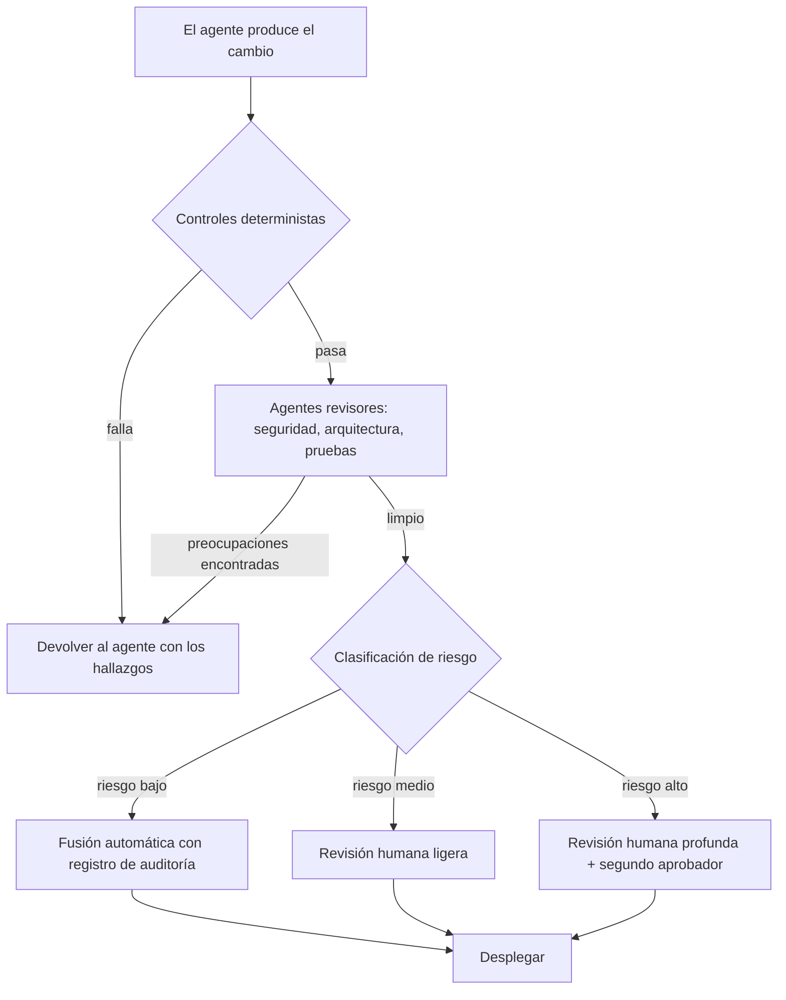

# Fatiga del revisor: cuando los agentes escriben más código del que los humanos pueden leer

## El cuello de botella se movió y la mayoría de los equipos no lo ha notado

Durante décadas, escribir código fue la parte cara. Leerlo era casi gratis en comparación. Un desarrollador pasaba horas produciendo un cambio y un revisor pasaba minutos confirmándolo. Esa proporción dio forma a todo: nuestras herramientas, nuestros procesos y nuestra idea de quién estaba ocupado y quién esperaba.

Los agentes invirtieron esa proporción. Un agente capaz ahora produce una rama completa con código, pruebas y documentación en el tiempo que toma escribir una buena descripción de la tarea. Escribir se volvió barato. Leer no.

{/* truncate */}

El resultado es una acumulación silenciosa. Los pull requests llegan más rápido de lo que cualquier humano puede absorber. La cola crece. El revisor, que solía ser la parte rápida del ciclo, ahora es la parte lenta. La restricción no desapareció cuando escribir se volvió más rápido. Simplemente se trasladó al único lugar que no aceleró: la persona que tiene que entender, verificar y asumir la responsabilidad del cambio.

Esto es la fatiga del revisor, y es el cuello de botella que define a la ingeniería de software agéntica. Este artículo se centra en el humano al final de todos esos pipelines y en cómo mantener efectiva a esa persona cuando el volumen de trabajo que le llega sigue creciendo.

---

## La asimetría que nadie presupuestó

Escribir y revisar no son imágenes especulares de la misma tarea. Imponen demandas muy distintas al cerebro, y esa diferencia es la raíz del problema.

Cuando escribes código, construyes un modelo mental a medida que avanzas. Cada decisión es tuya. Sabes por qué existe una variable, por qué se agregó una rama, por qué se eligió una dependencia. El contexto vive en tu cabeza porque tú lo pusiste ahí.

Cuando revisas código, tienes que reconstruir ese modelo mental desde afuera, sin nada del contexto original. Estás haciendo ingeniería inversa de la intención a partir de los artefactos. Tienes que preguntar: qué intentaba hacer esto, lo hace de verdad y qué podría salir mal que el autor no consideró.

Revisar código generado por agentes es aún más difícil, por tres razones:

1. **No hay contexto compartido.** Un autor humano puede responder "¿por qué hiciste esto?" en un hilo de comentarios. El razonamiento de un agente, si es que existe, a menudo se descarta después de la generación. Al revisor le queda la salida y ningún autor a quien interrogar.
2. **El código se ve seguro de sí mismo.** La salida del agente es fluida, bien formateada y plausible. Rara vez parece incorrecta. La fluidez no es corrección, pero se lee como tal, y eso baja la guardia del revisor.
3. **El volumen es implacable.** Un autor humano produce unos pocos pull requests al día. Un equipo de agentes puede producir docenas. El revisor no enfrenta una tarea exigente, sino un flujo continuo de ellas.

La verdad incómoda: la ganancia de velocidad de los agentes es en parte una ilusión si solo traslada el trabajo de un autor cansado a un revisor cansado. Como señalé al [medir la productividad del desarrollador](/blog/measuring-developer-productivity-ai-era), una herramienta que genera código más rápido pero obliga a los ingenieros a pasar más tiempo revisándolo no es una ganancia neta.

---

## La ciencia cognitiva de la fatiga del revisor

Para diseñar buenas soluciones, ayuda entender exactamente qué está desgastando a los revisores. Cuatro efectos cognitivos bien documentados se acumulan bajo la revisión de alto volumen de agentes.

### Carga cognitiva

La memoria de trabajo es pequeña. Revisar un cambio significa sostener en la cabeza, al mismo tiempo, el código afectado, el sistema circundante, los requisitos y los posibles modos de falla. Cada pull request reinicia esa carga. Un revisor que procesa diez pull requests de agentes seguidos no está haciendo una tarea difícil diez veces. Está cargando y descargando repetidamente modelos mentales completos, lo cual es mucho más exigente de lo que sugiere el número de líneas.

### Residuo de atención

Cuando cambias de una tarea a otra, parte de tu atención se queda atrás en la tarea anterior. Los revisores que cambian de contexto entre muchos pull requests pequeños arrastran residuo de cada uno hacia el siguiente. La quinta revisión del día se realiza con una fracción del enfoque disponible para la primera. El trabajo se ve igual en el papel; la calidad de la atención no.

### Sesgo de automatización

Los humanos tienden a confiar en la salida automatizada más de lo que deberían, sobre todo cuando es fluida y normalmente correcta. Después de aprobar veinte pull requests de agentes que estaban bien, la expectativa del revisor se desplaza hacia "este probablemente también está bien". El número veintiuno, el que tiene la falla sutil de autorización, pasa sin problemas. Esta es la misma dinámica que discutí en [seguridad y cumplimiento para flujos de trabajo agénticos](/blog/security-compliance-agentic-workflows): el defecto peligroso es el que llega envuelto en el mismo empaque seguro de sí mismo que todo lo que vino antes.

### Disminución de la vigilancia

La atención sostenida se degrada con el tiempo. Este es un efecto medido en cualquier tarea que requiera vigilar problemas poco frecuentes. La revisión de código es exactamente ese tipo de tarea: la mayoría de las líneas están bien y el revisor caza las pocas que no lo están. Cuanto más larga es la sesión, más cae la tasa de detección. El alto volumen de agentes convierte la revisión en una larga tarea de vigilancia, que es precisamente la condición en la que la atención humana es menos confiable.

Junta estos cuatro efectos y llegas a una conclusión clara: **decirle a los revisores que "simplemente revisen con más cuidado" no es una estrategia.** Le pide a personas cansadas que luchen contra su propia neurología a escala. La solución no es más fuerza de voluntad humana. Es un sistema que reduce lo que llega al humano, precalifica lo que llega y protege la atención del revisor para las decisiones que de verdad necesitan a una persona.

---

## Principio: que el humano sea la última línea, no la única línea

En un flujo de trabajo agéntico saludable, un revisor humano debería ser el punto de control final, no el primer filtro. Todo lo que pueda verificarse de forma mecánica o por otro agente debería verificarse antes de que una persona mire el cambio. Para cuando un pull request llega a un humano, tres cosas ya deberían ser ciertas:

1. Ha pasado cada verificación determinista (compilación, pruebas, lint, análisis de seguridad, política).
2. Ha sido revisado por al menos un agente revisor que no lo escribió.
3. Ha sido enrutado por riesgo, de modo que el esfuerzo del humano corresponda a lo que está en juego.

El resto de este artículo cubre cómo construir ese sistema: patrones de delegación que dan forma a la entrada, agentes que revisan a otros agentes y arquitecturas de control que enrutan el trabajo por riesgo.

---

## Patrones para la delegación

Delegar no es solo "darle una tarea al agente". Bien hecho, da forma al trabajo para que lo que regresa esté listo para revisar. El objetivo son cambios menos numerosos, con más contexto y mejor explicados, en lugar de una avalancha de cambios opacos.

| Patrón | Qué hace | Por qué reduce la fatiga |
|---|---|---|
| **Delegación con especificación primero** | Dar al agente una especificación escrita con criterios de aceptación antes de que escriba código | El revisor compara la salida con una intención conocida en lugar de adivinar para qué era el cambio |
| **Alcance acotado** | Limitar cada tarea a un solo asunto o módulo | Modelo mental más pequeño por revisión; menos contexto que reconstruir |
| **Salida autodocumentada** | Exigir al agente que produzca un resumen del cambio, su justificación y una lista de los riesgos que consideró | El revisor parte del razonamiento del autor en lugar de un contexto vacío |
| **Agrupar por tema, no por tiempo** | Agrupar cambios relacionados en un solo pull request coherente en vez de muchos goteando | Menos cambios de contexto; menos residuo de atención |
| **Evidencia de pruebas requerida** | Exigir al agente que adjunte resultados de pruebas y explique qué verifica cada una | El revisor evalúa evidencia, no solo afirmaciones de cobertura |
| **Reversibilidad por defecto** | Preferir cambios detrás de banderas o en módulos aislados | Menos en juego por revisión significa que el humano puede avanzar con más confianza |

El patrón de especificación primero es el de mayor apalancamiento. Como argumenté en [de prompts a especificaciones](/blog/from-prompts-to-specifications), una especificación duradera y versionada da al revisor un punto de referencia fijo. La revisión se convierte entonces en una comparación ("¿coincide esto con la especificación?") en lugar de una investigación abierta ("¿qué es esto y es correcto?"). Ese único cambio transforma la naturaleza cognitiva de la tarea, de reconstrucción a verificación, que es mucho menos agotadora.

Una regla práctica: **si un cambio no se puede explicar en un resumen breve, es demasiado grande para revisarlo bien.** Usa eso como una restricción de delegación, no solo como una queja de revisión.

---

## Agentes que evalúan a otros agentes

Si el problema de volumen viene de los agentes, parte de la solución también viene de los agentes. Un agente que no escribió el código puede servir como primer revisor y atrapar una buena parte de los problemas antes de que un humano gaste atención alguna.

No se trata de reemplazar el juicio humano. Se trata de filtrar, para que el juicio humano se gaste donde importa. Algunos patrones funcionan bien en la práctica.

### El agente revisor

Un agente revisor dedicado lee el cambio con un objetivo distinto al del autor. Donde el autor optimizó para "que funcione", el revisor optimiza para "encontrar lo que está mal". Los agentes personalizados hacen esto concreto: como describí en [construir tu equipo de agentes de IA](/blog/building-your-ai-agent-team), puedes definir un agente `Security Reviewer` que aplique tus políticas, busque clases comunes de vulnerabilidades y valide el manejo de entradas antes de que cualquier código llegue a una persona.

### Revisión adversarial

El autor y el revisor no deberían ser el mismo agente, e idealmente tampoco la misma configuración de modelo. Un agente que revisa su propia salida hereda sus propios puntos ciegos. Un agente revisor distinto, al que se le da la especificación y el diff pero no el razonamiento del autor, aborda el cambio en frío y tiene más probabilidades de notar las brechas. Esta separación entre autor y crítico es la versión agéntica de "no revises tu propio pull request".

### Agentes revisores especializados

Distintas preocupaciones se benefician de distintos revisores. En lugar de un agente que verifica todo de forma superficial, un conjunto de agentes enfocados verifica cada uno una dimensión en profundidad.

| Agente revisor | Enfoque | Verificaciones de ejemplo |
|---|---|---|
| **Revisor de seguridad** | Clases de vulnerabilidad y límites de confianza | Validación de entradas, brechas de autenticación/autorización, manejo de secretos, riesgos de inyección |
| **Revisor de arquitectura** | Ajuste con los patrones existentes | Capas, dirección de dependencias, convenciones de nombres y estructura |
| **Revisor de pruebas** | Calidad de la verificación, no solo cobertura | Aserciones significativas, casos límite, pruebas que realmente ejercitan el cambio |
| **Revisor de dependencias** | Integridad de la cadena de suministro | Paquetes nuevos, versiones fijadas, paquetes que no existen en ningún registro |
| **Revisor de rendimiento** | Implicaciones de costo y latencia | Consultas N+1, bucles sin límite, asignaciones en rutas calientes |

### La trampa que hay que evitar

Los agentes revisores pueden producir su propio sesgo de automatización. Si un agente revisor aprueba un cambio, un humano puede sellarlo sin más precisamente porque un agente ya lo miró. Protégete contra esto tratando la revisión del agente como un filtro que elimina problemas evidentes, no como un aval que pone fin al escrutinio. El agente revisor reduce el volumen y saca a la luz preocupaciones; el humano sigue siendo el dueño de la decisión en todo lo que el sistema marque como de alto riesgo.

Un encuadre útil: los agentes revisores manejan la amplitud (verificar todo, siempre, sin fatiga) y los humanos manejan la profundidad (juicio, contexto y responsabilidad sobre los cambios que importan).

---

## Arquitecturas para la seguridad y la calidad: control por riesgo

La pieza final es estructural. No todos los cambios merecen el mismo escrutinio, y tratarlos a todos por igual es como los revisores se ahogan. Una arquitectura de control basada en riesgo enruta cada cambio por un camino proporcional a su potencial radio de impacto.

El principio hace eco del cambio que describí en [CI/CD para la era agéntica](/blog/cicd-pipelines-agentic-era): el pipeline deja de ser un control uniforme y se convierte en un enrutador activo y consciente del riesgo.

### Capa 1: controles deterministas

Estos se ejecutan primero y no requieren juicio humano ni de agentes. Compilación, pruebas unitarias y de integración, lint, análisis estático, escaneo de secretos, verificación de vulnerabilidades de dependencias y política como código. Todo lo que falle aquí se devuelve automáticamente al agente autor, con los hallazgos, para que corrija y reenvíe. No se gasta atención humana en problemas detectables de forma mecánica.

### Capa 2: revisión por agentes

Los cambios que pasan los controles deterministas van a los agentes revisores especializados descritos arriba. Su trabajo es eliminar el siguiente nivel de problemas: los que necesitan comprensión pero no necesariamente juicio humano. Su salida no es solo aprobar o rechazar; es un conjunto estructurado de hallazgos y una señal de riesgo que alimenta la siguiente capa.

### Capa 3: clasificación de riesgo y enrutamiento

Esta es la capa que a la mayoría de los equipos les falta. Antes de involucrar a un humano, clasifica el cambio por riesgo y enrútalo en consecuencia. Entradas útiles para la clasificación:

| Señal | Aumenta el riesgo |
|---|---|
| **Radio de impacto** | Toca autenticación, pagos, borrado de datos, infraestructura o APIs públicas |
| **Superficie** | Cambia límites de seguridad, permisos o contratos de cara al exterior |
| **Reversibilidad** | Difícil de revertir, o ejecuta una migración irreversible |
| **Novedad** | Introduce una nueva dependencia, patrón o servicio en vez de seguir uno existente |
| **Confianza del agente** | El agente autor o revisor marcó incertidumbre o compensaciones sin resolver |

Un cambio de bajo riesgo (una corrección de texto, un cambio bien probado detrás de una bandera en un módulo aislado) puede fusionarse automáticamente con un rastro de auditoría completo. Un cambio de riesgo medio recibe una revisión humana ligera. Un cambio de alto riesgo recibe una revisión humana profunda y un segundo aprobador. La escasa atención del humano ahora se gasta en proporción a lo que está en juego, no repartida de forma uniforme sobre una avalancha.

### Capa 4: la decisión humana

Para cuando un cambio llega a una persona, los problemas evidentes ya no están, el cambio está explicado y el riesgo está etiquetado. El humano ya no es un procesador de volumen. Es un juez que aplica contexto y responsabilidad al pequeño conjunto de decisiones que realmente lo requieren. Ese es el papel en el que los humanos son buenos, y el papel para el que deberían ser protegidos.

---

## Consejos prácticos para superar la fatiga del revisor

Más allá de la arquitectura, un conjunto de prácticas concretas mantiene efectivos a los revisores en el día a día.

- **Limita la duración de las sesiones de revisión.** La vigilancia se degrada con el tiempo. Sesiones de revisión más cortas y enfocadas, con pausas, detectan más problemas que las colas maratónicas. Trata el tiempo de revisión como un recurso finito y de alto valor, no como una actividad de fondo apretujada entre reuniones.
- **Fija un límite diario por revisor.** Si la cola supera lo que un humano puede revisar bien, la respuesta no es un revisor heroico. Es más filtrado por agentes, mejor agrupación o más fusión automática para cambios de bajo riesgo. Una cola que crece es una señal para arreglar el sistema, no para exigir más a la persona.
- **Haz que los agentes se expliquen.** Exige que cada cambio de un agente incluya qué hizo, por qué y de qué no estaba seguro. Un revisor que parte del razonamiento del autor gasta su energía en verificar, no en reconstruir.
- **Separa los agentes autor y revisor.** Nunca dejes que el agente que escribió el código sea el único que lo revise. La revisión en frío por un agente distinto atrapa lo que la autorrevisión pasa por alto.
- **Rota a los revisores en áreas sensibles.** La familiaridad alimenta el sesgo de automatización. Ojos frescos en las rutas críticas de seguridad restauran la vigilancia que la rutina erosiona.
- **Registra lo que se cuela.** Cuando un defecto escapa a la revisión, haz un análisis sin culpa: qué control debió haberlo atrapado y por qué no lo hizo. Realimenta eso en los controles deterministas y en los agentes revisores para que la misma clase de problema se atrape automáticamente la próxima vez.
- **Predetermina lo pequeño y reversible.** La revisión más fácil es la que tiene poco en juego. Las banderas, los módulos aislados y los cambios incrementales permiten que los revisores avancen rápido sin cargar riesgo.
- **Dale al revisor la especificación.** Un revisor que compara un cambio con una especificación clara trabaja mucho más rápido, y de forma mucho más confiable, que uno que infiere la intención solo a partir del diff.

---

## Cómo medir si está funcionando

No puedes gestionar la fatiga del revisor si no puedes verla. Algunas señales te dicen si el sistema está sano o si el humano se está convirtiendo en silencio en el cuello de botella.

| Señal | Qué te dice | Señal de alerta |
|---|---|---|
| **Profundidad y antigüedad de la cola de revisión** | Si los revisores van al día | Una cola que crece y envejece significa que el sistema está sobrecargando a los humanos |
| **Tiempo en revisión por cambio** | Si los cambios están listos para revisar | Un tiempo de revisión que sube sugiere mala delegación o cambios demasiado grandes |
| **Correlación entre aprobaciones e incidentes** | Si la velocidad cuesta calidad | Aprobaciones rápidas seguidas de incidentes indican sellos sin revisar |
| **Tasa de escape de defectos** | Si la revisión de verdad atrapa problemas | Una tasa de escape que sube significa que los controles o la atención están fallando |
| **Distribución de la carga entre revisores** | Si la fatiga está concentrada | Una o dos personas cargando la cola es un riesgo de agotamiento |
| **Tasa de fusión automática para cambios de bajo riesgo** | Si el sistema protege la atención humana | Una tasa cercana a cero significa que los humanos revisan cosas que no los necesitan |

El patrón más saludable: la mayoría de los cambios de bajo riesgo se fusionan automáticamente de forma segura, los agentes revisores absorben la amplitud y los revisores humanos gastan su tiempo en un pequeño número de decisiones genuinamente importantes con su atención intacta. Como señalé al [medir la productividad del desarrollador](/blog/measuring-developer-productivity-ai-era), la verdadera pregunta no es si entregas más rápido, sino si entregas mejores resultados, de forma más segura y sostenible.

---

## Reflexiones finales

Los agentes abarataron la escritura de código y, al hacerlo, movieron la restricción al humano que tiene que leerlo. La fatiga del revisor es la consecuencia previsible, y no se resuelve pidiéndole a las personas que se esfuercen más. Se resuelve diseñando un sistema que respete los límites de la atención humana.

La forma de ese sistema es consistente: delega para que la entrada esté lista para revisar, deja que los agentes manejen la amplitud de la revisión, controla por riesgo para que el esfuerzo humano corresponda a lo que está en juego y protege la atención del revisor como el recurso escaso que es. Mantén al humano firmemente en el ciclo, pero ponlo al final del ciclo, como el juicio final y no como el primer filtro.

Los equipos que prosperen en la era agéntica no serán los que generen más código. Serán los que puedan revisarlo bien, de forma sostenible, sin agotar a las personas cuyo juicio sigue importando más.
