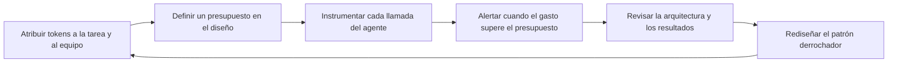

# Deuda de tokens: por qué FinOps para la IA agéntica es un problema de ingeniería, no de elección de modelo

_Por qué el próximo capítulo de FinOps no consiste en encontrar un modelo más barato. Se trata de diseñar sistemas que no desperdicien los tokens que ya tienen._

Un líder financiero abre la factura mensual de la plataforma de IA de la empresa y encuentra un número que no coincide con ninguna historia que alguien pueda contar. El uso creció de forma moderada. La factura creció de forma marcada. Nadie cambió a un modelo más caro. Nadie aprobó una nueva integración que alguien recuerde. La partida simplemente creció por sí sola, de la misma manera en que solían crecer las facturas de la nube antes de que alguien construyera una disciplina para vigilarlas.

Pregúntale al equipo de ingeniería qué pasó y la respuesta rara vez tiene una sola causa. Son cien pequeñas decisiones: un prompt de sistema que creció cada vez que alguien añadió una nueva regla, un paso de recuperación que trae diez documentos cuando dos bastarían, un agente que reintenta una llamada a una herramienta fallida cinco veces antes de rendirse, un flujo de trabajo que pasa una conversación entre tres agentes especializados y reenvía todo el historial en cada traspaso. Ninguna de estas decisiones parecía costosa por separado. Juntas, son la factura.

{/* truncate */}

Esto no es una historia sobre una mala elección de modelo. Es una historia sobre arquitectura, y se está convirtiendo en el problema de costos que define la era agéntica. **La optimización de costos de IA ya no es principalmente un problema de selección de modelo.** A medida que las organizaciones pasan de interfaces de chat con un solo prompt a agentes que planifican, llaman herramientas, recuperan datos y coordinan con otros agentes, las mayores y más persistentes oportunidades de ahorro se mueven con ellos, saliendo del catálogo de modelos y entrando en las decisiones de ingeniería que determinan cómo los agentes consumen tokens en realidad: diseño de agentes, gestión de contexto, orquestación, memoria, recuperación y uso de herramientas. Un diseño de agentes deficiente genera desperdicio de tokens exactamente de la misma manera en que una arquitectura de nube deficiente generó desperdicio de infraestructura durante la última década: de forma silenciosa, estructural, y a una escala que un precio unitario más bajo por sí solo no puede resolver.

---

## FinOps ya resolvió esto una vez

[FinOps](https://www.finops.org) existe porque la computación en la nube cambió la forma del gasto en tecnología. Una compra de centro de datos era una decisión grande, poco frecuente y controlada de forma centralizada. El gasto en la nube es lo contrario: pequeño, continuo, y decidido por miles de decisiones de ingeniería individuales tomadas lejos de cualquier departamento de finanzas. FinOps se convirtió en una disciplina porque alguien tenía que conectar esos dos mundos, dando a los ingenieros visibilidad sobre el costo y dando a finanzas una manera de entender un gasto que cambia cada hora según lo que construyen los ingenieros.

La práctica funcionó porque acertó en tres cosas. Hizo visible el costo al nivel del equipo y la carga de trabajo que lo generó, mediante etiquetado, showback y chargeback, en lugar de dejarlo como un solo número en una factura. Convirtió el costo en una preocupación compartida entre finanzas e ingeniería, en lugar de un informe que finanzas producía después de los hechos. Y se centró en la economía unitaria, el costo por transacción o por cliente, en lugar del gasto agregado, porque el gasto agregado casi no dice nada sobre si el dinero se está gastando bien.

La misma industria que construyó esta disciplina ya está indicando hacia dónde se dirige. La FinOps Foundation ahora mantiene pistas completas bajo nombres como AI for FinOps y Token Economics, y su propia [conferencia reciente llevó el tema AI Value: The Era of FinOps for AI, Token Economics, and Agentic FinOps, con una charla principal titulada simplemente From Alerts to Agents](https://youtube.com/watch?v=W4g8xvduIbs&list=PLUSCToibAswmiiuvt5DBYBcOAzOjoDBM4). Eso no es un giro de marketing. Es la misma disciplina reconociendo que ha llegado una nueva unidad de gasto, más difícil de gestionar, y esa unidad es el token.

Los tokens rompen algunas de las suposiciones sobre las que FinOps construyó su práctica para la infraestructura de nube. El costo de una máquina virtual es una función de su tamaño y duración, y ambos los define una persona que la aprovisionó. La factura de tokens es una función de lo que un sistema autónomo decide hacer en tiempo de ejecución: cuánto contexto reúne, cuántas herramientas llama, cuántas veces reintenta, a cuántos otros agentes consulta antes de producir una respuesta. La unidad de gasto ahora depende de una decisión tomada por software y no por una persona, lo que significa que la disciplina tiene que moverse hacia arriba, hacia el diseño de ese software, para tener algún efecto real.

---

## La trampa de la selección de modelo

Elegir el modelo es una palanca legítima, y descartarla sería un error. Dirigir pasos simples de clasificación o extracción hacia un modelo más pequeño mientras se reserva uno más grande para los pasos que de verdad lo necesitan es buena ingeniería. Pero es una palanca acotada, y en gran medida de un solo uso. Eliges un modelo, recibes un multiplicador fijo sobre el costo, y la historia termina en gran parte ahí hasta que llega la siguiente generación de modelos con un mejor precio para la misma calidad.

Mientras tanto, la forma de la carga de trabajo, cuántos tokens consume una tarea para llegar a un resultado correcto, la determinan por completo las decisiones de ingeniería, y esta sigue creciendo con cada agente, herramienta y reintento adicional que un equipo añade. Tratar la selección de modelo como la palanca de costo principal se parece mucho a obsesionarse con qué región tiene la tarifa por hora más barata para una máquina virtual mientras se ignora que la carga de trabajo está aprovisionada cinco veces más grande de lo que necesita, nunca se reduce, y reintenta trabajos fallidos sin límite. El precio unitario nunca fue el número más grande de esa ecuación.

Los paralelismos entre el desperdicio en la nube y el desperdicio de tokens son lo bastante cercanos como para usarlos de mapa de trabajo:

| Patrón de desperdicio en la nube | Patrón de desperdicio de tokens | Causa subyacente |
|---|---|---|
| Máquinas virtuales sobredimensionadas funcionando con baja utilización | Ventanas de contexto sobredimensionadas que cargan historial irrelevante | Aprovisionar o ensamblar pensando en el peor caso en lugar de la necesidad real |
| Recursos inactivos que se dejan corriendo tras finalizar un proyecto | Estado de conversación inactivo que se mantiene vivo y se reenvía en cada turno | Ausencia de gestión del ciclo de vida para un estado que ya dejó de ser útil |
| Microservicios ruidosos que se hacen llamadas redundantes entre sí | Traspasos ruidosos entre agentes que reenvían todo el contexto en cada salto | Cada componente razonando de forma local en lugar de que el sistema razone como un todo |
| Ausencia de autoescalado, así que la capacidad queda fija en el pico | Ausencia de poda de contexto, así que cada llamada paga por el historial máximo | Ningún mecanismo para reducir el uso de recursos cuando la necesidad real disminuye |
| Reintentar trabajos fallidos sin espera progresiva, multiplicando el cómputo | Reintentar llamadas a herramientas o pasos de agente sin espera progresiva, multiplicando los tokens | El manejo de fallas tratado como algo secundario en lugar de un camino diseñado |

Cada fila del lado derecho de esa tabla es una decisión de ingeniería. Ninguna se resuelve cambiando de modelo.

---

## Deuda de tokens: un marco para el desperdicio que no se ve en un panel

Uso el término **deuda de tokens** por la misma razón por la que los ingenieros usan deuda técnica: para describir un costo que resulta invisible en el momento en que se toma un atajo, y que se acumula en silencio hasta volverse imposible de ignorar. Un prompt de sistema que gana un párrafo más en cada sprint no parece costoso hoy. Un paso de recuperación que trae un fragmento un poco más grande de lo necesario no parece costoso hoy. Un agente que reintenta tres veces en lugar de fallar rápido no parece costoso hoy. Multiplica cualquiera de estos casos por unos cuantos cientos de miles de llamadas al mes, y el error de redondeo de hoy se convierte en la partida del próximo trimestre.

La deuda de tokens tiene el mismo rasgo definitorio que la deuda técnica: es barata de crear y cara de pagar. Es barata porque los tokens tienen un precio tan bajo por unidad que ninguna llamada individual derrochadora activa nunca una revisión por sí sola. Es cara de pagar porque, para cuando el desperdicio se vuelve visible en la factura agregada, ya está incorporado en la arquitectura, repartido en cada flujo de trabajo que copió el mismo patrón, y enredado con comportamientos de los que la gente ya depende.

Siete áreas de ingeniería explican la mayor parte de la deuda de tokens que aparece en los sistemas agénticos, y todas corresponden directamente a las decisiones que los equipos toman al diseñar un agente, no al modelo que hay detrás.

| Área de ingeniería | Cómo se acumula la deuda de tokens | Un patrón mejor |
|---|---|---|
| Diseño de agentes | Un único agente amplio maneja cada solicitud, cargando un conjunto completo de instrucciones y la definición de cada herramienta en cada llamada, incluso para tareas simples | Delimitar los agentes de forma estrecha y cargar instrucciones especializadas solo cuando la tarea realmente las requiere |
| Gestión de contexto | Todo el historial de la conversación se reenvía en cada turno, así que el costo crece mucho más rápido que la conversación misma | Resumir o acotar el historial, conservando solo lo que afecta de forma material a la siguiente decisión |
| Patrones de orquestación | Varios agentes se pasan una tarea entre sí, y cada uno reenvía el contexto completo que recibió | Diseñar los traspasos como mensajes pequeños y estructurados, no como transferencias completas de contexto |
| Estrategias de memoria | La memoria a largo plazo almacena transcripciones completas y las repite por completo cada vez que se recuperan | Almacenar hechos y decisiones destilados, y recuperar solo lo relevante para la tarea actual |
| Enfoques de recuperación | Fragmentos sobredimensionados, sin caché y sin filtrado de relevancia hacen que cada consulta traiga mucho más de lo que el modelo necesita | Ajustar el tamaño de los fragmentos, guardar en caché las búsquedas repetidas y reordenar los resultados antes de enviar algo al modelo |
| Uso de herramientas | Las herramientas devuelven la respuesta completa sin importar lo que la tarea realmente necesita | Limitar las respuestas de las herramientas a los campos que la tarea requiere, filtrados desde el origen |
| Arquitectura del flujo de trabajo | Los bucles de reintento se ejecutan sin límites ni espera progresiva, así que una sola falla puede multiplicarse en docenas de intentos costosos | Acotar los reintentos, agregar espera progresiva y diseñar un camino explícito de respaldo o escalamiento |

Algunos de estos patrones son más fáciles de reconocer al observar cómo las plataformas de agentes más maduras ya los abordan. Los agentes personalizados y las skills de [GitHub Copilot](https://github.com/features/copilot), por ejemplo, solo se cargan en el contexto cuando el agente o la skill correspondiente realmente se invoca, en lugar de concatenar cada instrucción posible en un solo prompt enviado con cada solicitud. El mecanismo específico variará entre plataformas, pero el principio subyacente se generaliza a cualquier sistema agéntico: la relevancia debería determinar qué entra en la ventana de contexto, no la conveniencia.

El uso de herramientas merece una advertencia particular, porque es fácil confundir estandarización con eficiencia. Protocolos como el [Model Context Protocol](https://modelcontextprotocol.io) facilitan mucho conectar un agente con muchas herramientas sin escribir código de integración personalizado para cada una, y eso es una mejora de ingeniería genuina. Eso no hace automáticamente barato el uso de herramientas. Un esquema de herramienta enviado con cada llamada y una respuesta detallada devuelta en cada invocación siguen costando tokens sin importar si el protocolo detrás de ellos es abierto y estandarizado o propietario. La estandarización resuelve la fricción de integración. No resuelve la eficiencia de tokens, y tratar ambos como el mismo problema es en sí mismo una fuente de deuda de tokens.

### En qué gasta sus tokens un solo turno

Ayuda hacer concreta la abstracción. Un solo turno de un agente, una solicitud y una respuesta, normalmente contiene varios componentes, y cada uno es un lugar donde la deuda puede acumularse en silencio.

| Componente de la llamada | Qué contiene | Riesgo de desperdicio habitual |
|---|---|---|
| Instrucciones de sistema | Reglas fijas y persona enviadas con cada llamada | Crece cada vez que alguien añade una nueva regla, y rara vez se poda |
| Definiciones de herramientas | Esquemas de cada herramienta que el agente podría llegar a llamar | Cada herramienta se carga sin importar si la tarea actual la necesita |
| Contexto recuperado | Documentos o registros traídos para fundamentar la respuesta | Fragmentos demasiado grandes, pasajes duplicados, sin filtro de relevancia |
| Historial de la conversación | Turnos anteriores que se arrastran por continuidad | Se reenvía la transcripción completa en lugar de un resumen |
| Respuestas de herramientas | Datos devueltos por una llamada de herramienta completada | Se devuelve la respuesta entera en lugar de los campos que la tarea realmente necesita |
| Traspasos entre agentes | Contexto pasado a un agente o subagente cooperante | Se reenvía el estado completo en cada salto en lugar de un traspaso mínimo y estructurado |
| Escrituras de memoria | Lo que se guarda en el almacenamiento a largo plazo | Se guardan transcripciones sin procesar en lugar de resúmenes destilados |

Ninguno de estos componentes es derrochador por naturaleza. Cada uno se convierte en deuda de tokens solo cuando se ensambla por defecto en lugar de por diseño.

---

## Métricas que hacen visible la eficiencia de tokens

No se puede gestionar lo que no se puede ver, y la mayoría de las organizaciones hoy solo pueden ver una métrica de tokens: la factura total. Ese número es casi inútil para decisiones de ingeniería, porque no dice si el gasto es proporcional al valor entregado. Un conjunto pequeño de métricas, medidas a nivel del flujo de trabajo en lugar de a nivel de la empresa, convierte el gasto en tokens de una entrada contable en una señal de ingeniería.

| Métrica | Definición | Qué revela | A qué prestar atención |
|---|---|---|---|
| Tokens por resultado | Total de tokens consumidos dividido entre las tareas completadas según una barra de calidad definida | El costo unitario real de un flujo de trabajo, comparable entre equipos y en el tiempo | Una definición vaga de completado esconde problemas de calidad detrás de un número que luce bien |
| Utilización de contexto | La proporción de tokens enviados en una solicitud que realmente influyeron en la respuesta | Si el ensamblado de contexto es preciso o está inflado | Difícil de medir directamente, así que se aproxima con pruebas de ablación que quitan contexto y verifican si la calidad de la salida se mantiene |
| Proporción de tokens en reintentos | Tokens gastados en reintentos y autocorrección divididos entre los tokens gastados en el primer intento exitoso | Si el manejo de fallas es barato o costoso | Una proporción cercana a cero puede significar que el agente se rinde demasiado pronto en lugar de reintentar de forma eficiente |
| Factor de amplificación de tokens | Tokens consumidos por un flujo de trabajo orquestado de varios pasos dividido entre los tokens que necesitaría una sola llamada bien delimitada para el mismo resultado | Si la orquestación agrega valor o solo agrega gastos generales | Cierta amplificación compra confiabilidad o seguridad reales, así que un número más alto no es automáticamente un problema |
| Costo por tarea exitosa | Costo en dólares dividido entre las tareas completadas según la misma barra de calidad de arriba | Conecta la eficiencia de tokens directamente con un número que finanzas ya entiende | Debe emparejarse con la barra de calidad, o los equipos aprenderán a optimizar respuestas baratas y equivocadas |

Cada una de estas métricas es peligrosa por sí sola. Un equipo medido solo en tokens por resultado aprenderá a producir respuestas más cortas, más baratas y peores. Un equipo medido solo en calidad nunca notará el desperdicio. Las dos deben reportarse juntas, en el mismo panel, revisadas por las mismas personas, o la métrica terminará optimizando exactamente el comportamiento equivocado.

---

## Gobernanza y responsabilidad: quién es dueño de la factura de tokens

FinOps en la nube funciona gracias a la propiedad compartida entre finanzas, ingeniería y los equipos de plataforma, y porque el gasto se atribuye con la claridad suficiente para que showback o chargeback signifiquen algo para la persona que los ve. Los sistemas agénticos necesitan la misma estructura, adaptada a una unidad de gasto que define el comportamiento del agente y no una persona eligiendo el tamaño de una máquina virtual.

Un puñado de prácticas carga con la mayor parte del peso:

* **Atribuye cada token a una tarea, un flujo de trabajo y un equipo**, de la misma manera en que el gasto en la nube se etiqueta a un grupo de recursos y a un dueño. Sin atribución, una factura creciente no tiene un nombre asociado, y nadie se siente responsable de reducirla.
* **Define un presupuesto de tokens para cada tipo de tarea antes de construir el agente**, no después de que llegue la primera factura. Un presupuesto definido en el momento del diseño convierte el costo en una restricción contra la que el equipo diseña, de la misma manera en que ya lo hacen un presupuesto de latencia o un objetivo de disponibilidad.
* **Exige un perfil de costo documentado antes de que un flujo de trabajo agéntico llegue a producción.** Cuál es el número esperado de tokens por resultado. Cuál es el tamaño máximo de contexto por turno. Cuántas llamadas a herramientas o saltos entre subagentes puede disparar una sola tarea antes de contar como una ejecución fuera de control.
* **Genera alertas sobre el consumo de tokens de la misma manera en que ya alertas sobre tasas de error o latencia**, y dirige la alerta al equipo dueño del flujo de trabajo, no solo a finanzas.
* **Revisa la eficiencia de tokens con la misma frecuencia que la revisión de arquitectura**, y conviértela en un filtro real en lugar de una sugerencia. Un flujo de trabajo que no puede explicar su propio perfil de tokens no está listo para tráfico de producción.
* **Escala de forma deliberada.** Cuando un flujo de trabajo supera su presupuesto, la respuesta debería ser un camino definido, como limitar el tráfico, recurrir a un enfoque más barato o pausar para una decisión humana, no un exceso silencioso que solo aparece treinta días después en una factura.

El ciclo que forman estas prácticas es un descendiente directo del ciclo clásico de FinOps, adaptado a una unidad de gasto que da forma al comportamiento del software en lugar de a las decisiones de aprovisionamiento.

---

## Un modelo de madurez para el FinOps agéntico

Las organizaciones tienden a pasar por etapas reconocibles a medida que construyen esta disciplina. Nombrar las etapas facilita ver dónde está un equipo en realidad, en lugar de dónde supone que está.

| Etapa | Qué es cierto | Comportamiento característico |
|---|---|---|
| Sin gestionar | El gasto en tokens solo es visible como un único número en una factura del proveedor | Nadie puede decir qué equipo, agente o flujo de trabajo es responsable del gasto |
| Observado | El consumo de tokens se mide y se atribuye a equipos y flujos de trabajo | Existen paneles, pero nadie es responsable de actuar sobre lo que muestran |
| Gestionado | Existen presupuestos, alertas y perfiles de costo definidos desde el diseño para los flujos de trabajo agénticos | Los equipos de ingeniería tratan la eficiencia de tokens como una restricción real de diseño |
| Gobernado | La eficiencia de tokens forma parte de la revisión de arquitectura y es una condición para publicar | Un agente no puede llegar a producción sin un perfil de costo documentado y un dueño |
| Sistémico | Los patrones eficientes de contexto, recuperación y orquestación se convierten en capacidades compartidas de la plataforma | Los equipos reutilizan problemas de eficiencia ya resueltos en lugar de redescubrirlos cada uno por su cuenta |

La mayoría de las organizaciones que hoy adoptan agentes se ubican en las etapas sin gestionar u observado. Pocas han llegado a gestionado. Casi ninguna ha llegado a sistémico, y es justo ahí donde se acumula la ventaja duradera, porque un patrón resuelto y reutilizado por cada equipo compone ahorros de la misma manera en que un patrón de desperdicio sin resolver compone costos.

---

## El pensamiento de sistemas le gana al pensamiento de modelos

Un modelo más barato es un descuento aplicado una sola vez a cada token que de todas formas ibas a gastar. Una mejor arquitectura cambia cuántos tokens gastas en primer lugar, y ese ahorro se compone cada vez que se ejecuta el flujo de trabajo, cada vez que escala, y cada vez que otro equipo adopta el mismo patrón.

La computación en la nube enseñó exactamente esta lección una década antes. Elegir un tamaño de máquina virtual un poco más barato ayudó una vez. Diseñar para la elasticidad, de modo que el sistema usara solo la capacidad que la carga de trabajo realmente necesitaba en cada momento, siguió dando frutos de forma indefinida. La eficiencia de tokens está siguiendo el mismo arco. Las organizaciones que la traten como una disciplina de arquitectura y no como una decisión de compras terminarán con una ventaja de costo estructural que un competidor no podrá borrar simplemente cambiando a un modelo más barato el próximo trimestre.

---

## Guía práctica para equipos de ingeniería y plataforma

* **Instrumenta primero.** Adjunta conteos de tokens a cada llamada de agente, etiquetados por tarea, flujo de trabajo y equipo, antes de intentar optimizar nada. No puedes arreglar lo que no puedes atribuir.
* **Define el presupuesto antes de construir.** Decide cuánto debería costar en tokens un tipo de tarea en el momento del diseño, no después de que la primera factura tome a alguien por sorpresa.
* **Trata el ensamblado de contexto como un artefacto diseñado, no como una acumulación.** Decide de forma deliberada qué pertenece a una llamada en lugar de incluir por defecto todo lo que podría ser relevante.
* **Separa la memoria en niveles.** Mantén la memoria de trabajo pequeña y precisa para la tarea actual. Mantén la memoria a largo plazo destilada en hechos y decisiones, nunca como una repetición literal de todo lo que ha ocurrido.
* **Acota cada reintento y cada bucle.** Define un número máximo de intentos, agrega espera progresiva y diseña un camino explícito de respaldo para cuando un agente no pueda completar un paso.
* **Audita la orquestación en busca de saltos redundantes.** Cada agente o subagente adicional en un flujo de trabajo debería ganarse su parte del costo en tokens mediante una mejora clara en el resultado o la confiabilidad, y no simplemente existir porque parecía útil durante un prototipo.
* **Haz de la eficiencia de tokens parte de la definición de terminado** para las funciones agénticas, revisada junto con la corrección y la seguridad, en lugar de descubrirla más tarde en una factura mensual.
* **Reporta las métricas de tokens junto a las métricas de confiabilidad y calidad**, a la misma audiencia, con la misma frecuencia. Una métrica que ve finanzas y que ingeniería nunca ve no cambiará el comportamiento de ingeniería.

---

## Cierre: optimiza el sistema, no el modelo

La selección de modelo seguirá importando. Seguirán llegando modelos nuevos, algunos de ellos de forma significativa más baratos o más rápidos con la misma calidad, y seguirá teniendo sentido aprovechar eso cuando ocurra. Pero esa palanca siempre ha tenido un techo, y las organizaciones que la tratan como su estrategia de costo principal están optimizando la parte más pequeña del problema.

La oportunidad más grande y más duradera está en las decisiones de ingeniería que determinan cuántos tokens necesita un sistema para llegar a un resultado correcto en primer lugar: cómo se delimita un agente, cómo se ensambla el contexto, cómo se guarda y se recupera la memoria, cómo se filtra la recuperación, cómo responden las herramientas, cómo se acotan las fallas, y cómo se orquesta el trabajo entre agentes. Cada una de estas es una decisión de diseño, tomada por un ingeniero, y revisable como cualquier otra pieza de arquitectura. Ninguna requiere elegir un modelo más barato. Todas requieren tratar la eficiencia de tokens con la misma seriedad con la que siempre se han tratado la latencia, la corrección y la seguridad.

La deuda de tokens se acumula en silencio, de la misma manera en que siempre lo han hecho la deuda técnica y el desperdicio en la nube: un atajo conveniente a la vez, hasta que una factura obliga a tener una conversación que pudo haber empezado meses antes como una revisión de diseño. Las organizaciones que ganen económicamente en la era agéntica no serán las que encontraron el modelo más barato. Serán las que construyeron sistemas lo bastante disciplinados como para no desperdiciar los tokens que ya estaban pagando.
