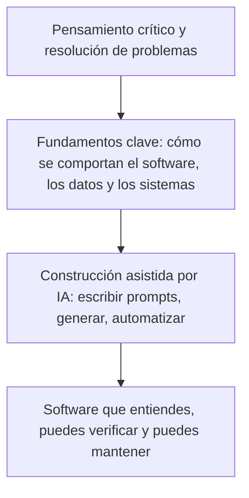

# Antes de escribir un prompt: los fundamentos que todo principiante necesita en la era de la IA

## Por qué entender sigue importando cuando la IA puede escribir el código

Nunca ha sido tan fácil convertir una idea en software funcional. Describe lo que quieres en lenguaje simple, y una herramienta de IA puede generar una página web, un script, una integración con una API o incluso un agente de varios pasos que realiza acciones en tu nombre. Para cualquiera que se haya sentido excluido del software por no saber programar, ese cambio es real y bienvenido.

Pero hay una diferencia entre software que funciona y software que entiendes. La IA puede producir lo primero en segundos. Solo tú puedes producir lo segundo, y solo si sabes lo suficiente sobre cómo funciona realmente el software para leer lo que la IA te entregó, cuestionarlo y corregirlo cuando esté equivocado.

{/* truncate */}

Este artículo es para estudiantes, personas en proceso de cambiar de carrera y cualquiera que esté empezando y quiera construir soluciones reales con ayuda de la IA. No es un argumento para pasar años estudiando antes de tocar un teclado. Es un mapa práctico de los fundamentos que te convierten en una mejor persona constructora, revisora y tomadora de decisiones, sin importar tu puesto o tu trayectoria.

---

## La IA cambió lo que produces, no de qué eres responsable

Las herramientas de IA son extraordinariamente buenas para producir respuestas plausibles con rapidez. No son buenas para saber exactamente qué necesitas, detectar cada error o entender las consecuencias de una decisión dentro de tu situación específica. Ese criterio le sigue perteneciendo a la persona que hace la pregunta.

Piensa en la IA como una colaboradora capaz que ha leído casi todo, pero que nunca ha usado tu producto, conocido a las personas que dependen de él, ni lidiado con las consecuencias cuando algo falla. Puede redactar, sugerir y acelerar. No puede decidir qué significa "correcto" en tu contexto, ni puede asumir la responsabilidad de lo que pase después de que publiques algo.

Ahí es donde entran los fundamentos. No porque necesites memorizar sintaxis o pasar años en teoría, sino porque:

- Necesitas **reconocer** cuándo un resultado parece correcto pero no lo es.
- Necesitas **hacer** mejores preguntas, porque una solicitud vaga produce un resultado vago o incorrecto.
- Necesitas **evaluar el riesgo**, porque algunos errores son cosméticos y otros son peligrosos.
- Necesitas **mantener** lo que se construye después de que la primera versión funciona, que es la mayor parte del esfuerzo real en el software.

Nada de esto requiere un título en ciencias de la computación. Requiere un modelo mental funcional de un pequeño número de ideas, la mayoría de las cuales toman pocas horas en aprenderse y mucho tiempo en profundizarse, igual que cualquier otra habilidad práctica.

Sáltate la base de esa pila y la parte superior se vuelve frágil. Aún puedes producir algo que funcione. Te costará saber si es seguro, correcto o digno de confianza.

---

## Los fundamentos: un recorrido práctico

Los conceptos siguientes aparecen en casi cualquier solución de software, ya sea un proyecto personal, una tarea de clase o un producto en producción. No necesitas dominarlos todos antes de empezar a construir. Necesitas saber que existen, qué problema resuelve cada uno y lo suficiente para notar cuando algo no cuadra.

| Fundamento | Qué significa en realidad | Por qué importa cuando la IA escribe el código |
|---|---|---|
| Cómo funciona el software | Los programas son instrucciones precisas y literales que una computadora ejecuta paso a paso | El código generado por IA también son solo instrucciones. Si no puedes leerlas, no puedes confirmar que hacen lo que pediste |
| Cliente, servidor y localhost | Un programa solicita algo, otro responde, y puedes ejecutar ambos de forma privada en tu propia máquina primero | La mayoría de los errores y brechas de seguridad viven en ese intercambio, y localhost es donde los detectas antes de que alguien más pueda hacerlo |
| APIs | Formas acordadas para que los programas intercambien datos | Las herramientas de IA se conectan a APIs constantemente; una llamada mal entendida falla en silencio o de forma costosa |
| Estructuras de datos | Cómo se organiza la información para poder almacenarla, encontrarla y modificarla | La diferencia entre software que escala y software que colapsa con el uso real |
| Depuración | Leer errores y evidencia para encontrar la causa real | El fundamento más transferible, y uno que la IA no puede hacer del todo por ti |
| Control de versiones | Un historial registrado y reversible de cada cambio | Tu red de seguridad cuando un cambio sugerido por la IA resulta estar mal |
| Pruebas | Prueba de que algo funciona, no solo la esperanza de que lo haga | La forma más rápida de detectar un error de la IA antes que una persona |
| Fundamentos de seguridad | Entender los límites de confianza y qué podría salir mal | La IA generará código inseguro si no le pides lo contrario, o si no lo notas |
| Pensamiento sistémico | Ver cómo las partes se afectan entre sí, no solo una pieza aislada | La IA razona sobre el código que tiene enfrente, no sobre todo tu sistema y su historia |

### Cómo funciona el software

Una computadora solo hace una cosa: sigue instrucciones, exactamente como están escritas, a una velocidad extraordinaria. Los lenguajes de programación permiten que las personas escriban esas instrucciones en una forma legible para humanos y traducible a algo que una máquina pueda ejecutar.

Esto importa porque el código generado por IA no es magia. Son instrucciones como cualquier otra, escritas por un modelo en vez de una persona. Si puedes seguir paso a paso lo que hace un fragmento de código, en lenguaje simple, puedes saber si coincide con lo que realmente pediste. Si no puedes, estás confiando en el resultado por fe, y la fe no es una estrategia de verificación.

No necesitas aprender todos los lenguajes. Necesitas sentirte cómodo con los bloques básicos que casi todos los lenguajes comparten: variables que guardan valores, condicionales que toman decisiones, bucles que repiten acciones y funciones que agrupan pasos en una unidad reutilizable.

### Cliente, servidor y localhost

La mayoría del software que usas a diario involucra dos programas separados que se comunican entre sí. El **cliente** es el programa con el que interactúas directamente: un navegador, una aplicación móvil o una herramienta de línea de comandos. El **servidor** es un programa distinto, muchas veces ejecutándose en otro lugar por completo, que recibe solicitudes, hace el trabajo y devuelve una respuesta.

Cada vez que se carga una página, se envía un formulario o una aplicación obtiene datos nuevos, un cliente le está pidiendo algo a un servidor y el servidor está respondiendo. Entender ese ir y venir es lo que convierte preguntas como "por qué esto es lento" o "por qué falló mi solicitud" en algo que realmente puedes investigar, en vez de magia inexplicable.

**Localhost** es tu propia computadora actuando como cliente y servidor a la vez, para que puedas construir y probar software antes de que alguien más pueda acceder a él. Cuando un tutorial te dice que abras `http://localhost:3000`, significa que hay un servidor corriendo en tu máquina y tu navegador está hablando con él de forma privada. Localhost es donde debes probar cualquier cosa que la IA genere para ti antes de que se acerque a usuarios o datos reales. [Web Dev for Beginners](https://github.com/microsoft/web-dev-for-beginners#%EF%B8%8F-lessons) es una referencia sólida y gratuita sobre estos conceptos cuando quieras profundizar más.

### APIs: los contratos entre sistemas

Una **API** (interfaz de programación de aplicaciones) es una forma acordada para que una pieza de software le pida algo a otra, sin necesidad de saber cómo funciona internamente. Envías una solicitud en un formato específico y recibes una respuesta en un formato específico.

Las APIs están en todas partes en el desarrollo asistido por IA. Al propio modelo de IA normalmente se accede a través de una API. El código que una IA genera para ti llamará con frecuencia a otras APIs, para datos del clima, pagos, autenticación o una base de datos. Si no entiendes la forma básica de una solicitud y una respuesta, incluyendo los códigos de estado y el manejo de errores, no puedes saber si una integración generada por IA es sólida o solo optimista.

Un hábito simple desarrolla esto rápido: toma cualquier API pública de acceso gratuito, hazle una solicitud usando solo tu navegador o un script corto, y observa con atención lo que regresa, incluyendo lo que pasa cuando algo falla a propósito.

### Estructuras de datos: cómo se organiza la información

Una estructura de datos es una forma de organizar información para que pueda almacenarse, encontrarse y modificarse de manera eficiente. Una lista, una tabla, un par clave-valor y un árbol son todos estructuras de datos. Los nombres específicos importan menos que la pregunta que te obligan a hacer: **¿cuál es la forma correcta de organizar esta información según cómo se usará realmente?**

La IA generará con confianza código usando la estructura que encaje con el prompt, no necesariamente la que encaje con tus datos reales o tu escala. Guardar un millón de registros en una estructura pensada para una docena funciona bien en una demo y falla en producción. No necesitas memorizar cada estructura de datos que existe. Necesitas poder preguntar qué le pasa a un enfoque a medida que crecen los datos, y tener suficiente base para evaluar la respuesta. La [guía de estructuras de datos de roadmap.sh](https://roadmap.sh/datastructures-and-algorithms) es una buena referencia gratuita cuando quieras profundizar.

### Depuración: la habilidad que la IA no puede automatizar del todo

Depurar es descubrir por qué algo no se comporta como se espera, usando evidencia como mensajes de error, registros y el comportamiento real del sistema, en vez de suposiciones.

Este podría ser el fundamento más transferible de todos, porque en realidad es pensamiento crítico aplicado. Observas un síntoma, formulas una hipótesis sobre la causa, pruebas esa hipótesis y vas acotando hasta encontrar el origen real. La IA puede ayudar enormemente aquí, sugiriendo causas y soluciones, pero muchas veces no tiene acceso a tu entorno de ejecución específico, tus datos ni el historial completo de cómo el sistema llegó a su estado actual. Cuando una solución sugerida por la IA no funciona, la capacidad de seguir investigando de forma metódica, en vez de probar cambios al azar, es lo que distingue a quien construye software confiable de quien solo está adivinando.

### Control de versiones: tu red de seguridad para experimentar

El control de versiones, casi siempre a través de una herramienta llamada Git, mantiene un historial completo y reversible de cada cambio hecho a un proyecto. Cada cambio queda registrado, etiquetado y puede deshacerse.

Esto se vuelve esencial en cuanto la IA entra en escena, porque los cambios sugeridos por la IA a veces estarán mal, y algunos de esos errores no serán obvios de inmediato. El control de versiones significa que siempre puedes volver a un estado conocido y correcto, comparar qué cambió y ver exactamente qué tocó una edición de la IA frente a lo que dejó intacto. Trata el hacer commit de tu trabajo temprano y seguido como un hábito básico, no como una técnica avanzada reservada para profesionales. [Introduction to Git](https://learn.github.com/courses/introductiontoGit) es un buen punto de partida gratuito.

### Pruebas: prueba, no esperanza

Una prueba es una verificación pequeña y automatizada que confirma que una pieza de software se comporta como debería. En vez de ejecutar una aplicación a mano y esperar que funcione, escribes una verificación que corre la misma comprobación cada vez, al instante, durante toda la vida del proyecto.

Las pruebas importan más, no menos, en un flujo de trabajo asistido por IA. Cuando una IA regenera o refactoriza una pieza de código, un buen conjunto de pruebas te dice de inmediato si el comportamiento del que dependes se mantiene. Sin pruebas, dependes de revisiones manuales puntuales, que se debilitan cada vez que el proyecto crece. Empieza pequeño: una prueba que verifica un comportamiento importante vale más que cero pruebas protegiendo un proyecto entero.

### Fundamentos de seguridad: límites de confianza y radio de impacto

La seguridad empieza con una pregunta simple: **¿qué pasa si no se puede confiar en esta entrada, este usuario o este sistema?** Un límite de confianza es cualquier punto donde la información pasa de algo que no controlas a algo que sí controlas: el envío de un formulario, un archivo subido, una solicitud desde internet público.

El código generado por IA a menudo se salta la validación, expone más información de la necesaria o maneja secretos con descuido, no por malicia, sino porque optimiza para que la solicitud inmediata funcione. No necesitas convertirte en ingeniera o ingeniero de seguridad para construir de forma responsable. Necesitas suficiente base para hacer preguntas básicas antes de publicar cualquier cosa: ¿esta entrada está validada?, ¿este secreto está almacenado de forma segura?, y ¿cuál es el peor caso si esto sale mal?, es decir, qué tan lejos podría llegar el daño, su **radio de impacto**. El [OWASP Top 10](https://owasp.org/Top10/2025/) es el punto de partida estándar y gratuito para los riesgos más comunes.

### Pensamiento sistémico: ver el panorama completo

El pensamiento sistémico es el hábito de considerar cómo un cambio en una parte de una solución afecta a todo lo que está conectado con ella, en vez de evaluar ese cambio de forma aislada. El software rara vez es una sola pieza. Es un conjunto de partes que interactúan: código, datos, infraestructura, otros sistemas y usuarios reales con comportamientos reales.

Las herramientas de IA razonan bien sobre el fragmento de código que tienen justo enfrente. Son mucho más débiles razonando sobre todo tu sistema, su historia, sus restricciones y las decisiones detrás de su forma actual. Esa mirada más amplia es tu trabajo. Un cambio que parece correcto de forma aislada puede romper algo dos pasos más allá, y solo alguien que piensa en el sistema completo detecta eso antes de que se publique.

---

## Pensamiento crítico: la habilidad que la IA no puede hacer por ti

Cada fundamento anterior construye hacia un mismo resultado: la capacidad de mirar algo que produjo la IA y juzgarlo con honestidad, en vez de aceptarlo porque suena seguro de sí mismo.

Las respuestas generadas por IA comparten un rasgo que las vuelve riesgosas para quienes empiezan: casi siempre son fluidas, están bien formateadas y suenan plausibles, sean correctas o no. La fluidez no es precisión, y es fácil confundir una con la otra cuando todavía no tienes los fundamentos para distinguirlas.

Un pequeño conjunto de preguntas convierte la confianza ciega en una evaluación real:

- **¿Esto realmente responde lo que pedí, o algo parecido pero distinto?** La IA puede resolver con total confianza un problema ligeramente distinto al que tienes.
- **¿Puedo explicar, con mis propias palabras, qué hace esto?** Si no puedes explicarlo de forma simple, todavía no lo entiendes, sin importar si funciona.
- **¿Qué demostraría que esto está mal?** Busca el caso límite o la entrada que rompería la afirmación o el código, y pruébala.
- **¿En qué se basa esto?** La IA puede presentar información desactualizada o una referencia que parece real pero no existe, con total confianza y sin ninguna señal de duda.
- **¿Qué pasa si esto falla en producción, no en una demo?** Algunos errores solo cuestan rehacer el trabajo. Otros cuestan datos, dinero o la confianza de alguien más.

Ninguna de estas preguntas requiere experiencia avanzada. Requieren el hábito de detenerte antes de aceptar una respuesta, y suficiente conocimiento fundamental para realmente ponerla a prueba en vez de solo releerla.

---

## Usar la IA de forma responsable

Construir bien con IA no es solo una cuestión técnica. También es una cuestión de criterio sobre qué compartes, qué automatizas y de qué estás dispuesto a hacerte responsable.

Unos pocos hábitos prácticos hacen una gran diferencia:

- **Nunca pegues secretos, credenciales o datos privados en un prompt.** Trata todo lo que escribes en una herramienta de IA como información que podría salir de tu control. Usa marcadores de posición en vez de claves, tokens o datos personales reales.
- **Ajusta los permisos de una herramienta de IA a la tarea.** Un agente al que le pides corregir un error tipográfico no necesita la capacidad de borrar datos o desplegar a producción. Dale a las herramientas y agentes de IA el acceso más limitado que les permita hacer el trabajo.
- **Verifica antes de confiar, sobre todo en algo irreversible.** Revisa el código generado antes de ejecutarlo, en especial los comandos que borran, sobrescriben o publican algo. Los errores reversibles son experiencias de aprendizaje. Los irreversibles no.
- **Revisa la licencia y la originalidad de todo lo que planees reutilizar o publicar.** El contenido generado por IA puede parecerse lo suficiente a material existente como para plantear dudas reales sobre atribución y derechos. Ante la duda, verifica antes de publicar.
- **Hazte responsable del resultado.** Si le pediste a una IA que produjera algo y lo usaste, eres responsable de lo que hace, igual que lo serías si lo hubieras escrito tú mismo.

Usar la IA de forma responsable no se trata de tenerle miedo. Se trata de tratar una herramienta poderosa con el mismo cuidado que esperarías de cualquier otra persona con acceso a tus sistemas y tus datos.

---

## Los fundamentos no son una barrera de entrada

Nada de esto es un argumento a favor de que necesitas un título en ciencias de la computación, un certificado o años de experiencia previa para que se te permita construir algo. Muchas personas construyen soluciones útiles y reales sin ninguna credencial formal, y eso se vuelve más cierto, no menos, a medida que la IA reduce el costo de empezar.

El argumento real es más específico y más útil: mientras menos fundamentos tengas, más difícil es distinguir un buen resultado de IA de uno malo, y más expuesto estás a errores que no puedes ver venir. Eso no es un muro para dejar a la gente afuera. Es un conjunto de habilidades que te hacen dramáticamente más efectivo una vez que decides cruzar la puerta, y cada una de ellas se aprende, en partes pequeñas, por cualquiera dispuesto a practicar.

De dónde vienes, tu puesto de trabajo y cómo aprendiste no determinan si puedes construir buen software. Si entiendes lo que construiste lo suficientemente bien como para confiar en ello, explicarlo y corregirlo, sí lo determina.

---

## Primeros pasos: una hoja de ruta simple para aprender

No necesitas aprender todo lo de este artículo antes de empezar a construir con IA. Necesitas una secuencia. Aquí tienes un orden práctico para comenzar:

1. **Aprende cómo una solicitud se convierte en una respuesta.** Construye la página web más simple posible, ábrela localmente y observa en las herramientas de desarrollo de tu navegador cómo ocurre la solicitud y la respuesta en tiempo real.
2. **Aprende un lenguaje lo suficientemente bien como para leer sus errores sin entrar en pánico.** Concéntrate en variables, condicionales, bucles y funciones. Todavía no buscas el dominio total, solo la fluidez suficiente para seguir lo que hace el código generado por IA.
3. **Instala Git y haz un commit hoy mismo.** Convierte el hacer commits en un hábito desde tu primer proyecto, no en una habilidad que agregas después.
4. **Llama a una API pública real y maneja a propósito tanto un éxito como un fallo.** Ver una respuesta de error de forma deliberada te enseña más que ver solo el camino feliz.
5. **Escribe una prueba automatizada para algo que construiste.** No necesita ser sofisticada. Necesita probar que una cosa funciona, siempre.
6. **Lee un resumen breve y accesible sobre riesgos de seguridad comunes**, como entradas sin validar y secretos expuestos, para reconocerlos a simple vista.
7. **Usa la IA para construir algo, y luego explica cada parte en voz alta o por escrito**, como si tuvieras que enseñárselo a alguien más. Donde te trabes explicando, ahí exactamente es donde debes estudiar después.

Puntos de partida gratuitos y estructurados como [freeCodeCamp](https://www.freecodecamp.org/) pueden respaldar esta secuencia sin necesidad de un programa formal ni un presupuesto grande.

Cada paso es pequeño por sí solo. Juntos, construyen el criterio que convierte "esto lo generó la IA para mí" en "yo construí esto, y sé que funciona". Ese criterio, más que cualquier herramienta o modelo en particular, es la habilidad real que vale la pena desarrollar ahora mismo, y está al alcance de cualquiera dispuesto a empezar.