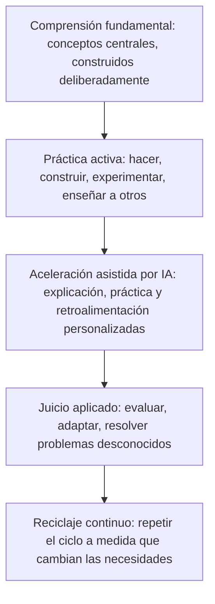

# Aprender de forma diferente: cómo deben evolucionar la enseñanza y el aprendizaje en la era de la IA y los agentes

## El verdadero cambio no es aprender menos, es aprender de forma diferente

Cada vez que una nueva tecnología facilita el acceso a la información, resurge la misma preocupación: ¿dejarán las personas de aprender por completo? Se suponía que las calculadoras harían innecesaria la aritmética. Se suponía que los buscadores harían innecesario recordar datos. La IA plantea ahora la misma pregunta, a una escala mucho mayor, porque puede explicar un concepto, redactar un ensayo y llevar a cabo tareas de varios pasos por su cuenta.

La preocupación interpreta mal lo que realmente está cambiando. La IA está transformando la rapidez con la que las personas pueden acceder a la información y producir un primer borrador de una respuesta. No está transformando el proceso subyacente mediante el cual un ser humano construye una comprensión real, desarrolla juicio o se vuelve capaz de resolver problemas que nunca antes había visto. Ese proceso sigue siendo lento, exige esfuerzo y sigue siendo profundamente humano.

{/* truncate */}

Esto importa para estudiantes, personas que aprenden por su cuenta, docentes, líderes de escuelas y universidades, organizaciones de desarrollo de la fuerza laboral, y profesionales que ahora necesitan reciclarse con más frecuencia que cualquier generación anterior. El argumento aquí es simple: el futuro del aprendizaje no consiste en aprender menos porque la IA puede responder al instante. Consiste en aprender de forma diferente, más continua y más intencional. La IA puede ser uno de los amplificadores de aprendizaje más poderosos jamás creados, pero solo si estudiantes, docentes e instituciones eligen usarla de esa manera.

---

## De la memorización al juicio

La educación tradicional surgió en un mundo donde la información era escasa y lenta de alcanzar. En ese mundo, memorizar datos y procedimientos era genuinamente valioso, porque recordar información rápidamente era a menudo el cuello de botella para poder usarla.

Ese cuello de botella prácticamente ha desaparecido. La IA ahora recupera, sintetiza y explica información con la profundidad que cada estudiante necesita. Esto no vuelve inútil el conocimiento fundamental, pero convierte al simple recuerdo en una medida mucho más débil del aprendizaje real. Las preguntas más útiles han cambiado: ¿puede esta persona reconocer cuándo un dato aplica a una situación nueva? ¿Puede juzgar si una respuesta, incluida una de la IA, es correcta o peligrosa? ¿Puede combinar conocimientos de distintos dominios para resolver un problema para el cual nadie le entregó una plantilla?

Ninguna de esas capacidades proviene de memorizar más contenido. Provienen del **juicio**: la capacidad de evaluar, aplicar y adaptar el conocimiento en condiciones reales y desordenadas. El juicio se construye mediante la práctica, la retroalimentación y la reflexión, no mediante la repetición de datos. Ese cambio ya era necesario incluso antes de que llegara la IA. La IA simplemente ha elevado el costo de ignorarlo.

El conocimiento fundamental sigue importando por una razón directa: es lo que permite a una persona evaluar una respuesta generada por IA en lugar de simplemente aceptarla. La IA puede ser fluida y segura de sí misma mientras está equivocada o desactualizada. Alguien con bases sólidas puede detectarlo; alguien sin ellas no tiene una base independiente para comparar. Las bases también son la materia prima de la creatividad, ya que las ideas genuinamente nuevas suelen surgir de recombinar conocimiento existente, y son una forma de resiliencia cuando una herramienta no está disponible o se equivoca.

---

## Cómo aprende la gente, y por qué hacer supera a consumir

El aprendizaje no es igual para todos. Las personas absorben información leyendo, viendo, escuchando, discutiendo, practicando, experimentando, construyendo proyectos y enseñando a otros, a menudo en combinación. La lectura construye profundidad y precisión. La discusión pone a prueba la comprensión frente a otras perspectivas. Construir un proyecto integra varias habilidades en juicio del mundo real. Enseñar un concepto a otra persona expone vacíos que ninguna revisión pasiva revelaría.

Décadas de investigación apuntan a la misma conclusión desde distintos ángulos: las personas aprenden mucho más haciendo algo que observándolo o leyendo sobre ello. La práctica de recuperación, donde una persona intenta recordar o aplicar algo en lugar de simplemente releerlo, produce una comprensión más sólida y duradera que la revisión pasiva.

La IA introduce aquí un riesgo real. Cuando una respuesta o un fragmento de código funcional puede generarse al instante, resulta tentador tratar ese resultado como la meta final en lugar de un punto de partida. Un estudiante que copia una explicación generada por IA sin trabajarla ha consumido información, no necesariamente ha aprendido algo duradero. El patrón más saludable invierte la secuencia: intentar resolver el problema primero, aunque sea de manera imperfecta, y luego usar la IA para verificar el razonamiento, llenar vacíos u ofrecer un segundo enfoque. La comparación entre tu propio intento y la respuesta de la IA, no la respuesta en sí, es donde ocurre el aprendizaje.

---

## Dónde la IA realmente ayuda: personalización, tutores y agentes

Los buenos docentes siempre han ajustado el ritmo y la dificultad según la persona que tienen enfrente. Lo que ha faltado a gran escala es hacer esto para cada estudiante, en cada materia, en cada momento. Aquí es donde la IA ofrece algo genuinamente nuevo: los sistemas adaptativos pueden identificar exactamente dónde se quiebra la comprensión, ajustar la dificultad en tiempo real y seguir el progreso de una manera que a un instructor humano le tomaría mucho más tiempo armar.

La personalización tiene límites que vale la pena nombrar. Un sistema que simplemente ofrece contenido más fácil cada vez que un estudiante tiene dificultades puede bajar silenciosamente las expectativas en lugar de construir capacidad. Una buena personalización ajusta *cómo* se enseña un concepto, no *si* finalmente se espera que el estudiante alcance un dominio real.

Más allá de la personalización, algunos roles de la IA ya están surgiendo con claridad en la educación:

- **Explicadora a demanda:** disponible a cualquier hora, dispuesta a repetir una explicación de forma distinta tantas veces como sea necesario.
- **Socia socrática:** hace preguntas orientadoras y señala vacíos en el razonamiento en lugar de simplemente entregar una respuesta.
- **Generadora de práctica:** crea variaciones ilimitadas de problemas adaptados a lo que un estudiante específico necesita repasar.
- **Orquestadora agéntica del aprendizaje:** gestiona un plan de aprendizaje de varios pasos por su cuenta, ordenando temas, generando práctica y ajustando según los resultados, ya sea preparando material diferenciado para una clase o construyendo una ruta de reciclaje personalizada para un profesional.

Ninguno de estos roles sustituye a un docente o mentor. Sustituyen las partes repetitivas y difíciles de escalar de la enseñanza. Esa distinción, la IA como amplificadora y no como reemplazo, debería guiar cada decisión de adopción.

---

## Modernizar escuelas, colegios y universidades

Las instituciones enfrentan un desafío de diseño real: conservar lo que funciona, actualizar lo que fue construido para un mundo donde el acceso a la información era el cuello de botella.

- **Repensar la evaluación.** Trasladar más peso hacia el trabajo basado en proyectos, las defensas orales y los portafolios aplicados, que miden juicio en lugar de la capacidad de producir una respuesta fluida.
- **Enseñar alfabetización en IA de forma explícita.** Los estudiantes necesitan evaluar los resultados de la IA de forma crítica, no solo operar las herramientas con competencia.
- **Redefinir la integridad académica.** Reemplazar las reglas generales de "sin IA" por distinciones claras entre usarla para entender, para verificar el trabajo o para eludir el aprendizaje por completo.
- **Invertir en los docentes, no solo en herramientas.** Dar a los docentes tiempo y capacitación reales para rediseñar sus cursos, no solo un nuevo software sobre un currículo sin cambios.
- **Proteger la interacción humana.** Reinvertir el tiempo ahorrado por la calificación y la generación de práctica con IA en más mentoría y discusión, no en menos.

---

## Reciclaje continuo y mentoría humana

Fuera de la educación formal, el ritmo al que las habilidades específicas quedan obsoletas sigue en aumento, y la IA está acelerando esa tendencia en casi todos los campos. Esto convierte el reciclaje en una práctica de toda la carrera: ciclos de aprendizaje más cortos y enfocados en una necesidad actual se ajustan mejor a este ritmo que los programas largos y cargados por adelantado. Los profesionales que prosperan tratan a la IA como un compañero personal de aprendizaje, usándola para explicar conceptos desconocidos o generar práctica relevante, mientras construyen el hábito repetible de identificar vacíos y validar su propia comprensión. Las organizaciones de desarrollo de la fuerza laboral tienen éxito aquí construyendo rutas de aprendizaje modulares y actualizables en lugar de currículos estáticos, y enseñando explícitamente la metahabilidad de aprender a aprender.

Nada de esto reduce el valor de las relaciones humanas. Un mentor aporta contexto y retroalimentación honesta que un sistema de IA no tiene; un grupo de pares aporta motivación y debate que agudiza el pensamiento. La IA funciona mejor cuando asume las partes repetitivas del aprendizaje, liberando tiempo humano para lo que depende de la relación y la experiencia vivida. Una prueba útil para cualquier herramienta de aprendizaje: ¿crea más espacio para la interacción humana, o intenta eliminar la necesidad de ella? La primera es amplificación. La segunda suele ser un error.

---

## Un marco práctico para el futuro del aprendizaje

Cada capa depende de la que está debajo. Saltarse las bases para pasar directamente a la aceleración asistida por IA produce resultados que suenan fluidos sin un juicio real detrás. Saltarse la práctica activa a favor de solo consumir explicaciones de IA produce reconocimiento sin la capacidad de aplicar. El ciclo solo aumenta su valor cuando las cinco capas se repiten con el tiempo, no cuando se tratan como una secuencia única.

---

## Recomendaciones

**Para estudiantes y personas que aprenden por su cuenta:**
- Intenta resolver el problema tú primero antes de preguntarle a la IA; la comparación es donde ocurre el aprendizaje.
- Combina modos: lee, practica, construye y explica conceptos a otra persona.
- Construye algo real con regularidad, y enseña lo que aprendes para exponer vacíos.
- Trata a la IA como un tutor que explica su razonamiento, no como un oráculo que entrega respuestas.

**Para escuelas, colegios, universidades y programas de fuerza laboral:**
- Rediseña la evaluación en torno al juicio aplicado, no al recuerdo.
- Enseña alfabetización en IA como habilidad central, no como algo secundario.
- Define políticas de integridad académica claras y realistas en lugar de prohibiciones generales.
- Invierte en el tiempo y la capacitación de los docentes tanto como en nuevas herramientas.
- Reinvierte el tiempo ahorrado gracias a la IA en más mentoría e interacción humana.

---

## Aprender de forma diferente, no menos

La IA ha cambiado de forma permanente la rapidez con la que las personas pueden acceder a la información y el apoyo disponible mientras aprenden algo nuevo. No ha cambiado la naturaleza subyacente del aprendizaje en sí: un proceso lento, que exige esfuerzo y es profundamente humano, de construir comprensión, ponerla a prueba frente a la realidad y ajustarla según lo que ocurra.

Las instituciones y las personas que más se beneficien de este momento no serán quienes aprendan menos porque la IA puede responder más rápido. Serán quienes usen esa velocidad para dedicar más tiempo a lo que realmente construye juicio: practicar, construir, discutir, enseñar y aplicar el conocimiento a problemas para los cuales nadie les entregó una plantilla. El futuro del aprendizaje no es más pequeño. Es diferente, más continuo y, si se hace bien, considerablemente más intencional que lo que existía antes.
