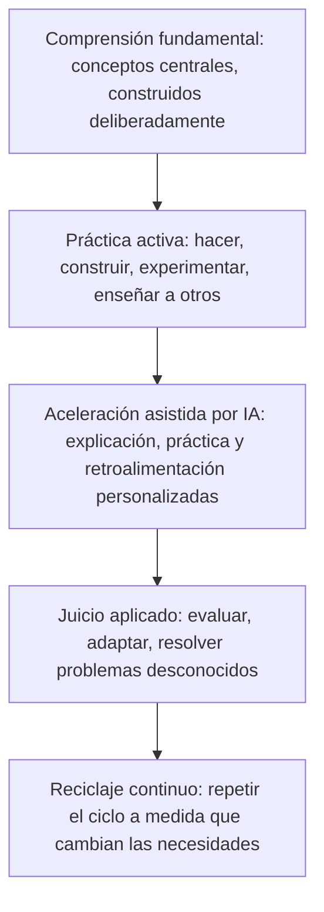

# Aprender de forma diferente: cómo deben evolucionar la enseñanza y el aprendizaje en la era de la IA y los agentes

## El verdadero cambio no es aprender menos, es aprender de forma diferente

Cada vez que una nueva tecnología facilita el acceso a la información, resurge la misma preocupación: ¿dejarán las personas de aprender por completo? Se suponía que las calculadoras harían innecesaria la aritmética. Se suponía que los buscadores harían innecesario recordar datos. La IA plantea ahora la misma pregunta, a una escala mucho mayor, porque puede explicar un concepto, redactar un ensayo, resolver un problema e incluso llevar a cabo tareas de varios pasos por su cuenta.

La preocupación es comprensible, pero interpreta mal lo que realmente está cambiando. La IA está transformando la rapidez con la que las personas pueden acceder a la información y producir un primer borrador de una respuesta. No está transformando el proceso subyacente mediante el cual un ser humano construye una comprensión real, desarrolla juicio o se vuelve capaz de resolver problemas que nunca antes había visto. Ese proceso sigue siendo lento, exige esfuerzo y sigue siendo profundamente humano.

{/* truncate */}

Esto importa para una amplia gama de personas: estudiantes que deciden cómo estudiar, personas que aprenden por su cuenta y desarrollan nuevas habilidades fuera de un aula, docentes y profesores que rediseñan sus cursos, líderes de escuelas y universidades que definen políticas, organizaciones de desarrollo de la fuerza laboral que preparan a las personas para trabajos en constante cambio, y profesionales que ahora necesitan reciclarse con más frecuencia que cualquier generación anterior.

El argumento de esta publicación es simple y, esperamos, tranquilizador: el futuro del aprendizaje no consiste en aprender menos porque la IA puede responder preguntas al instante. Consiste en aprender de forma diferente, más continua y más intencional. La IA puede ser uno de los amplificadores de aprendizaje más poderosos jamás creados, pero solo si las personas a su alrededor, estudiantes, docentes e instituciones, eligen usarla de esa manera.

---

## La memorización nunca fue el verdadero objetivo

Los sistemas educativos tradicionales surgieron en un mundo donde la información era escasa y lenta de alcanzar. Los libros eran costosos, las bibliotecas eran limitadas y era difícil acceder a expertos. En ese mundo, memorizar datos, fórmulas y procedimientos era genuinamente valioso, porque recordar información rápidamente era a menudo el cuello de botella para poder usarla.

Ese cuello de botella prácticamente ha desaparecido. Cualquier persona con un teléfono puede recuperar un dato, una fórmula o una explicación paso a paso en segundos. La IA acelera esto aún más, no solo recuperando información, sino sintetizándola, explicándola con la profundidad necesaria y adaptando la explicación al nivel actual de comprensión de la persona.

Esto no vuelve inútil el conocimiento fundamental. Convierte al simple recuerdo en una medida mucho más débil de si alguien realmente ha aprendido algo. Las preguntas más útiles han cambiado:

- ¿Puede esta persona reconocer cuándo un dato aplica a una situación nueva?
- ¿Puede juzgar si una respuesta, incluida una generada por IA, es correcta, razonable o peligrosa?
- ¿Puede combinar conocimientos de distintos dominios para resolver un problema para el cual nadie le entregó una plantilla?
- ¿Puede explicar su razonamiento con suficiente claridad para que otra persona, o un sistema de IA, pueda construir sobre él?

Ninguna de esas capacidades proviene de memorizar más contenido. Provienen del **juicio**: la capacidad de evaluar, aplicar y adaptar el conocimiento en condiciones reales y desordenadas. El juicio se construye mediante la práctica, la retroalimentación y la reflexión, no mediante la repetición de datos. Ese es el verdadero cambio que la educación necesita hacer, y ya era necesario incluso antes de que llegara la IA. La IA simplemente ha elevado mucho el costo de ignorarlo.

---

## Cómo aprende realmente la gente: no existe un único método correcto

Uno de los errores más persistentes, tanto en las aulas como en el aprendizaje autodirigido, es tratar el aprendizaje como si ocurriera de la misma manera para todos. No es así. Las personas absorben, procesan y retienen información a través de canales muy distintos, a menudo en combinación.

| Modo de aprendizaje | Cómo se ve | Qué construye bien |
|---|---|---|
| **Lectura** | Libros, artículos, documentación, explicaciones escritas | Profundidad, precisión, capacidad de revisar y consultar |
| **Video** | Clases grabadas, demostraciones, charlas grabadas | Comprensión visual y secuencial, control del ritmo |
| **Audio** | Podcasts, discusiones, explicaciones habladas | Aprender mientras se realizan otras tareas, retención narrativa |
| **Discusión** | Grupos de estudio, seminarios, debate estructurado | Poner a prueba la comprensión frente a otras perspectivas |
| **Práctica** | Ejercicios, repeticiones, aplicación reiterada | Fluidez, memoria muscular, velocidad |
| **Experimentación** | Probar variantes, poner a prueba hipótesis, curiosear | Intuición sobre causa y efecto, comodidad con el error |
| **Construcción de proyectos** | Aplicar conocimiento a un resultado real, de principio a fin | Integración de varias habilidades, juicio del mundo real |
| **Enseñar a otros** | Explicar un concepto hasta que otra persona lo entienda | La forma más profunda de dominio, expone los vacíos de comprensión |

Ninguna fila de esa tabla es la forma "correcta" de aprender. El aprendizaje más duradero suele provenir de combinar varias de ellas: leer para construir un modelo mental, practicar para lograr fluidez, construir un proyecto para integrar las piezas y enseñar a alguien más para revelar lo que aún no está firme.

Aquí es precisamente donde la IA puede ayudar sin reducir el aprendizaje a un solo método. Un tutor de IA bien diseñado puede ofrecer una explicación como texto, como ejemplo resuelto, como una serie de preguntas de práctica o como una conversación, dependiendo de lo que mejor funcione para cada persona. El peligro no es que la IA reemplace esta variedad. El peligro es diseñar el aprendizaje asistido por IA en torno a un solo modo, generalmente leer una respuesta generada, porque es lo más fácil de construir.

---

## Aprender haciendo: por qué la práctica sigue superando al consumo pasivo

Décadas de investigación sobre el aprendizaje apuntan a la misma conclusión desde distintos ángulos: las personas aprenden mucho más haciendo algo que observándolo o leyendo sobre ello. La práctica de recuperación, donde una persona intenta recordar o aplicar algo en lugar de simplemente releerlo, produce de forma consistente una comprensión más sólida y duradera que la revisión pasiva. El aprendizaje basado en proyectos, donde un concepto se aplica para construir algo real, tiende a producir una transferencia de conocimiento más profunda hacia situaciones nuevas que los ejercicios aislados.

La IA introduce aquí un riesgo real, y vale la pena nombrarlo directamente. Cuando una respuesta, un esquema de ensayo o un fragmento de código funcional puede generarse al instante, resulta tentador tratar ese resultado como la meta final en lugar de un punto de partida. Un estudiante que copia una explicación generada por IA sin trabajarla ha consumido información. No necesariamente ha aprendido algo duradero.

El patrón más saludable invierte la secuencia: intentar resolver el problema primero, aunque sea de manera imperfecta, y luego usar la IA para verificar el razonamiento, llenar vacíos u ofrecer un segundo enfoque. Esto preserva la lucha productiva que impulsa el aprendizaje real, mientras sigue entregando a los estudiantes una retroalimentación rápida y de alta calidad que antes requería un tutor, un mentor o mucho ensayo y error para obtener por cuenta propia.

Para quienes aprenden por su cuenta en particular, un hábito simple protege contra el consumo pasivo: **no le pidas la respuesta a la IA antes de haber escrito tu propio intento, aunque sea aproximado.** La comparación entre tu intento y la respuesta de la IA es donde ocurre el aprendizaje real, no la respuesta en sí misma.

---

## Aprendizaje personalizado y adaptativo: qué cambia realmente la IA

El aprendizaje personalizado no es una idea nueva. Los buenos docentes y tutores siempre han ajustado el ritmo, los ejemplos y la dificultad según la persona que tienen enfrente. Lo que ha faltado a gran escala es la capacidad de hacer esto para cada estudiante, en cada materia, en cada momento, sin necesitar una cantidad enorme de tutores humanos.

Aquí es donde la IA ofrece una capacidad genuinamente nueva. Los sistemas adaptativos pueden identificar exactamente dónde se quiebra la comprensión de un estudiante, ajustar en tiempo real la dificultad de los problemas de práctica, ofrecer explicaciones en un estilo distinto cuando la primera no resulta clara, y seguir el progreso durante semanas o meses de una manera que a un instructor humano le tomaría mucho más tiempo armar.

Bien utilizado, esto puede cerrar brechas que han persistido durante mucho tiempo: un estudiante que necesita más repetición antes de avanzar, una persona que entiende un concepto de forma visual pero no verbal, o un profesional que necesita repasar un tema fundamental antes de abordar algo avanzado.

La personalización tiene límites que vale la pena hacer explícitos. Los sistemas adaptativos son tan buenos como el modelo de aprendizaje que hay detrás de ellos, y un sistema que simplemente ofrece contenido más fácil cada vez que un estudiante tiene dificultades puede bajar silenciosamente las expectativas en lugar de construir capacidad. Una personalización efectiva debería ajustar *cómo* se enseña un concepto y *cuánto* apoyo se brinda, no *si* finalmente se espera que el estudiante alcance un dominio real. Las instituciones que adoptan herramientas adaptativas deberían preguntar directamente a los proveedores cómo define el sistema el progreso, y si está diseñado para construir independencia o simplemente para mantener a los estudiantes comprometidos.

---

## Tutores de IA, copilotos y sistemas agénticos en la educación

El cambio más interesante recientemente no es solo una IA que responde preguntas, sino una IA que puede actuar como un colaborador continuo a lo largo de todo un proceso de aprendizaje. Ya están surgiendo con claridad algunos roles:

**La IA como explicadora a demanda.** Disponible a cualquier hora, dispuesta a repetir una explicación de una forma distinta tantas veces como sea necesario, sin juicio ni impaciencia. Esto por sí solo elimina una barrera importante para los estudiantes que antes debían esperar la próxima clase o la próxima hora de consulta para desatascarse.

**La IA como socio socrático.** En lugar de simplemente entregar una respuesta, un tutor de IA bien diseñado puede hacer preguntas orientadoras, señalar vacíos en el razonamiento e impulsar al estudiante a llegar a una conclusión por sí mismo. Esto refleja una de las formas más efectivas de tutoría humana y puede incorporarse deliberadamente en la configuración de las herramientas de aprendizaje con IA.

**La IA como generadora de práctica.** Crea variaciones ilimitadas de problemas, cuestionarios y escenarios adaptados a lo que un estudiante específico necesita repasar más, algo que sería extremadamente lento de producir de forma individual para cada estudiante por parte de un instructor humano.

**Los sistemas agénticos como orquestadores del aprendizaje.** Esta es la capa más nueva y menos comprendida. Un sistema agéntico puede ir más allá de responder una sola pregunta y gestionar un plan de aprendizaje de varios pasos: evaluar el conocimiento actual, ordenar los temas, generar práctica, revisar el trabajo y ajustar el plan según los resultados, en gran medida por su cuenta. En un aula, esto podría verse como un agente que prepara sets de práctica diferenciados para toda una clase durante la noche. En la capacitación laboral, podría verse como un agente que construye una ruta de reciclaje personalizada según el rol actual de una persona y un rol objetivo, y luego hace seguimiento del progreso frente a esa ruta.

Ninguno de estos roles sustituye a un docente, mentor o experto en la materia. Sustituyen las partes de la enseñanza que son repetitivas, consumen mucho tiempo o son difíciles de escalar: generar material de práctica, ofrecer una primera explicación, hacer seguimiento del progreso de muchos estudiantes a la vez. Esa distinción es la diferencia entre la IA como amplificadora y la IA como reemplazo, y debería guiar cada decisión sobre cómo se adoptan estas herramientas.

---

## Por qué el conocimiento fundamental sigue importando cuando las respuestas son instantáneas

Podría parecer, a primera vista, que el acceso instantáneo a explicaciones reduce la necesidad de conocimiento fundamental. Ocurre lo contrario, y el razonamiento importa.

El conocimiento fundamental es lo que permite a una persona evaluar una respuesta generada por IA en lugar de simplemente aceptarla. Los sistemas de IA pueden ser fluidos y seguros de sí mismos mientras están equivocados, desactualizados o no encajan bien con la situación real. Una persona o profesional con bases sólidas puede detectar eso. Alguien sin ellas no puede, porque no tiene una base independiente para comparar.

El conocimiento fundamental también es lo que hace posible la creatividad y el pensamiento entre disciplinas. Las ideas genuinamente novedosas suelen surgir de recombinar conocimiento existente de una manera nueva, no de generar algo sin ningún punto de referencia. Cuanto más sólida sea la base de conceptos centrales de una persona, más material en bruto tendrá disponible para recombinar al enfrentar un problema desconocido.

Finalmente, el conocimiento fundamental es una forma de resiliencia. Los sistemas fallan, la conectividad se pierde, las herramientas cambian y el acceso no siempre está garantizado. Una persona que entiende los conceptos subyacentes puede razonar sin una herramienta frente a ella. Una persona que solo ha consumido respuestas generadas por IA, sin construir el modelo subyacente por sí misma, no tiene un respaldo cuando la herramienta no está disponible o se equivoca.

Nada de esto aboga por volver a la memorización por sí misma. Aboga por ser deliberado respecto a qué bases vale la pena construir en profundidad, y tratar a la IA como una forma de alcanzar y reforzar esas bases más rápido, no como un reemplazo de construirlas.

---

## Modernizar escuelas, colegios y universidades

Las instituciones educativas enfrentan un desafío de diseño genuino: cómo conservar las partes de la enseñanza que funcionan, mientras actualizan las partes que fueron construidas para un mundo donde el acceso a la información era el cuello de botella.

**Repensar la evaluación.** Las evaluaciones construidas principalmente en torno al recuerdo, exámenes a libro cerrado, respuestas cortas a preguntas factuales, son las más expuestas a la IA de maneras que socavan su valor. Las instituciones que trasladan más peso hacia el trabajo basado en proyectos, las defensas orales, la resolución de problemas en clase y los portafolios de trabajo aplicado crean evaluaciones que miden juicio y comprensión en lugar de la capacidad de producir una respuesta fluida, sin importar si esa fluidez provino del estudiante o de una herramienta.

**Enseñar alfabetización en IA de forma explícita, no solo el uso de la IA.** Los estudiantes necesitan aprender no solo cómo usar herramientas de IA, sino cómo evaluar sus resultados de forma crítica: reconocer respuestas seguras pero incorrectas, entender dónde los datos de entrenamiento de un modelo pueden estar desactualizados o sesgados, y saber cuándo una tarea realmente requiere juicio humano. Esto pertenece al currículo mismo, no debe dejarse a una exposición informal e inconsistente.

**Redefinir la integridad académica para un mundo con IA.** Las reglas construidas enteramente en torno a "no usar IA en absoluto" se están volviendo poco prácticas y, en muchos contextos, contraproducentes. Las políticas más claras y útiles distinguen entre usar la IA para entender un concepto, usarla para verificar el trabajo y usarla para eludir el aprendizaje por completo, con expectativas explícitas en lugar de asumidas.

**Invertir en los docentes, no solo en la tecnología.** Cada uno de estos cambios depende de docentes y profesores que tengan el tiempo, la capacitación y el apoyo para rediseñar sus cursos, no solo una nueva herramienta añadida sobre un currículo sin cambios. El desarrollo profesional enfocado en pedagogía consciente de la IA merece la misma prioridad institucional que la compra de la tecnología en sí.

**Preservar y fortalecer la interacción humana.** Las secciones de discusión, las horas de consulta, la mentoría y los proyectos colaborativos siguen siendo algunas de las partes de más alto valor de la educación formal precisamente porque no pueden ser replicadas por una herramienta. A medida que la explicación rutinaria y la generación de práctica se trasladan a la IA, las instituciones tienen la oportunidad de reinvertir el tiempo ahorrado en más contacto humano, no en menos.

---

## Reciclaje continuo: el aprendizaje como práctica de toda la carrera

Fuera de la educación formal, el argumento para aprender de forma diferente es igual de sólido, y probablemente más urgente. El ritmo al que habilidades específicas quedan obsoletas ha ido en aumento durante años, y la IA está acelerando esa tendencia en muchos campos a la vez, no solo en los técnicos.

Esto convierte el reciclaje continuo en una práctica de toda la carrera, en lugar de algo que ocurre entre un trabajo y otro. Varios cambios se derivan directamente de esa realidad:

**Aprender en ciclos más cortos y frecuentes.** Esperar un curso formal, un programa de grado o una iniciativa de capacitación de la empresa es demasiado lento cuando el panorama de habilidades subyacente puede cambiar en uno o dos años. Los ciclos de aprendizaje más cortos y enfocados, construidos en torno a una necesidad específica y actual, se ajustan mucho mejor a este ritmo que los programas largos y cargados por adelantado.

**Construir un sistema personal de aprendizaje, no solo consumir cursos.** Los profesionales que prosperan durante periodos de cambio acelerado suelen tener una forma repetible de identificar qué necesitan aprender, encontrar buenas fuentes, practicar deliberadamente y validar su propia comprensión, en lugar de depender por completo de la capacitación que se les ofrezca.

**Tratar a la IA como un compañero personal de aprendizaje.** Las mismas herramientas de IA que están transformando industrias pueden ayudar a un profesional a aprender precisamente las habilidades que esas industrias ahora exigen: explicar un concepto desconocido rápidamente, generar escenarios de práctica relevantes para un trabajo específico o resumir un tema técnico denso antes de una sesión de estudio más profunda. Usada así, la IA no solo cambia qué habilidades se necesitan. Se convierte en parte de cómo se construyen esas habilidades.

**Las organizaciones de desarrollo de la fuerza laboral tienen un rol distinto aquí.** Los programas construidos en torno a currículos estáticos, actualizados cada pocos años, se ajustan mal a este ritmo de cambio. Las organizaciones que tienen éxito en este entorno construyen rutas de aprendizaje modulares y acumulables que se pueden actualizar rápidamente, y que enseñan explícitamente la metahabilidad de aprender a aprender, ya que el contenido técnico específico seguirá cambiando bajo cualquier currículo.

---

## Equilibrar la mentoría humana, la colaboración y las herramientas impulsadas por IA

Ninguna de las capacidades descritas anteriormente elimina el valor de las relaciones humanas en el aprendizaje. Si acaso, aclaran para qué sirven esas relaciones.

Un mentor aporta un contexto que un sistema de IA no tiene: conocimiento de la cultura de una organización específica, retroalimentación honesta basada en una relación real, y el tipo de aliento que proviene de alguien que tiene un interés genuino en el crecimiento de una persona. Un grupo de pares aporta motivación, responsabilidad y el tipo de debate que agudiza el pensamiento de maneras que rara vez logra una interacción solitaria con una herramienta. Un docente o instructor aporta juicio sobre lo que un grupo específico de estudiantes necesita a continuación, informado por una experiencia a la que ningún modelo tiene acceso.

Las herramientas de IA funcionan mejor cuando asumen las partes del aprendizaje que son repetitivas, consumen mucho tiempo o son difíciles de escalar, liberando tiempo y atención humanos para las partes que dependen de la relación, el contexto y la experiencia vivida. Una prueba útil para cualquier herramienta de aprendizaje impulsada por IA es si está diseñada para crear más tiempo y espacio para la interacción humana, o si está diseñada para eliminar la necesidad de ella. La primera es amplificación. La segunda, en la mayoría de los contextos de aprendizaje, es un error.

---

## Un marco práctico para el futuro del aprendizaje

Al reunir las ideas anteriores, un marco simple puede guiar las decisiones tanto de estudiantes como de docentes e instituciones.

Cada capa depende de la que está debajo. Saltarse la comprensión fundamental para pasar directamente a la aceleración asistida por IA produce resultados que suenan fluidos sin un juicio real detrás. Saltarse la práctica activa a favor de solo consumir explicaciones de IA produce reconocimiento sin la capacidad de aplicar. El ciclo solo aumenta su valor cuando las cinco capas están presentes y se repiten con el tiempo, no cuando se tratan como una secuencia única.

| Capa | Rol del estudiante | Rol de la IA | Rol del docente o mentor |
|---|---|---|---|
| Comprensión fundamental | Construir un modelo mental funcional de los conceptos centrales | Explicar conceptos de múltiples maneras, con la profundidad adecuada | Definir qué es genuinamente fundamental para un campo dado |
| Práctica activa | Intentar problemas, construir proyectos, enseñar conceptos de vuelta | Generar práctica variada y retroalimentación instantánea | Diseñar tareas que requieran aplicación real, no recuerdo |
| Aceleración asistida por IA | Usar la IA para verificar, extender y llenar vacíos después de un intento genuino | Personalizar el ritmo, la dificultad y el estilo de explicación | Modelar un uso responsable de la IA que preserve el juicio |
| Juicio aplicado | Evaluar críticamente los resultados de la IA antes de confiar en ellos | Mostrar incertidumbre y enfoques alternativos | Evaluar la comprensión mediante trabajo aplicado y abierto |
| Reciclaje continuo | Tratar el aprendizaje como un hábito continuo, no un proyecto terminado | Identificar brechas de habilidades emergentes y sugerir próximos pasos | Apoyar a los estudiantes que regresan a construir nuevas bases |

---

## Recomendaciones para estudiantes y personas que aprenden por su cuenta

- **Intenta antes de preguntar.** Escribe tu propia respuesta o enfoque primero, luego usa la IA para verificar, ampliar o cuestionarlo. La comparación es donde ocurre el aprendizaje.
- **Combina tus modos de aprendizaje.** Combina lectura, práctica, construcción y explicación de conceptos a otra persona en lugar de depender de un solo formato.
- **Construye algo real, con regularidad.** Un proyecto terminado, por pequeño que sea, integra el conocimiento de una manera que los ejercicios aislados rara vez logran.
- **Enseña lo que aprendes.** Explicar un concepto, incluso a ti mismo por escrito, expone vacíos que la revisión pasiva oculta.
- **Trata a la IA como un tutor, no como un oráculo.** Pídele que explique su razonamiento, ofrezca enfoques alternativos y cuestione tus suposiciones, en lugar de solo pedir respuestas finales.
- **Convierte el aprendizaje en un hábito, no en un evento.** Las sesiones cortas y frecuentes enfocadas en necesidades actuales tienden a durar más que las largas e infrecuentes, especialmente a medida que las habilidades siguen cambiando.

## Recomendaciones para escuelas, colegios, universidades y programas de fuerza laboral

- **Rediseñar la evaluación en torno al juicio aplicado.** Favorecer proyectos, defensas orales y problemas abiertos por sobre evaluaciones que principalmente miden el recuerdo.
- **Enseñar alfabetización en IA como habilidad central.** Ayudar a los estudiantes a evaluar críticamente los resultados de la IA, no solo a operar herramientas de IA con competencia.
- **Actualizar las políticas de integridad académica con distinciones claras y realistas.** Definir cómo se ve el uso responsable de la IA para cada tipo de tarea, en lugar de depender de prohibiciones generales difíciles de aplicar y fáciles de malinterpretar.
- **Invertir en los docentes tanto como en las herramientas.** Dar a los docentes y profesores tiempo y apoyo reales para rediseñar sus cursos en torno a estos cambios, no solo acceso a nuevo software.
- **Proteger y ampliar la interacción humana.** Usar el tiempo ahorrado mediante la calificación, explicación y generación de práctica asistidas por IA para invertir en mentoría, discusión y trabajo colaborativo.
- **Construir currículos modulares y actualizables.** Especialmente en el desarrollo de la fuerza laboral, diseñar rutas de aprendizaje que puedan actualizarse rápidamente a medida que cambian las necesidades de habilidades, en lugar de reconstruirse desde cero cada pocos años.

---

## Aprender de forma diferente, no menos

La IA ha cambiado de forma permanente la rapidez con la que las personas pueden acceder a la información y el apoyo disponible mientras aprenden algo nuevo. No ha cambiado la naturaleza subyacente del aprendizaje en sí: un proceso lento, que exige esfuerzo y es profundamente humano, de construir comprensión, ponerla a prueba frente a la realidad y ajustarla según lo que ocurra.

Las instituciones, los programas y las personas que más se beneficien de este momento no serán quienes aprendan menos porque la IA puede responder más rápido. Serán quienes usen esa velocidad para dedicar más tiempo a las partes del aprendizaje que realmente construyen juicio: practicar, construir, discutir, enseñar y aplicar el conocimiento a problemas para los cuales nadie les entregó una plantilla.

El futuro del aprendizaje no es más pequeño. Es diferente, más continuo y, si se hace bien, considerablemente más intencional que lo que existía antes.
