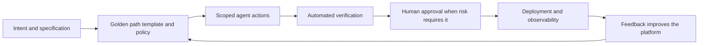

# Rutas doradas para agentes: por qué la ingeniería de plataformas es la capa que falta

## Los agentes no eliminan la fricción de la entrega

Los agentes de IA pueden leer un repositorio, escribir código, ejecutar pruebas y abrir una solicitud de extracción. Es una capacidad impresionante, pero no hace que el sistema de ingeniería que los rodea sea más fácil de navegar. Hace que cada inconsistencia de ese sistema sea más fácil de reproducir a gran velocidad.

Un agente con acceso a un entorno grande y sin documentación enfrenta las mismas preguntas que un ingeniero nuevo: ¿qué plantilla está aprobada? ¿Cómo se implementa un servicio? ¿De dónde vienen los secretos? ¿Qué comprobaciones son obligatorias? ¿Quién es responsable de esta dependencia? ¿Qué es seguro cambiar? Un modelo capaz puede inferir algunas respuestas, pero la inferencia no es un modelo operativo confiable para software de producción.

{/* truncate */}

Por eso la conversación sobre agentes no puede terminar en prompts, modelos o instrucciones de repositorio. La capa que falta es la **ingeniería de plataformas**: la disciplina de crear productos internos que hacen que la manera segura y respaldada de entregar software sea la más sencilla.

Para los desarrolladores humanos, esa capa reduce la carga cognitiva. Para los agentes, convierte un contexto vago en una ruta ejecutable. El resultado no es un agente con acceso sin restricciones a todo. Es un agente que puede avanzar de forma útil mediante flujos de trabajo conocidos, observables y gobernados.

---

## Qué es realmente una ruta dorada

Una ruta dorada no es una presentación que indica a los equipos qué herramientas deberían usar. Es un camino pavimentado para una tarea de ingeniería frecuente, con las elecciones preferidas ya conectadas.

Por ejemplo, una ruta dorada para una nueva API podría proporcionar:

- Una plantilla de servicio mantenida con registros, comprobaciones de estado y valores predeterminados seguros.
- Una forma estándar de solicitar e inyectar configuración sin exponer secretos.
- Un flujo de CI que ejecuta las pruebas requeridas, comprobaciones de seguridad y validación de políticas.
- Una ruta de implementación con propiedad, reversión y observabilidad integradas.
- Documentación que explica los límites y las alternativas compatibles.

La palabra *dorada* no significa obligatoria ni universal. Los equipos tendrán razones legítimas para salir de la ruta. Significa que la ruta se mantiene, prueba e intencionalmente resulta más fácil que reconstruir las mismas decisiones desde cero.

Esa distinción importa aún más para los agentes. Un agente no puede beneficiarse de una preferencia organizacional que existe solo en conversaciones informales, conocimiento tribal o una página wiki actualizada por última vez hace dos años. Necesita interfaces, plantillas, políticas y retroalimentación disponibles en el lugar donde trabaja.

---

## Por qué los agentes necesitan caminos pavimentados, no más permisos

El primer impulso cuando un agente tiene dificultades suele ser conceder otro permiso, agregar otra herramienta o ampliar su ventana de contexto. A veces es necesario. Más a menudo, es una señal de que el flujo de trabajo mismo no está claro.

El acceso sin límites crea varios problemas:

| Problema | Lo que ve el agente | Lo que debe proporcionar la plataforma |
|---|---|---|
| Demasiados patrones válidos | Varias formas de crear, probar o implementar un servicio | Una plantilla compatible y un flujo predeterminado |
| Dependencias ocultas | Credenciales, aprobaciones y propiedad fuera del repositorio | Interfaces de autoservicio con políticas explícitas |
| Calidad ambigua | Las comprobaciones varían por equipo o se realizan manualmente | Puertas de verificación reutilizables |
| Retroalimentación débil | Los fallos aparecen tarde y sin contexto útil | Señales rápidas y accionables en cada etapa |
| Amplio radio de impacto | Una tarea local puede afectar accidentalmente sistemas no relacionados | Credenciales con alcance limitado y límites protegidos |

Dar más permisos a un agente puede permitirle superar un paso bloqueado, pero no hace que ese paso sea más seguro, repetible o comprensible. Una ruta dorada aborda el problema subyacente. Restringe las decisiones que deben restringirse y expone las decisiones que realmente requieren juicio humano.

Este es el mismo principio que hizo valiosas la integración continua y la infraestructura como código. La estandarización no es burocracia cuando elimina decisiones repetitivas y hace visibles las decisiones importantes.

---

## La plataforma preparada para agentes

Una plataforma interna de desarrolladores está preparada para agentes cuando sus capacidades pueden ser utilizadas tanto por personas como por software. Un portal pulido ayuda a las personas, pero un portal por sí solo no basta. Los agentes también necesitan contratos legibles por máquinas e interfaces confiables.

Cinco elementos son los más importantes:

### 1. Puntos de partida con opinión

Las plantillas, implementaciones de referencia y herramientas de andamiaje codifican la arquitectura preferida de la organización. Deben incluir los elementos no negociables: identidad, telemetría, gestión de dependencias, pruebas, metadatos de implementación y propiedad. Un agente que comienza con una plantilla confiable tiene menos oportunidades de inventar una versión casi correcta de una práctica establecida.

### 2. Contexto legible por máquinas

Las instrucciones, especificaciones, contratos de API, catálogos de servicios y definiciones de políticas deben vivir junto al trabajo o estar disponibles mediante interfaces estables. No es documentación por la documentación misma. Es el contexto que un agente utiliza para elegir el repositorio correcto, comprender los límites y saber cuándo detenerse.

### 3. Autoservicio con alcance limitado

Los agentes deben poder solicitar las capacidades que requiere su tarea sin recibir acceso permanente a sistemas no relacionados. Una plataforma puede intermediar credenciales temporales, entornos aprobados y acciones controladas. El objetivo es simplificar las acciones seguras y mantener deliberadamente restringidas las acciones de alto impacto.

### 4. La verificación como capacidad de producto

Las compilaciones, pruebas, comprobaciones de seguridad, comprobaciones de accesibilidad, controles de políticas y vistas previas de implementación no son solo pasos de una canalización. Son la evidencia de que la salida del agente puede avanzar con seguridad. Cuanto más rápidas y claras sean esas señales, más eficaces serán los agentes y los revisores.

### 5. Ciclos de retroalimentación observables

Cada ruta dorada debe producir telemetría útil: adopción, tiempo de entrega, razones de fallos, tasa de reversión y los puntos donde personas o agentes abandonan la ruta. Sin esta retroalimentación, un equipo de plataforma no puede saber si redujo la fricción o simplemente la trasladó a un lugar menos visible.

---

## Una ruta dorada es un contrato de delegación

Cuando una persona delega trabajo a un agente, la plataforma debe hacer explícito el contrato. ¿Cuál es el resultado deseado? ¿Qué recursos puede usar el agente? ¿Qué comprobaciones deben aprobarse? ¿Qué necesita aprobación? ¿Cómo se observará el resultado después de la implementación?

Esto es más que automatización de flujos de trabajo. Crea un modelo operativo compartido para colaboradores humanos, agentes y los sistemas que ambos utilizan. La plataforma gestiona la mecánica repetible. Las personas conservan la propiedad de la intención, las decisiones de riesgo y los resultados.

El modelo también mejora la responsabilidad. Cuando un agente crea un cambio mediante una ruta dorada, la organización puede responder preguntas útiles: ¿qué plantilla utilizó, qué políticas aplicaron, qué identidad lo autorizó, qué evidencia aprobó y quién aprobó la publicación? Es difícil reconstruir esas respuestas cuando cada agente sigue una ruta improvisada.

---

## Empieza con un problema repetido

La ingeniería de plataformas no requiere un programa de varios años ni un portal interno completo antes de crear valor. Empieza donde la entrega es frecuente, costosa e inconsistente.

Buenos candidatos incluyen:

- Crear un servicio nuevo con valores predeterminados listos para producción.
- Agregar una dependencia que requiere revisión de seguridad y licencia.
- Aprovisionar un entorno de vista previa para una solicitud de extracción.
- Implementar un trabajo programado con monitoreo y un responsable claro.
- Rotar un secreto sin copiar credenciales en la configuración local.

Elige un flujo de trabajo, identifica las decisiones que deben estandarizarse y crea una ruta que funcione primero para un desarrollador. Después, haz que esa ruta sea invocable y comprensible para un agente. Mide si los usuarios llegan a un resultado seguro más rápido, si los fallos son más fáciles de diagnosticar y si los revisores dedican menos tiempo a redescubrir los mismos requisitos.

Evita tratar la plataforma como un catálogo de herramientas. Una lista de servicios disponibles no resuelve un problema de entrega. La unidad valiosa del trabajo de plataforma es un recorrido completo desde la intención hasta un resultado verificado.

---

## El objetivo es una autonomía mejor

La promesa de los agentes no es que puedan operar sin restricciones. Es que pueden asumir más trabajo de ejecución mientras las personas se concentran en la intención, el diseño, la revisión y la responsabilidad. Esa promesa solo se cumple cuando el entorno les da una forma confiable de actuar.

Las rutas doradas son la forma en que las organizaciones convierten su conocimiento de ingeniería ganado con esfuerzo en un producto. Empaquetan valores predeterminados seguros, estándares de entrega y lecciones operativas en rutas que los desarrolladores quieren usar porque ahorran tiempo. Dan a los agentes la misma ventaja, con límites más claros y evidencia más sólida.

Por tanto, la ingeniería de plataformas no es una preocupación de apoyo para la era de los agentes. Es la capa que hace práctica la autonomía segura de los agentes. Construye primero los caminos pavimentados y tanto las personas como los agentes podrán avanzar más rápido sin perder el control.
