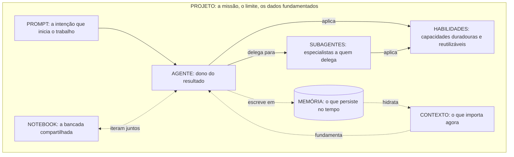

# Dominar a IA generativa: a arquitetura de um sistema de inteligência

_Oito blocos de construção que transformam um modelo capaz em um sistema que entrega trabalho real: agentes, subagentes, habilidades, contexto, memória, prompts, notebooks e projetos._

A maioria acredita que está usando IA generativa quando abre uma janela de chat e digita uma pergunta. Está usando a parte menos interessante de tudo isso. O chat é a porta de entrada, não a casa.

{/* truncate */}

O reenquadramento que importa é este: um modelo que responde perguntas é uma funcionalidade. Um sistema que persegue resultados é uma categoria diferente. O primeiro é um chatbot. O segundo é um **sistema de inteligência**, e a diferença entre os dois não são modelos maiores. É arquitetura.

A capacidade bruta está virando commodity em alta velocidade. Qualquer modelo sério já escreve código, resume um documento e rascunha um plano. Não é mais ali que mora a vantagem. A vantagem mora em como você monta essa capacidade em algo que lembra, se especializa, se fundamenta nos seus dados e coordena o próprio trabalho. Essa montagem tem partes, e as partes têm nome. Este artigo é o modelo mental que as conecta.

---

## O marco unificador: a inteligência como sistema operacional

Pare de imaginar um gênio dentro de uma caixa. Imagine uma equipe de alto desempenho trabalhando dentro de um espaço de trabalho bem definido.

Uma equipe tem pessoas donas dos resultados, especialistas a quem recorre quando preciso, manuais compartilhados que todos seguem, consciência da situação à sua frente, conhecimento institucional que sobrevive à rotatividade, atribuições claras, uma bancada onde as ideias são testadas e uma missão com limites. Um sistema de inteligência tem exatamente as mesmas partes. Só damos a elas nomes diferentes.

Este é o mapa completo:

| Bloco de construção | O que é | Sua função no sistema |
|---|---|---|
| **Prompt** | Uma declaração estruturada de intenção | Coloca o trabalho em movimento |
| **Agente** | Uma unidade autônoma dona de um resultado | Decide, age e verifica |
| **Subagente** | Um especialista delimitado a quem um agente delega | Traz profundidade sem poluir o fluxo principal |
| **Habilidade** | Uma capacidade empacotada e reutilizável | Codifica a experiência para aplicá-la de forma consistente |
| **Contexto** | A informação relevante neste momento | Fundamenta o trabalho na situação atual |
| **Memória** | Informação que persiste ao longo do tempo | Permite que o sistema aprenda em vez de recomeçar |
| **Notebook** | Um espaço de trabalho compartilhado e iterativo | Onde humanos e agentes pensam juntos |
| **Projeto** | A missão, o limite e os dados fundamentados | Contém tudo e define o que está no escopo |

O diagrama abaixo é o modelo que convém manter na cabeça. Leia-o como um único espaço de trabalho (o projeto) dentro do qual a intenção flui para um agente, o agente delega e aplica habilidades, enquanto o contexto e a memória alimentam e registram o trabalho de forma contínua.

Agora vamos percorrer cada bloco: o que é, o papel que cumpre e como interage com os demais. A ordem é uma narrativa, da faísca da intenção até o limite que contém todo o sistema.

---

## Prompts: intenção, não encantamento

Um prompt é uma declaração de intenção. Essa é a definição inteira, e boa parte da confusão nesta área vem de esquecê-la.

O equívoco popular é que escrever prompts é um saco de truques: frases mágicas, aberturas de interpretação de papéis e ameaças que supostamente arrancam respostas melhores do modelo. Isso é folclore. Os prompts que se sustentam são os que comunicam a intenção com precisão: o objetivo, as restrições, as entradas, a definição de pronto. Um bom prompt parece menos um feitiço e mais uma pequena especificação. Desenvolvi esse argumento a fundo em [De prompts a especificações](/blog/from-prompts-to-specifications), e é a base sobre a qual tudo o mais se apoia.

Este é o papel que um prompt realmente cumpre: é a interface entre a intenção humana e a ação da máquina. Em um sistema de inteligência, um prompt raramente viaja sozinho. Chega carregando contexto, é interpretado por um agente e é moldado pela memória e pelas habilidades disponíveis no projeto. As mesmas palavras produzem resultados radicalmente diferentes conforme o que as cerca.

O erro a evitar é tratar o prompt como se fosse o sistema inteiro. Há equipes que investem semanas ajustando prompts enquanto ignoram o contexto em que esse prompt é executado e a memória da qual ele poderia tomar. Isso é otimizar a pergunta enquanto se mata de fome a resposta. Um prompt preciso sem contexto é uma pergunta precisa gritada em uma sala vazia.

---

## Agentes: a unidade dona de um resultado

Um agente é uma unidade autônoma dona de um resultado. A palavra-chave é *dona*. Um chatbot responde a um turno. Um agente persegue um objetivo: planeja, age, observa os resultados, corrige o rumo e decide quando o trabalho está realmente concluído.

Este é o salto de responder para realizar. Peça a um modelo que "resuma este relatório" e você recebe texto. Dê a um agente o objetivo "produza o relatório semanal de riscos e sinalize qualquer coisa que exija uma decisão executiva" e ele precisa recuperar os documentos certos, aplicar julgamento, usar ferramentas e montar um resultado que atenda a um padrão. O agente é o ator do sistema, aquilo que transforma intenção em trabalho concluído.

Um agente interage com tudo o mais: lê o **contexto** para entender a situação, recorre à **memória** para não reaprender o que já sabe, aplica **habilidades** para executar passos especializados de forma confiável e delega a **subagentes** quando uma tarefa exige uma profundidade que ele não deveria lidar em linha. O prompt define sua direção. O projeto traça seu limite.

A falha típica aqui é o monólito: um agente gigante com um conjunto de instruções inchado a quem se pede fazer tudo. Funciona em demos e desmorona em produção, porque uma única janela de contexto não consegue sustentar um processo de negócio inteiro sem perder o fio. Os sistemas reais se decompõem. E é exatamente por isso que existem os subagentes.

---

## Subagentes: a delegação como princípio de design

Um subagente é um especialista delimitado que um agente chama para resolver uma tarefa bem definida. Se o agente é o líder, os subagentes são os especialistas que ele convoca para uma pergunta específica e depois libera.

A razão pela qual os subagentes importam não é organização prolixa. É uma restrição dura de como esses sistemas funcionam: a atenção e o contexto são finitos. Quando um agente líder tenta pesquisar, escrever, testar e revisar dentro de uma única conversa, cada uma dessas preocupações compete pelo mesmo espaço de trabalho limitado, e a qualidade se degrada. Delegar uma tarefa autocontida a um subagente dá a essa tarefa seu próprio espaço novo para trabalhar. O subagente se aprofunda, devolve um resultado limpo e o agente líder se mantém focado no resultado de que é dono. Explorei como compor equipes desses agentes em [Construa sua equipe de agentes de IA](/blog/building-your-ai-agent-team).

Pense em um fluxo de desenvolvimento. O agente líder está implementando uma funcionalidade. Ele despacha um subagente de exploração para mapear como funciona um módulo desconhecido, e um subagente de testes para escrever e executar a suíte de verificação. Cada subagente consome uma grande quantidade de raciocínio intermediário que o líder nunca precisa ver. O que volta é um resumo: "é assim que o módulo funciona" e "estes são os resultados". O líder se mantém limpo, orientado e eficaz.

Os subagentes interagem com as habilidades (muitas vezes existem para aplicar uma em profundidade), com o contexto (recebem uma fatia focada, não o mundo inteiro) e com o agente líder por meio de uma entrega estreita e bem definida. Bem usados, são a forma como um sistema escala além do que qualquer agente individual conseguiria sustentar na cabeça.

---

## Habilidades: capacidade que você pode reutilizar

Uma habilidade é uma capacidade empacotada e reutilizável: um procedimento definido, com o conhecimento e os passos para executá-lo, que qualquer agente pode aplicar. Se um prompt é um pedido pontual, uma habilidade é uma competência que o sistema conserva.

Esta é a diferença entre explicar como fazer algo toda vez e ensinar uma única vez. Sem habilidades, a experiência vive em quem escreveu o melhor prompt, e evapora quando a conversa se fecha. Com habilidades, essa experiência se torna um ativo duradouro e versionado. "Como classificamos um ticket de suporte", "como formatamos um relatório de conformidade", "como executamos nossa lista de implantação": cada uma se torna uma habilidade que um agente invoca em vez de um processo que ele improvisa.

O poder das habilidades é a composição. A mesma habilidade pode ser aplicada por muitos agentes e muitos subagentes. Uma única habilidade pode ser melhorada uma vez e elevar imediatamente a qualidade de todos os fluxos que a usam. As habilidades interagem com os agentes (que decidem quando aplicá-las), com o contexto (que fornece os detalhes sobre os quais a habilidade opera) e com a memória (que pode refinar com o tempo como uma habilidade é usada).

O erro é tratar as habilidades como scripts descartáveis em vez de ativos governados e compartilhados. Quando as habilidades estão dispersas e são pessoais, você obtém a mesma fragmentação que os gerenciadores de pacotes resolveram um dia para as dependências de código: todos reinventam a mesma capacidade de forma ligeiramente diferente, e a qualidade é uma loteria.

---

## Contexto: consciência situacional no momento

O contexto é a informação relevante neste momento. Não tudo o que o sistema sabe, apenas o que importa para a tarefa à sua frente: o documento atual, os registros relevantes, o estado da conversa, os dados recuperados para esta decisão específica.

O contexto é o bloco mais subestimado de todo o modelo, e a causa da maioria dos resultados decepcionantes. Um modelo sem contexto é brilhante e cego. Raciocina maravilhosamente sobre nada em particular. O salto de qualidade quase nunca vem de um prompt melhor. Vem de colocar a informação certa diante do modelo no momento certo. Na empresa isso tem um nome: fundamentação (grounding). Você conecta o sistema aos seus dados, recupera os trechos que importam e deixa o modelo raciocinar sobre a realidade em vez de sobre seu treinamento genérico.

Mas o contexto tem um fio, e ele corta no sentido contrário ao que as pessoas supõem. O instinto é colocar tudo, sob a teoria de que mais informação é mais seguro. Não é. Um contexto sobrecarregado enterra o sinal que importa sob o ruído, e a qualidade cai. A disciplina do contexto é a curadoria: recuperar exatamente o relevante e nada mais. O contexto interage com a memória (que decide o que vale a pena trazer ao momento), com os prompts (aos quais ele fundamenta) e com os agentes (que agem sobre ele).

Esta é a regra que vale a pena memorizar: a maioria dos problemas de "a IA deu uma resposta ruim" não são falhas de raciocínio. São falhas de contexto.

---

## Memória: aprender ao longo do tempo

A memória é informação que persiste ao longo do tempo, além de uma única tarefa ou conversa. Se o contexto é o que está sobre a mesa agora, a memória é o arquivo, o conhecimento institucional, a relação que se aprofunda a cada interação.

Sem memória, cada sessão começa do zero. O sistema te conhece permanentemente pela primeira vez, reaprende suas convenções, repete perguntas que você já respondeu, esquece a decisão que ajudou você a tomar ontem. É inteligência com amnésia, e coloca um teto no valor de tudo o mais. Com memória, o sistema se acumula. Lembra suas preferências, suas decisões passadas e as razões por trás delas, as correções que você fez, a forma como seu domínio realmente funciona.

A memória e o contexto são parceiros, não sinônimos, e confundi-los é um erro comum e custoso. A memória é o armazém duradouro. O contexto é o conjunto de trabalho extraído dela para a tarefa atual. A memória hidrata o contexto: decide o que do registro de longo prazo vale a pena trazer ao momento presente. Os agentes escrevem na memória à medida que trabalham, de modo que o sistema que atender a uma tarefa na próxima semana seja mais inteligente que o que a atendeu hoje. Esse ciclo de retroalimentação, escrever e lembrar, é o que separa uma ferramenta que você opera de um sistema que aprende.

O erro é pular a memória por completo porque ela é mais difícil de construir que um prompt. Há equipes que lançam sistemas sem estado e depois se perguntam por que a experiência parece superficial e por que os usuários nunca desenvolvem confiança. A confiança se constrói sobre ser lembrado.

---

## Notebooks: a bancada compartilhada

Um notebook é um espaço de trabalho compartilhado e iterativo onde humanos e agentes pensam juntos. Não é um registro de chat que rola para cima e não é software acabado. É a bancada onde o trabalho é composto, executado, inspecionado e refinado, com o raciocínio à vista.

O papel do notebook é tornar o processo legível. Em um chat, a conversa se desvanece para cima e os passos se misturam. Em um notebook, a intenção, o código, os resultados e os comentários convivem lado a lado como artefatos duradouros que você pode reexecutar, ajustar e construir em cima. Aqui é onde o humano permanece no ciclo, não como espectador que assiste a um agente trabalhar, mas como colaborador que pode inspecionar um passo, mudar uma suposição e executá-lo de novo. É o habitat natural dos padrões de colaboração que descrevi em [Humanos e agentes](/blog/humans-and-agents-collaboration-patterns).

Os notebooks interagem com quase tudo: os agentes trabalham dentro deles, as habilidades são aplicadas e testadas neles, o contexto é carregado e examinado neles, e os resultados que se comprovam podem ser promovidos a habilidades duradouras ou fluxos de produção. O notebook é onde a experimentação se torna entendimento.

O erro é deixar o trabalho valioso morrer no notebook. Um notebook é para iterar, não para a permanência. Quando algo que você descobriu ali se mostra útil, deveria se formar: em uma habilidade, nas instruções de um agente, no próprio projeto. Um notebook cheio de ideias que nunca são promovidas é uma bancada cheia de peças prontas que ninguém instala.

---

## Projetos: o limite que o transforma em um sistema

Um projeto é a missão, o limite e os dados fundamentados que mantêm tudo o mais unido. É o contêiner. Cada um dos outros blocos, os prompts, os agentes, os subagentes, as habilidades, o contexto, a memória, os notebooks, vive dentro de um projeto e recebe seu sentido dele.

O projeto é o que marca a diferença entre um assistente engenhoso e um sistema em que se pode confiar para trabalho real. Define o escopo: o que está dentro dos limites e o que não está. Define a fundamentação: a quais dados o sistema está conectado e sobre quais tem permissão para raciocinar. Define os ativos compartilhados: os agentes e as habilidades disponíveis, a memória que se acumula, as convenções que todos seguem. Um projeto transforma um monte de partes capazes em um todo coerente com um propósito. Este é o espírito de construir software para sistemas, não para sessões, que destrinchei em [Projetar software para um mundo agêntico](/blog/designing-software-agent-first-world).

Na prática, o projeto é onde mora a governança, e a governança é o que torna possível a adoção empresarial. Os limites não são burocracia. São o que permite dar a um sistema acesso a dados reais e ações reais sem perder o controle de nenhum dos dois. O projeto é onde você decide o que o sistema tem permissão para saber, o que tem permissão para fazer e por quê é responsável.

O erro é operar sem um: agentes sem limite, puxando de tudo, fundamentados em nada em particular, responsáveis perante nenhum escopo definido. Isso não é um sistema. É uma vulnerabilidade com boa gramática.

---

## A orquestração é o ponto central

Esta é a tese que todo o modelo busca entregar: o valor não está nos blocos. Está em como eles são coordenados. Um sistema de inteligência não são oito funcionalidades parafusadas juntas. É um único fluxo orquestrado.

Veja as partes se moverem juntas em um único cenário empresarial. Uma equipe precisa preparar um relatório para a renovação de uma conta.

1. O **projeto** prepara o palco. É o espaço de trabalho da conta, fundamentado nos dados de uso do cliente, em seu histórico de suporte e nos manuais da equipe. Define o que está no escopo e o que o sistema pode tocar.
2. Um **prompt** declara a intenção: produza um relatório de renovação e sinalize qualquer risco que exija a decisão de um líder.
3. Um **agente** assume a posse desse resultado. Não apenas responde. Ele planeja o trabalho.
4. Ele delega a **subagentes**: um extrai e analisa as tendências de uso, outro varre o histórico de suporte em busca de atrito não resolvido. Cada um trabalha em seu próprio espaço focado e devolve um resultado limpo.
5. Ao longo do processo, os agentes aplicam **habilidades**: a forma padrão como a organização avalia a saúde de uma conta e rascunha um relatório executivo, aplicada de forma consistente em vez de improvisada.
6. Tudo está fundamentado no **contexto**: os dados reais desta conta específica, recuperados com precisão, não um modelo genérico.
7. O trabalho recorre à **memória**: o que a equipe aprendeu sobre esta conta no trimestre passado, as preocupações levantadas antes, os compromissos assumidos. E escreve de volta, para que o próximo trimestre comece com vantagem.
8. Uma pessoa revisa e refina em um **notebook**, ajustando a ênfase, corrigindo uma nuance, aprovando o resultado.

Nenhum bloco sozinho fez algo milagroso. O resultado (um relatório fundamentado e confiável produzido em uma fração do tempo habitual) veio da coordenação. Tire qualquer um dos blocos e ele se degrada: sem memória, esquece a relação; sem contexto, alucina os detalhes; sem subagentes, o líder se afoga na profundidade; sem projeto, não tem sequer direito aos dados.

Esta é a mudança de mentalidade que o domínio exige. Pare de perguntar "o que o modelo consegue fazer?" Comece a perguntar "como orquestro esses blocos em um fluxo que produza o resultado?" A primeira pergunta tem mais ou menos a mesma resposta para todos. A segunda é onde se constroem os sistemas reais, e a vantagem real.

---

## Os erros que mantêm os sistemas na superfície

Os fracassos nesta área são notavelmente consistentes. Quase todos vêm de superinvestir em um bloco enquanto se negligencia o sistema.

- **Idolatrar o prompt.** Tratar a redação do prompt como a habilidade mestra enquanto se ignora o contexto em que ele é executado e a memória que ele poderia usar. Um prompt perfeito sobre um contexto vazio continua sendo uma resposta vazia.
- **Confundir o modelo com o sistema.** Acreditar que um modelo mais capaz elimina a necessidade de arquitetura. Faz o oposto. Um motor mais potente faz a boa orquestração valer mais, não menos.
- **Construir o monólito.** Um agente inchado a quem se pede fazer tudo, em vez de um líder que delega a subagentes focados. Parece bom em demo e falha sob carga real.
- **Pular a memória.** Lançar sistemas sem estado que conhecem o usuário pela primeira vez a cada sessão, e depois se perguntar por que a confiança nunca se forma.
- **Matar de fome ou inundar o contexto.** Dar ao modelo nada em que se fundamentar, ou enterrar o sinal sob tudo o que você conseguiu encontrar. Ambos produzem respostas ruins por razões opostas.
- **Tratar as habilidades como rascunho.** Deixar a capacidade viver em prompts pessoais em vez de ativos compartilhados e versionados, de modo que a qualidade vira uma loteria e nada se acumula.
- **Operar sem um projeto.** Sem limite, sem fundamentação, sem responsabilidade. Capaz, conectado e sem governança não é uma funcionalidade. É uma exposição.

Repare no padrão. Cada um destes é uma falha de coordenação disfarçada de problema de capacidade. O modelo raramente é o gargalo. A arquitetura ao seu redor quase sempre é.

---

## Como o domínio se parece daqui em diante

A primeira era da IA generativa premiou o prompt engenhoso. Essa era está terminando. A redação que parecia uma vantagem competitiva está virando o mínimo, porque os modelos estão absorvendo essa engenhosidade em seus comportamentos padrão.

A próxima era premia uma habilidade diferente: a capacidade de compor. As pessoas e as organizações que tomarem a dianteira serão as que pensam como arquitetos de inteligência, as que projetam como agentes, subagentes, habilidades, contexto, memória, prompts, notebooks e projetos se encaixam em sistemas que aprendem, se especializam e se mantêm fundamentados na realidade. As aplicações que definirão a próxima década não nascerão de um prompt. Serão montadas, com o mesmo rigor que aplicamos a qualquer sistema de software sério.

Então esta é a conclusão que vale a pena guardar. A IA generativa não é um chatbot que você consulta. É um sistema que você arquiteta. O domínio não é conhecer as palavras mágicas. É conhecer os blocos de construção, e saber como fazê-los funcionar como um só. O modelo é a parte fácil. O sistema é o jogo inteiro.
