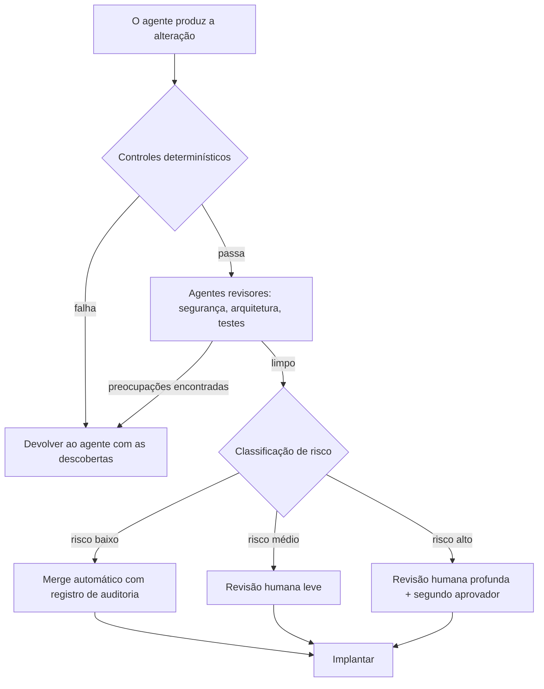

# Fadiga do revisor: quando os agentes escrevem mais código do que os humanos conseguem ler

## O gargalo se moveu e a maioria das equipes não percebeu

Por décadas, escrever código foi a parte cara. Lê-lo era quase de graça em comparação. Um desenvolvedor passava horas produzindo uma alteração e um revisor passava minutos confirmando-a. Essa proporção moldou tudo: nossas ferramentas, nossos processos e nossa noção de quem estava ocupado e quem estava esperando.

Os agentes inverteram essa proporção. Um agente capaz agora produz uma branch completa com código, testes e documentação no tempo que leva para escrever uma boa descrição da tarefa. Escrever ficou barato. Ler não.

{/* truncate */}

O resultado é um acúmulo silencioso. Os pull requests chegam mais rápido do que qualquer humano consegue absorver. A fila cresce. O revisor, que costumava ser a parte rápida do ciclo, agora é a parte lenta. A restrição não desapareceu quando escrever ficou mais rápido. Ela simplesmente se deslocou para o único lugar que não acelerou: a pessoa que precisa entender, verificar e assumir a responsabilidade pela alteração.

Isso é a fadiga do revisor, e é o gargalo que define a engenharia de software agêntica. Este artigo se concentra no humano ao final de todos esses pipelines e em como manter essa pessoa eficaz quando o volume de trabalho que chega até ela continua crescendo.

---

## A assimetria que ninguém orçou

Escrever e revisar não são imagens espelhadas da mesma tarefa. Elas impõem demandas muito diferentes ao cérebro, e essa diferença é a raiz do problema.

Quando você escreve código, constrói um modelo mental à medida que avança. Cada decisão é sua. Você sabe por que uma variável existe, por que uma ramificação foi adicionada, por que uma dependência foi escolhida. O contexto vive na sua cabeça porque você o colocou ali.

Quando você revisa código, precisa reconstruir esse modelo mental de fora, sem nada do contexto original. Você está fazendo engenharia reversa da intenção a partir dos artefatos. Você precisa perguntar: o que isto tentava fazer, ele realmente faz isso e o que pode dar errado que o autor não considerou.

Revisar código gerado por agentes é ainda mais difícil, por três razões:

1. **Não há contexto compartilhado.** Um autor humano pode responder "por que você fez isto?" em um tópico de comentários. O raciocínio de um agente, se é que existe, muitas vezes é descartado após a geração. Ao revisor resta a saída e nenhum autor para interrogar.
2. **O código parece seguro de si.** A saída do agente é fluente, bem formatada e plausível. Raramente parece errada. A fluência não é correção, mas se lê como tal, e isso baixa a guarda do revisor.
3. **O volume é implacável.** Um autor humano produz alguns poucos pull requests por dia. Uma equipe de agentes pode produzir dezenas. O revisor não enfrenta uma tarefa exigente, mas um fluxo contínuo delas.

A verdade incômoda: o ganho de velocidade dos agentes é em parte uma ilusão se ele apenas transfere o trabalho de um autor cansado para um revisor cansado. Como observei ao [medir a produtividade do desenvolvedor](/blog/measuring-developer-productivity-ai-era), uma ferramenta que gera código mais rápido mas obriga os engenheiros a passar mais tempo revisando-o não é um ganho líquido.

---

## A ciência cognitiva da fadiga do revisor

Para projetar boas soluções, ajuda entender exatamente o que está desgastando os revisores. Quatro efeitos cognitivos bem documentados se acumulam sob a revisão de alto volume de agentes.

### Carga cognitiva

A memória de trabalho é pequena. Revisar uma alteração significa segurar na cabeça, ao mesmo tempo, o código afetado, o sistema ao redor, os requisitos e os possíveis modos de falha. Cada pull request reinicia essa carga. Um revisor que processa dez pull requests de agentes em sequência não está fazendo uma tarefa difícil dez vezes. Ele está carregando e descarregando repetidamente modelos mentais completos, o que é muito mais cansativo do que a contagem de linhas sugere.

### Resíduo de atenção

Quando você muda de uma tarefa para outra, parte da sua atenção fica para trás na tarefa anterior. Os revisores que mudam de contexto entre muitos pull requests pequenos arrastam resíduo de cada um para o próximo. A quinta revisão do dia é feita com uma fração do foco disponível para a primeira. O trabalho parece igual no papel; a qualidade da atenção não.

### Viés de automação

Os humanos tendem a confiar na saída automatizada mais do que deveriam, sobretudo quando ela é fluente e normalmente correta. Depois de aprovar vinte pull requests de agentes que estavam corretos, a expectativa do revisor se desloca para "este provavelmente também está certo". O número vinte e um, aquele com a falha sutil de autorização, passa sem problemas. Essa é a mesma dinâmica que discuti em [segurança e conformidade para fluxos de trabalho agênticos](/blog/security-compliance-agentic-workflows): o defeito perigoso é o que chega embrulhado na mesma embalagem segura de si de tudo o que veio antes.

### Queda de vigilância

A atenção sustentada se degrada com o tempo. Esse é um efeito medido em qualquer tarefa que exija vigiar problemas raros. A revisão de código é exatamente esse tipo de tarefa: a maioria das linhas está correta e o revisor caça as poucas que não estão. Quanto mais longa a sessão, mais cai a taxa de detecção. O alto volume de agentes transforma a revisão em uma longa tarefa de vigilância, que é justamente a condição em que a atenção humana é menos confiável.

Junte esses quatro efeitos e você chega a uma conclusão clara: **dizer aos revisores para "simplesmente revisar com mais cuidado" não é uma estratégia.** Isso pede a pessoas cansadas que lutem contra a própria neurologia em escala. A correção não é mais força de vontade humana. É um sistema que reduz o que chega ao humano, pré-qualifica o que chega e protege a atenção do revisor para as decisões que de fato precisam de uma pessoa.

---

## Princípio: que o humano seja a última linha, não a única linha

Em um fluxo de trabalho agêntico saudável, um revisor humano deveria ser o ponto de controle final, não o primeiro filtro. Tudo o que pode ser verificado de forma mecânica ou por outro agente deveria ser verificado antes de uma pessoa olhar a alteração. No momento em que um pull request chega a um humano, três coisas já deveriam ser verdadeiras:

1. Ele passou por todas as verificações determinísticas (compilação, testes, lint, análise de segurança, política).
2. Ele foi revisado por pelo menos um agente revisor que não o escreveu.
3. Ele foi roteado por risco, de modo que o esforço do humano corresponda ao que está em jogo.

O restante deste artigo cobre como construir esse sistema: padrões de delegação que moldam a entrada, agentes que revisam outros agentes e arquiteturas de controle que roteiam o trabalho por risco.

---

## Padrões para a delegação

Delegar não é apenas "dar uma tarefa ao agente". Bem feito, isso molda o trabalho para que o que volta esteja pronto para revisão. O objetivo são alterações menos numerosas, com mais contexto e melhor explicadas, em vez de uma avalanche de alterações opacas.

| Padrão | O que faz | Por que reduz a fadiga |
|---|---|---|
| **Delegação com especificação primeiro** | Dar ao agente uma especificação escrita com critérios de aceitação antes que ele escreva código | O revisor compara a saída com uma intenção conhecida em vez de adivinhar para que servia a alteração |
| **Escopo delimitado** | Limitar cada tarefa a um único assunto ou módulo | Modelo mental menor por revisão; menos contexto a reconstruir |
| **Saída autodocumentada** | Exigir do agente um resumo da alteração, sua justificativa e uma lista dos riscos que considerou | O revisor parte do raciocínio do autor em vez de um contexto vazio |
| **Agrupar por tema, não por tempo** | Agrupar alterações relacionadas em um único pull request coerente em vez de muitos pingando | Menos trocas de contexto; menos resíduo de atenção |
| **Evidência de testes exigida** | Exigir que o agente anexe resultados de testes e explique o que cada um verifica | O revisor avalia evidências, não apenas afirmações de cobertura |
| **Reversibilidade por padrão** | Preferir alterações atrás de flags ou em módulos isolados | Menos em jogo por revisão significa que o humano pode avançar com mais confiança |

O padrão de especificação primeiro é o de maior alavancagem. Como argumentei em [de prompts a especificações](/blog/from-prompts-to-specifications), uma especificação durável e versionada dá ao revisor um ponto de referência fixo. A revisão então se torna uma comparação ("isto corresponde à especificação?") em vez de uma investigação aberta ("o que é isto e está correto?"). Essa única mudança transforma a natureza cognitiva da tarefa, de reconstrução para verificação, que é muito menos exaustiva.

Uma regra prática: **se uma alteração não pode ser explicada em um resumo curto, ela é grande demais para ser bem revisada.** Use isso como uma restrição de delegação, não apenas como uma reclamação de revisão.

---

## Agentes que avaliam outros agentes

Se o problema de volume vem dos agentes, parte da solução também vem dos agentes. Um agente que não escreveu o código pode servir como primeiro revisor e capturar uma boa parte dos problemas antes que um humano gaste qualquer atenção.

Não se trata de substituir o julgamento humano. Trata-se de filtrar, para que o julgamento humano seja gasto onde importa. Alguns padrões funcionam bem na prática.

### O agente revisor

Um agente revisor dedicado lê a alteração com um objetivo diferente do autor. Onde o autor otimizou para "fazer funcionar", o revisor otimiza para "encontrar o que está errado". Os agentes personalizados tornam isso concreto: como descrevi em [montar sua equipe de agentes de IA](/blog/building-your-ai-agent-team), você pode definir um agente `Security Reviewer` que aplica suas políticas, busca classes comuns de vulnerabilidades e valida o tratamento de entradas antes que qualquer código chegue a uma pessoa.

### Revisão adversarial

O autor e o revisor não deveriam ser o mesmo agente, e idealmente nem a mesma configuração de modelo. Um agente que revisa a própria saída herda os próprios pontos cegos. Um agente revisor distinto, ao qual se dá a especificação e o diff mas não o raciocínio do autor, aborda a alteração a frio e tem mais chances de notar as lacunas. Essa separação entre autor e crítico é a versão agêntica de "não revise o seu próprio pull request".

### Agentes revisores especializados

Diferentes preocupações se beneficiam de diferentes revisores. Em vez de um agente que verifica tudo de forma superficial, um conjunto de agentes focados verifica cada um uma dimensão em profundidade.

| Agente revisor | Foco | Verificações de exemplo |
|---|---|---|
| **Revisor de segurança** | Classes de vulnerabilidade e limites de confiança | Validação de entradas, lacunas de autenticação/autorização, tratamento de segredos, riscos de injeção |
| **Revisor de arquitetura** | Encaixe com os padrões existentes | Camadas, direção das dependências, convenções de nomes e estrutura |
| **Revisor de testes** | Qualidade da verificação, não apenas cobertura | Asserções significativas, casos de borda, testes que de fato exercitam a alteração |
| **Revisor de dependências** | Integridade da cadeia de suprimentos | Pacotes novos, versões fixadas, pacotes que não existem em nenhum registro |
| **Revisor de desempenho** | Implicações de custo e latência | Consultas N+1, laços sem limite, alocações em caminhos quentes |

### A armadilha a evitar

Os agentes revisores podem produzir o próprio viés de automação. Se um agente revisor aprova uma alteração, um humano pode carimbá-la sem mais justamente porque um agente já olhou. Proteja-se disso tratando a revisão do agente como um filtro que remove problemas evidentes, não como um aval que encerra o escrutínio. O agente revisor reduz o volume e traz à tona preocupações; o humano continua sendo o dono da decisão em tudo o que o sistema marcar como de alto risco.

Um enquadramento útil: os agentes revisores cuidam da amplitude (verificar tudo, sempre, sem fadiga) e os humanos cuidam da profundidade (julgamento, contexto e responsabilidade sobre as alterações que importam).

---

## Arquiteturas para segurança e qualidade: controle por risco

A peça final é estrutural. Nem toda alteração merece o mesmo escrutínio, e tratar todas igualmente é como os revisores se afogam. Uma arquitetura de controle baseada em risco roteia cada alteração por um caminho proporcional ao seu potencial raio de impacto.

O princípio ecoa a mudança que descrevi em [CI/CD para a era agêntica](/blog/cicd-pipelines-agentic-era): o pipeline deixa de ser um controle uniforme e se torna um roteador ativo e consciente do risco.

### Camada 1: controles determinísticos

Estes rodam primeiro e não exigem julgamento humano nem de agentes. Compilação, testes unitários e de integração, lint, análise estática, varredura de segredos, verificação de vulnerabilidades de dependências e política como código. Tudo o que falha aqui é devolvido automaticamente ao agente autor, com as descobertas, para que corrija e reenvie. Nenhuma atenção humana é gasta em problemas detectáveis de forma mecânica.

### Camada 2: revisão por agentes

As alterações que passam pelos controles determinísticos vão para os agentes revisores especializados descritos acima. O trabalho deles é remover o próximo nível de problemas: aqueles que precisam de compreensão mas não necessariamente de julgamento humano. A saída deles não é apenas aprovar ou rejeitar; é um conjunto estruturado de descobertas e um sinal de risco que alimenta a próxima camada.

### Camada 3: classificação de risco e roteamento

Esta é a camada que falta à maioria das equipes. Antes de envolver um humano, classifique a alteração por risco e roteie de acordo. Entradas úteis para a classificação:

| Sinal | Aumenta o risco |
|---|---|
| **Raio de impacto** | Toca autenticação, pagamentos, exclusão de dados, infraestrutura ou APIs públicas |
| **Superfície** | Altera limites de segurança, permissões ou contratos voltados ao exterior |
| **Reversibilidade** | Difícil de reverter, ou executa uma migração irreversível |
| **Novidade** | Introduz uma nova dependência, padrão ou serviço em vez de seguir um existente |
| **Confiança do agente** | O agente autor ou revisor sinalizou incerteza ou compensações não resolvidas |

Uma alteração de baixo risco (uma correção de texto, uma alteração bem testada atrás de uma flag em um módulo isolado) pode passar por merge automático com uma trilha de auditoria completa. Uma alteração de risco médio recebe uma revisão humana leve. Uma alteração de alto risco recebe uma revisão humana profunda e um segundo aprovador. A escassa atenção do humano agora é gasta em proporção ao que está em jogo, não espalhada de forma uniforme sobre uma avalanche.

### Camada 4: a decisão humana

No momento em que uma alteração chega a uma pessoa, os problemas evidentes já não estão lá, a alteração está explicada e o risco está rotulado. O humano já não é um processador de volume. É um juiz que aplica contexto e responsabilidade ao pequeno conjunto de decisões que realmente exigem isso. Esse é o papel em que os humanos são bons, e o papel para o qual deveriam ser protegidos.

---

## Dicas práticas para superar a fadiga do revisor

Além da arquitetura, um conjunto de práticas concretas mantém os revisores eficazes no dia a dia.

- **Limite a duração das sessões de revisão.** A vigilância se degrada com o tempo. Sessões de revisão mais curtas e focadas, com pausas, detectam mais problemas do que filas maratonas. Trate o tempo de revisão como um recurso finito e de alto valor, não como uma atividade de fundo espremida entre reuniões.
- **Defina um limite diário por revisor.** Se a fila excede o que um humano consegue revisar bem, a resposta não é um revisor heroico. É mais filtragem por agentes, melhor agrupamento ou mais merge automático para alterações de baixo risco. Uma fila que cresce é um sinal para consertar o sistema, não para exigir mais da pessoa.
- **Faça os agentes se explicarem.** Exija que cada alteração de um agente inclua o que ele fez, por quê e sobre o que ficou em dúvida. Um revisor que parte do raciocínio do autor gasta a energia verificando, não reconstruindo.
- **Separe os agentes autor e revisor.** Nunca deixe que o agente que escreveu o código seja o único a revisá-lo. A revisão a frio por um agente distinto captura o que a autorrevisão deixa passar.
- **Faça rodízio de revisores em áreas sensíveis.** A familiaridade alimenta o viés de automação. Olhos novos nos caminhos críticos de segurança restauram a vigilância que a rotina corrói.
- **Registre o que escapa.** Quando um defeito escapa à revisão, faça uma análise sem culpa: qual controle deveria tê-lo capturado e por que não capturou? Realimente isso nos controles determinísticos e nos agentes revisores para que a mesma classe de problema seja capturada automaticamente na próxima vez.
- **Prefira o pequeno e reversível por padrão.** A revisão mais fácil é a que tem pouco em jogo. Flags, módulos isolados e alterações incrementais permitem que os revisores avancem rápido sem carregar risco.
- **Dê a especificação ao revisor.** Um revisor que compara uma alteração com uma especificação clara trabalha muito mais rápido, e de forma muito mais confiável, do que um que infere a intenção apenas a partir do diff.

---

## Como medir se está funcionando

Você não consegue gerenciar a fadiga do revisor se não consegue vê-la. Alguns sinais indicam se o sistema está saudável ou se o humano está se tornando, em silêncio, o gargalo.

| Sinal | O que indica | Sinal de alerta |
|---|---|---|
| **Profundidade e idade da fila de revisão** | Se os revisores estão dando conta | Uma fila que cresce e envelhece significa que o sistema está sobrecarregando os humanos |
| **Tempo em revisão por alteração** | Se as alterações estão prontas para revisão | Um tempo de revisão que sobe sugere má delegação ou alterações grandes demais |
| **Correlação entre aprovações e incidentes** | Se a velocidade está custando qualidade | Aprovações rápidas seguidas de incidentes indicam carimbos sem revisão |
| **Taxa de escape de defeitos** | Se a revisão de fato captura problemas | Uma taxa de escape que sobe significa que os controles ou a atenção estão falhando |
| **Distribuição da carga entre revisores** | Se a fadiga está concentrada | Uma ou duas pessoas carregando a fila é um risco de esgotamento |
| **Taxa de merge automático para alterações de baixo risco** | Se o sistema protege a atenção humana | Uma taxa próxima de zero significa que os humanos revisam coisas que não precisam deles |

O padrão mais saudável: a maioria das alterações de baixo risco passa por merge automático de forma segura, os agentes revisores absorvem a amplitude e os revisores humanos gastam o tempo em um pequeno número de decisões genuinamente importantes com a atenção intacta. Como observei ao [medir a produtividade do desenvolvedor](/blog/measuring-developer-productivity-ai-era), a verdadeira pergunta não é se você entrega mais rápido, mas se você entrega melhores resultados, de forma mais segura e sustentável.

---

## Considerações finais

Os agentes tornaram a escrita de código barata e, ao fazê-lo, moveram a restrição para o humano que precisa lê-lo. A fadiga do revisor é a consequência previsível, e ela não se resolve pedindo às pessoas que se esforcem mais. Ela se resolve projetando um sistema que respeite os limites da atenção humana.

A forma desse sistema é consistente: delegue para que a entrada esteja pronta para revisão, deixe os agentes cuidarem da amplitude da revisão, controle por risco para que o esforço humano corresponda ao que está em jogo e proteja a atenção do revisor como o recurso escasso que ela é. Mantenha o humano firmemente no ciclo, mas coloque-o ao final do ciclo, como o julgamento final e não como o primeiro filtro.

As equipes que prosperarem na era agêntica não serão as que geram mais código. Serão as que conseguem revisá-lo bem, de forma sustentável, sem esgotar as pessoas cujo julgamento ainda importa mais.
