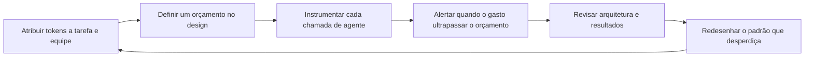

# Dívida de tokens: por que o FinOps para IA agêntica é um problema de engenharia, não de escolha de modelo

_Por que o próximo capítulo do FinOps não é sobre encontrar um modelo mais barato. É sobre projetar sistemas que não desperdicem os tokens que já pagam._

Um líder financeiro abre a fatura mensal da plataforma de IA da empresa e encontra um número que não corresponde a nenhuma história que alguém consiga contar. O uso cresceu de forma moderada. A fatura cresceu de forma acentuada. Ninguém trocou para um modelo mais caro. Ninguém aprovou uma nova integração que alguém se lembre. O item simplesmente cresceu por conta própria, da mesma maneira que as faturas de nuvem costumavam crescer antes de alguém construir uma disciplina para acompanhá-las.

Pergunte à equipe de engenharia o que aconteceu e a resposta raramente tem uma única causa. São cem pequenas decisões: um prompt de sistema que cresceu toda vez que alguém incluiu uma nova regra, uma etapa de recuperação que busca dez documentos quando dois bastariam, um agente que tenta de novo uma chamada de ferramenta com falha cinco vezes antes de desistir, um fluxo de trabalho que passa uma conversa entre três agentes especializados e reenvia todo o histórico a cada transferência. Nenhuma dessas decisões parecia cara isoladamente. Juntas, elas são a fatura.

{/* truncate */}

Esta não é uma história sobre uma má escolha de modelo. É uma história sobre arquitetura, e está se tornando o problema de custo que define a era agêntica. **A otimização de custos de IA não é mais, principalmente, um problema de seleção de modelo.** À medida que as organizações passam de interfaces de chat com um único prompt para agentes que planejam, chamam ferramentas, recuperam dados e coordenam com outros agentes, as maiores e mais persistentes oportunidades de economia se movem junto, saindo do catálogo de modelos e entrando nas decisões de engenharia que determinam como os agentes realmente consomem tokens: design de agentes, gestão de contexto, orquestração, memória, recuperação e uso de ferramentas. Um design de agente ruim gera desperdício de tokens exatamente da mesma forma que uma arquitetura de nuvem ruim gerou desperdício de infraestrutura na última década: de modo silencioso, estrutural, e em uma escala que um preço unitário mais baixo, sozinho, não consegue resolver.

---

## O FinOps já resolveu isso uma vez

O [FinOps](https://www.finops.org) existe porque a computação em nuvem mudou a forma do gasto em tecnologia. Uma compra de data center era uma decisão grande, pouco frequente e controlada de forma centralizada. O gasto em nuvem é o oposto: pequeno, contínuo, e decidido por milhares de escolhas de engenharia individuais tomadas longe de qualquer departamento financeiro. O FinOps se tornou uma disciplina porque alguém precisava conectar esses dois mundos, dando aos engenheiros visibilidade sobre o custo e dando às finanças uma forma de entender um gasto que muda a cada hora conforme o que os engenheiros constroem.

A prática funcionou porque acertou em três pontos. Ela tornou o custo visível no nível da equipe e da carga de trabalho que o gerou, por meio de marcação, showback e chargeback, em vez de deixá-lo como um único número em uma fatura. Ela transformou o custo em uma preocupação compartilhada entre finanças e engenharia, em vez de um relatório que as finanças produziam depois dos fatos. E se concentrou na economia unitária, o custo por transação ou por cliente, em vez do gasto agregado, porque o gasto agregado quase não diz nada sobre se o dinheiro está sendo bem gasto.

A própria indústria que construiu essa disciplina já está mostrando para onde ela está indo. A FinOps Foundation agora mantém trilhas inteiras com nomes como AI for FinOps e Token Economics, e sua conferência recente teve como tema AI Value: The Era of FinOps for AI, Token Economics, and Agentic FinOps, com uma palestra principal chamada simplesmente From Alerts to Agents. Isso não é um giro de marketing. É a mesma disciplina reconhecendo que chegou uma nova unidade de gasto, mais difícil de gerenciar, e essa unidade é o token.

Os tokens quebram algumas das suposições sobre as quais o FinOps construiu sua prática para a infraestrutura de nuvem. O custo de uma máquina virtual é uma função do seu tamanho e da sua duração, e ambos são definidos por uma pessoa que a provisionou. Uma fatura de tokens é uma função do que um sistema autônomo decide fazer em tempo de execução: quanto contexto ele reúne, quantas ferramentas ele chama, quantas vezes ele tenta novamente, quantos outros agentes ele consulta antes de produzir uma resposta. A unidade de gasto agora depende de uma decisão tomada pelo software, e não por uma pessoa, o que significa que a disciplina precisa se mover para trás, para o design desse software, para ter algum efeito real.

---

## A armadilha da seleção de modelo

Escolher o modelo é uma alavanca legítima, e descartá-la seria um erro. Direcionar etapas simples de classificação ou extração para um modelo menor, reservando um modelo maior para as etapas que realmente precisam dele, é boa engenharia. Mas é uma alavanca limitada e, em grande parte, de uso único. Você escolhe um modelo, recebe um multiplicador fixo sobre o custo, e a história basicamente termina até que a próxima geração de modelos chegue com um preço melhor para a mesma qualidade.

Enquanto isso, a forma da carga de trabalho, quantos tokens uma tarefa consome para chegar a um resultado correto, é definida inteiramente por decisões de engenharia, e ela continua se acumulando a cada agente, ferramenta e nova tentativa que uma equipe adiciona. Tratar a seleção de modelo como a principal alavanca de custo é bem parecido com se obcecar por qual região tem a tarifa horária mais barata para uma máquina virtual, ignorando que a carga de trabalho está provisionada cinco vezes maior do que precisa, nunca reduz de tamanho, e tenta novamente trabalhos com falha sem limite. O preço unitário nunca foi o maior número dessa equação.

Os paralelos entre o desperdício em nuvem e o desperdício de tokens são próximos o suficiente para servir de mapa de trabalho:

| Padrão de desperdício em nuvem | Padrão de desperdício de tokens | Causa subjacente |
|---|---|---|
| Máquinas virtuais superdimensionadas rodando com baixa utilização | Janelas de contexto superdimensionadas carregando histórico irrelevante | Provisionar ou montar pensando no pior caso em vez da necessidade real |
| Recursos ociosos deixados em execução depois que um projeto termina | Estado de conversa ocioso mantido vivo e reenviado a cada turno | Ausência de gestão de ciclo de vida para um estado que já deixou de ser útil |
| Microsserviços tagarelas fazendo chamadas redundantes entre si | Transferências tagarelas entre agentes reenviando todo o contexto a cada salto | Cada componente raciocinando localmente em vez de o sistema raciocinar como um todo |
| Ausência de escalonamento automático, então a capacidade fica fixa no pico | Ausência de poda de contexto, então cada chamada paga pelo histórico máximo | Nenhum mecanismo para reduzir o uso de recursos quando a necessidade real diminui |
| Tentar novamente trabalhos com falha sem espera progressiva, multiplicando o processamento | Tentar novamente chamadas de ferramentas ou etapas de agente sem espera progressiva, multiplicando os tokens | Tratamento de falhas visto como algo secundário em vez de um caminho projetado |

Cada linha do lado direito dessa tabela é uma decisão de engenharia. Nenhuma delas é resolvida trocando de modelo.

---

## Dívida de tokens: um modelo mental para o desperdício que não aparece em um painel

Uso o termo **dívida de tokens** pelo mesmo motivo que os engenheiros usam dívida técnica: para descrever um custo que é invisível no momento em que um atalho é tomado, e que se acumula silenciosamente até se tornar impossível de ignorar. Um prompt de sistema que ganha mais um parágrafo a cada sprint não parece caro hoje. Uma etapa de recuperação que traz um fragmento um pouco maior do que o necessário não parece cara hoje. Um agente que tenta de novo três vezes em vez de falhar rápido não parece caro hoje. Multiplique qualquer um desses casos por algumas centenas de milhares de chamadas por mês, e o erro de arredondamento de hoje vira o item da fatura do próximo trimestre.

A dívida de tokens tem a mesma característica definidora da dívida técnica: é barata de criar e cara de pagar. É barata porque os tokens têm um preço tão baixo por unidade que nenhuma chamada desperdiçadora, sozinha, dispara uma revisão. É cara de pagar porque, quando o desperdício finalmente aparece na fatura agregada, ele já está incorporado à arquitetura, espalhado por todo fluxo de trabalho que copiou o mesmo padrão, e misturado a comportamentos dos quais as pessoas já dependem.

Sete áreas de engenharia respondem pela maior parte da dívida de tokens que aparece em sistemas agênticos, e todas elas correspondem diretamente às decisões que as equipes tomam ao projetar um agente, não ao modelo que está por trás dele.

| Área de engenharia | Como a dívida de tokens se acumula | Um padrão melhor |
|---|---|---|
| Design de agentes | Um único agente amplo atende cada solicitação, carregando um conjunto completo de instruções e a definição de cada ferramenta em cada chamada, mesmo para tarefas simples | Delimitar os agentes de forma estreita, e carregar instruções especializadas somente quando a tarefa realmente exigir |
| Gestão de contexto | Todo o histórico da conversa é reenviado a cada turno, então o custo cresce muito mais rápido do que a própria conversa | Resumir ou limitar o histórico, mantendo apenas o que afeta materialmente a próxima decisão |
| Padrões de orquestração | Vários agentes passam uma tarefa entre si, e cada um reenvia o contexto completo que recebeu | Projetar as transferências como mensagens pequenas e estruturadas, não como transferências completas de contexto |
| Estratégias de memória | A memória de longo prazo armazena transcrições brutas e as reproduz por inteiro sempre que são recuperadas | Armazenar fatos e decisões destilados, e recuperar apenas o que é relevante para a tarefa atual |
| Abordagens de recuperação | Fragmentos superdimensionados, sem cache e sem filtro de relevância fazem cada consulta trazer muito mais do que o modelo precisa | Dimensionar corretamente os fragmentos, colocar em cache buscas repetidas e reordenar os resultados antes de enviar qualquer coisa ao modelo |
| Uso de ferramentas | As ferramentas retornam a resposta completa, independentemente do que a tarefa realmente precisa | Restringir as respostas das ferramentas aos campos que a tarefa exige, filtrados na origem |
| Arquitetura de fluxo de trabalho | Laços de nova tentativa rodam sem limites nem espera progressiva, então uma única falha pode se multiplicar em dezenas de tentativas caras | Limitar as novas tentativas, adicionar espera progressiva e projetar um caminho explícito de contingência ou escalonamento |

Alguns desses padrões ficam mais fáceis de reconhecer quando se observa como plataformas de agentes mais maduras já lidam com eles. Os agentes personalizados e as skills do [GitHub Copilot](https://github.com/features/copilot), por exemplo, só são carregados no contexto quando o agente ou a skill correspondente é de fato invocado, em vez de concatenar toda instrução possível em um único prompt enviado a cada solicitação. O mecanismo específico vai variar entre plataformas, mas o princípio subjacente se generaliza para qualquer sistema agêntico: a relevância deveria determinar o que entra na janela de contexto, não a conveniência.

O uso de ferramentas merece um alerta específico, porque é fácil confundir padronização com eficiência. Protocolos como o [Model Context Protocol](https://modelcontextprotocol.io) tornam muito mais fácil conectar um agente a muitas ferramentas sem escrever código de integração personalizado para cada uma, e isso é uma melhoria de engenharia genuína. Isso não torna o uso de ferramentas automaticamente barato. Um esquema de ferramenta enviado a cada chamada e uma resposta detalhada retornada em cada invocação continuam custando tokens, seja o protocolo por trás deles aberto e padronizado, seja proprietário. A padronização resolve o atrito de integração. Ela não resolve a eficiência de tokens, e tratar os dois como o mesmo problema é, em si, uma fonte de dívida de tokens.

### Onde um único turno gasta seus tokens

Ajuda tornar a abstração concreta. Um único turno de agente, uma solicitação e uma resposta, normalmente carrega vários componentes, e cada um é um lugar onde a dívida pode se acumular silenciosamente.

| Componente da chamada | O que ele carrega | Risco de desperdício comum |
|---|---|---|
| Instruções de sistema | Regras fixas e persona enviadas a cada chamada | Cresce toda vez que alguém inclui uma nova regra, e raramente é podado |
| Definições de ferramentas | Esquemas de cada ferramenta que o agente poderia chamar | Toda ferramenta carregada independentemente de a tarefa atual precisar dela |
| Contexto recuperado | Documentos ou registros trazidos para fundamentar a resposta | Fragmentos grandes demais, trechos duplicados, nenhum filtro de relevância |
| Histórico da conversa | Turnos anteriores carregados para dar continuidade | Transcrição completa reenviada em vez de um resumo |
| Respostas de ferramentas | Dados retornados por uma chamada de ferramenta concluída | Em vez de devolver a resposta inteira, devolver apenas os campos de que a tarefa realmente precisa |
| Transferências entre agentes | Contexto passado a um agente ou subagente cooperante | Estado completo reenviado a cada salto, em vez de uma transferência mínima e estruturada |
| Escritas de memória | O que é gravado no armazenamento de longo prazo | Transcrições brutas armazenadas em vez de resumos destilados |

Nenhum desses componentes é desperdiçador por natureza. Cada um se torna dívida de tokens apenas quando é montado por padrão em vez de por projeto.

---

## Métricas que tornam a eficiência de tokens visível

Você não consegue gerenciar o que não consegue ver, e a maioria das organizações hoje consegue ver exatamente uma métrica de tokens: a fatura total. Esse número é quase inútil para decisões de engenharia, porque não diz se o gasto é proporcional ao valor entregue. Um pequeno conjunto de métricas, acompanhado no nível do fluxo de trabalho em vez do nível da empresa, transforma o gasto em tokens de um lançamento contábil em um sinal de engenharia.

| Métrica | Definição | O que revela | Cuidado com |
|---|---|---|---|
| Tokens por resultado | Total de tokens consumidos dividido pelas tarefas concluídas segundo uma barra de qualidade definida | O custo unitário real de um fluxo de trabalho, comparável entre equipes e ao longo do tempo | Uma definição vaga de concluído esconde problemas de qualidade atrás de um número que parece bom |
| Utilização de contexto | A parcela dos tokens enviados em uma solicitação que realmente influenciou a resposta | Se a montagem de contexto é precisa ou está inchada | Difícil de medir diretamente, então aproxime com testes de ablação que removem contexto e verificam se a qualidade da saída se mantém |
| Proporção de tokens em novas tentativas | Tokens gastos em novas tentativas e autocorreção divididos pelos tokens gastos na primeira tentativa bem sucedida | Se o tratamento de falhas é barato ou caro | Uma proporção próxima de zero pode significar que o agente desiste cedo demais, em vez de tentar novamente de forma eficiente |
| Fator de amplificação de tokens | Tokens consumidos por um fluxo de trabalho orquestrado, com várias etapas, dividido pelos tokens que uma única chamada bem delimitada precisaria para o mesmo resultado | Se a orquestração está agregando valor ou apenas custos indiretos | Alguma amplificação compra confiabilidade ou segurança reais, então um número mais alto não é automaticamente um problema |
| Custo por tarefa bem sucedida | Custo em dólares dividido pelas tarefas concluídas segundo a mesma barra de qualidade acima | Conecta a eficiência de tokens diretamente a um número que as finanças já entendem | Precisa vir junto com a barra de qualidade, ou as equipes aprenderão a otimizar respostas baratas e erradas |

Cada uma dessas métricas é perigosa isoladamente. Uma equipe medida apenas por tokens por resultado vai aprender a produzir respostas mais curtas, mais baratas e piores. Uma equipe medida apenas por qualidade nunca vai notar o desperdício. As duas precisam ser reportadas juntas, no mesmo painel, revisadas pelas mesmas pessoas, ou a métrica vai acabar otimizando exatamente o comportamento errado.

---

## Governança e responsabilidade: quem é o dono da fatura de tokens

O FinOps de nuvem funciona por causa da propriedade compartilhada entre finanças, engenharia e equipes de plataforma, e porque o gasto é atribuído com clareza suficiente para que showback ou chargeback signifiquem algo para quem está olhando. Sistemas agênticos precisam da mesma estrutura, adaptada a uma unidade de gasto definida pelo comportamento do agente, e não por uma pessoa escolhendo o tamanho de uma máquina virtual.

Um punhado de práticas carrega a maior parte do peso:

* **Atribua cada token a uma tarefa, um fluxo de trabalho e uma equipe**, da mesma forma que o gasto em nuvem é marcado a um grupo de recursos e a um dono. Sem atribuição, uma fatura crescente não tem um nome associado, e ninguém se sente responsável por reduzi-la.
* **Defina um orçamento de tokens para cada tipo de tarefa antes de construir o agente**, não depois que a primeira fatura chegar. Um orçamento definido no momento do design transforma o custo em uma restrição contra a qual a equipe projeta, da mesma forma que um orçamento de latência ou uma meta de disponibilidade já fazem.
* **Exija um perfil de custo documentado antes que um fluxo de trabalho agêntico chegue à produção.** Qual é o número esperado de tokens por resultado. Qual é o tamanho máximo de contexto por turno. Quantas chamadas de ferramentas ou saltos entre subagentes uma única tarefa pode disparar antes de contar como uma execução fora de controle.
* **Alerte sobre o consumo de tokens da mesma forma que você já alerta sobre taxas de erro ou latência**, e direcione o alerta para a equipe dona do fluxo de trabalho, não apenas para as finanças.
* **Revise a eficiência de tokens na mesma cadência da revisão de arquitetura**, e transforme isso em um filtro real, não em uma sugestão. Um fluxo de trabalho que não consegue explicar seu próprio perfil de tokens não está pronto para tráfego de produção.
* **Escale de forma deliberada.** Quando um fluxo de trabalho ultrapassa seu orçamento, a resposta deveria ser um caminho definido, como limitar o tráfego, recorrer a uma abordagem mais barata ou pausar para uma decisão humana, e não um excesso silencioso que só aparece trinta dias depois em uma fatura.

O ciclo que essas práticas formam é um descendente direto do ciclo clássico de FinOps, adaptado para uma unidade de gasto moldada pelo comportamento do software, e não por escolhas de provisionamento.

---

## Um modelo de maturidade para o FinOps agêntico

As organizações tendem a passar por estágios reconhecíveis à medida que constroem essa disciplina. Nomear os estágios facilita ver onde uma equipe realmente está, em vez de onde ela supõe que está.

| Estágio | O que é verdade | Comportamento característico |
|---|---|---|
| Não gerenciado | O gasto em tokens só é visível como um único número em uma fatura do fornecedor | Ninguém consegue dizer qual equipe, agente ou fluxo de trabalho é responsável pelo gasto |
| Observado | O consumo de tokens é medido e atribuído a equipes e fluxos de trabalho | Painéis existem, mas ninguém é responsável por agir sobre o que eles mostram |
| Gerenciado | Orçamentos, alertas e perfis de custo definidos no design existem para os fluxos de trabalho agênticos | As equipes de engenharia tratam a eficiência de tokens como uma restrição real de design |
| Governado | A eficiência de tokens faz parte da revisão de arquitetura e é uma condição para publicar | Um agente não pode chegar à produção sem um perfil de custo documentado e um dono |
| Sistêmico | Padrões eficientes de contexto, recuperação e orquestração se tornam capacidades compartilhadas da plataforma | As equipes reaproveitam problemas de eficiência já resolvidos, em vez de redescobri-los cada uma por conta própria |

A maioria das organizações que hoje adotam agentes está nos estágios não gerenciado ou observado. Poucas chegaram a gerenciado. Quase nenhuma chegou a sistêmico, e é exatamente aí que a vantagem duradoura se acumula, porque um padrão resolvido e reaproveitado por toda equipe compõe economia da mesma forma que um padrão de desperdício não resolvido compõe custo.

---

## O pensamento sistêmico vence o pensamento sobre modelos

Um modelo mais barato é um desconto aplicado uma única vez a cada token que você de qualquer forma iria gastar. Uma arquitetura melhor muda quantos tokens você gasta em primeiro lugar, e essa economia se acumula toda vez que o fluxo de trabalho roda, toda vez que ele escala, e toda vez que outra equipe adota o mesmo padrão.

A computação em nuvem ensinou exatamente essa lição uma década antes. Escolher um tamanho de máquina virtual um pouco mais barato ajudou uma vez. Projetar para a elasticidade, de modo que o sistema usasse apenas a capacidade que a carga de trabalho realmente precisava a cada momento, continuou trazendo retorno indefinidamente. A eficiência de tokens está seguindo o mesmo arco. As organizações que a tratarem como uma disciplina de arquitetura, e não como uma decisão de compras, vão acabar com uma vantagem de custo estrutural que um concorrente não conseguirá apagar apenas trocando para um modelo mais barato no próximo trimestre.

---

## Orientação prática para equipes de engenharia e plataforma

* **Instrumente primeiro.** Associe contagens de tokens a cada chamada de agente, marcadas por tarefa, fluxo de trabalho e equipe, antes de tentar otimizar qualquer coisa. Você não consegue corrigir o que não consegue atribuir.
* **Defina o orçamento antes de construir.** Decida quanto um tipo de tarefa deveria custar em tokens no momento do design, não depois que a primeira fatura pegar alguém de surpresa.
* **Trate a montagem de contexto como um artefato projetado, não como um acúmulo.** Decida deliberadamente o que pertence a uma chamada, em vez de incluir por padrão tudo o que possivelmente poderia ser relevante.
* **Separe a memória em camadas.** Mantenha a memória de trabalho pequena e precisa para a tarefa atual. Mantenha a memória de longo prazo destilada em fatos e decisões, nunca como uma repetição literal de tudo o que aconteceu.
* **Limite cada nova tentativa e cada laço.** Defina um número máximo de tentativas, adicione espera progressiva e projete um caminho explícito de contingência para quando um agente não conseguir concluir uma etapa.
* **Audite a orquestração em busca de saltos redundantes.** Cada agente ou subagente adicional em um fluxo de trabalho deveria justificar sua parcela do custo em tokens por meio de uma melhoria clara no resultado ou na confiabilidade, e não simplesmente existir porque parecia útil durante um protótipo.
* **Torne a eficiência de tokens parte da definição de pronto** para funcionalidades agênticas, revisada junto com a correção e a segurança, em vez de descoberta depois em uma fatura mensal.
* **Reporte as métricas de tokens ao lado das métricas de confiabilidade e qualidade**, para a mesma audiência, na mesma cadência. Uma métrica que as finanças veem e a engenharia nunca vê não vai mudar o comportamento da engenharia.

---

## Encerramento: otimize o sistema, não o modelo

A seleção de modelo continuará importando. Novos modelos continuarão chegando, alguns deles significativamente mais baratos ou mais rápidos com a mesma qualidade, e continuará fazendo sentido aproveitar isso quando acontecer. Mas essa alavanca sempre teve um teto, e as organizações que a tratam como sua principal estratégia de custo estão otimizando a menor parte do problema.

A oportunidade maior e mais duradoura está nas decisões de engenharia que determinam quantos tokens um sistema precisa para chegar a um resultado correto em primeiro lugar: como um agente é delimitado, como o contexto é montado, como a memória é armazenada e recuperada, como a recuperação é filtrada, como as ferramentas respondem, como as falhas são limitadas, e como o trabalho é orquestrado entre agentes. Cada uma dessas é uma decisão de design, tomada por um engenheiro, e revisável como qualquer outra peça de arquitetura. Nenhuma delas exige escolher um modelo mais barato. Todas exigem tratar a eficiência de tokens com a mesma seriedade com que a latência, a correção e a segurança sempre foram tratadas.

A dívida de tokens se acumula silenciosamente, da mesma forma que a dívida técnica e o desperdício em nuvem sempre fizeram: um atalho conveniente de cada vez, até que uma fatura force uma conversa que poderia ter começado meses antes como uma revisão de design. As organizações que vencerem economicamente na era agêntica não serão as que encontraram o modelo mais barato. Serão as que construíram sistemas disciplinados o suficiente para não desperdiçar os tokens que já estavam pagando.
