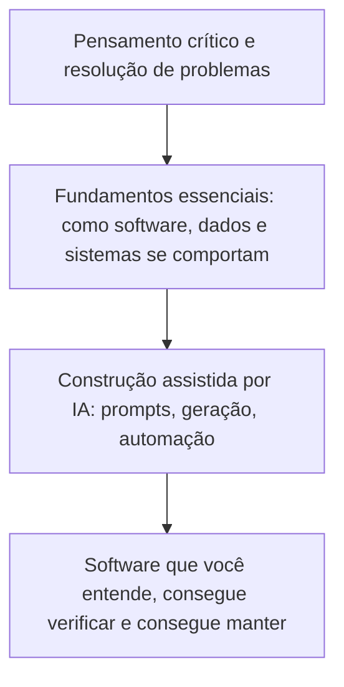

# Antes de fazer o prompt: os fundamentos que todo iniciante precisa na era da IA

## Por que entender ainda importa quando a IA pode escrever o código

Nunca foi tão fácil transformar uma ideia em software funcional. Descreva o que você quer em linguagem simples, e uma ferramenta de IA pode gerar uma página web, um script, uma integração com API ou até um agente de múltiplas etapas que executa ações em seu nome. Para quem já se sentiu excluído do software por não saber programar, essa mudança é real e bem-vinda.

Mas existe uma diferença entre software que funciona e software que você entende. A IA pode produzir o primeiro em segundos. Só você pode produzir o segundo, e apenas se souber o suficiente sobre como o software realmente funciona para ler o que a IA te entregou, questioná-lo e corrigi-lo quando estiver errado.

{/* truncate */}

Este artigo é para estudantes, pessoas em transição de carreira e qualquer pessoa iniciante que queira construir soluções reais com a ajuda da IA. Não é um argumento para passar anos estudando antes de tocar em um teclado. É um mapa prático dos fundamentos que fazem de você uma pessoa melhor para construir, revisar e tomar decisões, independentemente do seu cargo ou histórico.

---

## A IA mudou o que você produz, não aquilo pelo que você é responsável

As ferramentas de IA são excepcionalmente boas em produzir respostas plausíveis com rapidez. Elas não são boas em saber exatamente o que você precisa, detectar cada erro ou entender as consequências de uma decisão dentro da sua situação específica. Esse julgamento continua sendo de quem faz a pergunta.

Pense na IA como uma colaboradora capaz que já leu quase tudo, mas que nunca usou o seu produto, conheceu as pessoas que dependem dele, nem lidou com as consequências quando algo quebra. Ela pode rascunhar, sugerir e acelerar. Ela não pode decidir o que "correto" significa no seu contexto, e não pode assumir a responsabilidade pelo que acontece depois que você publica.

É aí que entram os fundamentos. Não porque você precise decorar sintaxe ou passar anos em teoria, mas porque:

- Você precisa **reconhecer** quando um resultado parece certo, mas não é.
- Você precisa **fazer** perguntas melhores, já que um pedido vago produz um resultado vago ou errado.
- Você precisa **avaliar o risco**, já que alguns erros são cosméticos e outros são perigosos.
- Você precisa **manter** o que foi construído depois que a primeira versão funciona, que é a maior parte do esforço real em software.

Nada disso exige um diploma em ciência da computação. Exige um modelo mental funcional de um pequeno número de ideias, a maioria das quais leva poucas horas para aprender e muito tempo para aprofundar, exatamente como qualquer outra habilidade prática.

Pule a base dessa pilha e o topo se torna frágil. Você ainda consegue produzir algo que funciona. Vai ter dificuldade em saber se é seguro, correto ou digno de confiança.

---

## Os fundamentos: um passeio prático

Os conceitos abaixo aparecem em quase toda solução de software, seja um projeto pessoal, uma tarefa de faculdade ou um produto em produção. Você não precisa dominar todos eles antes de começar a construir. Precisa saber que existem, qual problema cada um resolve, e o suficiente para perceber quando algo está errado.

| Fundamento | O que isso realmente significa | Por que importa quando a IA escreve o código |
|---|---|---|
| Como o software funciona | Programas são instruções precisas e literais que um computador executa passo a passo | O código gerado por IA também é apenas instruções. Se você não consegue lê-las, não pode confirmar que fazem o que você pediu |
| Cliente, servidor e localhost | Um programa solicita algo, outro responde, e você pode rodar os dois de forma privada na sua própria máquina primeiro | A maioria dos bugs e falhas de segurança vive nessa troca, e o localhost é onde você os detecta antes que qualquer outra pessoa consiga |
| APIs | Formas combinadas para que programas troquem dados | Ferramentas de IA se conectam a APIs o tempo todo; uma chamada mal compreendida falha silenciosamente ou de forma cara |
| Estruturas de dados | Como a informação é organizada para ser armazenada, encontrada e alterada | A diferença entre software que escala e software que quebra sob uso real |
| Depuração | Ler erros e evidências para encontrar a causa real | O fundamento mais transferível, e um que a IA não consegue fazer totalmente por você |
| Controle de versão | Um histórico registrado e reversível de cada mudança | Sua rede de segurança quando uma mudança sugerida pela IA acaba estando errada |
| Testes | Prova de que algo funciona, não apenas a esperança de que funcione | A forma mais rápida de detectar um erro da IA antes que uma pessoa o faça |
| Fundamentos de segurança | Entender limites de confiança e o que poderia dar errado | A IA vai gerar código inseguro se você não pedir o contrário, ou não perceber |
| Pensamento sistêmico | Ver como as partes se afetam entre si, não apenas uma peça isolada | A IA raciocina sobre o código que tem à frente, não sobre todo o seu sistema e sua história |

### Como o software funciona

Um computador só faz uma coisa: segue instruções, exatamente como foram escritas, em velocidade extraordinária. Linguagens de programação permitem que pessoas escrevam essas instruções em uma forma legível para humanos e traduzível para algo que uma máquina possa executar.

Isso importa porque o código gerado por IA não é mágica. São instruções como quaisquer outras, escritas por um modelo em vez de uma pessoa. Se você consegue acompanhar, passo a passo, o que um trecho de código faz, em linguagem simples, consegue dizer se ele corresponde ao que você realmente pediu. Se não consegue, está confiando no resultado por fé, e fé não é uma estratégia de verificação.

Você não precisa aprender todas as linguagens. Precisa se sentir confortável com os blocos básicos que quase toda linguagem compartilha: variáveis que guardam valores, condicionais que tomam decisões, laços que repetem ações e funções que agrupam etapas em uma unidade reutilizável.

### Cliente, servidor e localhost

A maior parte do software que você usa todos os dias envolve dois programas separados conversando entre si. O **cliente** é o programa com o qual você interage diretamente: um navegador, um aplicativo móvel ou uma ferramenta de linha de comando. O **servidor** é um programa separado, muitas vezes rodando em outro lugar completamente diferente, que recebe solicitações, faz o trabalho e envia uma resposta de volta.

Toda vez que uma página carrega, um formulário é enviado ou um aplicativo busca novos dados, um cliente está pedindo algo a um servidor e o servidor está respondendo. Entender esse vaivém é o que transforma "por que isso está lento" ou "por que minha solicitação falhou" de mágica inexplicável em algo que você realmente pode investigar.

**Localhost** é o seu próprio computador atuando como cliente e servidor ao mesmo tempo, para que você possa construir e testar software antes que qualquer outra pessoa consiga acessá-lo. Quando um tutorial diz para abrir `http://localhost:3000`, significa que há um servidor rodando na sua máquina e o seu navegador está conversando com ele de forma privada. O localhost é onde você deve testar qualquer coisa que a IA gerar para você antes que isso chegue perto de usuários ou dados reais. O [Web Dev for Beginners](https://github.com/microsoft/web-dev-for-beginners#%EF%B8%8F-lessons) é uma referência sólida e gratuita sobre esses conceitos quando você quiser se aprofundar mais.

### APIs: os contratos entre sistemas

Uma **API** (interface de programação de aplicações) é uma forma combinada para que uma parte do software peça algo a outra, sem precisar saber como a outra funciona por dentro. Você envia uma solicitação em um formato específico e recebe uma resposta em um formato específico de volta.

APIs estão em todo lugar no desenvolvimento assistido por IA. O próprio modelo de IA geralmente é acessado por meio de uma API. O código que uma IA gera para você vai chamar outras APIs com frequência, para dados de clima, pagamentos, autenticação ou um banco de dados. Se você não entende a forma básica de uma solicitação e uma resposta, incluindo códigos de status e tratamento de erros, não consegue saber se uma integração gerada por IA é sólida ou apenas otimista.

Um hábito simples desenvolve isso rapidamente: pegue qualquer API pública de acesso gratuito, faça uma solicitação a ela usando nada além do seu navegador ou um script curto, e observe com atenção o que volta, incluindo o que acontece quando algo dá errado de propósito.

### Estruturas de dados: como a informação é organizada

Uma estrutura de dados é uma forma de organizar informação para que ela possa ser armazenada, encontrada e alterada de maneira eficiente. Uma lista, uma tabela, um par chave-valor e uma árvore são todas estruturas de dados. Os nomes específicos importam menos do que a pergunta que eles forçam você a fazer: **qual é a forma correta de organizar essa informação para como ela realmente será usada?**

A IA vai gerar com confiança código usando qualquer estrutura que combine com o prompt, não necessariamente a que combina com seus dados reais ou sua escala. Guardar um milhão de registros em uma estrutura pensada para uma dúzia funciona bem em uma demonstração e falha em produção. Você não precisa decorar cada estrutura de dados que existe. Precisa conseguir perguntar o que acontece com uma abordagem à medida que os dados crescem, e ter base suficiente para avaliar a resposta. O [guia de estruturas de dados do roadmap.sh](https://roadmap.sh/datastructures-and-algorithms) é uma boa referência gratuita para quando você quiser se aprofundar.

### Depuração: a habilidade que a IA não consegue automatizar totalmente

Depurar é descobrir por que algo não está se comportando como esperado, usando evidências como mensagens de erro, registros e o comportamento real do sistema, em vez de suposições.

Este pode ser o fundamento mais transferível de todos, porque é, na prática, pensamento crítico aplicado. Você observa um sintoma, formula uma hipótese sobre a causa, testa essa hipótese e vai restringindo até encontrar a origem real. A IA pode ajudar bastante aqui, sugerindo causas e soluções, mas muitas vezes não tem acesso ao seu ambiente de execução específico, aos seus dados ou ao histórico completo de como o sistema chegou ao estado atual. Quando uma correção sugerida pela IA não funciona, a capacidade de continuar investigando de forma metódica, em vez de tentar mudanças aleatórias, é o que separa quem constrói software confiável de quem está apenas chutando.

### Controle de versão: sua rede de segurança para experimentar

O controle de versão, geralmente por meio de uma ferramenta chamada Git, mantém um histórico completo e reversível de cada mudança feita em um projeto. Cada mudança é registrada, identificada e pode ser desfeita.

Isso se torna essencial assim que a IA entra em cena, porque as mudanças sugeridas pela IA às vezes estarão erradas, e alguns desses erros não serão óbvios de imediato. Controle de versão significa que você sempre pode voltar a um estado conhecido e correto, comparar o que mudou e ver exatamente o que uma edição da IA alterou versus o que deixou intacto. Trate fazer commit do seu trabalho cedo e com frequência como um hábito básico, não como uma técnica avançada reservada para profissionais. [Introduction to Git](https://learn.github.com/courses/introductiontoGit) é um bom ponto de partida gratuito.

### Testes: prova, não esperança

Um teste é uma verificação pequena e automatizada que confirma que uma parte do software se comporta como deveria. Em vez de rodar um aplicativo manualmente e esperar que funcione, você escreve uma verificação que executa a mesma checagem toda vez, instantaneamente, durante toda a vida do projeto.

Testes importam mais, não menos, em um fluxo de trabalho assistido por IA. Quando uma IA regenera ou refatora um trecho de código, um bom conjunto de testes te diz imediatamente se o comportamento do qual você depende ainda se mantém. Sem testes, você depende de verificações manuais pontuais, que ficam mais fracas a cada vez que o projeto cresce. Comece pequeno: um teste que verifica um comportamento importante vale mais do que zero testes protegendo um projeto inteiro.

### Fundamentos de segurança: limites de confiança e raio de impacto

Segurança começa com uma pergunta simples: **o que acontece se não for possível confiar nesta entrada, neste usuário ou neste sistema?** Um limite de confiança é qualquer ponto onde a informação passa de algo que você não controla para algo que você controla: o envio de um formulário, um arquivo enviado, uma solicitação vinda da internet pública.

O código gerado por IA muitas vezes pula validações, expõe mais informação do que o necessário ou lida com segredos de forma descuidada, não por malícia, mas porque otimiza para fazer a solicitação imediata funcionar. Você não precisa se tornar uma pessoa especialista em segurança para construir de forma responsável. Precisa de base suficiente para fazer perguntas básicas antes de publicar qualquer coisa: essa entrada está validada?, esse segredo está armazenado com segurança?, e qual é o pior cenário se isso der errado, ou seja, até onde o dano poderia se espalhar, o seu **raio de impacto**. O [OWASP Top 10](https://owasp.org/Top10/2025/) é o ponto de partida padrão e gratuito para os riscos mais comuns.

### Pensamento sistêmico: enxergando o quadro completo

Pensamento sistêmico é o hábito de considerar como uma mudança em uma parte de uma solução afeta tudo que está conectado a ela, em vez de avaliar essa mudança isoladamente. Software raramente é uma única peça. É um conjunto de partes que interagem: código, dados, infraestrutura, outros sistemas e usuários reais com comportamentos reais.

Ferramentas de IA raciocinam bem sobre o trecho de código diretamente à sua frente. Elas são bem mais fracas ao raciocinar sobre todo o seu sistema, sua história, suas restrições e as decisões por trás da sua forma atual. Essa visão mais ampla é trabalho seu. Uma mudança que parece correta isoladamente ainda pode quebrar algo dois passos adiante, e só alguém pensando no sistema inteiro percebe isso antes de ir ao ar.

---

## Pensamento crítico: a habilidade que a IA não pode fazer por você

Cada fundamento acima constrói em direção a um único resultado: a capacidade de olhar para algo que a IA produziu e julgá-lo com honestidade, em vez de aceitá-lo porque soa confiante.

As respostas geradas por IA compartilham uma característica que as torna arriscadas para iniciantes: elas quase sempre são fluentes, bem formatadas e plausíveis, estejam corretas ou não. Fluência não é precisão, e é fácil confundir as duas quando você ainda não tem os fundamentos para diferenciá-las.

Um pequeno conjunto de perguntas transforma confiança cega em avaliação real:

- **Isso realmente responde ao que eu pedi, ou algo parecido, mas diferente?** A IA pode resolver com total confiança um problema ligeiramente diferente do seu.
- **Consigo explicar, com minhas próprias palavras, o que isso faz?** Se você não consegue reformular de forma simples, ainda não entendeu, independentemente de funcionar.
- **O que provaria que isso está errado?** Procure o caso extremo ou a entrada que quebraria a afirmação ou o código, e teste.
- **Em que isso se baseia?** A IA pode apresentar informação desatualizada ou uma referência que parece real mas não existe, com total confiança e sem nenhum sinal de incerteza.
- **O que acontece se isso estiver errado em produção, não em uma demonstração?** Alguns erros custam apenas refazer o trabalho. Outros custam dados, dinheiro ou a confiança de outra pessoa.

Nenhuma dessas perguntas exige experiência avançada. Elas exigem o hábito de fazer uma pausa antes de aceitar uma resposta, e conhecimento fundamental suficiente para realmente testá-la em vez de apenas reler.

---

## Usando a IA de forma responsável

Construir bem com IA não é apenas uma questão técnica. É também uma questão de julgamento sobre o que você compartilha, o que você automatiza e pelo que você está disposto a se responsabilizar.

Alguns hábitos práticos fazem uma grande diferença:

- **Nunca cole segredos, credenciais ou dados privados em um prompt.** Trate tudo que você digita em uma ferramenta de IA como informação que pode sair do seu controle. Use marcadores de posição em vez de chaves, tokens ou dados pessoais reais.
- **Ajuste as permissões de uma ferramenta de IA à tarefa.** Um agente encarregado de corrigir um erro de digitação não precisa da capacidade de apagar dados ou implantar em produção. Dê às ferramentas e agentes de IA o acesso mais restrito que permita realizar o trabalho.
- **Verifique antes de confiar, especialmente em qualquer coisa irreversível.** Revise o código gerado antes de executá-lo, especialmente comandos que apagam, sobrescrevem ou publicam algo. Erros reversíveis são experiências de aprendizado. Os irreversíveis não são.
- **Verifique licenciamento e originalidade em qualquer coisa que você planeje reutilizar ou publicar.** Conteúdo gerado por IA pode se parecer o suficiente com material existente para levantar questões reais sobre atribuição e direitos. Na dúvida, verifique antes de publicar.
- **Assuma o resultado.** Se você pediu para uma IA produzir algo e usou esse resultado, você é responsável pelo que ele faz, da mesma forma que seria se tivesse escrito você mesmo.

Uso responsável não é sobre ter medo da IA. É sobre tratar uma ferramenta poderosa com o mesmo cuidado que você esperaria de qualquer outra pessoa com acesso aos seus sistemas e aos seus dados.

---

## Fundamentos não são uma barreira de entrada

Nada disso é um argumento de que você precisa de um diploma em ciência da computação, um certificado ou anos de experiência prévia para que se permita construir algo. Muitas pessoas constroem soluções úteis e reais sem nenhuma credencial formal, e isso se torna mais verdadeiro, não menos, à medida que a IA reduz o custo de começar.

O argumento real é mais específico e mais útil: quanto menos fundamentos você tem, mais difícil é diferenciar um bom resultado de IA de um ruim, e mais exposto você fica a erros que não consegue ver chegando. Isso não é um muro para manter as pessoas de fora. É um conjunto de habilidades que te tornam dramaticamente mais eficaz assim que você decide atravessar a porta, e cada uma delas pode ser aprendida, em pequenas partes, por qualquer pessoa disposta a praticar.

De onde você vem, seu cargo e como você aprendeu não determinam se você consegue construir bom software. Entender o que você construiu bem o suficiente para confiar nele, explicá-lo e corrigi-lo, isso sim determina.

---

## Primeiros passos: um roteiro simples de aprendizado

Você não precisa aprender tudo neste artigo antes de começar a construir com IA. Precisa de uma sequência. Aqui está uma ordem prática para começar:

1. **Aprenda como uma solicitação se transforma em uma resposta.** Construa a página web mais simples possível, abra-a localmente e observe as ferramentas de desenvolvedor do seu navegador mostrarem a solicitação e a resposta acontecendo em tempo real.
2. **Aprenda uma linguagem o suficiente para ler seus erros sem entrar em pânico.** Foque em variáveis, condicionais, laços e funções. Você ainda não está buscando domínio total, apenas fluência suficiente para acompanhar o que o código gerado por IA está fazendo.
3. **Instale o Git e faça um commit hoje.** Torne o commit um hábito desde o seu primeiro projeto, não uma habilidade que você adiciona depois.
4. **Chame uma API pública real e trate tanto um sucesso quanto uma falha de propósito.** Ver uma resposta de erro deliberadamente ensina mais do que ver apenas o caminho feliz.
5. **Escreva um teste automatizado para algo que você construiu.** Não precisa ser sofisticado. Precisa provar que uma coisa funciona, sempre.
6. **Leia um resumo curto e acessível sobre riscos de segurança comuns**, como entradas não validadas e segredos expostos, para reconhecê-los de imediato.
7. **Use a IA para construir algo, depois explique cada parte em voz alta ou por escrito**, como se tivesse que ensinar isso a outra pessoa. Onde você travar ao explicar, é exatamente ali que deve estudar em seguida.

Pontos de partida gratuitos e estruturados como [freeCodeCamp](https://www.freecodecamp.org/) podem apoiar essa sequência sem exigir um programa formal ou um orçamento grande.

Cada passo é pequeno por si só. Juntos, eles constroem o julgamento que transforma "a IA gerou isso para mim" em "eu construí isso, e sei que funciona". Esse julgamento, mais do que qualquer ferramenta ou modelo específico, é a habilidade real que vale a pena desenvolver agora, e está ao alcance de qualquer pessoa disposta a começar.