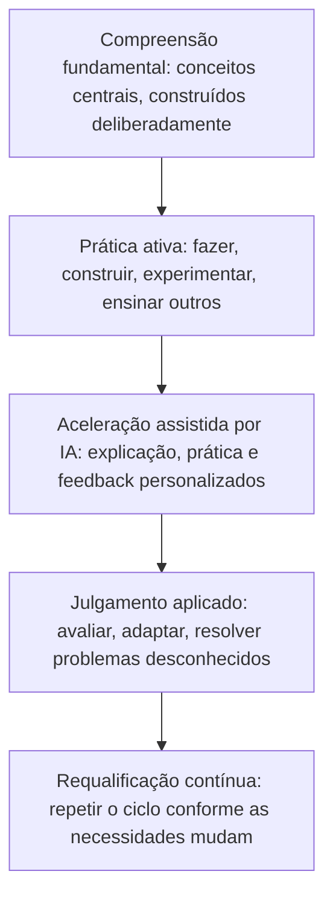

# Aprender de forma diferente: como o ensino e a aprendizagem devem evoluir na era da IA e dos agentes

## A verdadeira mudança não é aprender menos, é aprender de forma diferente

Toda vez que uma nova tecnologia torna a informação mais fácil de alcançar, a mesma preocupação ressurge: as pessoas vão parar de aprender por completo? Supostamente as calculadoras tornariam a aritmética desnecessária. Supostamente os mecanismos de busca tornariam desnecessário memorizar fatos. A IA agora levanta a mesma pergunta, em uma escala muito maior, porque consegue explicar um conceito, redigir um ensaio, resolver um problema e até realizar tarefas de vários passos por conta própria.

A preocupação é compreensível, mas interpreta mal o que realmente está mudando. A IA está transformando a rapidez com que as pessoas conseguem acessar informações e produzir um primeiro rascunho de resposta. Ela não está transformando o processo subjacente pelo qual um ser humano constrói compreensão real, desenvolve julgamento ou se torna capaz de resolver problemas que nunca viu antes. Esse processo continua lento, exige esforço e continua profundamente humano.

{/* truncate */}

Isso importa para um amplo grupo de pessoas: estudantes decidindo como estudar, pessoas que aprendem por conta própria e desenvolvem novas habilidades fora de uma sala de aula, professores que redesenham seus cursos, líderes de escolas e universidades que definem políticas, organizações de desenvolvimento de força de trabalho que preparam pessoas para empregos em constante mudança, e profissionais que agora precisam se requalificar com mais frequência do que qualquer geração anterior.

O argumento desta publicação é simples e, esperamos, reconfortante: o futuro da aprendizagem não é aprender menos porque a IA pode responder perguntas instantaneamente. É aprender de forma diferente, mais contínua e mais intencional. A IA pode ser um dos amplificadores de aprendizagem mais poderosos já criados, mas apenas se as pessoas ao seu redor, estudantes, professores e instituições, escolherem usá-la dessa forma.

---

## A memorização nunca foi o verdadeiro objetivo

Os sistemas educacionais tradicionais surgiram em um mundo onde a informação era escassa e lenta de alcançar. Livros eram caros, bibliotecas eram limitadas e especialistas eram difíceis de acessar. Nesse mundo, memorizar fatos, fórmulas e procedimentos era genuinamente valioso, porque relembrar informações rapidamente era, muitas vezes, o gargalo para poder usá-las.

Esse gargalo praticamente desapareceu. Qualquer pessoa com um telefone pode recuperar um fato, uma fórmula ou uma explicação passo a passo em segundos. A IA acelera isso ainda mais, não apenas recuperando informações, mas sintetizando-as, explicando-as na profundidade necessária e adaptando a explicação ao nível atual de compreensão de quem aprende.

Isso não torna o conhecimento fundamental inútil. Torna a simples memorização uma medida muito mais fraca de saber se alguém realmente aprendeu algo. As perguntas mais úteis mudaram:

- Essa pessoa consegue reconhecer quando uma informação se aplica a uma situação nova?
- Ela consegue julgar se uma resposta, incluindo uma gerada por IA, é correta, razoável ou perigosa?
- Ela consegue combinar conhecimentos de diferentes domínios para resolver um problema para o qual ninguém lhe entregou um modelo pronto?
- Ela consegue explicar seu raciocínio com clareza suficiente para que outra pessoa, ou um sistema de IA, possa construir a partir dele?

Nenhuma dessas capacidades vem de memorizar mais conteúdo. Elas vêm do **julgamento**: a capacidade de avaliar, aplicar e adaptar conhecimento em condições reais e confusas. O julgamento é construído por meio de prática, feedback e reflexão, não pela repetição de fatos. Essa é a verdadeira mudança que a educação precisa fazer, e ela já era necessária mesmo antes da chegada da IA. A IA simplesmente elevou muito o custo de ignorá-la.

---

## Como as pessoas realmente aprendem: não existe um único método correto

Um dos erros mais persistentes, tanto em salas de aula quanto no aprendizado autodirigido, é tratar a aprendizagem como se acontecesse da mesma forma para todos. Não é o caso. As pessoas absorvem, processam e retêm informações por canais muito diferentes, frequentemente em combinação.

| Modo de aprendizagem | Como se parece | O que constrói bem |
|---|---|---|
| **Leitura** | Livros, artigos, documentação, explicações escritas | Profundidade, precisão, capacidade de revisitar e consultar |
| **Vídeo** | Aulas gravadas, demonstrações, palestras gravadas | Compreensão visual e sequencial, controle do ritmo |
| **Áudio** | Podcasts, discussões, explicações faladas | Aprender enquanto se faz outras tarefas, retenção narrativa |
| **Discussão** | Grupos de estudo, seminários, debate estruturado | Testar a compreensão diante de outras perspectivas |
| **Prática** | Exercícios, repetições, aplicação repetida | Fluência, memória muscular, velocidade |
| **Experimentação** | Testar variações, testar hipóteses, explorar | Intuição sobre causa e efeito, conforto com o erro |
| **Construção de projetos** | Aplicar conhecimento a um resultado real, do início ao fim | Integração de várias habilidades, julgamento do mundo real |
| **Ensinar a outros** | Explicar um conceito até que outra pessoa o entenda | A forma mais profunda de domínio, expõe lacunas de compreensão |

Nenhuma linha dessa tabela é a forma "correta" de aprender. A aprendizagem mais duradoura geralmente vem da combinação de várias delas: ler para construir um modelo mental, praticar para ganhar fluência, construir um projeto para integrar as partes e ensinar outra pessoa para expor o que ainda não está firme.

É exatamente aqui que a IA pode ajudar sem reduzir a aprendizagem a um único método. Um tutor de IA bem projetado pode oferecer uma explicação como texto, como exemplo resolvido, como uma série de perguntas de prática ou como uma conversa, dependendo do que funciona melhor para cada pessoa. O perigo não é a IA substituir essa variedade. O perigo é projetar a aprendizagem assistida por IA em torno de um único modo, geralmente ler uma resposta gerada, porque é o mais fácil de construir.

---

## Aprender fazendo: por que a prática ainda supera o consumo passivo

Décadas de pesquisa sobre aprendizagem apontam para a mesma conclusão a partir de ângulos diferentes: as pessoas aprendem muito mais fazendo algo do que observando ou lendo sobre isso. A prática de recuperação, em que a pessoa tenta recordar ou aplicar algo em vez de simplesmente reler, produz de forma consistente uma compreensão mais sólida e duradoura do que a revisão passiva. A aprendizagem baseada em projetos, em que um conceito é aplicado para construir algo real, tende a produzir uma transferência de conhecimento mais profunda para situações novas do que exercícios isolados.

A IA introduz aqui um risco real, que vale a pena nomear diretamente. Quando uma resposta, um esboço de ensaio ou um trecho de código funcional pode ser gerado instantaneamente, é tentador tratar esse resultado como a linha de chegada, em vez de um ponto de partida. Um estudante que copia uma explicação gerada por IA sem trabalhá-la consumiu informação. Não necessariamente aprendeu algo duradouro.

O padrão mais saudável inverte a sequência: tentar resolver o problema primeiro, mesmo que de forma imperfeita, e só então usar a IA para verificar o raciocínio, preencher lacunas ou oferecer uma segunda abordagem. Isso preserva a luta produtiva que impulsiona a aprendizagem real, ao mesmo tempo em que oferece aos estudantes um feedback rápido e de alta qualidade, que antes exigia um tutor, um mentor ou muita tentativa e erro para se obter sozinho.

Para quem aprende por conta própria, em particular, um hábito simples protege contra o consumo passivo: **não peça a resposta à IA antes de ter escrito sua própria tentativa, mesmo que rudimentar.** A comparação entre sua tentativa e a resposta da IA é onde a aprendizagem real acontece, não a resposta em si.

---

## Aprendizagem personalizada e adaptativa: o que a IA realmente muda

A aprendizagem personalizada não é uma ideia nova. Bons professores e tutores sempre ajustaram o ritmo, os exemplos e a dificuldade de acordo com a pessoa à sua frente. O que faltava em escala era a capacidade de fazer isso para cada estudante, em cada matéria, a cada momento, sem exigir um número enorme de tutores humanos.

É aqui que a IA oferece uma capacidade genuinamente nova. Sistemas adaptativos podem identificar exatamente onde a compreensão de um estudante se quebra, ajustar em tempo real a dificuldade dos problemas de prática, oferecer explicações em um estilo diferente quando a primeira não funciona, e acompanhar o progresso ao longo de semanas ou meses de uma forma que levaria muito mais tempo para um instrutor humano reunir.

Bem utilizado, isso pode fechar lacunas que persistem há muito tempo: um estudante que precisa de mais repetição antes de avançar, uma pessoa que entende um conceito visualmente mas não verbalmente, ou um profissional que precisa revisar um tema fundamental antes de abordar algo avançado.

A personalização tem limites que vale a pena deixar explícitos. Sistemas adaptativos são tão bons quanto o modelo de aprendizagem por trás deles, e um sistema que simplesmente oferece conteúdo mais fácil sempre que um estudante tem dificuldade pode reduzir silenciosamente as expectativas em vez de construir capacidade. Uma personalização eficaz deve ajustar *como* um conceito é ensinado e *quanto* apoio é oferecido, não *se* o estudante deve, eventualmente, alcançar o domínio real. Instituições que adotam ferramentas adaptativas devem perguntar diretamente aos fornecedores como o sistema define progresso, e se ele foi projetado para construir independência ou apenas para manter os estudantes engajados.

---

## Tutores de IA, copilotos e sistemas agênticos na educação

A mudança mais interessante recentemente não é apenas uma IA que responde perguntas, mas uma IA que pode atuar como colaboradora contínua ao longo de toda uma jornada de aprendizagem. Alguns papéis já estão surgindo claramente:

**A IA como explicadora sob demanda.** Disponível a qualquer hora, disposta a repetir uma explicação de uma forma diferente quantas vezes forem necessárias, sem julgamento ou impaciência. Isso, por si só, remove uma barreira significativa para estudantes que antes precisavam esperar a próxima aula ou o próximo horário de atendimento para se desbloquear.

**A IA como parceira socrática.** Em vez de simplesmente fornecer uma resposta, um tutor de IA bem projetado pode fazer perguntas orientadoras, apontar lacunas no raciocínio e levar o estudante a chegar a uma conclusão por conta própria. Isso reflete uma das formas mais eficazes de tutoria humana e pode ser incorporado deliberadamente na forma como as ferramentas de aprendizagem com IA são configuradas.

**A IA como geradora de prática.** Cria variações ilimitadas de problemas, questionários e cenários adaptados ao que um estudante específico precisa reforçar, algo que seria extremamente demorado para um instrutor humano produzir individualmente para cada estudante.

**Sistemas agênticos como orquestradores da aprendizagem.** Essa é a camada mais nova e menos compreendida. Um sistema agêntico pode ir além de responder uma única pergunta e gerenciar um plano de aprendizagem de vários passos: avaliar o conhecimento atual, sequenciar tópicos, gerar prática, revisar o trabalho e ajustar o plano com base nos resultados, em grande parte por conta própria. Em uma sala de aula, isso pode se parecer com um agente que prepara conjuntos de prática diferenciados para toda uma turma durante a noite. No treinamento profissional, pode se parecer com um agente que constrói uma trilha de requalificação personalizada com base na função atual de uma pessoa e em uma função-alvo, e depois acompanha o progresso em relação a ela.

Nenhum desses papéis substitui um professor, mentor ou especialista no assunto. Eles substituem as partes do ensino que são repetitivas, demoradas ou difíceis de escalar: gerar material de prática, oferecer uma primeira explicação, acompanhar o progresso de muitos estudantes ao mesmo tempo. Essa distinção é a diferença entre a IA como amplificadora e a IA como substituta, e deve orientar cada decisão sobre como essas ferramentas são adotadas.

---

## Por que o conhecimento fundamental ainda importa quando as respostas são instantâneas

Pode parecer, à primeira vista, que o acesso instantâneo a explicações reduz a necessidade de conhecimento fundamental. O oposto é verdadeiro, e o raciocínio importa.

O conhecimento fundamental é o que permite a uma pessoa avaliar uma resposta gerada por IA em vez de simplesmente aceitá-la. Sistemas de IA podem ser fluentes e confiantes mesmo estando errados, desatualizados ou pouco alinhados com a situação real. Uma pessoa ou profissional com bases sólidas consegue perceber isso. Alguém sem elas não consegue, porque não tem uma base independente para comparação.

O conhecimento fundamental também é o que torna possível a criatividade e o pensamento entre diferentes áreas. Ideias genuinamente novas costumam surgir da recombinação de conhecimento existente de uma nova maneira, não da geração de algo sem nenhum ponto de referência. Quanto mais sólida for a base de conceitos centrais de uma pessoa, mais matéria-prima ela terá disponível para recombinar ao enfrentar um problema desconhecido.

Por fim, o conhecimento fundamental é uma forma de resiliência. Sistemas falham, a conectividade cai, ferramentas mudam e o acesso nem sempre é garantido. Uma pessoa que entende os conceitos subjacentes consegue raciocinar sem uma ferramenta à sua frente. Uma pessoa que apenas consumiu respostas geradas por IA, sem construir o modelo subjacente por conta própria, não tem um plano de reserva quando a ferramenta não está disponível ou está errada.

Nada disso defende voltar à memorização por si só. Defende ser deliberado sobre quais bases vale a pena construir profundamente, e tratar a IA como uma forma de alcançar e reforçar essas bases mais rápido, não como um substituto para construí-las.

---

## Modernizar escolas, faculdades e universidades

As instituições de ensino enfrentam um desafio de design genuíno: como manter as partes do ensino que funcionam, enquanto atualizam as partes que foram construídas para um mundo em que o acesso à informação era o gargalo.

**Repensar a avaliação.** Avaliações construídas principalmente em torno da memorização, provas sem consulta, respostas curtas a perguntas factuais, são as mais expostas à IA de maneiras que prejudicam seu valor. Instituições que deslocam mais peso para trabalhos baseados em projetos, defesas orais, resolução de problemas em sala de aula e portfólios de trabalho aplicado criam avaliações que medem julgamento e compreensão em vez da capacidade de produzir uma resposta fluente, independentemente de essa fluência vir do estudante ou de uma ferramenta.

**Ensinar letramento em IA de forma explícita, não apenas o uso da IA.** Os estudantes precisam aprender não apenas como usar ferramentas de IA, mas como avaliar seus resultados de forma crítica: reconhecer respostas confiantes, porém incorretas, entender onde os dados de treinamento de um modelo podem estar desatualizados ou enviesados, e saber quando uma tarefa realmente exige julgamento humano. Isso pertence ao currículo em si, não deve ficar restrito a uma exposição informal e inconsistente.

**Redefinir a integridade acadêmica para um mundo com IA.** Regras construídas inteiramente em torno de "não usar IA de forma alguma" estão se tornando impraticáveis e, em muitos contextos, contraproducentes. Políticas mais claras e úteis distinguem entre usar a IA para entender um conceito, usá-la para verificar o trabalho e usá-la para contornar a aprendizagem por completo, com expectativas explícitas em vez de presumidas.

**Investir nos educadores, não apenas na tecnologia.** Cada uma dessas mudanças depende de professores que tenham tempo, treinamento e apoio para redesenhar seus cursos, não apenas uma nova ferramenta adicionada sobre um currículo inalterado. O desenvolvimento profissional focado em pedagogia consciente da IA merece a mesma prioridade institucional que a aquisição da tecnologia em si.

**Preservar e fortalecer a interação humana.** Seções de discussão, horários de atendimento, mentoria e projetos colaborativos continuam sendo algumas das partes de maior valor da educação formal justamente por não poderem ser replicadas por uma ferramenta. À medida que a explicação de rotina e a geração de prática são transferidas para a IA, as instituições têm a oportunidade de reinvestir o tempo economizado em mais contato humano, não em menos.

---

## Requalificação contínua: a aprendizagem como prática ao longo de toda a carreira

Fora da educação formal, o argumento para aprender de forma diferente é igualmente forte, e possivelmente mais urgente. O ritmo em que habilidades específicas se tornam obsoletas vem aumentando há anos, e a IA está acelerando essa tendência em muitos campos ao mesmo tempo, não apenas nos técnicos.

Isso torna a requalificação contínua uma prática ao longo de toda a carreira, em vez de algo que acontece entre um emprego e outro. Algumas mudanças decorrem diretamente dessa realidade:

**Aprender em ciclos menores e mais frequentes.** Esperar por um curso formal, um programa de graduação ou uma iniciativa de treinamento da empresa é lento demais quando o cenário de habilidades subjacente pode mudar em um ou dois anos. Ciclos de aprendizagem mais curtos e focados, construídos em torno de uma necessidade específica e atual, se encaixam muito melhor nesse ritmo do que programas longos e concentrados no início.

**Construir um sistema pessoal de aprendizagem, não apenas consumir cursos.** Profissionais que prosperam em períodos de mudança acelerada tendem a ter uma forma repetível de identificar o que precisam aprender, encontrar boas fontes, praticar deliberadamente e validar sua própria compreensão, em vez de depender inteiramente do treinamento que lhes é oferecido.

**Tratar a IA como uma parceira pessoal de aprendizagem.** As mesmas ferramentas de IA que estão transformando setores inteiros podem ajudar um profissional a aprender exatamente as habilidades que esses setores agora exigem: explicar um conceito desconhecido rapidamente, gerar cenários de prática relevantes para um trabalho específico ou resumir um tema técnico denso antes de uma sessão de estudo mais profunda. Usada dessa forma, a IA não muda apenas quais habilidades são necessárias. Ela se torna parte de como essas habilidades são construídas.

**As organizações de desenvolvimento de força de trabalho têm um papel distinto aqui.** Programas construídos em torno de currículos estáticos, atualizados a cada poucos anos, se encaixam mal nesse ritmo de mudança. Organizações que têm sucesso nesse ambiente constroem trilhas de aprendizagem modulares e empilháveis que podem ser atualizadas rapidamente, e que ensinam explicitamente a metahabilidade de aprender a aprender, já que o conteúdo técnico específico continuará mudando sob qualquer currículo.

---

## Equilibrando mentoria humana, colaboração e ferramentas com IA

Nenhuma das capacidades descritas acima elimina o valor dos relacionamentos humanos na aprendizagem. Na verdade, elas esclarecem para que servem esses relacionamentos.

Um mentor traz um contexto que um sistema de IA não tem: conhecimento da cultura de uma organização específica, feedback honesto baseado em um relacionamento real, e o tipo de incentivo que vem de alguém que tem um interesse genuíno no crescimento de uma pessoa. Um grupo de colegas traz motivação, responsabilidade e o tipo de debate que aguça o pensamento de formas que uma interação solitária com uma ferramenta raramente consegue. Um professor ou instrutor traz julgamento sobre o que um grupo específico de estudantes precisa em seguida, informado por uma experiência à qual nenhum modelo tem acesso.

As ferramentas de IA funcionam melhor quando assumem as partes da aprendizagem que são repetitivas, demoradas ou difíceis de escalar, liberando tempo e atenção humanos para as partes que dependem de relacionamento, contexto e experiência vivida. Um teste útil para qualquer ferramenta de aprendizagem com IA é se ela foi projetada para criar mais tempo e espaço para a interação humana, ou se foi projetada para eliminar a necessidade dela. A primeira é amplificação. A segunda, na maioria dos contextos de aprendizagem, é um erro.

---

## Um framework prático para o futuro da aprendizagem

Reunindo as ideias acima, um framework simples pode orientar decisões de estudantes, educadores e instituições.

Cada camada depende da que está abaixo dela. Pular a compreensão fundamental para ir direto à aceleração assistida por IA produz resultados que soam fluentes sem um julgamento real por trás. Pular a prática ativa em favor de apenas consumir explicações de IA produz reconhecimento sem a capacidade de aplicar. O ciclo só aumenta seu valor quando as cinco camadas estão presentes e se repetem ao longo do tempo, e não quando são tratadas como uma sequência única.

| Camada | Papel do estudante | Papel da IA | Papel do educador ou mentor |
|---|---|---|---|
| Compreensão fundamental | Construir um modelo mental funcional dos conceitos centrais | Explicar conceitos de várias formas, com a profundidade adequada | Definir o que é genuinamente fundamental para uma área |
| Prática ativa | Tentar resolver problemas, construir projetos, ensinar conceitos de volta | Gerar prática variada e feedback instantâneo | Projetar tarefas que exijam aplicação real, não memorização |
| Aceleração assistida por IA | Usar a IA para verificar, ampliar e preencher lacunas após uma tentativa genuína | Personalizar ritmo, dificuldade e estilo de explicação | Modelar um uso responsável da IA que preserve o julgamento |
| Julgamento aplicado | Avaliar criticamente os resultados da IA antes de confiar neles | Mostrar incerteza e abordagens alternativas | Avaliar a compreensão por meio de trabalho aplicado e aberto |
| Requalificação contínua | Tratar a aprendizagem como um hábito contínuo, não um projeto concluído | Identificar lacunas de habilidades emergentes e sugerir próximos passos | Apoiar estudantes que retornam para construir novas bases |

---

## Recomendações para estudantes e pessoas que aprendem por conta própria

- **Tente antes de perguntar.** Escreva sua própria resposta ou abordagem primeiro, depois use a IA para verificar, ampliar ou questioná-la. A comparação é onde a aprendizagem acontece.
- **Combine seus modos de aprendizagem.** Combine leitura, prática, construção e explicação de conceitos a outra pessoa, em vez de depender de um único formato.
- **Construa algo real, regularmente.** Um projeto concluído, por menor que seja, integra o conhecimento de uma forma que exercícios isolados raramente conseguem.
- **Ensine o que você aprende.** Explicar um conceito, mesmo que seja para si mesmo por escrito, expõe lacunas que a revisão passiva esconde.
- **Trate a IA como um tutor, não como um oráculo.** Peça que ela explique o raciocínio, ofereça abordagens alternativas e questione suas suposições, em vez de apenas pedir respostas finais.
- **Torne a aprendizagem um hábito, não um evento.** Sessões curtas e frequentes focadas em necessidades atuais tendem a durar mais do que sessões longas e pouco frequentes, especialmente à medida que as habilidades continuam mudando.

## Recomendações para escolas, faculdades, universidades e programas de força de trabalho

- **Redesenhar a avaliação em torno do julgamento aplicado.** Priorizar projetos, defesas orais e problemas abertos em vez de avaliações que medem principalmente a memorização.
- **Ensinar letramento em IA como habilidade central.** Ajudar os estudantes a avaliar criticamente os resultados da IA, não apenas a operar ferramentas de IA com competência.
- **Atualizar as políticas de integridade acadêmica com distinções claras e realistas.** Definir como é o uso responsável da IA para cada tipo de tarefa, em vez de depender de proibições genéricas, difíceis de aplicar e fáceis de interpretar mal.
- **Investir nos educadores tanto quanto nas ferramentas.** Dar aos professores tempo e apoio reais para redesenhar seus cursos em torno dessas mudanças, não apenas acesso a novos softwares.
- **Proteger e ampliar a interação humana.** Usar o tempo economizado por meio da correção, explicação e geração de prática assistidas por IA para investir em mentoria, discussão e trabalho colaborativo.
- **Construir currículos modulares e atualizáveis.** Especialmente no desenvolvimento de força de trabalho, projetar trilhas de aprendizagem que possam ser atualizadas rapidamente conforme as necessidades de habilidades mudam, em vez de reconstruídas do zero a cada poucos anos.

---

## Aprender de forma diferente, não menos

A IA mudou de forma permanente a rapidez com que as pessoas conseguem acessar informações e o apoio disponível ao aprender algo novo. Ela não mudou a natureza subjacente da aprendizagem em si: um processo lento, que exige esforço e é profundamente humano, de construir compreensão, testá-la contra a realidade e ajustá-la de acordo com o que acontece.

As instituições, os programas e as pessoas que mais se beneficiarem deste momento não serão os que aprendem menos porque a IA consegue responder mais rápido. Serão os que usarem essa velocidade para dedicar mais tempo às partes da aprendizagem que realmente constroem julgamento: praticar, construir, discutir, ensinar e aplicar conhecimento a problemas para os quais ninguém lhes entregou um modelo pronto.

O futuro da aprendizagem não é menor. É diferente, mais contínuo e, quando bem feito, consideravelmente mais intencional do que era antes.
