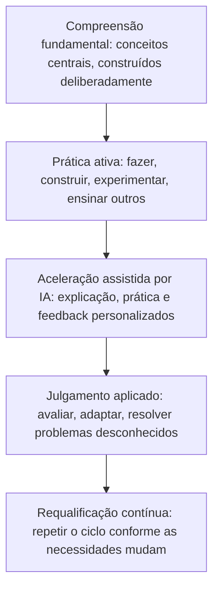

# Aprender de forma diferente: como o ensino e a aprendizagem devem evoluir na era da IA e dos agentes

## A verdadeira mudança não é aprender menos, é aprender de forma diferente

Toda vez que uma nova tecnologia torna a informação mais fácil de alcançar, a mesma preocupação ressurge: as pessoas vão parar de aprender por completo? Supostamente as calculadoras tornariam a aritmética desnecessária. Supostamente os mecanismos de busca tornariam desnecessário memorizar fatos. A IA agora levanta a mesma pergunta, em uma escala muito maior, porque consegue explicar um conceito, redigir um ensaio e realizar tarefas de vários passos por conta própria.

A preocupação interpreta mal o que realmente está mudando. A IA está transformando a rapidez com que as pessoas conseguem acessar informações e produzir um primeiro rascunho de resposta. Ela não está transformando o processo subjacente pelo qual um ser humano constrói compreensão real, desenvolve julgamento ou se torna capaz de resolver problemas que nunca viu antes. Esse processo continua lento, exige esforço e continua profundamente humano.

{/* truncate */}

Isso importa para estudantes, pessoas que aprendem por conta própria, professores, líderes de escolas e universidades, organizações de desenvolvimento de força de trabalho, e profissionais que agora precisam se requalificar com mais frequência do que qualquer geração anterior. O argumento aqui é simples: o futuro da aprendizagem não é aprender menos porque a IA pode responder instantaneamente. É aprender de forma diferente, mais contínua e mais intencional. A IA pode ser um dos amplificadores de aprendizagem mais poderosos já criados, mas apenas se estudantes, professores e instituições escolherem usá-la dessa forma.

---

## Da memorização ao julgamento

A educação tradicional surgiu em um mundo onde a informação era escassa e lenta de alcançar. Nesse mundo, memorizar fatos e procedimentos era genuinamente valioso, porque relembrar informações rapidamente era, muitas vezes, o gargalo para poder usá-las.

Esse gargalo praticamente desapareceu. A IA agora recupera, sintetiza e explica informações na profundidade que cada estudante precisa. Isso não torna o conhecimento fundamental inútil, mas torna a simples memorização uma medida muito mais fraca do aprendizado real. As perguntas mais úteis mudaram: essa pessoa consegue reconhecer quando uma informação se aplica a uma situação nova? Ela consegue julgar se uma resposta, incluindo uma da IA, é correta ou perigosa? Ela consegue combinar conhecimentos de diferentes domínios para resolver um problema para o qual ninguém lhe entregou um modelo pronto?

Nenhuma dessas capacidades vem de memorizar mais conteúdo. Elas vêm do **julgamento**: a capacidade de avaliar, aplicar e adaptar conhecimento em condições reais e confusas. O julgamento é construído por meio de prática, feedback e reflexão, não pela repetição de fatos. Essa mudança já era necessária mesmo antes da chegada da IA. A IA simplesmente elevou o custo de ignorá-la.

O conhecimento fundamental ainda importa por uma razão direta: é o que permite a uma pessoa avaliar uma resposta gerada por IA em vez de simplesmente aceitá-la. A IA pode ser fluente e confiante mesmo estando errada ou desatualizada. Quem tem bases sólidas consegue perceber isso; quem não tem não possui uma base independente para comparação. As bases também são a matéria-prima da criatividade, já que ideias genuinamente novas costumam surgir da recombinação de conhecimento existente, e são uma forma de resiliência quando uma ferramenta não está disponível ou está errada.

---

## Como as pessoas aprendem, e por que fazer supera consumir

A aprendizagem não é igual para todos. As pessoas absorvem informações lendo, assistindo, ouvindo, discutindo, praticando, experimentando, construindo projetos e ensinando a outros, frequentemente em combinação. A leitura constrói profundidade e precisão. A discussão testa a compreensão diante de outras perspectivas. Construir um projeto integra várias habilidades em julgamento do mundo real. Ensinar um conceito a outra pessoa expõe lacunas que nenhuma revisão passiva revelaria.

Décadas de pesquisa apontam para a mesma conclusão a partir de ângulos diferentes: as pessoas aprendem muito mais fazendo algo do que observando ou lendo sobre isso. A prática de recuperação, em que a pessoa tenta recordar ou aplicar algo em vez de simplesmente reler, produz uma compreensão mais sólida e duradoura do que a revisão passiva.

A IA introduz aqui um risco real. Quando uma resposta ou um trecho de código funcional pode ser gerado instantaneamente, é tentador tratar esse resultado como a linha de chegada, em vez de um ponto de partida. Um estudante que copia uma explicação gerada por IA sem trabalhá-la consumiu informação, não necessariamente aprendeu algo duradouro. O padrão mais saudável inverte a sequência: tentar resolver o problema primeiro, mesmo que de forma imperfeita, e só então usar a IA para verificar o raciocínio, preencher lacunas ou oferecer uma segunda abordagem. A comparação entre sua própria tentativa e a resposta da IA, não a resposta em si, é onde a aprendizagem acontece.

---

## Onde a IA realmente ajuda: personalização, tutores e agentes

Bons professores sempre ajustaram o ritmo e a dificuldade de acordo com a pessoa à sua frente. O que faltava em escala era fazer isso para cada estudante, em cada matéria, a cada momento. É aqui que a IA oferece algo genuinamente novo: sistemas adaptativos podem identificar exatamente onde a compreensão se quebra, ajustar a dificuldade em tempo real e acompanhar o progresso de uma forma que levaria muito mais tempo para um instrutor humano reunir.

A personalização tem limites que vale a pena nomear. Um sistema que simplesmente oferece conteúdo mais fácil sempre que um estudante tem dificuldade pode reduzir silenciosamente as expectativas em vez de construir capacidade. Uma boa personalização ajusta *como* um conceito é ensinado, não *se* o estudante deve, eventualmente, alcançar o domínio real.

Além da personalização, alguns papéis da IA já estão surgindo com clareza na educação:

- **Explicadora sob demanda:** disponível a qualquer hora, disposta a repetir uma explicação de forma diferente quantas vezes forem necessárias.
- **Parceira socrática:** faz perguntas orientadoras e aponta lacunas no raciocínio em vez de simplesmente entregar uma resposta.
- **Geradora de prática:** cria variações ilimitadas de problemas adaptados ao que um estudante específico precisa reforçar.
- **Orquestradora agêntica da aprendizagem:** gerencia um plano de aprendizagem de vários passos por conta própria, sequenciando tópicos, gerando prática e ajustando conforme os resultados, seja preparando material diferenciado para uma turma ou construindo uma trilha de requalificação personalizada para um profissional.

Nenhum desses papéis substitui um professor ou mentor. Eles substituem as partes repetitivas e difíceis de escalar do ensino. Essa distinção, a IA como amplificadora e não como substituta, deve orientar cada decisão de adoção.

---

## Modernizar escolas, faculdades e universidades

As instituições enfrentam um desafio de design real: manter o que funciona, atualizar o que foi construído para um mundo em que o acesso à informação era o gargalo.

- **Repensar a avaliação.** Deslocar mais peso para trabalhos baseados em projetos, defesas orais e portfólios aplicados, que medem julgamento em vez da capacidade de produzir uma resposta fluente.
- **Ensinar letramento em IA de forma explícita.** Os estudantes precisam avaliar os resultados da IA de forma crítica, não apenas operar as ferramentas com competência.
- **Redefinir a integridade acadêmica.** Substituir as regras gerais de "sem IA" por distinções claras entre usá-la para entender, para verificar o trabalho ou para contornar a aprendizagem por completo.
- **Investir nos professores, não apenas nas ferramentas.** Dar aos professores tempo e treinamento reais para redesenhar seus cursos, não apenas um novo software sobre um currículo inalterado.
- **Proteger a interação humana.** Reinvestir o tempo economizado pela correção e geração de prática com IA em mais mentoria e discussão.

---

## Requalificação contínua e mentoria humana

Fora da educação formal, o ritmo em que habilidades específicas se tornam obsoletas continua aumentando, e a IA está acelerando essa tendência em quase todos os campos. Isso torna a requalificação uma prática ao longo de toda a carreira: ciclos de aprendizagem mais curtos e focados em uma necessidade atual se encaixam melhor nesse ritmo do que programas longos e concentrados no início. Profissionais que prosperam tratam a IA como uma parceira pessoal de aprendizagem, usando-a para explicar conceitos desconhecidos ou gerar prática relevante, enquanto constroem o hábito repetível de identificar lacunas e validar sua própria compreensão. Organizações de desenvolvimento de força de trabalho têm sucesso construindo trilhas de aprendizagem modulares e atualizáveis em vez de currículos estáticos, e ensinando explicitamente a metahabilidade de aprender a aprender.

Nada disso reduz o valor dos relacionamentos humanos. Um mentor traz contexto e feedback honesto que um sistema de IA não tem; um grupo de colegas traz motivação e debate que aguça o pensamento. A IA funciona melhor quando assume as partes repetitivas da aprendizagem, liberando tempo humano para o que depende de relacionamento e experiência vivida. Um teste útil para qualquer ferramenta de aprendizagem: ela cria mais espaço para a interação humana, ou tenta eliminar a necessidade dela? A primeira é amplificação. A segunda costuma ser um erro.

---

## Um framework prático para o futuro da aprendizagem

Cada camada depende da que está abaixo dela. Pular as bases para ir direto à aceleração assistida por IA produz resultados que soam fluentes sem um julgamento real por trás. Pular a prática ativa em favor de apenas consumir explicações de IA produz reconhecimento sem a capacidade de aplicar. O ciclo só aumenta seu valor quando as cinco camadas se repetem ao longo do tempo, não quando são tratadas como uma sequência única.

---

## Recomendações

**Para estudantes e pessoas que aprendem por conta própria:**
- Tente resolver o problema você mesmo antes de perguntar à IA; a comparação é onde a aprendizagem acontece.
- Combine modos: leia, pratique, construa e explique conceitos a outra pessoa.
- Construa algo real regularmente, e ensine o que você aprende para expor lacunas.
- Trate a IA como um tutor que explica o raciocínio, não como um oráculo que entrega respostas.

**Para escolas, faculdades, universidades e programas de força de trabalho:**
- Redesenhe a avaliação em torno do julgamento aplicado, não da memorização.
- Ensine letramento em IA como habilidade central, não como algo secundário.
- Defina políticas de integridade acadêmica claras e realistas em vez de proibições genéricas.
- Invista no tempo e treinamento dos professores tanto quanto em novas ferramentas.
- Reinvista o tempo economizado graças à IA em mais mentoria e interação humana.

---

## Aprender de forma diferente, não menos

A IA mudou de forma permanente a rapidez com que as pessoas conseguem acessar informações e o apoio disponível ao aprender algo novo. Ela não mudou a natureza subjacente da aprendizagem em si: um processo lento, que exige esforço e é profundamente humano, de construir compreensão, testá-la contra a realidade e ajustá-la de acordo com o que acontece.

As instituições e as pessoas que mais se beneficiarem deste momento não serão os que aprendem menos porque a IA consegue responder mais rápido. Serão os que usarem essa velocidade para dedicar mais tempo ao que realmente constrói julgamento: praticar, construir, discutir, ensinar e aplicar conhecimento a problemas para os quais ninguém lhes entregou um modelo pronto. O futuro da aprendizagem não é menor. É diferente, mais contínuo e, quando bem feito, consideravelmente mais intencional do que era antes.
