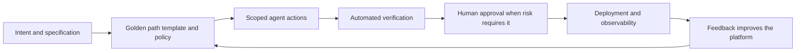

# Caminhos dourados para agentes: por que a engenharia de plataformas é a camada que falta

## Agentes não eliminam a fricção da entrega

Agentes de IA podem ler um repositório, escrever código, executar testes e abrir um pull request. Essa é uma capacidade impressionante, mas não torna o sistema de engenharia ao redor mais fácil de navegar. Ela torna cada inconsistência desse sistema mais fácil de reproduzir em alta velocidade.

Um agente com acesso a um ambiente grande e sem documentação enfrenta as mesmas perguntas que um novo engenheiro: qual modelo é aprovado? Como um serviço é implantado? De onde vêm os segredos? Quais verificações são obrigatórias? Quem é responsável por esta dependência? O que é seguro alterar? Um modelo capaz pode inferir algumas respostas, mas inferência não é um modelo operacional confiável para software de produção.

{/* truncate */}

É por isso que a conversa sobre agentes não pode terminar em prompts, modelos ou instruções de repositório. A camada que falta é a **engenharia de plataformas**: a disciplina de criar produtos internos que tornam a maneira segura e suportada de entregar software a mais simples.

Para desenvolvedores humanos, essa camada reduz a carga cognitiva. Para agentes, ela transforma contexto vago em um caminho executável. O resultado não é um agente com acesso irrestrito a tudo. É um agente que consegue progredir de forma útil por fluxos de trabalho bem compreendidos, observáveis e governados.

---

## O que um caminho dourado realmente é

Um caminho dourado não é uma apresentação que diz às equipes quais ferramentas devem usar. É uma rota pavimentada para uma tarefa comum de engenharia, com as escolhas preferidas já conectadas.

Por exemplo, um caminho dourado para uma nova API pode fornecer:

- Um modelo de serviço mantido com logs, verificações de integridade e padrões seguros.
- Uma forma padrão de solicitar e injetar configuração sem expor segredos.
- Um fluxo de CI que executa os testes obrigatórios, verificações de segurança e validação de políticas.
- Uma rota de implantação com propriedade, reversão e observabilidade incorporadas.
- Documentação que explica os limites e as alternativas suportadas.

A palavra *dourado* não significa obrigatório ou universal. As equipes terão razões legítimas para sair do caminho. Significa que o caminho é mantido, testado intencionalmente e mais fácil do que reconstruir as mesmas decisões do zero.

Essa distinção importa ainda mais para agentes. Um agente não pode se beneficiar de uma preferência organizacional que existe apenas em conversas informais, conhecimento tribal ou uma página wiki atualizada pela última vez há dois anos. Ele precisa de interfaces, modelos, políticas e feedback disponíveis onde trabalha.

---

## Por que agentes precisam de estradas pavimentadas, não de mais permissões

O primeiro impulso quando um agente tem dificuldade costuma ser conceder outra permissão, adicionar outra ferramenta ou ampliar sua janela de contexto. Às vezes isso é necessário. Mais frequentemente, é um sinal de que o próprio fluxo de trabalho não está claro.

O acesso sem limites cria vários problemas:

| Problema | O que o agente vê | O que a plataforma deve fornecer |
|---|---|---|
| Muitos padrões válidos | Várias formas de criar, testar ou implantar um serviço | Um modelo suportado e um fluxo padrão |
| Dependências ocultas | Credenciais, aprovações e propriedade fora do repositório | Interfaces de autoatendimento com política explícita |
| Qualidade ambígua | As verificações variam por equipe ou são manuais | Portões de verificação reutilizáveis |
| Feedback fraco | Falhas aparecem tarde e sem contexto útil | Sinais rápidos e acionáveis em cada etapa |
| Amplo raio de impacto | Uma tarefa local pode afetar acidentalmente sistemas não relacionados | Credenciais com escopo limitado e limites protegidos |

Dar mais permissões a um agente pode permitir que ele supere uma etapa bloqueada, mas não torna essa etapa mais segura, repetível ou compreensível. Um caminho dourado resolve o problema subjacente. Ele restringe as escolhas que devem ser restringidas e expõe as escolhas que realmente exigem julgamento humano.

Esse é o mesmo princípio que tornou a integração contínua e a infraestrutura como código valiosas. Padronização não é burocracia quando remove decisões repetitivas e torna visíveis as decisões importantes.

---

## A plataforma pronta para agentes

Uma plataforma interna de desenvolvedores se torna pronta para agentes quando suas capacidades podem ser usadas tanto por pessoas quanto por software. Um portal bem acabado ajuda as pessoas, mas um portal sozinho não basta. Agentes também precisam de contratos legíveis por máquina e interfaces confiáveis.

Cinco elementos são os mais importantes:

### 1. Pontos de partida opinativos

Modelos, implementações de referência e ferramentas de scaffolding codificam a arquitetura preferida da organização. Eles devem incluir os pontos inegociáveis: identidade, telemetria, gestão de dependências, testes, metadados de implantação e propriedade. Um agente que começa com um modelo confiável tem menos oportunidades de inventar uma versão quase correta de uma prática estabelecida.

### 2. Contexto legível por máquina

Instruções, especificações, contratos de API, catálogos de serviços e definições de política precisam viver junto ao trabalho ou estar disponíveis por interfaces estáveis. Isso não é documentação por documentação. É o contexto que um agente usa para escolher o repositório correto, entender os limites e saber quando parar.

### 3. Autoatendimento com escopo limitado

Agentes devem poder solicitar as capacidades necessárias à tarefa sem receber acesso permanente a sistemas não relacionados. Uma plataforma pode intermediar credenciais temporárias, ambientes aprovados e ações controladas. O objetivo é tornar ações seguras fáceis e manter ações de alto impacto deliberadamente bloqueadas.

### 4. Verificação como capacidade de produto

Compilações, testes, verificações de segurança, verificações de acessibilidade, controles de política e prévias de implantação não são apenas etapas de pipeline. Eles são a evidência de que a saída do agente pode avançar com segurança. Quanto mais rápidos e claros forem esses sinais, mais eficazes se tornam agentes e revisores.

### 5. Ciclos de feedback observáveis

Cada caminho dourado deve produzir telemetria útil: adoção, tempo de entrega, motivos de falha, taxa de reversão e os pontos em que pessoas ou agentes saem do caminho. Sem esse feedback, uma equipe de plataforma não consegue saber se reduziu a fricção ou apenas a moveu para algum lugar menos visível.

---

## Um caminho dourado é um contrato de delegação

Quando uma pessoa delega trabalho a um agente, a plataforma deve tornar o contrato explícito. Qual é o resultado desejado? Quais recursos o agente pode usar? Quais verificações precisam passar? O que exige aprovação? Como o resultado será observado depois da implantação?

Isso é mais do que automação de fluxo de trabalho. Cria um modelo operacional compartilhado para colaboradores humanos, agentes e os sistemas que ambos usam. A plataforma cuida da mecânica repetível. As pessoas mantêm a responsabilidade pela intenção, pelas decisões de risco e pelos resultados.

O modelo também melhora a responsabilização. Quando um agente cria uma alteração por um caminho dourado, a organização pode responder perguntas úteis: qual modelo ele usou, quais políticas se aplicaram, qual identidade o autorizou, quais evidências passaram e quem aprovou a liberação? Essas respostas são difíceis de reconstruir quando cada agente segue uma rota improvisada.

---

## Comece com uma dor repetida

Engenharia de plataformas não exige um programa de vários anos ou um portal interno completo antes de gerar valor. Comece onde a entrega é frequente, cara e inconsistente.

Bons candidatos incluem:

- Criar um novo serviço com padrões prontos para produção.
- Adicionar uma dependência que requer revisão de segurança e licença.
- Provisionar um ambiente de prévia para um pull request.
- Implantar um trabalho agendado com monitoramento e um responsável claro.
- Rotacionar um segredo sem copiar credenciais para a configuração local.

Escolha um fluxo de trabalho, identifique as decisões que devem ser padronizadas e construa um caminho que funcione primeiro para um desenvolvedor. Depois, torne esse caminho invocável e compreensível para um agente. Meça se os usuários chegam a um resultado seguro mais rápido, se as falhas são mais fáceis de diagnosticar e se revisores gastam menos tempo redescobrindo os mesmos requisitos.

Evite tratar a plataforma como um catálogo de ferramentas. Uma lista de serviços disponíveis não resolve um problema de entrega. A unidade valiosa do trabalho de plataforma é uma jornada completa da intenção até um resultado verificado.

---

## O objetivo é melhor autonomia

A promessa dos agentes não é que possam operar sem restrições. É que possam assumir mais trabalho de execução enquanto as pessoas se concentram em intenção, design, revisão e responsabilização. Essa promessa só se sustenta quando o ambiente lhes oferece uma forma confiável de agir.

Caminhos dourados são como as organizações transformam seu conhecimento de engenharia duramente conquistado em um produto. Eles empacotam padrões seguros, normas de entrega e lições operacionais em rotas que desenvolvedores querem usar porque economizam tempo. Dão aos agentes a mesma vantagem, com limites mais claros e evidências mais fortes.

Engenharia de plataformas, portanto, não é uma preocupação de apoio para a era dos agentes. É a camada que torna prática a autonomia segura de agentes. Construa primeiro as estradas pavimentadas, e humanos e agentes poderão avançar mais rápido sem perder o controle.
