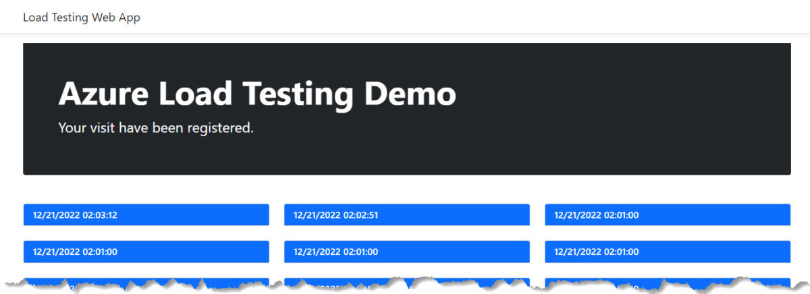

# Projects

## Load Testing Demo (.NET 7 ASP.NET with Azure Cosmos DB, Azure Load Testing & GitHub)

This is a demo repository about Azure Load Testing in CI/CD with Azure DevOps and GitHub.

[Check out the blog post about this repository](https://xpirit.com/adding-load-testing-to-your-workflows).

In my past roles I had the opportunity to build the following open source projects, check out to learn more about Azure services and software development.

## Sample Delivery Service (Azure Maps Project)

Sample Web App using Azure Maps, Cosmos DB, Azure App Service, Key Vault and .NET with JavaScript.

## Rock, Paper, Scissors, Lizard, Spock

Sample application running in Azure presented at Microsoft Ignite 2019

## Tailwind Traders

A fictitious retail company showcasing the future of intelligent application experiences. These reference apps are all are powered by the Azure cloud, built with best-in-class tools, and made smarter through data and AI.

## SmartHotel360

SmartHotel360 is a fictitious smart hospitality company showcasing the future of connected travel.

## Thundercloud

A cotton cloud with LED lights controlled remotely with the MXChip Azure IoT Dev Kit by using Azure IoT Hub and an Azure Function.

### More to come!