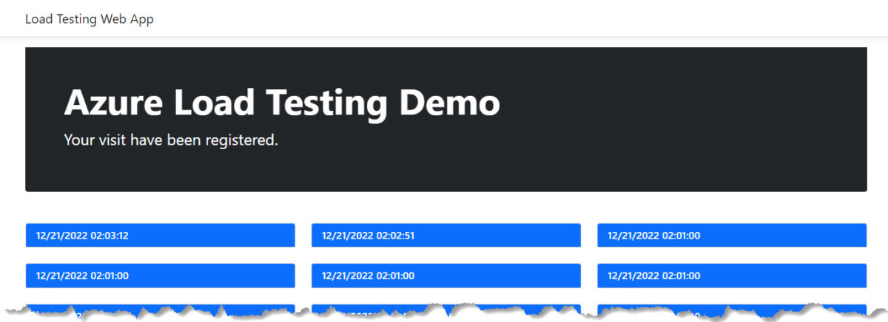

import ExchangeRates from './exchangerates';

# Projects

## Colones Exchange Rate - NuGet & npm Packages (GitHub Actions, GitHub Packages, NuGet.org & npmjs.com)

This is a demo repository about how to build a NuGet package and publish it to GitHub Packages and NuGet.org. Also, how to build a npm package and publish it to GitHub Packages and npmjs.com.

It is a real case scenario that gets the exchange rate from the [Ministerio de Hacienda de Costa Rica API](https://api.hacienda.go.cr/indicadores/tc) retrieving the values for Colones, Dollars and Euros.
[Check out the repository](https://github.com/dsanchezcr/ColonesExchangeRate).

Here is an example of the result of the npm package displaying today's exchange rates:

<ExchangeRates />

## Build a simple contact form (Azure Communication Services, Azure Functions & GitHub Actions)

[Check out the blog post about this repository](/blog/building-a-contact-form-with-azure)

## Load Testing Demo (.NET 7 ASP.NET with Azure Cosmos DB, Azure Load Testing & GitHub)

This is a demo repository about Azure Load Testing in CI/CD with Azure DevOps and GitHub.

In my past roles I had the opportunity to build the following open source projects, check out to learn more about Azure services and software development.

## Sample Delivery Service (Azure Maps Project)

Sample Web App using Azure Maps, Cosmos DB, Azure App Service, Key Vault and .NET with JavaScript.

## Rock, Paper, Scissors, Lizard, Spock

Sample application running in Azure presented at Microsoft Ignite 2019

## Tailwind Traders

A fictitious retail company showcasing the future of intelligent application experiences. These reference apps are all are powered by the Azure cloud, built with best-in-class tools, and made smarter through data and AI.

## SmartHotel360

SmartHotel360 is a fictitious smart hospitality company showcasing the future of connected travel.

## Thundercloud

A cotton cloud with LED lights controlled remotely with the MXChip Azure IoT Dev Kit by using Azure IoT Hub and an Azure Function.

### More to come!