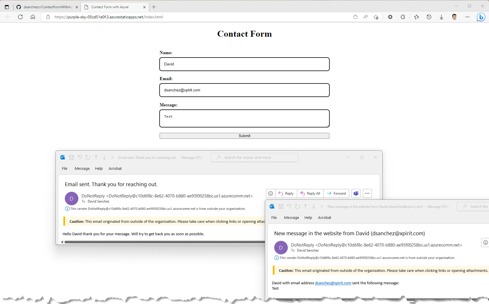

import ExchangeRates from './exchangerates';

# Projects

# Secret Santa – Azure-powered gift exchange (Open Source)

**Secret Santa** is a multilingual gift exchange web application that helps you organize Secret Santa games for your team, friends, or family — with a modern, cloud-native architecture running on Azure.

- 🌐 Live app: https://secretsanta.dsanchezcr.com  
- 💻 Source code: https://github.com/dsanchezcr/secretsanta  

## Why I built it

Every year I see people fighting with spreadsheets and group chats to organize Secret Santa. I wanted something:

- Simple enough for non-technical users  
- Privacy-conscious and transparent about data retention  
- Interesting enough technically to serve as a real-world reference for:
  - Modern frontend patterns
  - Azure serverless + data services
  - DevOps and GitHub best practices
  - AI-assisted development with GitHub Copilot

Secret Santa is the result.

## Try it for your next gift exchange

You don’t need an account to use the app.

**What you can do as an organizer:**

- Create a game in a few seconds with:
  - Event date
  - Budget
  - Optional description or rules
- Add participants and let the app handle **random assignments** with a fair circular shuffle
- Protect games with **participant tokens** if you want an extra privacy layer
- Use the **organizer panel** to:
  - View or resend assignments
  - Handle reassignment requests
  - Delete games at any time

**What participants get:**

- A simple flow to join the game and discover who they’re buying for  
- Optional email notifications with their assignment  
- The ability to request a new assignment (when the organizer allows it)

**Built-in safeguards:**

- Games can only be created for **today or future dates**  
- Data is automatically deleted **3 days after the event date**  
- Clear in-app **Privacy Policy** describing how data is handled

## New GitHub Action: Issue Importer
In a world where AI coding agents and prompt engineering are becoming the new normal, issues remain the cornerstone of productive software development.

That’s why I’m excited to share something I built for the community:

🎯 A GitHub Action that lets you bulk import issues from a CSV or JSON file directly into your repository, perfect for assigning structured tasks to GitHub Copilot.

Whether you're managing a sprint, migrating from another system, or setting up a new repo with Copilot Agent Mode, this tool bridges the gap between planning and automated execution.

✨ What makes this even more special?
I created this GitHub Action from scratch using the single structured prompt below, defining the tech stack, structure, and automation I wanted, and let GitHub Copilot help bring it to life.
This experience reminded me how accessible and empowering today's tools have become for developers of all levels.

```text
create a complete repository for a reusable github action that imports issues from a csv or json file into a repository. the action should support both formats and accept three inputs: file path, file format (csv or json), and github token. use node.js for the core logic and make the action publishable to the github marketplace. include an action.yml file with properly documented inputs, outputs, and usage metadata. also include a readme.md that explains the usage, configuration, and example workflow. the base project must include a .github folder with a ci-cd workflow file using actions/checkout and actions/setup-node, install dependencies, run tests, and optionally publish the action to the marketplace or tag the release. add a codeql analysis workflow with javascript configuration. add a basic issue template under .github/ISSUE_TEMPLATE including title, description, and reproduction steps. include a dependabot.yml file to keep the node dependencies up to date weekly. include a minimal package.json and ensure the index.js file contains working logic to read the file, parse the content based on format, and create issues via the github rest api. add basic unit tests in a tests folder. ensure the repository is ready to be pushed and used as an open-source github action with all best practices. do not scaffold a sample repository using hello world, start from scratch using the issue importer concept.
```

🔗 [The Action is now live](https://github.com/dsanchezcr/issue-importer-action)

👉🏻 [Here is a demo on how to use it](https://github.com/dsanchezcr/issue-importer-action-demo)

If this helps you or your team move faster with automation, I’d love to hear how you use it. 
Let’s keep building — smarter, faster, and together. 🚀

## Colones Exchange Rate - NuGet & npm Packages (GitHub Actions, GitHub Packages, NuGet.org & npmjs.com)

This is a demo repository about how to build a NuGet package and publish it to GitHub Packages and NuGet.org. Also, how to build a npm package and publish it to GitHub Packages and npmjs.com.

It is a real case scenario that gets the exchange rate from the [Ministerio de Hacienda de Costa Rica API](https://api.hacienda.go.cr/indicadores/tc) retrieving the values for Colones, Dollars and Euros.
[Check out the repository](https://github.com/dsanchezcr/ColonesExchangeRate).

Here is an example of the result of the npm package displaying today's exchange rates:

<ExchangeRates />

[](https://github.com/dsanchezcr/ColonesExchangeRate)

## Build a simple contact form (Azure Communication Services, Azure Functions & GitHub Actions)

[Check out the blog post about this repository](/blog/building-a-contact-form-with-azure)

[](https://github.com/dsanchezcr/ContactFormWithAzure)

## Load Testing Demo (.NET 7 ASP.NET with Azure Cosmos DB, Azure Load Testing & GitHub)

This is a demo repository about Azure Load Testing in CI/CD with Azure DevOps and GitHub.

[](https://github.com/dsanchezcr/LoadTestingDemo)

In my past roles I had the opportunity to build the following open source projects, check out to learn more about Azure services and software development.

## Sample Delivery Service (Azure Maps Project)

Sample Web App using Azure Maps, Cosmos DB, Azure App Service, Key Vault and .NET with JavaScript.

[](https://github.com/dsanchezcr/SampleDeliveryService)

## Rock, Paper, Scissors, Lizard, Spock

Sample application running in Azure presented at Microsoft Ignite 2019

[](https://github.com/microsoft/RockPaperScissorsLizardSpock)

## Tailwind Traders

A fictitious retail company showcasing the future of intelligent application experiences. These reference apps are all are powered by the Azure cloud, built with best-in-class tools, and made smarter through data and AI.

[](https://github.com/microsoft/TailwindTraders)

## SmartHotel360

SmartHotel360 is a fictitious smart hospitality company showcasing the future of connected travel.

[](https://github.com/microsoft/SmartHotel360)

## Thundercloud

A cotton cloud with LED lights controlled remotely with the MXChip Azure IoT Dev Kit by using Azure IoT Hub and an Azure Function.

[](https://github.com/dsanchezcr/Thundercloud)

### More to come!